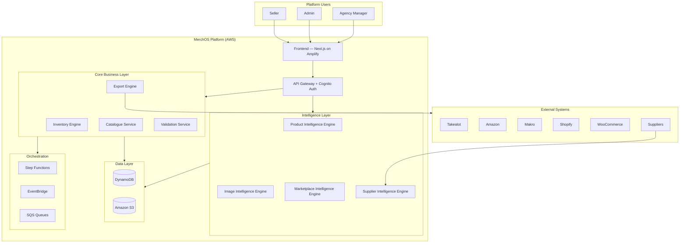
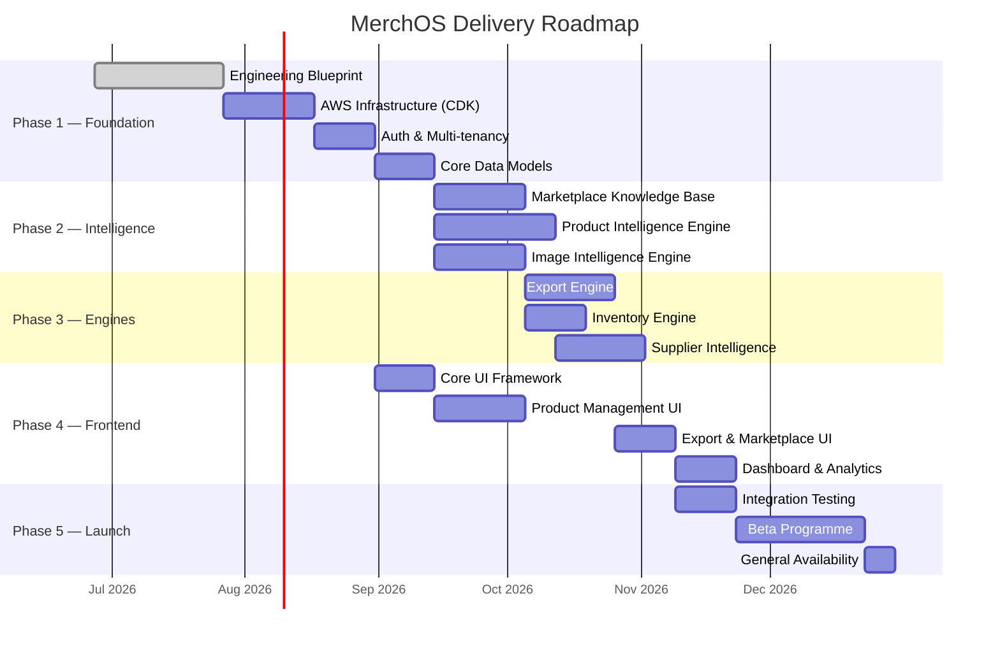

# MerchOS Blueprint

> The complete engineering blueprint for **MerchOS** — an AI-assisted, multi-marketplace e-commerce management platform built entirely on AWS serverless architecture.

---

## What is MerchOS?

MerchOS is a **cloud-native, multi-tenant SaaS platform** that transforms fragmented, manual marketplace selling into a unified, AI-augmented commerce operation. Sellers manage products across multiple marketplaces (Takealot, Amazon, Makro, Shopify, WooCommerce) from a single source of truth, with AI handling the complexity of content generation, categorisation, and compliance.

---

## The Problem It Solves

E-commerce sellers in South Africa and beyond face critical operational challenges:

| Problem | Impact |
|---------|--------|
| **Fragmented tooling** | Each marketplace has its own portal, CSV format, and validation rules |
| **Manual data entry** | Product attributes must be re-entered or reformatted per channel |
| **Inconsistent quality** | Human error leads to listing rejections, fines, and lost sales |
| **No intelligent assistance** | Sellers get no guidance on categories, descriptions, or attributes |
| **Scaling bottleneck** | Adding a marketplace multiplies operational workload linearly |
| **Supplier chaos** | Incoming data arrives in inconsistent formats needing manual normalisation |

**MerchOS reduces time-to-list from hours to minutes** with AI-assisted enrichment, deterministic validation, and automated export generation.

---

## High-Level Architecture



---

## Technology Stack

| Layer | Technology | Purpose |
|-------|-----------|---------|
| **Frontend** | Next.js 14, React, TypeScript | SSR/SSG web application |
| **Hosting** | AWS Amplify | Managed hosting, CI/CD, branch previews |
| **API** | Amazon API Gateway (HTTP API) | REST API surface, rate limiting, validation |
| **Auth** | Amazon Cognito | Multi-tenant authentication, MFA, RBAC |
| **Compute** | AWS Lambda (Node.js 20, arm64) | All business logic — serverless, event-driven |
| **Database** | Amazon DynamoDB | Single-table design, multi-tenant isolation |
| **Storage** | Amazon S3 | Images, exports, supplier files, backups |
| **AI/ML** | Amazon Bedrock (Claude 3.5 Sonnet) | Description generation, attribute extraction, categorisation |
| **OCR** | Amazon Textract | Document and label text extraction |
| **Vision** | Amazon Rekognition | Image analysis, moderation, quality assessment |
| **Orchestration** | AWS Step Functions | Complex multi-step workflows |
| **Events** | Amazon EventBridge | Decoupled inter-service communication |
| **Queuing** | Amazon SQS | Async processing, backpressure management |
| **Notifications** | Amazon SNS + SES | Multi-channel alerts and emails |
| **IaC** | AWS CDK (TypeScript) | 100% infrastructure as code |
| **Monitoring** | Amazon CloudWatch + X-Ray | Logs, metrics, traces, dashboards |
| **Secrets** | AWS Secrets Manager | API keys, credentials, rotation |

---

## Repository Structure

```
MerchOS.blueprint/
├── README.md                          # This file — project overview
├── CHANGELOG.md                       # Version history and changes
├── docs/
│   ├── blueprint/                     # Complete engineering blueprint (24 volumes)
│   │   ├── 01-Executive-Summary.md
│   │   ├── 02-Business-Product.md
│   │   ├── 03-Functional-Requirements.md
│   │   ├── 04-Non-Functional-Requirements.md
│   │   ├── 05-AWS-Architecture.md
│   │   ├── 06-Security-Architecture.md
│   │   ├── 07-AI-Architecture.md
│   │   ├── 08-Marketplace-Intelligence-Engine.md
│   │   ├── 09-Product-Intelligence-Engine.md
│   │   ├── 10-Image-Intelligence-Engine.md
│   │   ├── 11-Supplier-Intelligence.md
│   │   ├── 12-Inventory-Engine.md
│   │   ├── 13-Export-Engine.md
│   │   ├── 14-Database-Design.md
│   │   ├── 15-API-Specifications.md
│   │   ├── 16-Frontend-Architecture.md
│   │   ├── 17-Backend-Architecture.md
│   │   ├── 18-DevOps-CICD.md
│   │   ├── 19-Monitoring-Operations.md
│   │   ├── 20-Cost-Optimisation.md
│   │   ├── 21-Implementation-Roadmap.md
│   │   ├── 22-Glossary.md
│   │   ├── 23-Architecture-Decision-Records.md
│   │   └── 24-Index.md
│   ├── diagrams/                      # Visual architecture diagrams (Mermaid)
│   │   ├── high-level/
│   │   ├── aws/
│   │   ├── sequence/
│   │   ├── data-flow/
│   │   └── ui/
│   ├── adr/                           # Architecture Decision Records (individual)
│   │   ├── ADR-001-why-aws.md
│   │   ├── ADR-002-why-serverless.md
│   │   ├── ADR-003-why-amplify.md
│   │   ├── ADR-004-why-bedrock.md
│   │   ├── ADR-005-why-marketplace-knowledge-base.md
│   │   └── ADR-006-ai-vs-deterministic-boundary.md
│   └── well-architected/             # AWS Well-Architected Framework mapping
│       └── well-architected-review.md
└── .gitkeep
```

---

## Blueprint Index

| Vol | ID | Title | Description |
|-----|-----|-------|-------------|
| 01 | MERCH-001 | [Executive Summary](docs/blueprint/01-Executive-Summary.md) | Platform vision, business context, architecture overview |
| 02 | MERCH-002 | [Business & Product](docs/blueprint/02-Business-Product.md) | Market analysis, user personas, pricing model |
| 03 | MERCH-003 | [Functional Requirements](docs/blueprint/03-Functional-Requirements.md) | 161 functional requirements across all engines |
| 04 | MERCH-004 | [Non-Functional Requirements](docs/blueprint/04-Non-Functional-Requirements.md) | 129 NFRs — performance, security, scalability |
| 05 | MERCH-005 | [AWS Architecture](docs/blueprint/05-AWS-Architecture.md) | Complete AWS service documentation (16 services) |
| 06 | MERCH-006 | [Security Architecture](docs/blueprint/06-Security-Architecture.md) | Multi-tenant isolation, encryption, POPIA compliance |
| 07 | MERCH-007 | [AI Architecture](docs/blueprint/07-AI-Architecture.md) | AI philosophy, model strategy, RAG, governance |
| 08 | MERCH-008 | [Marketplace Intelligence Engine](docs/blueprint/08-Marketplace-Intelligence-Engine.md) | Knowledge-base-driven marketplace schema management |
| 09 | MERCH-009 | [Product Intelligence Engine](docs/blueprint/09-Product-Intelligence-Engine.md) | AI-powered attribute extraction and enrichment |
| 10 | MERCH-010 | [Image Intelligence Engine](docs/blueprint/10-Image-Intelligence-Engine.md) | OCR, image analysis, compliance checking |
| 11 | MERCH-011 | [Supplier Intelligence](docs/blueprint/11-Supplier-Intelligence.md) | Catalogue ingestion, normalisation, deduplication |
| 12 | MERCH-012 | [Inventory Engine](docs/blueprint/12-Inventory-Engine.md) | Stock management, allocation, synchronisation |
| 13 | MERCH-013 | [Export Engine](docs/blueprint/13-Export-Engine.md) | Marketplace-specific CSV/API export with validation |
| 14 | MERCH-014 | [Database Design](docs/blueprint/14-Database-Design.md) | DynamoDB single-table design, access patterns |
| 15 | MERCH-015 | [API Specifications](docs/blueprint/15-API-Specifications.md) | 57 REST API endpoints documented |
| 16 | MERCH-016 | [Frontend Architecture](docs/blueprint/16-Frontend-Architecture.md) | Next.js app architecture, component design |
| 17 | MERCH-017 | [Backend Architecture](docs/blueprint/17-Backend-Architecture.md) | Lambda service structure, middleware, patterns |
| 18 | MERCH-018 | [DevOps & CI/CD](docs/blueprint/18-DevOps-CICD.md) | Deployment pipelines, environments, testing |
| 19 | MERCH-019 | [Monitoring & Operations](docs/blueprint/19-Monitoring-Operations.md) | Observability, alerting, incident response |
| 20 | MERCH-020 | [Cost Optimisation](docs/blueprint/20-Cost-Optimisation.md) | Cost modelling, budget controls, optimisation |
| 21 | MERCH-021 | [Implementation Roadmap](docs/blueprint/21-Implementation-Roadmap.md) | Sprint-by-sprint delivery plan |
| A | MERCH-GLO | [Glossary](docs/blueprint/22-Glossary.md) | Domain terminology definitions |
| B | MERCH-ADR | [Architecture Decision Records](docs/blueprint/23-Architecture-Decision-Records.md) | 12 foundational ADRs |
| C | MERCH-IDX | [Document Index](docs/blueprint/24-Index.md) | Cross-reference matrix and statistics |

---

## Current Project Status

| Aspect | Status | Details |
|--------|--------|---------|
| **Blueprint** | v0.2 — Reviewed | 24 volumes complete; diagrams added; ADRs expanded |
| **Infrastructure** | Planned | AWS CDK stacks designed; not yet deployed |
| **Backend** | Planned | Lambda functions architected; implementation pending |
| **Frontend** | Planned | Next.js app structure defined; UI pending |
| **AI Integration** | Planned | Bedrock prompts designed; integration pending |
| **Marketplace Schemas** | Planned | Takealot + Amazon specs documented |

---

## Roadmap



---

## Key Design Decisions

| Decision | Why | Details |
|----------|-----|---------|
| AWS (not multi-cloud) | Deep service integration; managed AI; Africa region | [ADR-001](docs/adr/ADR-001-why-aws.md) |
| Serverless (not containers) | Zero idle cost; auto-scaling; no ops | [ADR-002](docs/adr/ADR-002-why-serverless.md) |
| Amplify (not EC2/ECS) | Managed frontend hosting with CI/CD | [ADR-003](docs/adr/ADR-003-why-amplify.md) |
| Bedrock (not self-hosted AI) | No GPU management; pay-per-token | [ADR-004](docs/adr/ADR-004-why-bedrock.md) |
| Knowledge Base for marketplace schemas | Add marketplaces without code changes | [ADR-005](docs/adr/ADR-005-why-marketplace-knowledge-base.md) |
| AI recommends, rules decide | Deterministic compliance; no AI hallucination risk in exports | [ADR-006](docs/adr/ADR-006-ai-vs-deterministic-boundary.md) |

---

## How to Navigate This Blueprint

| You want to... | Start here |
|----------------|-----------|
| Understand what MerchOS is | [01 — Executive Summary](docs/blueprint/01-Executive-Summary.md) |
| Understand the business model | [02 — Business & Product](docs/blueprint/02-Business-Product.md) |
| See the AWS architecture | [05 — AWS Architecture](docs/blueprint/05-AWS-Architecture.md) |
| Understand how AI is used | [07 — AI Architecture](docs/blueprint/07-AI-Architecture.md) |
| Review security design | [06 — Security Architecture](docs/blueprint/06-Security-Architecture.md) |
| Implement a specific engine | Volumes 08–13 (per engine) |
| Set up infrastructure | [18 — DevOps & CI/CD](docs/blueprint/18-DevOps-CICD.md) |
| Review architecture decisions | [ADR Directory](docs/adr/) |

---

## Contributing

This blueprint is maintained by **Wadzanai Maparura** with AI-assisted authoring via Kiro.

### Blueprint Contribution Process

1. Create a branch from `main`
2. Make changes to the relevant volume(s)
3. Update the version in the document header
4. Update `CHANGELOG.md` with what changed
5. Submit a pull request for review
6. Merge after approval

### Naming Conventions

- Blueprint volumes: `XX-Title-With-Hyphens.md`
- ADRs: `ADR-XXX-short-description.md`
- Diagrams: `diagram-name.md` (Mermaid in Markdown)

---

## License

This blueprint is proprietary and confidential. All rights reserved.

Copyright (c) 2026 Wadzanai Maparura.

---

## Blueprint Statistics

| Metric | Value |
|--------|-------|
| Total volumes | 21 + 3 appendices |
| Total estimated lines | 9,500+ |
| Mermaid diagrams | 45+ |
| Data tables | 350+ |
| Functional requirements | 161 |
| Non-functional requirements | 129 |
| Architecture Decision Records | 12 |
| API endpoints documented | 57 |
| AWS services documented | 16 |
| Marketplace specifications | 5 |
