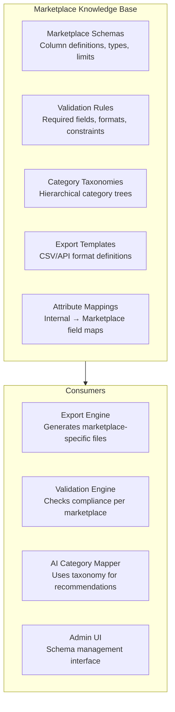

# ADR-005: Why Marketplace Knowledge Base?

| Field | Value |
|-------|-------|
| **Status** | Approved |
| **Date** | 2026-06-27 |
| **Decision Makers** | Wadzanai Maparura |
| **Category** | Data Architecture |

---

## Context

MerchOS supports 5 marketplaces (Takealot, Amazon, Makro, Shopify, WooCommerce), each with:
- Different CSV/API column formats
- Different validation rules (required fields, character limits, data types)
- Different category taxonomies (tree structures)
- Different image requirements (size, format, compliance)
- Formats that change periodically without advance notice

The platform must add new marketplaces without code deployment and handle format changes through configuration.

## Decision

Store all marketplace schemas, validation rules, category taxonomies, and export templates as **configuration data** in DynamoDB and S3 — forming a "Marketplace Knowledge Base." Never hardcode marketplace-specific logic in application code.

## Rationale

| Requirement | Knowledge Base Solution |
|-------------|----------------------|
| Add marketplaces without deployment | New marketplace = new configuration records |
| Handle format changes | Update schema config, no code change needed |
| Version control | Schema versions tracked; rollback available |
| AI integration | Schemas consumable by RAG for category recommendation |
| Separation of concerns | Engine logic vs. marketplace knowledge clearly separated |
| Admin manageable | Non-developer admins can update schemas via UI |

## Architecture

## Alternatives Considered

| Alternative | Reason Rejected |
|-------------|----------------|
| **Hardcoded adapters per marketplace** | Code deployment for every format change; doesn't scale beyond 5 marketplaces; developer required for all changes |
| **External API only** | Not all marketplaces have APIs; CSV still required; can't control rate/availability |
| **Plugin architecture** | Over-engineering for 5 marketplaces; runtime loading complexity; harder to test |
| **Spreadsheet/JSON config files** | No versioning; no admin UI; harder to query; no schema validation |

## Consequences

### Positive
- New marketplace onboarding: configuration only, no code deployment
- Schema changes handled by admin (no developer needed for format updates)
- Version-controlled schemas with instant rollback
- Schemas directly consumable by AI (RAG for smart category recommendation)
- Clear separation: engine logic is generic; knowledge is specific
- Testable: schemas can be validated independently

### Negative
- More complex initial setup (schema definition tooling needed)
- Admin UI required for schema management (Phase 2 development)
- Validation rule expressions need careful design for flexibility
- Schema migration process needed when structure evolves

---

## References

- MerchOS MERCH-008 (Marketplace Intelligence Engine)
- MerchOS MERCH-013 (Export Engine)
