# ADR-006: AI vs Deterministic Boundary

| Field | Value |
|-------|-------|
| **Status** | Approved |
| **Date** | 2026-06-27 |
| **Decision Makers** | Wadzanai Maparura |
| **Category** | AI Governance |

---

## Context

MerchOS uses AI (Amazon Bedrock / Claude) to generate product content — descriptions, attributes, categories, SEO text. This AI-generated content ultimately gets exported to marketplaces where incorrect data leads to:
- Listing rejections
- Account penalties or suspensions
- Customer complaints
- Financial loss (wrong pricing, wrong specs)

The fundamental question: **how much authority should AI have over marketplace-bound data?**

## Decision

Enforce a strict boundary: **AI recommends, rules decide.**

- AI generates suggestions with confidence scores
- Deterministic business rules validate, format, and decide what gets exported
- Human approval is required before any AI-generated content reaches a marketplace

## The Boundary

```mermaid
graph LR
    subgraph AI["AI Domain (Probabilistic)"]
        direction TB
        A1[Description generation]
        A2[Attribute extraction]
        A3[Category recommendation]
        A4[SEO keywords]
        A5[Translation]
        A6[Image understanding]
    end

    subgraph RULES["Deterministic Domain (Rules)"]
        direction TB
        B1[CSV column formatting]
        B2[Marketplace validation]
        B3[Required field enforcement]
        B4[SKU generation]
        B5[Pricing + tax]
        B6[Export file generation]
    end

    subgraph HUMAN["Human Authority"]
        direction TB
        C1[Review AI suggestions]
        C2[Accept / Edit / Reject]
        C3[Set pricing]
        C4[Final approval]
    end

    AI -->|"Suggestions +<br/>Confidence Scores"| HUMAN
    HUMAN -->|"Approved content"| RULES
    RULES -->|"Compliant export"| MARKETPLACE[Marketplace]
```

## Rationale

| Principle | Why |
|-----------|-----|
| AI can hallucinate | Generated specifications might be wrong — dangerous for product claims |
| Marketplace rules are absolute | CSV format compliance is binary — no room for "approximately correct" |
| Human accountability | Someone must own what gets published — liability cannot rest on AI |
| Compliance is deterministic | Tax, required fields, character limits — these are rules, not suggestions |
| Trust builds gradually | Start with human-in-the-loop; automate as confidence proves reliable |

## Confidence Score Framework

| Score | Label | Behaviour |
|-------|-------|-----------|
| 0.95–1.0 | Very High | Auto-suggest (user can override) |
| 0.85–0.94 | High | Recommended, no mandatory review |
| 0.70–0.84 | Medium | Suggest with "review recommended" flag |
| 0.50–0.69 | Low | Require manual confirmation |
| 0.0–0.49 | Very Low | Show as reference only; don't populate |

## Alternatives Considered

| Alternative | Reason Rejected |
|-------------|----------------|
| **AI-first (auto-apply all output)** | Unacceptable marketplace rejection risk; no accountability; hallucination risk |
| **Rules-only (no AI)** | Doesn't differentiate product; manual effort too high; can't scale |
| **Auto-approve above confidence threshold** | Considered for Phase 4 — not Phase 1; must prove reliability first |
| **AI with post-hoc validation only** | Validation catches format errors but not factual hallucination |

## Consequences

### Positive
- Marketplace compliance guaranteed (deterministic rules are binary pass/fail)
- AI failures never corrupt exports or break business operations
- Users maintain control — human-in-the-loop for all exported content
- Auditable — every decision logged (source: AI, human, or rule)
- AI improves over time without risk to production correctness
- Trust builds incrementally with measurable acceptance rates

### Negative
- Not fully autonomous — cannot "set and forget" (deliberate trade-off)
- Additional UX step (user reviews AI suggestions before export)
- Complexity of dual-path (AI generates → rules validate → human approves)
- Higher latency for full enrichment flow vs. auto-apply

### Future Evolution

| Phase | Autonomy Level |
|-------|---------------|
| Phase 1 (Launch) | Full human review required |
| Phase 2 | Auto-accept high-confidence non-critical fields |
| Phase 3 | Per-tenant "auto-mode" for trusted patterns |
| Phase 4 | Full auto-enrichment for high-confidence products (opt-in) |

---

## References

- MerchOS MERCH-007 (AI Architecture — Section 4: AI vs Deterministic Boundary)
- MerchOS ADR-008 in blueprint (expanded version)
- Anthropic responsible AI documentation
