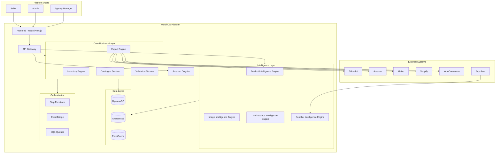
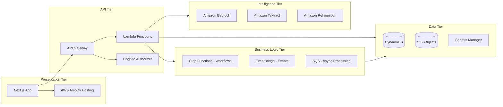
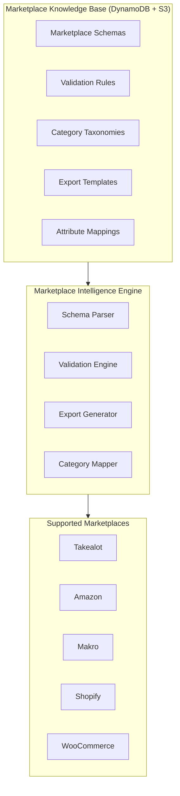
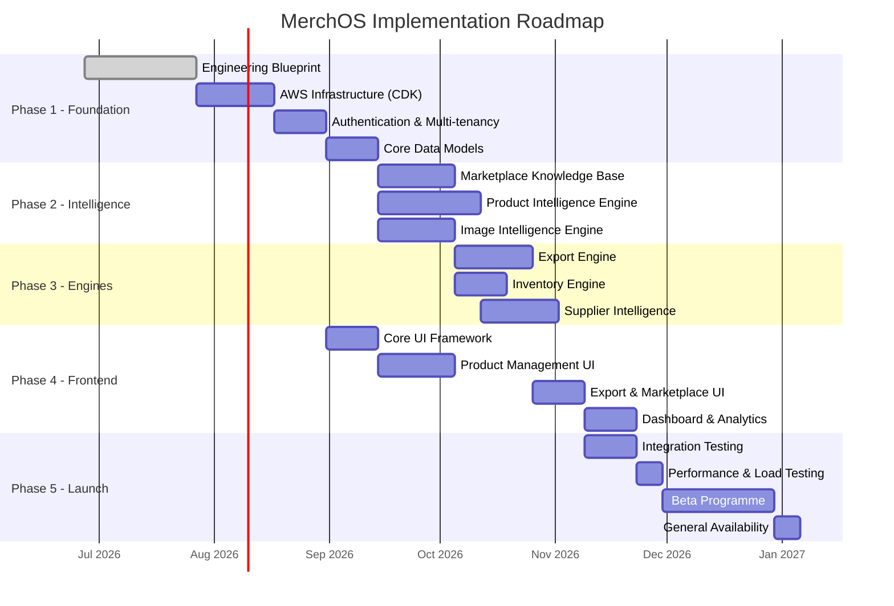
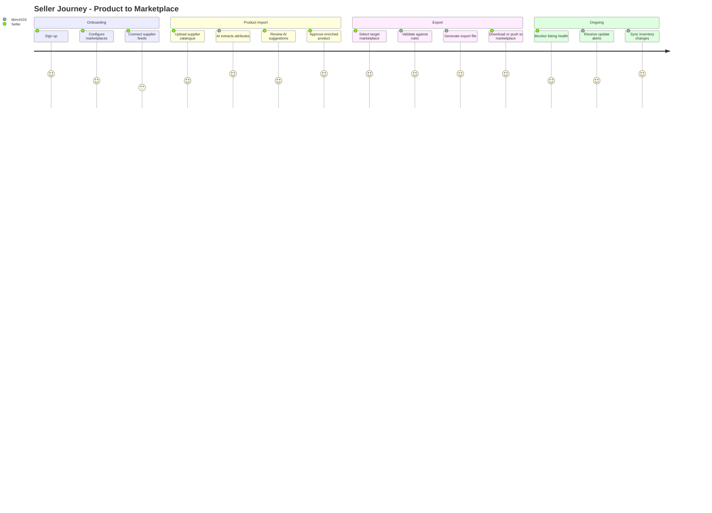
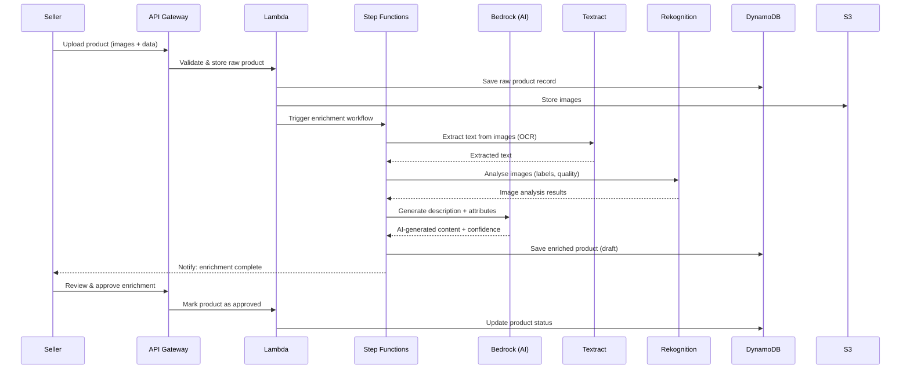

# MerchOS Engineering Blueprint

## Volume 01 — Executive Summary

---

| Field | Value |
|-------|-------|
| **Document ID** | MERCH-001 |
| **Title** | Executive Summary |
| **Version** | 0.1 |
| **Status** | Draft |
| **Owner** | Wadzanai Maparura |
| **Technical Lead** | Kiro AI |
| **Created** | 2026-06-27 |
| **Last Updated** | 2026-06-27 |
| **Next Review** | 2026-07-11 |
| **Classification** | Internal — Confidential |
| **Related Documents** | MERCH-002 through MERCH-021, Appendices, ADRs |

---

## Revision History

| Version | Date | Author | Change Description |
|---------|------|--------|-------------------|
| 0.1 | 2026-06-27 | Kiro AI / Wadzanai Maparura | Initial draft — complete executive summary |

---

## Table of Contents

1. [Purpose](#1-purpose)
2. [Scope](#2-scope)
3. [Platform Vision](#3-platform-vision)
4. [Business Context](#4-business-context)
5. [Target Market](#5-target-market)
6. [Platform Overview](#6-platform-overview)
7. [Architecture Philosophy](#7-architecture-philosophy)
8. [High-Level Architecture](#8-high-level-architecture)
9. [Key Architecture Decisions](#9-key-architecture-decisions)
10. [AWS Service Landscape](#10-aws-service-landscape)
11. [AI Strategy](#11-ai-strategy)
12. [Marketplace Strategy](#12-marketplace-strategy)
13. [Security Posture](#13-security-posture)
14. [Implementation Strategy](#14-implementation-strategy)
15. [Cost Model](#15-cost-model)
16. [Risks & Mitigations](#16-risks--mitigations)
17. [Success Criteria](#17-success-criteria)
18. [Assumptions](#18-assumptions)
19. [Dependencies](#19-dependencies)
20. [References](#20-references)

---

## 1. Purpose

This document provides the authoritative executive summary of the **MerchOS** platform — a cloud-native, AI-assisted, multi-marketplace e-commerce management system built entirely on Amazon Web Services (AWS).

The Executive Summary serves as the entry point to the MerchOS Engineering Blueprint series (Volumes 01–21 plus Appendices). It establishes:

- The business problem MerchOS solves
- The strategic architecture decisions that guide all engineering work
- The scope, constraints, and success criteria for the platform
- The relationship between AI intelligence and deterministic business logic
- The implementation roadmap at a glance

**Audience:** Engineering leadership, AWS solutions architects, investors, auditors, and new team members requiring rapid context acquisition.

---

## 2. Scope

### In Scope

| Domain | Coverage |
|--------|----------|
| Multi-marketplace product listing management | Takealot, Amazon, Makro, Shopify, WooCommerce |
| AI-powered product intelligence | Attribute extraction, description generation, image analysis, category recommendation |
| Marketplace export engine | CSV generation, validation, compliance, template management |
| Supplier management | Supplier onboarding, catalogue ingestion, data normalisation |
| Inventory engine | Stock synchronisation, allocation rules, low-stock alerts |
| Image intelligence | OCR (Textract), image analysis (Rekognition), background removal, compliance checks |
| Security & compliance | Multi-tenant isolation, POPIA compliance, encryption at rest and in transit |
| Infrastructure | Serverless-first AWS architecture, Infrastructure as Code (CDK), CI/CD via Amplify |
| Monitoring & operations | CloudWatch, X-Ray, alerting, runbooks, SLA management |

### Out of Scope (Current Phase)

- Payment processing and checkout flows
- End-consumer-facing storefronts
- Warehouse management system (WMS) integration
- International tax compliance beyond South Africa
- Mobile native applications (Phase 2+)

---

## 3. Platform Vision

> **MerchOS transforms fragmented, manual marketplace selling into a unified, AI-augmented, automated commerce operation — enabling sellers to list products across multiple marketplaces from a single source of truth with intelligent automation handling the complexity.**

### Vision Pillars

| Pillar | Description |
|--------|-------------|
| **Unified Catalogue** | One product record, intelligently adapted per marketplace requirements |
| **AI-Augmented Intelligence** | Machine learning recommends; deterministic rules decide |
| **Marketplace Agnostic** | Knowledge-base-driven marketplace support — add new marketplaces without code changes |
| **Seller Empowerment** | Reduce time-to-list from hours to minutes with AI-assisted enrichment |
| **Compliance by Design** | Every export passes marketplace-specific validation before submission |
| **Scale Without Complexity** | Serverless architecture scales from 1 to 1,000,000 products without operational overhead |

---

## 4. Business Context

### Problem Statement

E-commerce sellers operating across multiple South African and international marketplaces face:

1. **Fragmented tooling** — Each marketplace has its own portal, CSV format, and validation rules
2. **Manual data entry** — Product attributes must be re-entered or reformatted for each channel
3. **Inconsistent data quality** — Human error leads to listing rejections, fines, and lost sales
4. **No intelligent assistance** — Sellers receive no guidance on optimal categories, descriptions, or attributes
5. **Scaling bottleneck** — Adding a new marketplace multiplies operational workload linearly
6. **Supplier chaos** — Incoming supplier data arrives in inconsistent formats requiring manual normalisation

### Market Opportunity

- South African e-commerce market growing at 30%+ CAGR
- Takealot dominates with 15M+ monthly visitors
- Amazon South Africa launched 2024, creating new multi-channel complexity
- No dominant multi-marketplace management tool exists in the South African market
- International tools (ChannelAdvisor, Linnworks) are priced for enterprise and lack local marketplace support

---

## 5. Target Market

### Primary Segments

| Segment | Description | Product Count | Pain Level |
|---------|-------------|---------------|------------|
| **Growing Sellers** | Established sellers expanding to 2+ marketplaces | 100–5,000 SKUs | High |
| **Brands** | Manufacturers selling direct-to-marketplace | 50–10,000 SKUs | Medium-High |
| **Distributors** | Multi-brand distributors with large catalogues | 5,000–100,000 SKUs | Critical |
| **Agencies** | E-commerce agencies managing multiple seller accounts | 10,000–500,000 SKUs | Critical |

### Geographic Focus

- **Phase 1:** South Africa (Takealot, Makro, Shopify ZA, WooCommerce)
- **Phase 2:** Pan-African expansion + Amazon Global
- **Phase 3:** Full international marketplace coverage

---

## 6. Platform Overview

MerchOS is a **multi-tenant SaaS platform** that provides:

### Core Capabilities

| Capability | Description |
|-----------|-------------|
| **Product Hub** | Central product catalogue with rich attribute management |
| **Marketplace Intelligence Engine** | Knowledge-base-driven marketplace schema management |
| **Product Intelligence Engine** | AI-powered attribute extraction, description generation, SEO optimisation |
| **Image Intelligence Engine** | OCR, image analysis, compliance checking, background processing |
| **Supplier Intelligence** | Automated supplier catalogue ingestion and normalisation |
| **Inventory Engine** | Real-time stock management and allocation across channels |
| **Export Engine** | Marketplace-specific CSV/API export with full validation |
| **Analytics Dashboard** | Listing performance, compliance scores, AI confidence metrics |

### Platform Characteristics

- **Multi-tenant:** Complete data isolation per tenant with shared infrastructure
- **Serverless-first:** No servers to manage; scales to zero and to infinity
- **Event-driven:** Loosely coupled services communicating via events
- **API-first:** All functionality exposed via well-documented REST/GraphQL APIs
- **AI-assisted:** Intelligence augments human decision-making without replacing business rules
- **Infrastructure as Code:** 100% of infrastructure defined in AWS CDK

---

## 7. Architecture Philosophy

MerchOS engineering is guided by ten architectural principles that inform every technical decision:

| # | Principle | Rationale |
|---|-----------|-----------|
| 1 | **AWS Native** | Maximise managed service usage to reduce undifferentiated heavy lifting |
| 2 | **Serverless First** | Eliminate server management; pay only for actual compute consumed |
| 3 | **Event Driven** | Decouple services; enable asynchronous processing and resilience |
| 4 | **API First** | Design APIs before implementation; enable frontend/backend independence |
| 5 | **Multi-Tenant SaaS** | Shared infrastructure, isolated data; cost-efficient at scale |
| 6 | **Infrastructure as Code** | Reproducible, version-controlled, auditable infrastructure |
| 7 | **Secure by Design** | Security is not bolted on — it is embedded in every layer |
| 8 | **AI Assisted** | AI recommends and enriches; business rules validate and decide |
| 9 | **Highly Scalable** | Architecture supports 10x growth without re-architecture |
| 10 | **Cost Optimised** | Right-size from day one; monitor and optimise continuously |

### AWS Well-Architected Framework Alignment

MerchOS architecture is evaluated against all six pillars:

| Pillar | MerchOS Approach |
|--------|-----------------|
| **Operational Excellence** | Infrastructure as Code, automated deployments, runbooks, observability |
| **Security** | Least privilege IAM, encryption everywhere, Cognito multi-tenant auth, POPIA compliance |
| **Reliability** | Multi-AZ by default, retry with exponential backoff, dead-letter queues, circuit breakers |
| **Performance Efficiency** | Right-sized Lambda, DynamoDB on-demand, CloudFront caching, async processing |
| **Cost Optimisation** | Serverless pay-per-use, reserved capacity for predictable loads, cost alerts |
| **Sustainability** | Serverless scales to zero, efficient data lifecycle policies, right-sized compute |

---

## 8. High-Level Architecture

### System Context Diagram

### Component Architecture

---

## 9. Key Architecture Decisions

The following Architecture Decision Records (ADRs) represent the foundational technical choices for MerchOS. Full ADRs are maintained in the Appendices.

| ADR | Decision | Rationale | Status |
|-----|----------|-----------|--------|
| ADR-001 | **DynamoDB as primary database** | Single-digit millisecond latency, serverless scaling, multi-tenant partition design, no connection pool management | Approved |
| ADR-002 | **AWS Lambda for compute** | Pay-per-invocation, auto-scaling, no server management, event-driven integration | Approved |
| ADR-003 | **Amazon Bedrock for AI** | Managed LLM access, no model hosting, pay-per-token, multiple model choice (Claude, Titan) | Approved |
| ADR-004 | **EventBridge for event bus** | Native AWS integration, schema registry, content-based filtering, archive/replay | Approved |
| ADR-005 | **Step Functions for orchestration** | Visual workflows, built-in retry/error handling, direct service integrations, audit trail | Approved |
| ADR-006 | **Cognito for authentication** | AWS-native, multi-tenant user pools, OAuth 2.0/OIDC, MFA support, Amplify integration | Approved |
| ADR-007 | **Knowledge-base-driven marketplace schemas** | Decouple marketplace rules from code; add marketplaces via configuration, not deployment | Approved |
| ADR-008 | **AI recommends, rules decide** | Maintain deterministic compliance; AI enriches but never bypasses validation | Approved |
| ADR-009 | **Next.js on Amplify for frontend** | SSR/SSG flexibility, React ecosystem, Amplify managed hosting with CI/CD | Approved |
| ADR-010 | **AWS CDK for IaC** | TypeScript-native, construct abstractions, AWS-native toolchain, L2/L3 constructs | Approved |
| ADR-011 | **Multi-tenant via partition key isolation** | Single-table design with tenant prefix; cost-efficient, operationally simple | Approved |
| ADR-012 | **S3 for all object storage** | Images, exports, supplier files, backups — single object store with lifecycle policies | Approved |

---

## 10. AWS Service Landscape

### Service Matrix

| Service | Purpose in MerchOS | Tier |
|---------|-------------------|------|
| **Amazon S3** | Image storage, export files, supplier uploads, static assets, backups | Data |
| **AWS Lambda** | All business logic compute, API handlers, event processors | Compute |
| **Amazon Textract** | OCR on supplier documents, invoices, product labels | Intelligence |
| **Amazon Bedrock** | LLM inference — descriptions, attributes, SEO, translations, category mapping | Intelligence |
| **Amazon Rekognition** | Image analysis, label detection, moderation, quality assessment | Intelligence |
| **Amazon DynamoDB** | Primary database — products, tenants, orders, marketplace schemas, audit logs | Data |
| **Amazon Cognito** | User authentication, multi-tenant authorisation, MFA, federation | Security |
| **Amazon API Gateway** | REST/HTTP API surface, rate limiting, request validation, WAF integration | API |
| **AWS Step Functions** | Complex workflow orchestration — product enrichment, bulk export, onboarding | Orchestration |
| **Amazon EventBridge** | Event bus — decoupled service communication, scheduling, cross-service triggers | Orchestration |
| **Amazon CloudWatch** | Logging, metrics, dashboards, alarms, anomaly detection | Operations |
| **Amazon SNS** | Notifications — email, SMS, push for alerts and user communications | Messaging |
| **Amazon SQS** | Async message queuing — bulk processing, retry buffers, dead-letter queues | Messaging |
| **AWS Amplify** | Frontend hosting, CI/CD pipeline, branch previews, custom domains | Deployment |
| **AWS CDK** | Infrastructure as Code — all resources defined in TypeScript constructs | Infrastructure |
| **AWS Secrets Manager** | API keys, third-party credentials, rotation policies | Security |

---

## 11. AI Strategy

### Separation of Concerns

MerchOS enforces a strict boundary between AI intelligence and deterministic business logic:

```mermaid
graph LR
    subgraph AI_Layer["AI Intelligence Layer (Recommends)"]
        A1[Product Understanding]
        A2[Attribute Extraction]
        A3[Description Generation]
        A4[SEO Optimisation]
        A5[Category Recommendation]
        A6[Image Understanding]
        A7[OCR Interpretation]
        A8[Translation]
    end

    subgraph Business_Layer["Deterministic Business Layer (Decides)"]
        B1[CSV Generation]
        B2[Marketplace Validation]
        B3[Required Field Enforcement]
        B4[SKU Generation]
        B5[Pricing Rules]
        B6[Tax Calculation]
        B7[Inventory Allocation]
        B8[Compliance Checks]
        B9[Export Formatting]
    end

    AI_Layer -->|"Recommendations + Confidence Scores"| Business_Layer
    Business_Layer -->|"Validation Feedback"| AI_Layer
```

### AI Governance Principles

| Principle | Implementation |
|-----------|---------------|
| **Transparency** | All AI outputs include confidence scores and reasoning traces |
| **Human-in-the-loop** | AI suggestions require seller approval before marketplace submission |
| **Auditability** | Every AI decision is logged with input, output, model version, and timestamp |
| **Fallback** | If AI confidence is below threshold, flag for human review rather than guessing |
| **Determinism** | Business-critical outputs (pricing, tax, compliance) never depend on AI |
| **Cost control** | Token usage tracked per tenant; budget alerts prevent runaway costs |

### AI Service Mapping

| Capability | AWS Service | Model/Feature | Use Case |
|-----------|-------------|---------------|----------|
| Text generation | Amazon Bedrock | Claude 3.5 Sonnet | Product descriptions, SEO, translations |
| Attribute extraction | Amazon Bedrock | Claude 3.5 Sonnet | Parse unstructured supplier data into structured attributes |
| Image analysis | Amazon Rekognition | DetectLabels, DetectText | Product categorisation from images, compliance checks |
| Document OCR | Amazon Textract | AnalyzeDocument | Extract data from supplier invoices, catalogues, labels |
| Category mapping | Amazon Bedrock | Claude 3.5 Sonnet + RAG | Map products to marketplace taxonomy with knowledge base |
| Translation | Amazon Bedrock | Claude 3.5 Sonnet | Multi-language product descriptions |

---

## 12. Marketplace Strategy

### Knowledge-Base Architecture

MerchOS does **not** hardcode marketplace rules into application logic. Instead, all marketplace schemas, validation rules, and export templates are stored in a **Marketplace Knowledge Base** — a configuration-driven system that allows new marketplaces to be added without code deployment.

### Marketplace Coverage Matrix

| Marketplace | Region | Integration Method | Priority | Status |
|-------------|--------|-------------------|----------|--------|
| **Takealot** | South Africa | CSV Upload + Seller API | P0 | Phase 1 |
| **Amazon** | Global (ZA focus) | Seller Partner API (SP-API) | P0 | Phase 1 |
| **Makro** | South Africa | CSV Upload (Marketplace Portal) | P1 | Phase 1 |
| **Shopify** | Global | REST/GraphQL Admin API | P1 | Phase 1 |
| **WooCommerce** | Global | REST API (WP) | P2 | Phase 1 |

### Per-Marketplace Documentation

Each marketplace receives a dedicated blueprint chapter (within Volume 08) containing:

1. Marketplace overview and business context
2. Complete CSV specification (every column documented)
3. Category taxonomy mapping
4. Mandatory and optional attributes
5. Image requirements and compliance rules
6. Validation rules and common errors
7. Export template definitions
8. API integration strategy
9. Version history and change tracking

---

## 13. Security Posture

### Security Architecture Summary

| Layer | Control | Implementation |
|-------|---------|---------------|
| **Identity** | Multi-tenant authentication | Amazon Cognito with custom attributes for tenant isolation |
| **Authorisation** | Role-based access control (RBAC) | Cognito groups + API Gateway authorizers + Lambda policy enforcement |
| **Network** | API protection | API Gateway WAF, rate limiting, request validation |
| **Data at Rest** | Encryption | S3 SSE-S3/SSE-KMS, DynamoDB encryption, Secrets Manager |
| **Data in Transit** | TLS everywhere | HTTPS enforced, TLS 1.2+ minimum |
| **Application** | Input validation | Schema validation at API Gateway + business logic layer |
| **Secrets** | Credential management | AWS Secrets Manager with automatic rotation |
| **Audit** | Complete audit trail | CloudTrail, CloudWatch Logs, DynamoDB audit records |
| **Compliance** | POPIA (South Africa) | Data residency, consent management, right to deletion |
| **Tenant Isolation** | Data segregation | Partition key prefixing, IAM policy conditions, row-level filtering |

### Threat Model Summary

| Threat | Mitigation | AWS Service |
|--------|-----------|-------------|
| Unauthorised access | MFA, token validation, session management | Cognito |
| Cross-tenant data leakage | Partition isolation, authorisation middleware | DynamoDB + Lambda |
| API abuse | Rate limiting, WAF rules, throttling | API Gateway + WAF |
| Data exfiltration | Encryption, access logging, anomaly detection | S3 + CloudTrail + CloudWatch |
| Supply chain attacks | Dependency scanning, CDK Nag, SAST | CodePipeline + CDK Nag |
| Credential exposure | Secrets Manager, no hardcoded credentials, rotation | Secrets Manager |

---

## 14. Implementation Strategy

### Phased Delivery

### Delivery Principles

| Principle | Application |
|-----------|-------------|
| Blueprint before code | No implementation without approved documentation |
| Vertical slices | Deliver end-to-end features, not horizontal layers |
| Continuous deployment | Every merge to main deploys to staging automatically |
| Feature flags | New capabilities behind flags for controlled rollout |
| Observability from day one | Logging, metrics, and tracing in every Lambda from the start |

---

## 15. Cost Model

### Cost Philosophy

MerchOS is designed for **cost efficiency from inception** by leveraging the serverless pay-per-use model. The architecture ensures:

- Zero cost when idle (Lambda, DynamoDB on-demand, S3 lifecycle)
- Linear cost growth with usage (not exponential)
- Clear per-tenant cost attribution
- Automated cost alerting and budget enforcement

### Estimated Monthly Cost Tiers

| Scale | Monthly Active Products | Estimated AWS Cost | Cost per Product |
|-------|------------------------|-------------------|-----------------|
| **Startup** | 1,000 | $50–$150 | $0.05–$0.15 |
| **Growth** | 10,000 | $200–$600 | $0.02–$0.06 |
| **Scale** | 100,000 | $1,500–$4,000 | $0.015–$0.04 |
| **Enterprise** | 1,000,000 | $8,000–$20,000 | $0.008–$0.02 |

### Cost Drivers

| Service | Cost Driver | Optimisation Strategy |
|---------|------------|----------------------|
| Lambda | Invocation count + duration | Right-size memory, minimise cold starts, batch processing |
| DynamoDB | Read/Write capacity units | On-demand for unpredictable; provisioned for steady-state |
| Bedrock | Input/output tokens | Prompt caching, response streaming, model selection per task |
| S3 | Storage + requests | Lifecycle policies, Intelligent-Tiering, compression |
| Textract | Pages processed | Batch processing, cache results, process only changed documents |
| API Gateway | Request count | Caching, request deduplication, WebSocket for real-time |

---

## 16. Risks & Mitigations

| # | Risk | Likelihood | Impact | Mitigation | Owner |
|---|------|-----------|--------|-----------|-------|
| R1 | Marketplace CSV format changes without notice | High | High | Version-controlled knowledge base; automated format detection; alert on validation failure rate spike | Platform Team |
| R2 | AI model output quality inconsistency | Medium | Medium | Confidence thresholds; human-in-the-loop; A/B testing; model version pinning | AI Team |
| R3 | Multi-tenant data leakage | Low | Critical | Partition key isolation; integration tests; penetration testing; security reviews | Security Team |
| R4 | AWS service limits hit during scale | Medium | High | Proactive limit increase requests; architectural patterns that respect limits; monitoring | DevOps Team |
| R5 | Vendor lock-in to AWS | Low | Medium | Hexagonal architecture at service boundary; data export capabilities; standard APIs | Architecture Team |
| R6 | Cold start latency impacts UX | Medium | Medium | Provisioned concurrency for critical paths; warm-up strategies; async processing | Platform Team |
| R7 | Cost overrun from AI token usage | Medium | Medium | Per-tenant budgets; token monitoring; prompt optimisation; caching | Finance + Engineering |
| R8 | Regulatory changes (POPIA evolution) | Low | High | Modular compliance layer; legal review cadence; configurable data policies | Compliance Team |

---

## 17. Success Criteria

### Platform Success Metrics

| Metric | Target | Measurement |
|--------|--------|-------------|
| **Time to first listing** | < 5 minutes for AI-assisted flow | User session analytics |
| **Export validation pass rate** | > 98% on first attempt | Export engine metrics |
| **AI attribute extraction accuracy** | > 90% confidence on primary attributes | Model evaluation pipeline |
| **System availability** | 99.9% uptime (8.7h downtime/year max) | CloudWatch synthetic monitoring |
| **API latency (p95)** | < 500ms for synchronous operations | API Gateway + X-Ray |
| **Multi-marketplace export** | Support 5 marketplaces from single product record | Feature completion tracking |
| **Tenant onboarding** | < 10 minutes from signup to first product import | Onboarding funnel analytics |
| **Cost per product per month** | < $0.05 at growth scale | AWS Cost Explorer + custom attribution |

### Engineering Quality Metrics

| Metric | Target |
|--------|--------|
| Test coverage (unit + integration) | > 80% |
| Deployment frequency | Multiple times per day |
| Change failure rate | < 5% |
| Mean time to recovery (MTTR) | < 30 minutes |
| Infrastructure drift | Zero (CDK enforced) |
| Security vulnerabilities (critical) | Zero in production |

---

## 18. Assumptions

| # | Assumption | Impact if Invalid | Mitigation |
|---|-----------|-------------------|-----------|
| A1 | AWS services remain available in af-south-1 (Cape Town) region | Architecture redesign for latency | Multi-region failover design documented |
| A2 | Amazon Bedrock supports Claude models in required region | AI capability degradation | Cross-region Bedrock invocation; alternative model providers |
| A3 | Marketplace CSV formats change infrequently (< quarterly) | Increased maintenance burden | Automated format detection; versioned knowledge base |
| A4 | Seller data volumes fit within DynamoDB item size limits (400KB) | Data model redesign | Large attribute overflow to S3; item splitting pattern |
| A5 | Takealot Seller API remains available and stable | Fallback to CSV-only integration | Abstract marketplace interface; dual-mode integration |
| A6 | Target market can adopt SaaS pricing model | Revenue model failure | Flexible pricing; on-premise option in roadmap |
| A7 | Single-table DynamoDB design supports all access patterns | Migration required | Thorough access pattern analysis upfront (Volume 14) |
| A8 | Serverless cold starts are acceptable for non-critical paths | User experience degradation | Provisioned concurrency budget for critical functions |

---

## 19. Dependencies

### External Dependencies

| Dependency | Type | Risk Level | Contingency |
|-----------|------|-----------|-------------|
| AWS Cloud Services | Infrastructure | Low | Multi-region design; no single-region dependency |
| Amazon Bedrock (Claude) | AI Models | Medium | Model abstraction layer; fallback to Titan/alternative |
| Takealot Seller Portal/API | Marketplace | High | CSV fallback; format versioning; error recovery |
| Amazon SP-API | Marketplace | Medium | Well-documented; SDK available; rate limit handling |
| Shopify Admin API | Marketplace | Low | Stable, well-versioned API; webhook support |
| WooCommerce REST API | Marketplace | Low | Open source; self-hosted; version pinning |
| GitHub | Source Control | Low | Industry standard; export capability |
| Amplify Hosting | Deployment | Low | Fallback to CloudFront + S3 static hosting |

### Internal Dependencies

| Dependency | Description | Status |
|-----------|-------------|--------|
| Engineering Blueprint (this document series) | All implementation depends on approved blueprints | In Progress |
| AWS Account Setup | Production, staging, and development accounts | Pending |
| Domain & DNS | merchos.com (or equivalent) registered and configured | Pending |
| CI/CD Pipeline | Amplify + CDK Pipeline configured | Pending |
| Design System | UI component library and brand guidelines | Pending |

---

## 20. References

| # | Reference | Description |
|---|-----------|-------------|
| 1 | [AWS Well-Architected Framework](https://docs.aws.amazon.com/wellarchitected/latest/framework/welcome.html) | Six-pillar architecture review framework |
| 2 | [AWS Serverless Application Lens](https://docs.aws.amazon.com/wellarchitected/latest/serverless-applications-lens/welcome.html) | Serverless-specific architecture best practices |
| 3 | [Amazon DynamoDB Best Practices](https://docs.aws.amazon.com/amazondynamodb/latest/developerguide/best-practices.html) | Single-table design, partition key strategy, scaling |
| 4 | [Amazon Bedrock Documentation](https://docs.aws.amazon.com/bedrock/) | Foundation model access and configuration |
| 5 | [AWS CDK Developer Guide](https://docs.aws.amazon.com/cdk/v2/guide/home.html) | Infrastructure as Code with TypeScript constructs |
| 6 | [POPIA Act (South Africa)](https://popia.co.za/) | Protection of Personal Information Act compliance requirements |
| 7 | [Takealot Seller Portal Documentation](https://seller.takealot.com/) | Marketplace integration specifications |
| 8 | [Amazon SP-API Documentation](https://developer-docs.amazon.com/sp-api/) | Selling Partner API reference |
| 9 | [Shopify Admin API Reference](https://shopify.dev/docs/admin-api) | Shopify integration endpoints |
| 10 | [AWS Multi-Tenant SaaS Architecture](https://docs.aws.amazon.com/whitepapers/latest/saas-architecture-fundamentals/saas-architecture-fundamentals.html) | Multi-tenant design patterns on AWS |

---

## Blueprint Document Index

The complete MerchOS Engineering Blueprint comprises the following volumes:

| Volume | Document ID | Title | Status |
|--------|-------------|-------|--------|
| 01 | MERCH-001 | Executive Summary | Draft |
| 02 | MERCH-002 | Business & Product | Planned |
| 03 | MERCH-003 | Functional Requirements | Planned |
| 04 | MERCH-004 | Non-Functional Requirements | Planned |
| 05 | MERCH-005 | AWS Architecture | Planned |
| 06 | MERCH-006 | Security Architecture | Planned |
| 07 | MERCH-007 | AI Architecture | Planned |
| 08 | MERCH-008 | Marketplace Intelligence Engine | Planned |
| 09 | MERCH-009 | Product Intelligence Engine | Planned |
| 10 | MERCH-010 | Image Intelligence Engine | Planned |
| 11 | MERCH-011 | Supplier Intelligence | Planned |
| 12 | MERCH-012 | Inventory Engine | Planned |
| 13 | MERCH-013 | Export Engine | Planned |
| 14 | MERCH-014 | Database Design | Planned |
| 15 | MERCH-015 | API Specifications | Planned |
| 16 | MERCH-016 | Frontend Architecture | Planned |
| 17 | MERCH-017 | Backend Architecture | Planned |
| 18 | MERCH-018 | DevOps & CI/CD | Planned |
| 19 | MERCH-019 | Monitoring & Operations | Planned |
| 20 | MERCH-020 | Cost Optimisation | Planned |
| 21 | MERCH-021 | Implementation Roadmap | Planned |
| — | MERCH-ADR | Architecture Decision Records | In Progress |
| — | MERCH-GLO | Glossary | Planned |
| — | MERCH-APP | Appendices | Planned |

---

## User Journey — Seller Flow

---

## Data Flow — Product Enrichment Pipeline

---

*End of Volume 01 — Executive Summary*

*Next: Volume 02 — Business & Product (MERCH-002)*
