# MerchOS Engineering Blueprint

## Volume 02 — Business & Product

---

| Field | Value |
|-------|-------|
| **Document ID** | MERCH-002 |
| **Title** | Business & Product |
| **Version** | 0.1 |
| **Status** | Draft |
| **Owner** | Wadzanai Maparura |
| **Technical Lead** | Kiro AI |
| **Created** | 2026-06-27 |
| **Last Updated** | 2026-06-27 |
| **Next Review** | 2026-07-11 |
| **Classification** | Internal — Confidential |
| **Related Documents** | MERCH-001 (Executive Summary), MERCH-003 (Functional Requirements) |

---

## Revision History

| Version | Date | Author | Change Description |
|---------|------|--------|-------------------|
| 0.1 | 2026-06-27 | Kiro AI / Wadzanai Maparura | Initial draft — complete business and product specification |

---

## Table of Contents

1. [Purpose](#1-purpose)
2. [Scope](#2-scope)
3. [Business Model](#3-business-model)
4. [Value Proposition](#4-value-proposition)
5. [Target Personas](#5-target-personas)
6. [Product Features Matrix](#6-product-features-matrix)
7. [User Stories](#7-user-stories)
8. [Platform Modules](#8-platform-modules)
9. [Pricing Strategy](#9-pricing-strategy)
10. [Competitive Analysis](#10-competitive-analysis)
11. [Go-to-Market Strategy](#11-go-to-market-strategy)
12. [Growth Strategy](#12-growth-strategy)
13. [Success Metrics](#13-success-metrics)
14. [Product Roadmap](#14-product-roadmap)
15. [Risks & Mitigations](#15-risks--mitigations)
16. [Assumptions](#16-assumptions)
17. [Dependencies & References](#17-dependencies--references)

---

## 1. Purpose

This document defines the **business model, product strategy, and commercial framework** for the MerchOS platform. It translates the strategic vision established in Volume 01 (Executive Summary) into concrete product decisions, market positioning, and revenue architecture.

This volume serves as the authoritative reference for:

- Product management decisions and feature prioritisation
- Engineering teams requiring business context for technical trade-offs
- Investors and stakeholders evaluating commercial viability
- Sales and marketing teams positioning MerchOS in the market
- Onboarding new team members to the business rationale

**Audience:** Product managers, engineering leads, business stakeholders, investors, marketing teams.

**Relationship to Other Volumes:**
- Informed by: MERCH-001 (Executive Summary)
- Informs: MERCH-003 (Functional Requirements), MERCH-020 (Cost Optimisation), MERCH-021 (Implementation Roadmap)

---

## 2. Scope

### In Scope

| Area | Coverage |
|------|----------|
| Business model definition | Revenue streams, pricing tiers, unit economics |
| Product strategy | Feature matrix, module architecture, differentiation |
| Market analysis | Competitive landscape, positioning, target segments |
| User personas | Detailed persona definitions with jobs-to-be-done |
| User stories | Comprehensive user story catalogue organised by module |
| Go-to-market | Launch strategy, channel strategy, partnership model |
| Growth mechanics | Retention, expansion, viral loops, network effects |
| Product roadmap | Phase-aligned feature delivery timeline |
| Success metrics | Business KPIs, product metrics, health indicators |

### Out of Scope

| Area | Covered In |
|------|-----------|
| Technical architecture details | MERCH-005 (AWS Architecture) |
| Detailed functional specifications | MERCH-003 (Functional Requirements) |
| API contract definitions | MERCH-015 (API Specifications) |
| Database schema design | MERCH-014 (Database Design) |
| Security compliance details | MERCH-006 (Security Architecture) |
| Operational procedures | MERCH-019 (Monitoring & Operations) |

---

## 3. Business Model

### 3.1 Model Type

MerchOS operates as a **B2B SaaS (Software as a Service)** platform with a **tiered subscription + usage-based** hybrid revenue model. This combines predictable recurring revenue with scalable usage-aligned pricing.

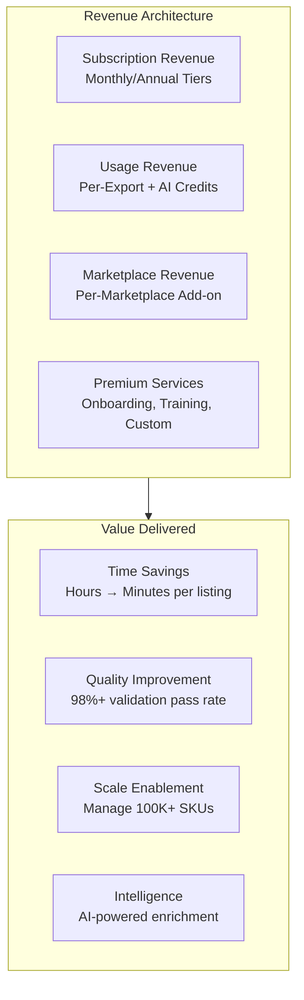

### 3.2 Revenue Streams

| Stream | Type | Description | Contribution Target |
|--------|------|-------------|-------------------|
| **Platform Subscription** | Recurring (MRR) | Monthly/annual access fee based on tier | 60% of revenue |
| **Usage Credits** | Consumption | AI processing credits, export volumes, API calls | 25% of revenue |
| **Marketplace Modules** | Add-on | Per-marketplace connector activation | 10% of revenue |
| **Professional Services** | One-time/Recurring | Onboarding, custom integrations, training | 5% of revenue |

### 3.3 Unit Economics

| Metric | Target | Basis |
|--------|--------|-------|
| **Customer Acquisition Cost (CAC)** | < R5,000 | Blended (organic + paid) |
| **Monthly Recurring Revenue per Customer (ARPU)** | R1,500 — R15,000 | Tier-dependent |
| **Customer Lifetime Value (LTV)** | > R150,000 | 36-month average retention |
| **LTV:CAC Ratio** | > 30:1 | Healthy SaaS benchmark is > 3:1 |
| **Gross Margin** | > 80% | Serverless infrastructure + AI costs |
| **Net Revenue Retention (NRR)** | > 120% | Expansion via usage growth + tier upgrades |
| **Monthly Churn Rate** | < 3% | Logo churn target |
| **Payback Period** | < 3 months | Time to recover CAC |

### 3.4 Cost Structure

| Cost Category | % of Revenue | Driver |
|---------------|-------------|--------|
| AWS Infrastructure | 8–12% | Serverless, scales with usage |
| AI/ML Costs (Bedrock tokens) | 5–10% | Per-product processing |
| Engineering & Development | 30–40% | Team salaries, tools |
| Sales & Marketing | 15–25% | Growth phase dependent |
| Customer Success | 5–10% | Onboarding, support |
| General & Administrative | 5–10% | Operations, legal, finance |

---

## 4. Value Proposition

### 4.1 Core Value Statement

> **MerchOS eliminates the complexity of multi-marketplace selling by providing a single intelligent platform that transforms raw product data into marketplace-ready listings across every channel — powered by AI, governed by rules, and scaled by the cloud.**

### 4.2 Value Proposition Canvas

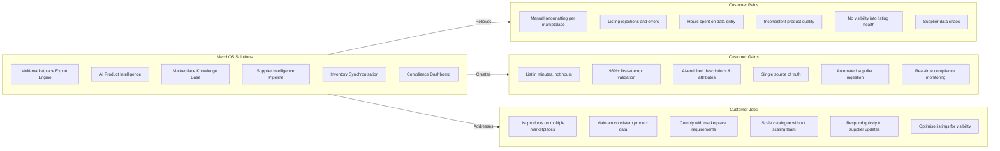

### 4.3 Differentiation Matrix

| Dimension | MerchOS | Traditional Tools | Manual Process |
|-----------|---------|------------------|----------------|
| **Time to list** | Minutes (AI-assisted) | Hours (template-based) | Hours-Days (manual) |
| **Marketplace coverage** | 5+ (knowledge-base driven) | 2–3 (hardcoded) | 1 at a time |
| **Data quality** | AI enrichment + validation | Template validation only | Human error prone |
| **Adding new marketplace** | Configuration change | Code deployment | Complete rework |
| **South African focus** | Native Takealot/Makro support | Limited/No SA support | Manual SA knowledge |
| **Scale** | 1M+ products serverless | Limited by server capacity | Limited by team size |
| **Intelligence** | AI-powered recommendations | Rules only | Human judgment only |
| **Cost model** | Pay per use (serverless) | Fixed server costs | Labour costs |

### 4.4 Key Benefits by Stakeholder

| Stakeholder | Primary Benefit | Quantified Impact |
|-------------|----------------|-------------------|
| **Seller (Owner)** | Revenue growth through multi-channel presence | 40–60% increase in marketplace coverage |
| **Catalogue Manager** | Dramatic time savings on listing creation | 80% reduction in time-to-list |
| **Operations Manager** | Reduced errors and rework | 95% reduction in listing rejections |
| **Finance** | Lower cost per listing at scale | 70% reduction in per-listing operational cost |
| **Agency** | Manage more clients with same team | 3–5x client capacity per team member |

---

## 5. Target Personas

### 5.1 Persona Overview

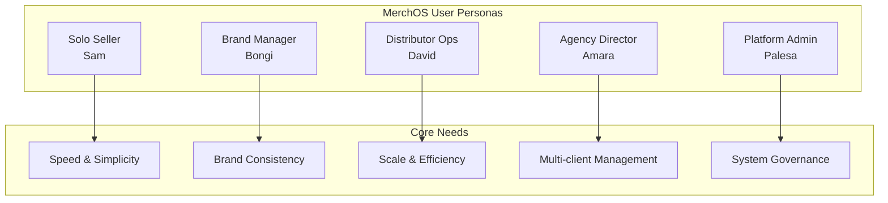

### 5.2 Persona: Solo Seller Sam

| Attribute | Detail |
|-----------|--------|
| **Role** | Independent e-commerce seller |
| **Company Size** | 1–3 people |
| **Catalogue Size** | 50–500 SKUs |
| **Marketplaces** | Takealot + 1 other (Shopify or Amazon) |
| **Technical Skill** | Low–Medium (comfortable with spreadsheets, not APIs) |
| **Primary Goal** | List products faster, reduce rejections, expand to new marketplaces |
| **Budget** | R500–R2,000/month |

**Jobs to Be Done:**
1. Upload my supplier catalogue and get it marketplace-ready without reformatting
2. Write compelling product descriptions without hiring a copywriter
3. Know exactly why my listings are rejected and fix them in one click
4. Add a new marketplace without learning an entirely new system

**Pain Points:**
- Spends 3–4 hours per product listing across 2 marketplaces
- 20–30% rejection rate on first CSV submission to Takealot
- Cannot afford dedicated catalogue manager
- Supplier data arrives in inconsistent formats (PDFs, spreadsheets, WhatsApp images)

**Success Criteria:**
- Time-to-list drops to < 15 minutes per product
- Rejection rate falls below 5%
- Can manage 2–3 marketplaces without additional staff

---

### 5.3 Persona: Brand Manager Bongi

| Attribute | Detail |
|-----------|--------|
| **Role** | E-commerce & digital commerce manager at a consumer brand |
| **Company Size** | 20–200 people (brand/manufacturer) |
| **Catalogue Size** | 200–5,000 SKUs |
| **Marketplaces** | Takealot, Amazon, Shopify (own DTC store), Makro |
| **Technical Skill** | Medium (uses SaaS tools daily, understands APIs conceptually) |
| **Primary Goal** | Maintain brand consistency across all channels while maximising marketplace coverage |
| **Budget** | R5,000–R20,000/month |

**Jobs to Be Done:**
1. Ensure product descriptions and images meet brand guidelines across all marketplaces
2. Launch new product lines across all channels simultaneously
3. Track listing health and compliance across every marketplace
4. Provide the exec team with multi-channel performance analytics

**Pain Points:**
- Brand inconsistency when different team members handle different marketplaces
- New product launches take 2–3 weeks to propagate across all channels
- No single view of catalogue health across marketplaces
- Compliance requirements differ per marketplace and change without notice

**Success Criteria:**
- Brand consistency score > 95% across channels
- New product launch across all marketplaces in < 48 hours
- Single dashboard for cross-marketplace catalogue health
- Automated alerts when marketplace requirements change

---

### 5.4 Persona: Distributor Ops David

| Attribute | Detail |
|-----------|--------|
| **Role** | Operations manager at a multi-brand distributor |
| **Company Size** | 50–500 people |
| **Catalogue Size** | 5,000–100,000 SKUs |
| **Marketplaces** | All supported (Takealot, Amazon, Makro, Shopify, WooCommerce) |
| **Technical Skill** | Medium–High (comfortable with data, integrations, bulk operations) |
| **Primary Goal** | Manage massive catalogue across all channels with minimal manual intervention |
| **Budget** | R20,000–R100,000/month |

**Jobs to Be Done:**
1. Bulk-import thousands of products from multiple suppliers in various formats
2. Automatically categorise and enrich products for each marketplace
3. Maintain accurate inventory across all channels in real-time
4. Generate marketplace-specific exports for 50,000+ products with zero errors

**Pain Points:**
- 10+ suppliers with different data formats, update frequencies, and quality levels
- Bulk export to Takealot generates hundreds of validation errors requiring manual fixes
- Inventory discrepancies across marketplaces cause overselling and penalties
- Adding a new supplier or marketplace takes weeks of mapping work

**Success Criteria:**
- Supplier onboarding time < 2 days (currently 2–3 weeks)
- Bulk export validation pass rate > 99%
- Inventory sync latency < 5 minutes
- Zero overselling incidents per quarter

---

### 5.5 Persona: Agency Director Amara

| Attribute | Detail |
|-----------|--------|
| **Role** | Director of an e-commerce management agency |
| **Company Size** | 5–50 people (agency) |
| **Catalogue Size** | 10,000–500,000 SKUs (across all clients) |
| **Marketplaces** | All supported, varying per client |
| **Technical Skill** | High (evaluates and implements technology for clients) |
| **Primary Goal** | Manage multiple client accounts efficiently with complete isolation and white-label capability |
| **Budget** | R50,000–R200,000/month (passed to clients) |

**Jobs to Be Done:**
1. Onboard new clients and their catalogues in days, not weeks
2. Manage 20+ client accounts with complete data isolation
3. Provide client-facing dashboards and reports (white-label optional)
4. Scale the agency without linearly scaling the team

**Pain Points:**
- Each client requires separate marketplace logins and workflows
- No unified view across all client accounts
- Team capacity is the bottleneck — each new client requires dedicated staff
- Client data must be completely isolated (contractual and legal requirement)

**Success Criteria:**
- Manage 3–5x more clients per team member than current state
- Client onboarding in < 5 days (catalogue imported and first export generated)
- Complete tenant isolation with per-client audit trails
- Agency-level analytics across all client accounts

---

### 5.6 Persona: Platform Admin Palesa

| Attribute | Detail |
|-----------|--------|
| **Role** | MerchOS internal platform administrator |
| **Company Size** | MerchOS (internal) |
| **Catalogue Size** | N/A (manages the platform, not products) |
| **Technical Skill** | High (DevOps, cloud infrastructure, system administration) |
| **Primary Goal** | Ensure platform health, manage tenants, update marketplace knowledge base |
| **Budget** | N/A (internal) |

**Jobs to Be Done:**
1. Monitor platform health across all tenants and services
2. Onboard and configure new tenants
3. Update marketplace schemas when CSV formats change
4. Investigate and resolve tenant-reported issues
5. Manage AI model performance and cost

**Pain Points:**
- Marketplace format changes require emergency updates
- Tenant issues require deep investigation across multiple services
- AI cost spikes need rapid identification and resolution
- Platform scaling requires proactive capacity management

**Success Criteria:**
- Platform uptime > 99.9%
- Marketplace schema updates deployed within 4 hours of detection
- Mean time to resolution (MTTR) < 30 minutes for P1 incidents
- AI cost per tenant remains within budget thresholds

---

## 6. Product Features Matrix

### 6.1 Feature Tier Allocation

| Feature | Starter | Growth | Professional | Enterprise |
|---------|:-------:|:------:|:------------:|:----------:|
| **Product Hub** | | | | |
| Product creation & editing | ✓ | ✓ | ✓ | ✓ |
| Bulk import (CSV/Excel) | 100/mo | 1,000/mo | 10,000/mo | Unlimited |
| Product variants | ✓ | ✓ | ✓ | ✓ |
| Custom attributes | 10 | 50 | Unlimited | Unlimited |
| Product templates | 5 | 20 | Unlimited | Unlimited |
| **AI Intelligence** | | | | |
| AI description generation | 50/mo | 500/mo | 5,000/mo | Unlimited |
| AI attribute extraction | 50/mo | 500/mo | 5,000/mo | Unlimited |
| AI category recommendation | ✓ | ✓ | ✓ | ✓ |
| AI SEO optimisation | — | ✓ | ✓ | ✓ |
| AI translation | — | — | ✓ | ✓ |
| Custom AI prompts | — | — | ✓ | ✓ |
| **Marketplace Export** | | | | |
| Marketplace connectors | 1 | 2 | 5 | Unlimited |
| CSV export | ✓ | ✓ | ✓ | ✓ |
| API push to marketplace | — | ✓ | ✓ | ✓ |
| Validation before export | ✓ | ✓ | ✓ | ✓ |
| Scheduled exports | — | Daily | Hourly | Real-time |
| Bulk export | 100/batch | 1,000/batch | 10,000/batch | Unlimited |
| **Image Management** | | | | |
| Image upload & storage | 1 GB | 10 GB | 100 GB | 1 TB |
| Image OCR (Textract) | 20/mo | 200/mo | 2,000/mo | Unlimited |
| Image analysis (Rekognition) | 20/mo | 200/mo | 2,000/mo | Unlimited |
| Background removal | — | ✓ | ✓ | ✓ |
| Image compliance checking | ✓ | ✓ | ✓ | ✓ |
| **Inventory** | | | | |
| Basic stock tracking | ✓ | ✓ | ✓ | ✓ |
| Multi-warehouse | — | 2 | 10 | Unlimited |
| Low stock alerts | ✓ | ✓ | ✓ | ✓ |
| Inventory sync across marketplaces | — | ✓ | ✓ | ✓ |
| Allocation rules | — | — | ✓ | ✓ |
| **Supplier Management** | | | | |
| Supplier profiles | 5 | 20 | 100 | Unlimited |
| Supplier feed ingestion | Manual | Scheduled | Real-time | Real-time |
| Data normalisation | Basic | ✓ | ✓ | ✓ |
| Supplier scorecards | — | — | ✓ | ✓ |
| **Collaboration & Access** | | | | |
| Team members | 1 | 3 | 10 | Unlimited |
| Role-based access (RBAC) | — | ✓ | ✓ | ✓ |
| Approval workflows | — | — | ✓ | ✓ |
| Audit trail | 30 days | 90 days | 1 year | Unlimited |
| **Support** | | | | |
| Community support | ✓ | ✓ | ✓ | ✓ |
| Email support | — | ✓ | ✓ | ✓ |
| Priority support | — | — | ✓ | ✓ |
| Dedicated account manager | — | — | — | ✓ |
| Custom integrations | — | — | — | ✓ |
| SLA guarantee | — | — | 99.5% | 99.9% |

### 6.2 Feature Priority Classification

| Priority | Definition | Feature Examples |
|----------|-----------|-----------------|
| **P0 — Must Have** | Platform cannot launch without | Product CRUD, marketplace export, validation, authentication |
| **P1 — Should Have** | Required for market competitiveness | AI enrichment, bulk import, inventory sync |
| **P2 — Nice to Have** | Enhances value, not blocking launch | Advanced analytics, supplier scorecards, translation |
| **P3 — Future** | Planned for later phases | Mobile app, POS integration, advanced forecasting |

---

## 7. User Stories

### 7.1 Story Map Overview

User stories are organised by **epic** (major capability area) and prioritised using MoSCoW methodology.

### 7.2 Epic: Product Management

| ID | As a... | I want to... | So that... | Priority | Persona |
|----|---------|-------------|-----------|----------|---------|
| PM-001 | Seller | create a product with title, description, and attributes | I have a central product record | P0 | Sam |
| PM-002 | Seller | upload images to my product | marketplace listings have visual content | P0 | Sam |
| PM-003 | Seller | define product variants (size, colour) | I can manage multi-variant products | P0 | Sam |
| PM-004 | Brand Manager | bulk-import products from a CSV file | I can onboard my catalogue quickly | P0 | Bongi |
| PM-005 | Brand Manager | define custom attributes per product category | I can capture category-specific data | P1 | Bongi |
| PM-006 | Distributor | bulk-update product prices and stock levels | I can reflect supplier price changes quickly | P0 | David |
| PM-007 | Distributor | duplicate a product as a template for similar items | I save time on repetitive data entry | P1 | David |
| PM-008 | Agency Director | view and manage products across multiple client accounts | I have a unified operational view | P1 | Amara |
| PM-009 | Seller | search and filter my product catalogue | I can find products quickly in large catalogues | P0 | Sam |
| PM-010 | Brand Manager | track product completeness score | I know which products need enrichment before export | P1 | Bongi |

### 7.3 Epic: AI Intelligence

| ID | As a... | I want to... | So that... | Priority | Persona |
|----|---------|-------------|-----------|----------|---------|
| AI-001 | Seller | have AI generate a product description from my raw data | I get professional copy without writing skills | P0 | Sam |
| AI-002 | Seller | have AI extract attributes from my supplier PDF | I don't manually re-type product specifications | P0 | Sam |
| AI-003 | Brand Manager | have AI recommend the best marketplace category | I don't need to navigate complex taxonomy trees | P1 | Bongi |
| AI-004 | Brand Manager | have AI optimise my descriptions for SEO | my listings rank higher in marketplace search | P1 | Bongi |
| AI-005 | Distributor | have AI process images to extract text (OCR) | product specs from packaging images become structured data | P1 | David |
| AI-006 | Distributor | review AI suggestions before they are applied | I maintain quality control over my catalogue | P0 | David |
| AI-007 | Agency Director | configure AI behaviour per client (tone, language) | each client's brand voice is maintained | P2 | Amara |
| AI-008 | Seller | see confidence scores for AI suggestions | I know which suggestions need human review | P1 | Sam |
| AI-009 | Brand Manager | have AI translate my product descriptions | I can list on international marketplaces | P2 | Bongi |
| AI-010 | Distributor | have AI batch-process thousands of products | I can enrich my entire catalogue without manual effort | P1 | David |

### 7.4 Epic: Marketplace Export

| ID | As a... | I want to... | So that... | Priority | Persona |
|----|---------|-------------|-----------|----------|---------|
| EX-001 | Seller | export my product to Takealot CSV format | I can upload to the Takealot seller portal | P0 | Sam |
| EX-002 | Seller | see validation errors before exporting | I can fix issues before submission to avoid rejections | P0 | Sam |
| EX-003 | Brand Manager | export to multiple marketplaces simultaneously | new products go live everywhere at once | P1 | Bongi |
| EX-004 | Brand Manager | schedule automated exports on a recurring basis | my marketplace listings stay updated automatically | P1 | Bongi |
| EX-005 | Distributor | bulk-export 50,000+ products in a single operation | my entire catalogue is marketplace-ready | P0 | David |
| EX-006 | Distributor | receive a detailed validation report for failed items | I can fix specific issues without guessing | P0 | David |
| EX-007 | Agency Director | export different product sets to different marketplaces per client | I manage multi-client multi-marketplace operations | P1 | Amara |
| EX-008 | Seller | push products directly to marketplace via API (not just CSV) | I avoid manual portal uploads | P1 | Sam |
| EX-009 | Brand Manager | preview the export before committing | I can verify formatting and content accuracy | P1 | Bongi |
| EX-010 | Distributor | receive alerts when a marketplace changes its CSV format | I can update my products before exports start failing | P1 | David |

### 7.5 Epic: Inventory Management

| ID | As a... | I want to... | So that... | Priority | Persona |
|----|---------|-------------|-----------|----------|---------|
| IV-001 | Seller | track stock levels for each product | I know what I have available | P0 | Sam |
| IV-002 | Seller | receive low-stock alerts | I can reorder before running out | P1 | Sam |
| IV-003 | Brand Manager | sync inventory across all marketplaces | I don't oversell on any channel | P1 | Bongi |
| IV-004 | Distributor | allocate stock by marketplace priority | high-margin channels get priority allocation | P2 | David |
| IV-005 | Distributor | manage inventory across multiple warehouses | I have accurate location-based stock visibility | P2 | David |
| IV-006 | Agency Director | view inventory status across all client accounts | I can proactively flag stock issues to clients | P2 | Amara |

### 7.6 Epic: Supplier Management

| ID | As a... | I want to... | So that... | Priority | Persona |
|----|---------|-------------|-----------|----------|---------|
| SP-001 | Distributor | register a new supplier with their data format | the system can ingest their catalogues | P1 | David |
| SP-002 | Distributor | automatically ingest supplier price lists | I don't manually re-enter updated pricing | P1 | David |
| SP-003 | Distributor | normalise supplier data into my product schema | inconsistent supplier formats don't corrupt my catalogue | P1 | David |
| SP-004 | Agency Director | manage supplier relationships per client | each client's suppliers are isolated | P2 | Amara |
| SP-005 | Distributor | score suppliers on data quality | I can prioritise suppliers who provide clean data | P2 | David |

### 7.7 Epic: Platform Administration

| ID | As a... | I want to... | So that... | Priority | Persona |
|----|---------|-------------|-----------|----------|---------|
| PA-001 | Admin | create and configure new tenant accounts | new customers can start using the platform | P0 | Palesa |
| PA-002 | Admin | update marketplace schemas without deploying code | CSV format changes are handled operationally | P0 | Palesa |
| PA-003 | Admin | monitor AI usage and cost per tenant | I can identify cost anomalies and enforce budgets | P1 | Palesa |
| PA-004 | Admin | view platform health dashboards | I have real-time visibility into system status | P0 | Palesa |
| PA-005 | Admin | manage user roles and permissions per tenant | access control is properly enforced | P0 | Palesa |
| PA-006 | Admin | investigate tenant-reported issues with audit logs | I can quickly identify root causes | P1 | Palesa |

---

## 8. Platform Modules

### 8.1 Module Architecture

MerchOS is composed of eight core modules, each with clear boundaries, responsibilities, and interfaces.

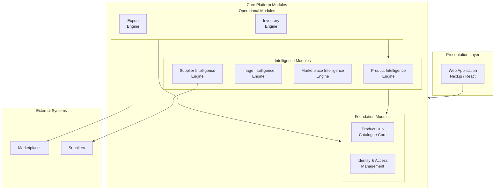

### 8.2 Module Detail

#### Module 1: Product Hub (Catalogue Core)

| Attribute | Detail |
|-----------|--------|
| **Purpose** | Central product data management — the single source of truth for all product information |
| **Owns** | Product records, variants, attributes, media references, completeness scores |
| **Consumes** | AI-enriched data (from PIE), supplier data (from SIE), inventory levels (from INV) |
| **Produces** | Product events (created, updated, enriched), export-ready product data |
| **Key APIs** | `POST /products`, `GET /products/{id}`, `PUT /products/{id}`, `POST /products/bulk-import` |
| **Data Store** | DynamoDB (product table), S3 (media) |
| **Events Published** | `product.created`, `product.updated`, `product.enriched`, `product.deleted` |

#### Module 2: Product Intelligence Engine (PIE)

| Attribute | Detail |
|-----------|--------|
| **Purpose** | AI-powered product enrichment — generates descriptions, extracts attributes, recommends categories |
| **Owns** | AI prompts, enrichment workflows, confidence scoring, model configurations |
| **Consumes** | Raw product data (from Product Hub), images (from S3), marketplace schemas (from MIE) |
| **Produces** | Enriched product data (descriptions, attributes, categories), confidence scores |
| **Key APIs** | `POST /intelligence/enrich`, `POST /intelligence/describe`, `POST /intelligence/categorise` |
| **AWS Services** | Amazon Bedrock (Claude), Step Functions (orchestration) |
| **Events Published** | `enrichment.started`, `enrichment.completed`, `enrichment.failed` |

#### Module 3: Image Intelligence Engine (IIE)

| Attribute | Detail |
|-----------|--------|
| **Purpose** | Image analysis, OCR, compliance checking, and processing for marketplace requirements |
| **Owns** | Image processing workflows, OCR pipelines, compliance rules, quality scoring |
| **Consumes** | Product images (from S3), marketplace image requirements (from MIE) |
| **Produces** | Extracted text (OCR), image labels, quality scores, compliance status, processed images |
| **Key APIs** | `POST /images/analyse`, `POST /images/ocr`, `POST /images/validate` |
| **AWS Services** | Amazon Textract, Amazon Rekognition, S3 (storage), Lambda (processing) |
| **Events Published** | `image.analysed`, `image.ocr.completed`, `image.compliance.checked` |

#### Module 4: Marketplace Intelligence Engine (MIE)

| Attribute | Detail |
|-----------|--------|
| **Purpose** | Knowledge-base-driven marketplace schema management — stores and serves all marketplace rules |
| **Owns** | Marketplace schemas, validation rules, category taxonomies, export templates, attribute mappings |
| **Consumes** | Marketplace documentation (manual input), format change notifications |
| **Produces** | Validation rules, export templates, category trees, compliance requirements |
| **Key APIs** | `GET /marketplaces`, `GET /marketplaces/{id}/schema`, `POST /marketplaces/{id}/validate` |
| **Data Store** | DynamoDB (schemas, rules), S3 (templates, taxonomy files) |
| **Events Published** | `marketplace.schema.updated`, `marketplace.validation.rules.changed` |

#### Module 5: Supplier Intelligence Engine (SIE)

| Attribute | Detail |
|-----------|--------|
| **Purpose** | Automated supplier catalogue ingestion, normalisation, and quality scoring |
| **Owns** | Supplier profiles, ingestion pipelines, data mapping rules, quality scores |
| **Consumes** | Supplier files (CSV, Excel, PDF), supplier API feeds |
| **Produces** | Normalised product data, supplier quality metrics, ingestion reports |
| **Key APIs** | `POST /suppliers`, `POST /suppliers/{id}/ingest`, `GET /suppliers/{id}/score` |
| **AWS Services** | S3 (file storage), Lambda (processing), Step Functions (ingestion workflow), Textract (PDF OCR) |
| **Events Published** | `supplier.catalogue.ingested`, `supplier.data.normalised`, `supplier.quality.scored` |

#### Module 6: Inventory Engine

| Attribute | Detail |
|-----------|--------|
| **Purpose** | Real-time stock management, allocation, and synchronisation across marketplaces |
| **Owns** | Stock levels, warehouse locations, allocation rules, reorder points, sync state |
| **Consumes** | Stock updates (manual or supplier feed), sales events (from marketplaces), allocation policies |
| **Produces** | Available stock per channel, low-stock alerts, sync confirmations, allocation decisions |
| **Key APIs** | `GET /inventory/{productId}`, `PUT /inventory/{productId}/adjust`, `POST /inventory/sync` |
| **Data Store** | DynamoDB (stock records with strong consistency) |
| **Events Published** | `inventory.updated`, `inventory.low_stock`, `inventory.sync.completed`, `inventory.oversold` |

#### Module 7: Export Engine

| Attribute | Detail |
|-----------|--------|
| **Purpose** | Generate marketplace-specific exports (CSV, API push) with full validation and compliance checking |
| **Owns** | Export jobs, validation pipelines, export history, marketplace format adapters |
| **Consumes** | Product data (from Product Hub), marketplace schemas (from MIE), inventory (from INV) |
| **Produces** | Marketplace-ready CSV files, API payloads, validation reports, export audit records |
| **Key APIs** | `POST /exports`, `GET /exports/{id}/status`, `GET /exports/{id}/download`, `POST /exports/validate` |
| **AWS Services** | Step Functions (export workflow), S3 (generated files), SQS (bulk processing), Lambda |
| **Events Published** | `export.started`, `export.validated`, `export.completed`, `export.failed` |

#### Module 8: Identity & Access Management

| Attribute | Detail |
|-----------|--------|
| **Purpose** | Multi-tenant authentication, authorisation, and user management |
| **Owns** | User accounts, tenant configurations, roles, permissions, session management |
| **Consumes** | Authentication requests, role assignments, tenant provisioning requests |
| **Produces** | JWT tokens, authorisation decisions, audit events, tenant context |
| **Key APIs** | `POST /auth/login`, `POST /auth/register`, `GET /tenants/{id}/users`, `PUT /users/{id}/roles` |
| **AWS Services** | Amazon Cognito (user pool, identity pool), Lambda (custom authorizers) |
| **Events Published** | `user.registered`, `user.authenticated`, `tenant.created`, `role.assigned` |

### 8.3 Module Interaction Matrix

| Module | Product Hub | PIE | IIE | MIE | SIE | Inventory | Export | IAM |
|--------|:-----------:|:---:|:---:|:---:|:---:|:---------:|:------:|:---:|
| **Product Hub** | — | Consumes | Consumes | Reads | Consumes | Reads | Serves | Requires |
| **PIE** | Reads | — | Collaborates | Reads | — | — | — | Requires |
| **IIE** | Reads | Collaborates | — | Reads | — | — | — | Requires |
| **MIE** | — | Serves | Serves | — | — | — | Serves | Requires |
| **SIE** | Writes | — | — | — | — | Updates | — | Requires |
| **Inventory** | Reads | — | — | — | — | — | Serves | Requires |
| **Export** | Reads | — | — | Reads | — | Reads | — | Requires |
| **IAM** | Guards | Guards | Guards | Guards | Guards | Guards | Guards | — |

### 8.4 Event Flow Architecture

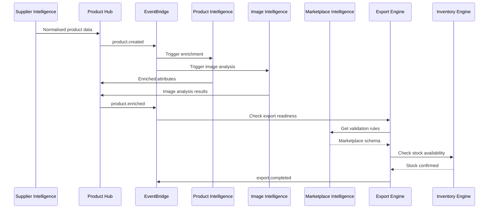

---

## 9. Pricing Strategy

### 9.1 Pricing Philosophy

MerchOS pricing is guided by three principles:

1. **Value-aligned** — Price correlates to the value delivered (products managed, exports generated, time saved)
2. **Land and expand** — Low barrier to entry; revenue grows as customers grow
3. **Transparent** — No hidden fees; customers can predict their bill before it arrives

### 9.2 Pricing Tiers

| Dimension | Starter | Growth | Professional | Enterprise |
|-----------|---------|--------|--------------|------------|
| **Monthly Price (ZAR)** | R499/mo | R1,999/mo | R7,999/mo | Custom |
| **Annual Price (ZAR)** | R4,990/yr (17% saving) | R19,990/yr (17% saving) | R79,990/yr (17% saving) | Custom |
| **Target Persona** | Solo Seller Sam | Brand Manager Bongi | Distributor Ops David | Agency Director Amara |
| **Products Managed** | Up to 500 | Up to 5,000 | Up to 50,000 | Unlimited |
| **Team Members** | 1 | 3 | 10 | Unlimited |
| **Marketplaces** | 1 | 2 | 5 | Unlimited |
| **AI Credits/month** | 50 | 500 | 5,000 | Custom allocation |
| **Storage** | 1 GB | 10 GB | 100 GB | 1 TB+ |
| **Support** | Community | Email (48h) | Priority (4h) | Dedicated AM + SLA |

### 9.3 Usage-Based Add-ons

| Add-on | Unit | Price (ZAR) | Notes |
|--------|------|-------------|-------|
| Additional AI credits | Pack of 100 | R99 | Expires end of billing cycle |
| Additional marketplace connector | Per marketplace/month | R499 | Any supported marketplace |
| Additional storage | Per 10 GB/month | R99 | Prorated |
| Additional team members | Per user/month | R199 | RBAC included |
| Bulk export overage | Per 1,000 products | R49 | Above tier limit |
| API push to marketplace | Per 1,000 pushes/month | R299 | Direct API integration |
| Priority processing | Per job | R19 | Skip the queue for bulk operations |

### 9.4 Enterprise & Agency Pricing

| Feature | Enterprise | Agency |
|---------|-----------|--------|
| **Model** | Custom contract | Per-client sub-accounts |
| **Minimum commitment** | 12 months | 6 months |
| **Volume discounts** | Tiered based on product count | Per-seat + per-client pricing |
| **White-label** | Available | Available (additional fee) |
| **Custom integrations** | Included (reasonable scope) | Quoted per integration |
| **Dedicated infrastructure** | Optional (single-tenant) | Shared multi-tenant |
| **SLA** | 99.9% with financial credits | 99.5% standard |
| **Onboarding** | Dedicated implementation manager | Agency partner programme |

### 9.5 Pricing Decision Log

| Decision | Rationale | Alternative Considered | Why Rejected |
|----------|-----------|----------------------|--------------|
| ZAR-denominated pricing | Target market is South Africa; reduces friction | USD pricing | Currency conversion confusion; perceived as expensive |
| Hybrid subscription + usage | Predictable base revenue + upside from growth | Pure usage-based | Revenue volatility too high for early-stage |
| Free trial (14 days) not freemium | Drives urgency; avoids supporting free users forever | Freemium tier | Support cost for free users unsustainable |
| Annual discount at 17% | Standard SaaS discount; improves cash flow | 20% or higher | Margin too thin at current scale |
| AI credits as consumption | Aligns cost to value; prevents abuse | Unlimited AI | Bedrock token costs could spiral |

---

## 10. Competitive Analysis

### 10.1 Competitive Landscape Map

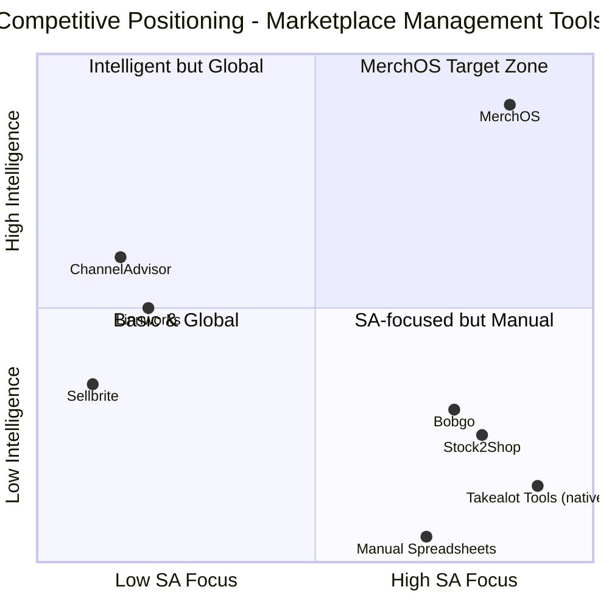

### 10.2 Competitor Comparison Matrix

| Capability | MerchOS | ChannelAdvisor | Linnworks | Stock2Shop | Bobgo | Manual/Spreadsheets |
|-----------|---------|----------------|-----------|------------|-------|-------------------|
| **Takealot support** | Native (deep) | Limited/None | None | Basic sync | Basic sync | Manual CSV |
| **Amazon SA support** | Native | Yes (global) | Yes (global) | Limited | Limited | Manual |
| **Makro support** | Native | No | No | No | No | Manual CSV |
| **AI product enrichment** | Core feature | Basic/None | None | None | None | None |
| **AI description generation** | Yes (Bedrock) | No | No | No | No | No |
| **Image OCR** | Yes (Textract) | No | No | No | No | No |
| **Marketplace Knowledge Base** | Configuration-driven | Hardcoded | Hardcoded | Hardcoded | Hardcoded | Human knowledge |
| **Multi-tenant (Agency)** | Yes | Yes | Yes | Limited | No | No |
| **SA pricing (ZAR)** | Yes | No (USD) | No (GBP) | Yes | Yes | N/A |
| **Serverless architecture** | Yes | No (legacy) | No (legacy) | No | Unknown | N/A |
| **Local support** | Yes | No | No | Yes | Yes | N/A |
| **Target market** | SA + Africa | Enterprise Global | Mid-market Global | SA SME | SA SME | All |
| **Starting price** | R499/mo | ~R15,000/mo | ~R5,000/mo | ~R1,500/mo | ~R999/mo | Free (time cost) |

### 10.3 Competitive Advantages

| # | Advantage | Defensibility | Time to Replicate |
|---|-----------|--------------|-------------------|
| 1 | **AI-first product intelligence** | High — requires ML expertise + training data | 12–18 months |
| 2 | **Deep SA marketplace integration** | Medium — requires local market knowledge | 6–12 months |
| 3 | **Knowledge-base marketplace architecture** | High — architectural decision, not a feature bolt-on | 12+ months (requires re-architecture) |
| 4 | **Serverless cost structure** | Medium — requires cloud-native rebuild | 18+ months for legacy competitors |
| 5 | **Takealot-native CSV/API support** | Medium — requires ongoing marketplace relationship | 6 months |
| 6 | **Multi-tenant isolation for agencies** | Medium — requires security architecture | 9–12 months |

### 10.4 Competitive Threats

| Threat | Probability | Impact | Response Strategy |
|--------|-------------|--------|------------------|
| Takealot builds native AI tools for sellers | Medium | High | Move faster; offer multi-marketplace value Takealot won't |
| ChannelAdvisor enters SA market | Low | Medium | Local expertise + pricing advantage + speed |
| New local AI startup | Medium | Medium | Architecture depth + marketplace knowledge base moat |
| Shopify expands multi-marketplace tools | Medium | Low | Deeper SA focus; Shopify unlikely to build Takealot/Makro support |
| Amazon builds better SP-API seller tools | High | Low | Multi-marketplace value beyond just Amazon |

---

## 11. Go-to-Market Strategy

### 11.1 GTM Phases

```mermaid
graph LR
    subgraph Phase1["Phase 1: Foundation<br/>(Months 1-3)"]
        F1[Private Beta<br/>10 sellers]
        F2[Product-Market Fit<br/>validation]
        F3[Case studies<br/>& testimonials]
    end

    subgraph Phase2["Phase 2: Launch<br/>(Months 4-6)"]
        L1[Public launch<br/>SA market]
        L2[Content marketing<br/>& SEO]
        L3[Takealot seller<br/>community]
    end

    subgraph Phase3["Phase 3: Growth<br/>(Months 7-12)"]
        G1[Agency partner<br/>programme]
        G2[Paid acquisition<br/>scale]
        G3[Integration<br/>marketplace]
    end

    subgraph Phase4["Phase 4: Expand<br/>(Year 2)"]
        E1[Pan-African<br/>expansion]
        E2[Enterprise<br/>segment]
        E3[Marketplace<br/>partnerships]
    end

    Phase1 --> Phase2 --> Phase3 --> Phase4
```

### 11.2 Channel Strategy

| Channel | Purpose | Priority | Metric |
|---------|---------|----------|--------|
| **Content Marketing (Blog/SEO)** | Attract sellers searching for marketplace help | P0 | Organic traffic, signups from content |
| **Takealot Seller Communities** | Direct access to target audience (Facebook groups, forums) | P0 | Community engagement, referral signups |
| **Product-Led Growth (Free Trial)** | Let the product sell itself | P0 | Trial-to-paid conversion rate |
| **Agency Partner Programme** | Agencies bring multiple clients each | P1 | Partners recruited, clients per partner |
| **LinkedIn (Founder Brand)** | Thought leadership, SA e-commerce expertise | P1 | Followers, inbound leads |
| **YouTube Tutorials** | Visual product education, SEO | P1 | Views, channel subscribers, signups |
| **Paid Search (Google Ads)** | Capture high-intent "Takealot seller tools" queries | P2 | CPC, conversion rate, CAC |
| **Referral Programme** | Existing customers bring new customers | P2 | Referral rate, referred customer LTV |
| **Industry Events** | SA e-commerce conferences and meetups | P2 | Leads generated, partnerships formed |
| **Strategic Partnerships** | Takealot, Shopify SA, logistics providers | P3 | Co-marketing reach, integrations |

### 11.3 Launch Strategy

| Element | Detail |
|---------|--------|
| **Beta Programme** | 10 hand-picked sellers across segments (2 solo, 3 brand, 3 distributor, 2 agency) |
| **Beta Duration** | 8 weeks with weekly feedback sessions |
| **Beta Offer** | 6 months free Professional tier; lifetime 30% discount |
| **Launch Event** | Virtual launch event targeting SA e-commerce community |
| **Launch Content** | 5 blog posts, 3 video tutorials, 1 case study, product demo |
| **PR** | TechCentral, MyBroadband, Ventureburn coverage (SA tech press) |
| **Launch Pricing** | "Founding Member" pricing — 25% lifetime discount for first 100 paying customers |

### 11.4 Positioning Statement

> **For South African e-commerce sellers** who struggle with multi-marketplace product management, **MerchOS** is the **AI-powered marketplace management platform** that **transforms raw product data into marketplace-ready listings in minutes, not hours**. Unlike manual processes or international tools with no local support, MerchOS provides **native Takealot, Amazon SA, and Makro integration with AI intelligence built for the South African market**.

---

## 12. Growth Strategy

### 12.1 Growth Model

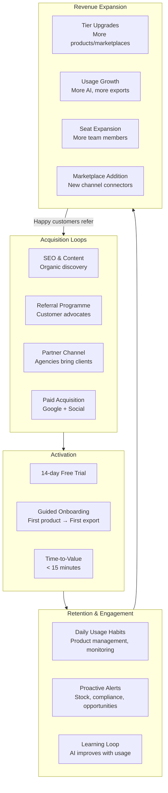

### 12.2 Growth Levers

| Lever | Mechanism | Target Metric | Timeline |
|-------|-----------|---------------|----------|
| **Product-Led Growth** | Free trial → self-serve onboarding → paid conversion | Trial-to-paid > 15% | Phase 1 |
| **Network Effects** | Agency multi-client model — each agency brings 5–20 clients | Clients per agency partner | Phase 2 |
| **Data Moat** | AI improves with more products processed; marketplace knowledge base deepens | Model accuracy over time | Ongoing |
| **Platform Ecosystem** | Third-party integrations, marketplace partnerships, API ecosystem | Integration count, API users | Phase 3 |
| **Geographic Expansion** | SA → Africa → Global; each region adds marketplace coverage | Countries active, new marketplace connectors | Phase 4 |
| **Vertical Expansion** | Category-specific AI models (electronics, fashion, FMCG) | Category-specific enrichment accuracy | Phase 3 |

### 12.3 Retention Strategy

| Strategy | Implementation | Target |
|----------|---------------|--------|
| **Time-to-value minimisation** | Guided onboarding: signup → first product → first export in < 15 minutes | Activation rate > 60% |
| **Habit formation** | Daily digest emails with catalogue health, alerts, and opportunities | DAU/MAU > 40% |
| **Switching cost accumulation** | Rich product data + AI learning + marketplace mappings = hard to leave | 12-month retention > 85% |
| **Proactive success management** | Usage-triggered outreach when engagement drops | Churn prediction 30 days ahead |
| **Continuous value delivery** | Monthly feature releases, marketplace updates, AI improvements | NPS > 50 |
| **Community building** | Seller community, best practices sharing, seller success stories | Community engagement rate |

### 12.4 Expansion Revenue Mechanics

| Trigger | Expansion Path | Revenue Impact |
|---------|---------------|----------------|
| Product count exceeds tier limit | Tier upgrade prompt | +100–300% MRR per customer |
| Seller adds new marketplace | Marketplace add-on purchase | +R499/mo per marketplace |
| Team grows | Additional seat purchase | +R199/mo per seat |
| AI usage increases | Credit pack purchase or tier upgrade | +R99–R7,500/mo |
| Agency wins new client | New sub-account creation | +Full tier subscription per client |
| Seasonal peak (Black Friday, Dec) | Usage spike → tier realisation | Temporary upgrade, often permanent |

### 12.5 Key Growth Metrics (North Star)

| Metric | Definition | Target (Year 1) | Target (Year 2) |
|--------|-----------|-----------------|-----------------|
| **Products under management** | Total active products across all tenants | 100,000 | 1,000,000 |
| **Monthly exports generated** | Successful marketplace exports | 10,000 | 100,000 |
| **Active tenants** | Paying customers with activity in last 30 days | 200 | 1,500 |
| **Net Revenue Retention** | Revenue from existing customers vs. 12 months ago | > 110% | > 125% |
| **AI enrichments processed** | Products enriched by AI per month | 50,000 | 500,000 |

---

## 13. Success Metrics

### 13.1 Metrics Framework

MerchOS tracks success across four dimensions, each with leading indicators (predictive) and lagging indicators (outcome-based).

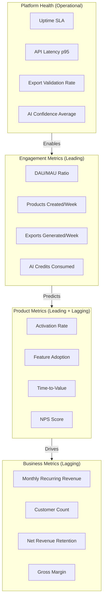

### 13.2 Business Success Metrics

| Metric | Definition | Year 1 Target | Year 2 Target | Measurement Source |
|--------|-----------|---------------|---------------|-------------------|
| **MRR (Monthly Recurring Revenue)** | Total monthly subscription + usage revenue | R500,000 | R5,000,000 | Billing system |
| **ARR (Annual Recurring Revenue)** | MRR × 12 | R6,000,000 | R60,000,000 | Billing system |
| **Paying Customers** | Active subscriptions (non-trial) | 200 | 1,500 | Cognito + billing |
| **ARPU (Average Revenue Per User)** | MRR ÷ Paying Customers | R2,500 | R3,333 | Billing system |
| **Net Revenue Retention (NRR)** | Revenue from existing cohort vs. 12 months prior | > 110% | > 125% | Cohort analysis |
| **Gross Revenue Churn** | MRR lost from downgrades + cancellations / prior MRR | < 5%/mo | < 3%/mo | Billing system |
| **Logo Churn** | Customers lost / prior customer count | < 4%/mo | < 2.5%/mo | CRM |
| **CAC (Customer Acquisition Cost)** | Total S&M spend / new customers acquired | < R5,000 | < R8,000 | Finance + CRM |
| **LTV:CAC Ratio** | Customer lifetime value / CAC | > 10:1 | > 20:1 | Derived |
| **Gross Margin** | (Revenue - COGS) / Revenue | > 75% | > 82% | Finance |

### 13.3 Product Success Metrics

| Metric | Definition | Target | Measurement Source |
|--------|-----------|--------|-------------------|
| **Trial-to-Paid Conversion** | % of trial signups converting to paid within 30 days | > 15% | Billing + Cognito |
| **Activation Rate** | % of new users completing first export within 7 days | > 40% | Product analytics |
| **Time-to-First-Value** | Median time from signup to first successful export | < 15 minutes | Event tracking |
| **Feature Adoption (AI)** | % of active users using AI enrichment monthly | > 60% | Feature flags + analytics |
| **Feature Adoption (Export)** | % of active users generating exports monthly | > 80% | Export engine metrics |
| **Net Promoter Score (NPS)** | Likelihood to recommend (quarterly survey) | > 50 | Survey tool |
| **Customer Effort Score (CES)** | Ease of completing key tasks | < 3 (low effort) | In-app surveys |
| **Support Ticket Volume** | Tickets per 100 active users per month | < 10 | Support system |

### 13.4 Engagement Metrics

| Metric | Definition | Target | Signal |
|--------|-----------|--------|--------|
| **DAU/MAU Ratio** | Daily active / Monthly active users | > 40% | Strong daily habit |
| **Weekly Products Created** | New products added per active user per week | > 5 | Active catalogue growth |
| **Weekly Exports Generated** | Exports per active user per week | > 2 | Core value realisation |
| **AI Credits Utilisation** | % of allocated AI credits consumed | 60–80% | Right-sized tier |
| **Session Duration (avg)** | Average time spent per session | 8–15 minutes | Engaged but efficient |
| **Multi-Marketplace Usage** | % of users exporting to 2+ marketplaces | > 30% | Platform stickiness |

### 13.5 Platform Health Metrics

| Metric | Target | Alert Threshold | Critical Threshold |
|--------|--------|----------------|-------------------|
| **Uptime** | 99.9% | < 99.8% | < 99.5% |
| **API Latency (p95)** | < 500ms | > 800ms | > 2,000ms |
| **API Latency (p99)** | < 2,000ms | > 3,000ms | > 5,000ms |
| **Export Validation Pass Rate** | > 98% | < 95% | < 90% |
| **AI Enrichment Success Rate** | > 95% | < 90% | < 80% |
| **AI Average Confidence Score** | > 0.85 | < 0.75 | < 0.60 |
| **Error Rate (5xx)** | < 0.1% | > 0.5% | > 1.0% |
| **Lambda Cold Start Rate** | < 5% | > 10% | > 20% |
| **DynamoDB Throttling** | 0 events | > 5/hour | > 50/hour |

---

## 14. Product Roadmap

### 14.1 Roadmap Philosophy

The MerchOS product roadmap follows a **phase-gated delivery model** where each phase builds upon the validated outputs of the previous phase. No phase begins until its predecessor achieves defined exit criteria.

### 14.2 Roadmap Timeline

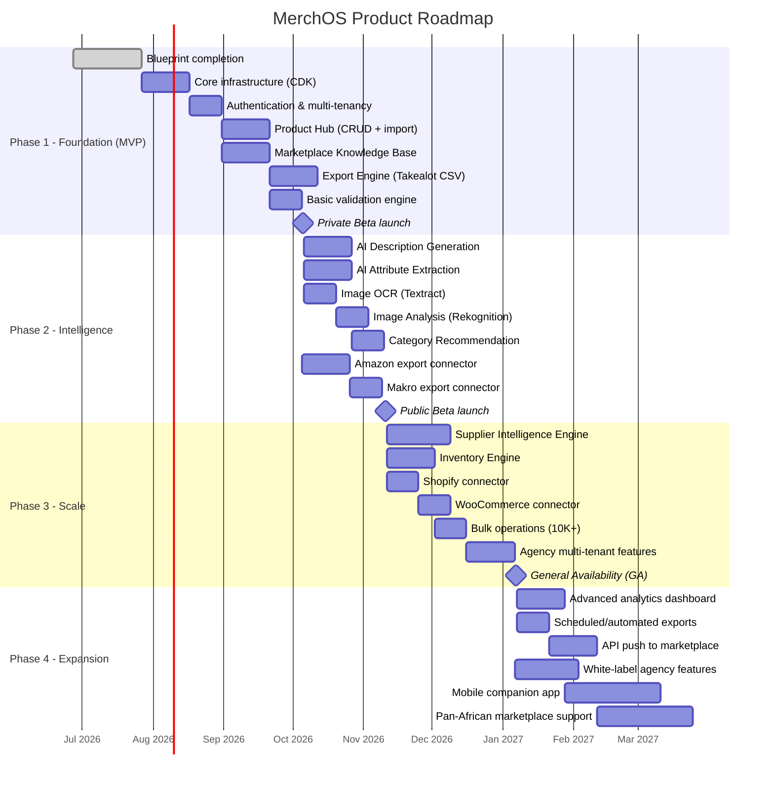

### 14.3 Phase Details

#### Phase 1 — Foundation (MVP)

| Deliverable | Exit Criteria | Duration |
|-------------|--------------|----------|
| Engineering Blueprint (all volumes) | Peer-reviewed and approved | 30 days |
| AWS infrastructure via CDK | All core services deployed to staging | 21 days |
| Authentication (Cognito) | Signup, login, MFA, tenant isolation working | 14 days |
| Product Hub | CRUD, variants, attributes, bulk CSV import functional | 21 days |
| Marketplace Knowledge Base | Takealot schema loaded and queryable | 21 days |
| Export Engine (Takealot) | Generate valid Takealot CSV from product data | 21 days |
| Validation Engine | Validate products against marketplace rules before export | 14 days |
| **Phase Exit Gate** | 10 beta sellers can import products and export valid Takealot CSVs | — |

#### Phase 2 — Intelligence

| Deliverable | Exit Criteria | Duration |
|-------------|--------------|----------|
| AI Description Generation | Generate marketplace-ready descriptions with > 80% acceptance rate | 21 days |
| AI Attribute Extraction | Extract structured attributes from unstructured data with > 85% accuracy | 21 days |
| Image OCR | Extract text from product images with > 90% character accuracy | 14 days |
| Image Analysis | Categorise products from images, detect compliance issues | 14 days |
| Category Recommendation | Recommend correct marketplace category with > 80% accuracy | 14 days |
| Amazon Export | Generate valid Amazon SP-API flat files | 21 days |
| Makro Export | Generate valid Makro marketplace CSV | 14 days |
| **Phase Exit Gate** | AI enrichment reduces manual effort by > 50% for beta users | — |

#### Phase 3 — Scale

| Deliverable | Exit Criteria | Duration |
|-------------|--------------|----------|
| Supplier Intelligence | Ingest and normalise supplier catalogues (CSV, Excel, PDF) | 28 days |
| Inventory Engine | Real-time stock tracking with multi-marketplace sync | 21 days |
| Shopify Connector | Bidirectional product sync via Admin API | 14 days |
| WooCommerce Connector | Bidirectional product sync via REST API | 14 days |
| Bulk Operations | Process 10,000+ products in single operation | 14 days |
| Agency Features | Multi-client management, tenant isolation, aggregate views | 21 days |
| **Phase Exit Gate** | Platform supports 5 marketplaces, 50,000 products, 50 tenants | — |

#### Phase 4 — Expansion

| Deliverable | Exit Criteria | Duration |
|-------------|--------------|----------|
| Analytics Dashboard | Cross-marketplace performance metrics and insights | 21 days |
| Scheduled Exports | Automated recurring exports with change detection | 14 days |
| API Push | Direct API integration with Takealot, Amazon, Shopify | 21 days |
| White-Label | Agency-branded interface and reports | 28 days |
| Mobile App | Companion app for alerts, approvals, quick edits | 42 days |
| Pan-African Expansion | Additional African marketplace connectors (Jumia, etc.) | 42 days |
| **Phase Exit Gate** | 1,500 paying customers, R5M ARR, 1M products under management | — |

### 14.4 Feature Prioritisation Framework

All feature requests are evaluated using a weighted scoring model:

| Criterion | Weight | Description |
|-----------|--------|-------------|
| **Revenue Impact** | 30% | Will this feature drive new revenue or reduce churn? |
| **User Demand** | 25% | How many users/prospects are requesting this? |
| **Strategic Alignment** | 20% | Does this advance our AI-first, multi-marketplace vision? |
| **Engineering Effort** | 15% | How much development time is required? (inverse weight) |
| **Competitive Necessity** | 10% | Do competitors have this? Are we losing deals without it? |

---

## 15. Risks & Mitigations

### 15.1 Business Risks

| # | Risk | Likelihood | Impact | Mitigation | Owner | Status |
|---|------|-----------|--------|-----------|-------|--------|
| BR-001 | Insufficient product-market fit — sellers don't adopt | Medium | Critical | Private beta validation with 10 real sellers before public launch; iterate on feedback | Product | Open |
| BR-002 | Pricing too high for SA market | Medium | High | Competitor pricing research; usage-based model allows low entry point (R499); beta feedback on willingness-to-pay | Product | Open |
| BR-003 | Slow customer acquisition — CAC exceeds budget | Medium | High | Multiple acquisition channels; product-led growth reduces CAC; agency partnerships for bulk acquisition | Growth | Open |
| BR-004 | Key competitor enters SA market with AI features | Low | High | Speed of execution; deep local marketplace knowledge; architecture moat (knowledge base) | Strategy | Open |
| BR-005 | Single-market dependency (SA) | Medium | Medium | Phase 4 expansion plan; architecture designed for multi-region from day one | Strategy | Open |
| BR-006 | Revenue concentration in few large accounts | Medium | Medium | Diversified pricing tiers; agency model spreads risk across sub-accounts | Finance | Open |
| BR-007 | Marketplace (Takealot) changes terms for third-party tools | Low | High | Relationship building with marketplace; diversify marketplace coverage; API + CSV dual-mode | Partnerships | Open |

### 15.2 Product Risks

| # | Risk | Likelihood | Impact | Mitigation | Owner | Status |
|---|------|-----------|--------|-----------|-------|--------|
| PR-001 | AI quality doesn't meet seller expectations | Medium | High | Confidence thresholds; human-in-the-loop; iterative prompt engineering; A/B testing | Engineering | Open |
| PR-002 | Marketplace CSV formats change frequently | High | Medium | Knowledge-base architecture; version control; automated format detection; alerts | Platform | Open |
| PR-003 | Feature scope creep delays Phase 1 | Medium | High | Strict MVP definition; phase gates; no feature without blueprint approval | Product | Open |
| PR-004 | Multi-marketplace complexity overwhelms users | Medium | Medium | Progressive disclosure UX; guided workflows; per-marketplace onboarding | Design | Open |
| PR-005 | Bulk operations performance at scale (50K+ products) | Medium | Medium | Async processing; Step Functions orchestration; performance testing in Phase 2 | Engineering | Open |
| PR-006 | Supplier data quality too low for AI processing | Medium | Medium | Data quality scoring; normalisation pipeline; manual fallback; supplier education | Product | Open |
| PR-007 | Agency multi-tenant complexity | Low | Medium | Early architecture design (Phase 1); tenant isolation testing; dedicated ADR | Engineering | Open |

### 15.3 Technical Risks

| # | Risk | Likelihood | Impact | Mitigation | Owner | Status |
|---|------|-----------|--------|-----------|-------|--------|
| TR-001 | AWS Bedrock model quality/availability issues | Low | High | Model abstraction layer; multiple model support; fallback to Titan; cross-region | Engineering | Open |
| TR-002 | DynamoDB single-table design limitations discovered late | Low | High | Thorough access pattern analysis (Volume 14); prototype with real data early | Engineering | Open |
| TR-003 | Lambda cold starts impact UX on critical paths | Medium | Medium | Provisioned concurrency for auth + API handlers; async for non-critical | DevOps | Open |
| TR-004 | AWS costs exceed projections | Medium | Medium | Cost monitoring from day one; per-tenant cost attribution; alerts at 80% budget | Finance + DevOps | Open |
| TR-005 | Security vulnerability in multi-tenant isolation | Low | Critical | Penetration testing; security reviews; principle of least privilege; audit logging | Security | Open |
| TR-006 | Integration failures with marketplace APIs (rate limits, downtime) | Medium | Medium | Retry with backoff; circuit breakers; queue-based processing; fallback to CSV | Engineering | Open |

### 15.4 Risk Heat Map

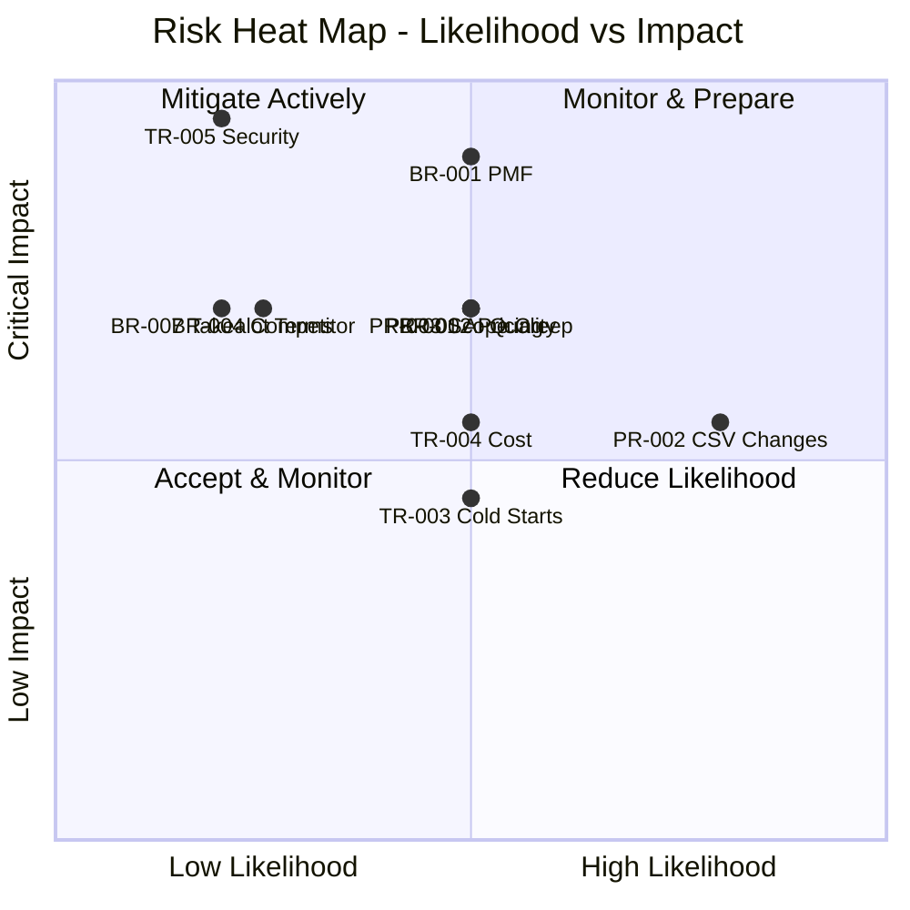

---

## 16. Assumptions

| # | Assumption | Impact if Invalid | Mitigation |
|---|-----------|-------------------|-----------|
| BA-001 | South African e-commerce market continues 30%+ CAGR growth | Reduced TAM and slower customer acquisition | Geographic diversification in Phase 4; monitor market quarterly |
| BA-002 | Sellers are willing to pay R499–R7,999/mo for multi-marketplace tools | Revenue model failure; pricing restructure required | Beta pricing validation; willingness-to-pay surveys; flexible pricing |
| BA-003 | AI-generated product content achieves > 80% seller acceptance rate | Core value proposition weakened; increased manual effort | Iterative prompt engineering; human-in-the-loop; confidence thresholds |
| BA-004 | Agencies represent a scalable acquisition channel (5–20 clients each) | GTM strategy underperforms; higher CAC | Diversified channel strategy; direct self-serve growth as backup |
| BA-005 | Takealot maintains third-party tool/CSV access for sellers | Primary marketplace integration breaks | Maintain relationship; diversify marketplace coverage; fallback modes |
| BA-006 | Serverless architecture cost model holds at scale (< 12% of revenue) | Margin compression; profitability delayed | Cost monitoring; architecture review at each scale milestone |
| BA-007 | Target personas (Sam, Bongi, David, Amara) accurately represent market segments | Feature/pricing misalignment with actual users | Beta validation with real users; quarterly persona review |
| BA-008 | 14-day free trial is sufficient for sellers to experience value | Low trial-to-paid conversion | Extend trial if conversion < 10%; guided onboarding improvements |
| BA-009 | Team can deliver Phase 1 MVP in approximately 4 months post-blueprint | Delayed time-to-market; competitor advantage window shrinks | Strict scope control; phase gates; no scope creep |
| BA-010 | Multi-tenant architecture can serve all persona segments (solo → enterprise) | Architecture redesign; separate deployments per segment | Prototype with real data; load testing; tenant isolation testing early |

---

## 17. Dependencies & References

### 16.1 External Dependencies

| # | Dependency | Type | Owner | Risk Level | Contingency |
|---|-----------|------|-------|-----------|-------------|
| D-001 | AWS Cloud Services (af-south-1) | Infrastructure | AWS | Low | Multi-region architecture ready |
| D-002 | Amazon Bedrock (Claude 3.5 Sonnet) | AI Model | AWS/Anthropic | Medium | Model abstraction; fallback to Titan |
| D-003 | Takealot Seller Portal & API | Marketplace | Takealot | High | CSV fallback; format versioning |
| D-004 | Amazon Selling Partner API (SP-API) | Marketplace | Amazon | Medium | Well-documented; SDK available |
| D-005 | Shopify Admin API (v2024-01+) | Marketplace | Shopify | Low | Stable versioned API; webhooks |
| D-006 | WooCommerce REST API (v3) | Marketplace | WooCommerce/Automattic | Low | Open source; self-hosted |
| D-007 | Makro Marketplace Portal | Marketplace | Makro/Massmart | High | CSV-only; no public API documented |
| D-008 | GitHub (source control + CI) | Development | GitHub/Microsoft | Low | Industry standard; export capability |
| D-009 | AWS Amplify (hosting + CI/CD) | Deployment | AWS | Low | Fallback: CloudFront + S3 + CodePipeline |
| D-010 | Domain registration (merchos.com or similar) | Brand | Registrar | Low | Multiple domain options reserved |

### 16.2 Internal Dependencies

| # | Dependency | Required By | Status | Blocking? |
|---|-----------|------------|--------|-----------|
| ID-001 | Engineering Blueprint (all volumes) | All implementation | In Progress (Vol 01–02 complete) | Yes — no code without blueprint |
| ID-002 | AWS Account setup (prod/staging/dev) | Phase 1 infrastructure | Pending | Yes — blocks CDK deployment |
| ID-003 | Brand identity & design system | Frontend development | Pending | Partially — can start with wireframes |
| ID-004 | Marketplace schema research (Takealot) | Knowledge base population | Pending | Yes — blocks export engine |
| ID-005 | Beta seller recruitment | Private beta launch | Pending | Yes — blocks validation |
| ID-006 | Data model design (Volume 14) | All backend services | Planned | Yes — blocks API development |
| ID-007 | API specification (Volume 15) | Frontend + backend development | Planned | Yes — blocks parallel development |
| ID-008 | Security architecture (Volume 06) | Authentication + authorisation | Planned | Partially — can start with Cognito basics |

### 16.3 Technology Dependencies

| Technology | Version | Purpose | Update Strategy |
|-----------|---------|---------|----------------|
| Node.js | 20 LTS | Lambda runtime, CDK | Follow AWS Lambda runtime updates |
| TypeScript | 5.x | All application code | Minor version updates quarterly |
| Next.js | 14.x | Frontend framework | Major version evaluation annually |
| React | 18.x | UI library | Follow Next.js compatibility |
| AWS CDK | 2.x | Infrastructure as Code | Update monthly; test in staging |
| Tailwind CSS | 3.x | UI styling | Follow stable releases |
| pnpm | 8.x | Package management | Follow stable releases |
| Vitest | 1.x | Testing framework | Follow stable releases |

### 16.4 References

| # | Reference | Relevance |
|---|-----------|-----------|
| 1 | MERCH-001 (Executive Summary) | Strategic context and architecture decisions |
| 2 | MERCH-003 (Functional Requirements) | Detailed feature specifications derived from this document |
| 3 | MERCH-005 (AWS Architecture) | Technical implementation of modules defined here |
| 4 | MERCH-014 (Database Design) | Data models supporting product and business entities |
| 5 | MERCH-015 (API Specifications) | API contracts implementing user stories from this document |
| 6 | MERCH-020 (Cost Optimisation) | Financial model alignment with pricing strategy |
| 7 | MERCH-021 (Implementation Roadmap) | Detailed engineering roadmap aligned with product roadmap |
| 8 | [AWS SaaS Factory](https://aws.amazon.com/partners/programs/saas-factory/) | Multi-tenant SaaS best practices on AWS |
| 9 | [Product-Led Growth (Wes Bush)](https://productled.com/) | PLG strategy framework informing GTM approach |
| 10 | [South African E-commerce Report 2025](https://www.worldwideworx.com/) | Market size and growth data for SA e-commerce |
| 11 | [Takealot Seller Centre](https://seller.takealot.com/) | Marketplace requirements and seller tools |
| 12 | [Amazon SP-API Developer Guide](https://developer-docs.amazon.com/sp-api/) | Amazon integration specifications |

### 16.5 Document Cross-Reference Matrix

| This Document Section | Informs | Informed By |
|----------------------|---------|-------------|
| Business Model (§3) | MERCH-020 (Cost), MERCH-021 (Roadmap) | Market research, founder vision |
| Target Personas (§5) | MERCH-003 (Requirements), MERCH-016 (Frontend) | User research, beta feedback |
| User Stories (§7) | MERCH-003 (Requirements), MERCH-015 (API) | Persona analysis, competitive analysis |
| Platform Modules (§8) | MERCH-005 (AWS Arch), MERCH-017 (Backend) | Architecture decisions (MERCH-001) |
| Pricing Strategy (§9) | MERCH-020 (Cost), Sales team | Unit economics, competitive pricing |
| Product Roadmap (§14) | MERCH-021 (Impl Roadmap), Engineering sprints | All sections of this document |

---

## Appendix A: Glossary of Business Terms

| Term | Definition |
|------|-----------|
| **ARPU** | Average Revenue Per User — MRR divided by paying customer count |
| **CAC** | Customer Acquisition Cost — total sales and marketing spend per new customer |
| **DAU/MAU** | Daily Active Users / Monthly Active Users — engagement ratio |
| **GMV** | Gross Merchandise Value — total value of products managed through platform |
| **LTV** | Lifetime Value — predicted total revenue from a customer over their lifetime |
| **MRR** | Monthly Recurring Revenue — predictable monthly subscription income |
| **NPS** | Net Promoter Score — customer satisfaction and loyalty metric (-100 to +100) |
| **NRR** | Net Revenue Retention — revenue from existing customers including expansion/contraction |
| **PLG** | Product-Led Growth — growth strategy where the product drives acquisition and expansion |
| **SKU** | Stock Keeping Unit — unique identifier for a specific product variant |
| **SaaS** | Software as a Service — cloud-delivered software on subscription model |
| **TAM** | Total Addressable Market — maximum revenue opportunity |

---

## Appendix B: Decision Log

| # | Decision | Date | Rationale | Alternatives Rejected |
|---|----------|------|-----------|----------------------|
| BD-001 | Target SA market first | 2026-06-27 | Founder expertise; underserved market; defensible position | Global from day one (too broad) |
| BD-002 | Subscription + usage hybrid pricing | 2026-06-27 | Predictable revenue + growth alignment | Pure subscription (limits growth); Pure usage (unpredictable) |
| BD-003 | Agencies as key GTM channel | 2026-06-27 | Each agency brings 5–20 clients; reduces per-customer CAC | Direct sales only (expensive, slow) |
| BD-004 | AI as differentiator, not core product | 2026-06-27 | AI enriches the workflow; marketplace management is the job-to-be-done | AI-first product (risky; technology maturity) |
| BD-005 | Takealot as first marketplace | 2026-06-27 | Largest SA marketplace; most complex CSV; highest seller pain | Amazon first (less SA seller volume) |
| BD-006 | Four pricing tiers | 2026-06-27 | Clear segmentation; natural upgrade path; covers all personas | Three tiers (gaps between segments) |
| BD-007 | 14-day trial (no freemium) | 2026-06-27 | Creates urgency; avoids supporting free users; proves value quickly | Freemium (support cost; no urgency) |

---

*End of Volume 02 — Business & Product*

*Previous: Volume 01 — Executive Summary (MERCH-001)*
*Next: Volume 03 — Functional Requirements (MERCH-003)*
