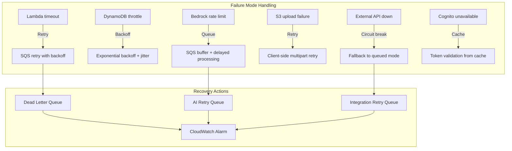

# MerchOS Engineering Blueprint

## Volume 04 — Non-Functional Requirements

---

| Field | Value |
|-------|-------|
| **Document ID** | MERCH-004 |
| **Title** | Non-Functional Requirements |
| **Version** | 0.1 |
| **Status** | Draft |
| **Owner** | Wadzanai Maparura |
| **Technical Lead** | Kiro AI |
| **Created** | 2026-06-27 |
| **Last Updated** | 2026-06-27 |
| **Next Review** | 2026-07-11 |
| **Classification** | Internal — Confidential |
| **Related Documents** | MERCH-003 (Functional Requirements), MERCH-005 (AWS Architecture) |

---

## Revision History

| Version | Date | Author | Change Description |
|---------|------|--------|-------------------|
| 0.1 | 2026-06-27 | Kiro AI / Wadzanai Maparura | Initial draft |

---

## Table of Contents

1. [Purpose](#1-purpose)
2. [Scope](#2-scope)
3. [Performance](#3-performance)
4. [Scalability](#4-scalability)
5. [Availability & Reliability](#5-availability--reliability)
6. [Security](#6-security)
7. [Data Management](#7-data-management)
8. [Compliance & Regulatory](#8-compliance--regulatory)
9. [Usability](#9-usability)
10. [Maintainability](#10-maintainability)
11. [Observability](#11-observability)
12. [Interoperability](#12-interoperability)
13. [Cost Efficiency](#13-cost-efficiency)
14. [Assumptions](#14-assumptions)
15. [Dependencies](#15-dependencies)
16. [References](#16-references)

---

## 1. Purpose

This document defines all **non-functional requirements (NFRs)** — also called quality attributes — for the MerchOS platform. NFRs specify how the system must behave rather than what it must do. They constrain the architecture and influence every design decision.

---

## 2. Scope

Covers: Performance, scalability, availability, reliability, security, data management, compliance, usability, maintainability, observability, interoperability, and cost efficiency.

---

## 3. Performance

### 3.1 API Response Times

| Endpoint Category | p50 Target | p95 Target | p99 Target | Measurement |
|-------------------|-----------|-----------|-----------|-------------|
| Authentication (login, token refresh) | < 200ms | < 500ms | < 1,000ms | API Gateway + Lambda |
| Product CRUD (single item) | < 150ms | < 400ms | < 800ms | API Gateway + DynamoDB |
| Product search/list | < 300ms | < 700ms | < 1,500ms | API Gateway + DynamoDB query |
| Export generation (< 100 products) | < 3s | < 5s | < 10s | Step Functions duration |
| Export generation (1,000 products) | < 15s | < 30s | < 60s | Step Functions duration |
| Export generation (50,000 products) | < 5min | < 10min | < 15min | Async; status polling |
| AI enrichment (single product) | < 8s | < 15s | < 30s | Bedrock inference time |
| Image upload + processing | < 5s | < 10s | < 20s | S3 + Lambda processing |
| Marketplace validation (single) | < 500ms | < 1,000ms | < 2,000ms | Lambda + DynamoDB |

### 3.2 Throughput

| Operation | Sustained Rate | Peak Rate | Burst Duration |
|-----------|---------------|-----------|----------------|
| API requests (per tenant) | 100 req/s | 500 req/s | 30 seconds |
| API requests (platform total) | 5,000 req/s | 20,000 req/s | 60 seconds |
| Product imports (per tenant) | 500 products/min | 2,000 products/min | Per-job |
| Export generation (platform) | 50 concurrent jobs | 200 concurrent jobs | Queue-based |
| AI enrichment (platform) | 100 products/min | 500 products/min | Token budget limited |
| Image processing (platform) | 200 images/min | 1,000 images/min | S3 trigger based |

### 3.3 Lambda Performance

| Requirement ID | Requirement | Target |
|---------------|-------------|--------|
| NFR-PERF-001 | Lambda cold start for critical paths (auth, product API) | < 500ms |
| NFR-PERF-002 | Lambda cold start for async processors | < 2,000ms (acceptable) |
| NFR-PERF-003 | Lambda memory allocation — API handlers | 512MB–1024MB |
| NFR-PERF-004 | Lambda memory allocation — AI/image processors | 1024MB–3008MB |
| NFR-PERF-005 | Lambda execution timeout — API handlers | 29 seconds (API GW limit) |
| NFR-PERF-006 | Lambda execution timeout — async processors | 15 minutes max |
| NFR-PERF-007 | Provisioned concurrency for critical functions | Auth: 5, Product API: 10 |

---

## 4. Scalability

### 4.1 Scaling Targets

| Dimension | Phase 1 (MVP) | Phase 2 | Phase 3 | Phase 4 |
|-----------|--------------|---------|---------|---------|
| Tenants (active) | 50 | 200 | 1,000 | 5,000 |
| Products (total platform) | 50,000 | 500,000 | 5,000,000 | 50,000,000 |
| Products per tenant (max) | 5,000 | 50,000 | 500,000 | 1,000,000 |
| Concurrent users | 100 | 500 | 2,000 | 10,000 |
| Monthly exports | 500 | 5,000 | 50,000 | 500,000 |
| Monthly AI enrichments | 5,000 | 50,000 | 500,000 | 5,000,000 |
| Storage (S3) | 100 GB | 1 TB | 10 TB | 100 TB |
| DynamoDB items | 500K | 5M | 50M | 500M |

### 4.2 Scaling Strategy

| Component | Scaling Method | Trigger | Limit |
|-----------|---------------|---------|-------|
| API Gateway | Automatic (AWS managed) | Request volume | 10,000 req/s (regional) |
| Lambda | Automatic concurrency scaling | Invocation rate | 1,000 concurrent (default; increase requestable) |
| DynamoDB | On-demand capacity mode | Read/write demand | Unlimited (with throttle protection) |
| S3 | Unlimited by design | Object count/size | No practical limit |
| Step Functions | Standard workflows, parallel states | Job submission rate | 2,000 state transitions/s |
| EventBridge | Automatic | Event volume | Unlimited |
| SQS | Automatic | Message volume | Unlimited; Lambda polling scales |
| Cognito | Automatic (AWS managed) | User pool operations | 80 req/s default (increasable) |

### 4.3 Scaling Constraints

| ID | Constraint | Mitigation |
|----|-----------|-----------|
| NFR-SCALE-001 | DynamoDB partition throughput: 3,000 RCU / 1,000 WCU per partition | Distribute access evenly across partition keys; avoid hot keys |
| NFR-SCALE-002 | DynamoDB item size limit: 400KB | Overflow large attributes to S3; store reference in DynamoDB |
| NFR-SCALE-003 | Lambda concurrent execution limit: 1,000 (default) | Request increase; implement SQS buffering for burst |
| NFR-SCALE-004 | API Gateway throttle: 10,000 req/s | Unlikely to hit; implement client-side retry |
| NFR-SCALE-005 | Bedrock tokens-per-minute limits (model-dependent) | Queue AI requests; per-tenant rate limiting; batch window |

---

## 5. Availability & Reliability

### 5.1 Availability Targets

| Service Tier | Target Uptime | Max Downtime/Year | Max Downtime/Month |
|-------------|---------------|-------------------|--------------------|
| Platform (overall) | 99.9% | 8h 46min | 43min |
| Authentication service | 99.95% | 4h 23min | 22min |
| Product API | 99.9% | 8h 46min | 43min |
| Export engine | 99.5% | 43h 48min | 3h 39min |
| AI enrichment | 99.0% | 87h 36min | 7h 18min |
| Admin panel | 99.5% | 43h 48min | 3h 39min |

### 5.2 Reliability Requirements

| ID | Requirement | Target |
|----|------------|--------|
| NFR-REL-001 | No data loss on any confirmed write operation | 99.999999999% durability (S3 + DynamoDB) |
| NFR-REL-002 | Exports must complete or fail cleanly — no partial corrupt files | 100% atomicity on export operations |
| NFR-REL-003 | Failed async jobs must retry automatically | Max 3 retries with exponential backoff |
| NFR-REL-004 | Dead-letter queues for all async processing | 100% of failed messages captured for investigation |
| NFR-REL-005 | Circuit breaker for external API calls (marketplace APIs) | Open circuit after 5 consecutive failures; half-open after 60s |
| NFR-REL-006 | Graceful degradation when AI service is unavailable | Platform functional without AI; AI features show "unavailable" |
| NFR-REL-007 | Recovery Point Objective (RPO) | < 1 hour (point-in-time recovery) |
| NFR-REL-008 | Recovery Time Objective (RTO) | < 30 minutes (automated failover) |

### 5.3 Fault Tolerance

---

## 6. Security

### 6.1 Security Requirements

| ID | Requirement | Standard |
|----|------------|----------|
| NFR-SEC-001 | All data encrypted at rest | AES-256 (S3 SSE-S3, DynamoDB encryption) |
| NFR-SEC-002 | All data encrypted in transit | TLS 1.2+ minimum; TLS 1.3 preferred |
| NFR-SEC-003 | Multi-tenant data isolation enforced at data layer | Partition key prefixing + IAM policy conditions |
| NFR-SEC-004 | Secrets never stored in code or environment variables | AWS Secrets Manager with automatic rotation |
| NFR-SEC-005 | IAM policies follow principle of least privilege | Each Lambda has minimal required permissions |
| NFR-SEC-006 | API endpoints protected by authentication | All endpoints except health check require valid JWT |
| NFR-SEC-007 | Rate limiting on all public endpoints | Per-IP and per-tenant throttling at API Gateway |
| NFR-SEC-008 | Input validation on all API endpoints | Schema validation at API Gateway + business logic layer |
| NFR-SEC-009 | SQL/NoSQL injection prevention | Parameterised queries; no string concatenation in queries |
| NFR-SEC-010 | XSS prevention on all user-generated content | Output encoding; CSP headers; sanitisation |
| NFR-SEC-011 | CORS policy restricts origins to approved domains | Whitelist of allowed origins; no wildcard in production |
| NFR-SEC-012 | Vulnerability scanning on all dependencies | Automated dependency audit in CI/CD pipeline |
| NFR-SEC-013 | Penetration testing annually | Third-party pentest before Phase 3 launch |
| NFR-SEC-014 | Security incident response time | < 1 hour acknowledgement; < 4 hours mitigation |

### 6.2 Authentication Security

| ID | Requirement | Target |
|----|------------|--------|
| NFR-SEC-020 | Password hashing | bcrypt/Argon2 (Cognito managed) |
| NFR-SEC-021 | Session token entropy | 256-bit minimum |
| NFR-SEC-022 | Brute force protection | Account lockout after 5 attempts; CAPTCHA on suspicious activity |
| NFR-SEC-023 | Token revocation | Immediate on logout; refresh token blacklisting |
| NFR-SEC-024 | MFA enforcement option | Configurable per tenant (mandatory or optional) |

---

## 7. Data Management

### 7.1 Data Retention

| Data Type | Retention Period | Storage Tier | Deletion Method |
|-----------|----------------|-------------|-----------------|
| Product data (active) | Indefinite (while tenant active) | DynamoDB (hot) | Soft-delete + 30-day purge |
| Product data (archived) | 2 years | DynamoDB (warm) → S3 (cold) | Auto-archive after 12 months inactive |
| Export files | 90 days | S3 Standard → S3 IA | S3 lifecycle policy |
| Audit logs | 2 years | CloudWatch Logs → S3 Glacier | CloudWatch retention + S3 lifecycle |
| User session data | 30 days | DynamoDB (TTL) | Auto-expire via DynamoDB TTL |
| AI processing logs | 90 days | CloudWatch Logs | Retention policy |
| Uploaded images (active) | Indefinite | S3 Standard | Deleted with product |
| Uploaded images (orphaned) | 30 days | S3 Standard | Lifecycle policy cleanup |
| Analytics data | 1 year | DynamoDB → S3 | Monthly aggregation + archive |
| Backup snapshots | 35 days | DynamoDB PITR + S3 | Rolling window |

### 7.2 Data Consistency

| ID | Requirement | Implementation |
|----|------------|---------------|
| NFR-DATA-001 | Product writes must be strongly consistent | DynamoDB ConsistentRead for post-write reads |
| NFR-DATA-002 | Inventory updates must be atomic | DynamoDB conditional writes with version checks |
| NFR-DATA-003 | Export must use point-in-time consistent data snapshot | Read at export-start timestamp; no mid-export changes |
| NFR-DATA-004 | Eventually consistent reads acceptable for analytics/dashboards | < 5 second propagation delay acceptable |
| NFR-DATA-005 | Cross-service event ordering guaranteed within partition | EventBridge + SQS FIFO for ordered events |

### 7.3 Backup & Recovery

| ID | Requirement | Target |
|----|------------|--------|
| NFR-DATA-010 | DynamoDB point-in-time recovery enabled | Continuous backup; restore to any second in 35-day window |
| NFR-DATA-011 | S3 versioning enabled on all data buckets | Object-level recovery; accidental delete protection |
| NFR-DATA-012 | Cross-region backup for disaster recovery | Daily S3 replication to secondary region |
| NFR-DATA-013 | Backup restoration tested quarterly | Documented recovery runbook; tested in staging |
| NFR-DATA-014 | Data export capability for tenant (POPIA right to portability) | Full tenant data exportable as JSON within 72 hours of request |

---

## 8. Compliance & Regulatory

### 8.1 POPIA Compliance (South Africa)

| ID | Requirement | POPIA Section |
|----|------------|---------------|
| NFR-COMP-001 | Obtain explicit consent before collecting personal information | Section 11 |
| NFR-COMP-002 | Allow users to access their personal data on request | Section 23 |
| NFR-COMP-003 | Allow users to request correction of personal data | Section 24 |
| NFR-COMP-004 | Allow users to request deletion of personal data | Section 24 |
| NFR-COMP-005 | Process personal data only for stated purpose | Section 13 |
| NFR-COMP-006 | Implement appropriate security safeguards | Section 19 |
| NFR-COMP-007 | Notify Information Regulator of data breaches | Section 22 |
| NFR-COMP-008 | Appoint Information Officer | Section 55 |
| NFR-COMP-009 | Maintain records of processing activities | Section 14 |
| NFR-COMP-010 | Cross-border data transfer controls | Section 72 |

### 8.2 Data Residency

| ID | Requirement | Implementation |
|----|------------|---------------|
| NFR-COMP-020 | Primary data stored in AWS af-south-1 (Cape Town) | All DynamoDB, S3, and primary services in Cape Town |
| NFR-COMP-021 | AI processing may use cross-region Bedrock | Acceptable under data processing agreement |
| NFR-COMP-022 | No tenant data transferred outside approved regions without consent | Region restrictions enforced in infrastructure code |

---

## 9. Usability

| ID | Requirement | Target | Measurement |
|----|------------|--------|-------------|
| NFR-USE-001 | Time to complete first product creation (new user) | < 5 minutes | Onboarding funnel analytics |
| NFR-USE-002 | Time to complete first export (new user) | < 15 minutes | Onboarding funnel analytics |
| NFR-USE-003 | System Usability Scale (SUS) score | > 75 (Good) | Quarterly user survey |
| NFR-USE-004 | Accessibility compliance | WCAG 2.1 Level AA | Automated + manual audit |
| NFR-USE-005 | Mobile-responsive design | Functional on 375px+ width | Device testing matrix |
| NFR-USE-006 | Page load time (initial) | < 3 seconds on 4G | Lighthouse performance score > 80 |
| NFR-USE-007 | Error messages must be actionable | User understands what to fix | UX review; support ticket analysis |
| NFR-USE-008 | Consistent UI patterns across all modules | Design system adherence > 95% | Design review checklist |
| NFR-USE-009 | Internationalisation readiness | All strings externalisable | i18n framework in place |
| NFR-USE-010 | Offline-tolerant forms (no data loss on connection drop) | Auto-save every 30 seconds | Local storage backup |

---

## 10. Maintainability

| ID | Requirement | Target |
|----|------------|--------|
| NFR-MAIN-001 | Code test coverage (unit + integration) | > 80% |
| NFR-MAIN-002 | Cyclomatic complexity per function | < 15 |
| NFR-MAIN-003 | Maximum function length | < 50 lines |
| NFR-MAIN-004 | TypeScript strict mode enforced | No `any` types in production code |
| NFR-MAIN-005 | All services independently deployable | Zero-downtime deployment per service |
| NFR-MAIN-006 | Infrastructure changes require no manual steps | 100% CDK automation |
| NFR-MAIN-007 | Feature flags for all new features | Controlled rollout; instant rollback |
| NFR-MAIN-008 | API versioning strategy | URL path versioning (v1, v2); minimum 12-month deprecation notice |
| NFR-MAIN-009 | Documentation coverage | All public APIs documented; architecture diagrams current |
| NFR-MAIN-010 | Dependency updates | Automated weekly scanning; monthly update cycle |
| NFR-MAIN-011 | Technical debt ratio | < 5% of sprint capacity allocated to debt reduction |
| NFR-MAIN-012 | Deployment frequency | Multiple times per day (automated) |
| NFR-MAIN-013 | Change failure rate | < 5% of deployments cause rollback |
| NFR-MAIN-014 | Mean time to recovery (MTTR) | < 30 minutes |

---

## 11. Observability

### 11.1 Logging

| ID | Requirement | Implementation |
|----|------------|---------------|
| NFR-OBS-001 | Structured JSON logging for all Lambda functions | Standard log format: timestamp, level, requestId, tenantId, message, metadata |
| NFR-OBS-002 | Correlation ID propagated across all service calls | X-Correlation-ID header; logged at every service boundary |
| NFR-OBS-003 | PII never logged in plain text | Sensitive fields masked or excluded from logs |
| NFR-OBS-004 | Log retention: 30 days hot (CloudWatch), 2 years cold (S3) | CloudWatch retention policy + S3 export |
| NFR-OBS-005 | Log levels: ERROR, WARN, INFO, DEBUG (configurable at runtime) | Environment variable toggles; no redeployment needed |

### 11.2 Metrics

| ID | Requirement | Implementation |
|----|------------|---------------|
| NFR-OBS-010 | Custom CloudWatch metrics for business KPIs | Products created, exports generated, AI credits used, validation pass rate |
| NFR-OBS-011 | Lambda performance metrics (duration, memory, cold starts) | Built-in + custom metrics per function |
| NFR-OBS-012 | DynamoDB consumption metrics (RCU/WCU, throttles, latency) | CloudWatch contributor insights |
| NFR-OBS-013 | Per-tenant usage metrics | Custom dimension on all metrics |
| NFR-OBS-014 | Real-time dashboard for platform health | CloudWatch Dashboard with critical metrics |

### 11.3 Tracing

| ID | Requirement | Implementation |
|----|------------|---------------|
| NFR-OBS-020 | Distributed tracing across all services | AWS X-Ray enabled on API Gateway + Lambda + DynamoDB |
| NFR-OBS-021 | Trace sampling rate | 5% in production; 100% for errors |
| NFR-OBS-022 | Service map visualisation | X-Ray service map for dependency visualization |
| NFR-OBS-023 | Trace annotation with tenant context | tenantId, userId, operation type annotated on traces |

### 11.4 Alerting

| ID | Requirement | Target |
|----|------------|--------|
| NFR-OBS-030 | Alert on API error rate > 1% (5-minute window) | P2 alert → Slack + email |
| NFR-OBS-031 | Alert on API error rate > 5% (5-minute window) | P1 alert → PagerDuty + Slack |
| NFR-OBS-032 | Alert on Lambda throttling | P2 alert → Slack |
| NFR-OBS-033 | Alert on DynamoDB throttling | P1 alert → Slack + email |
| NFR-OBS-034 | Alert on DLQ message count > 0 | P2 alert → Slack |
| NFR-OBS-035 | Alert on deployment failure | P1 alert → Slack + email |
| NFR-OBS-036 | Alert on AI credit budget > 80% utilisation per tenant | P3 alert → email to tenant |
| NFR-OBS-037 | Alert on monthly AWS cost > budget threshold | P2 alert → email to finance |

---

## 12. Interoperability

| ID | Requirement | Implementation |
|----|------------|---------------|
| NFR-INT-001 | All APIs use JSON (application/json) request/response format | REST API standard |
| NFR-INT-002 | API follows OpenAPI 3.0 specification | Machine-readable spec; code generation possible |
| NFR-INT-003 | Webhook events follow CloudEvents specification | Standard event envelope format |
| NFR-INT-004 | CSV exports use UTF-8 encoding (with BOM where marketplace requires) | Encoding specified per marketplace in knowledge base |
| NFR-INT-005 | Date/time values use ISO 8601 format (UTC) | Consistent across all APIs and exports |
| NFR-INT-006 | Currency values stored as integers (cents) with currency code | Avoids floating-point precision issues |
| NFR-INT-007 | File uploads support multipart/form-data | Standard HTTP file upload protocol |
| NFR-INT-008 | Third-party marketplace API adapters are pluggable | Adapter pattern; new marketplace = new adapter module |

---

## 13. Cost Efficiency

| ID | Requirement | Target |
|----|------------|--------|
| NFR-COST-001 | Infrastructure cost as percentage of revenue | < 15% (target < 10% at scale) |
| NFR-COST-002 | Cost per active product per month | < R0.50 at growth scale |
| NFR-COST-003 | Zero cost for idle resources | Lambda scales to zero; DynamoDB on-demand; no idle EC2 |
| NFR-COST-004 | AI cost per enrichment operation | < R2.00 average per product |
| NFR-COST-005 | Storage cost optimisation | S3 Intelligent-Tiering; lifecycle policies to Glacier |
| NFR-COST-006 | Per-tenant cost attribution | Cost tags on all resources; tenant-level billing reports |
| NFR-COST-007 | Monthly cost anomaly detection | CloudWatch anomaly detection on billing metrics |
| NFR-COST-008 | Budget alerts at 80% and 100% of monthly forecast | AWS Budgets with SNS notifications |
| NFR-COST-009 | Quarterly cost optimisation review | Documented review of right-sizing, reserved capacity, waste |
| NFR-COST-010 | No over-provisioning of any resource | On-demand/serverless preferred; provisioned only where justified |

---

## 14. Assumptions

| # | Assumption | Impact if Invalid |
|---|-----------|-------------------|
| A1 | AWS af-south-1 supports all required services (Bedrock, Textract, Rekognition) | Cross-region calls needed; latency increase |
| A2 | DynamoDB on-demand mode is cost-effective at projected scale | Switch to provisioned capacity with auto-scaling |
| A3 | Lambda cold starts are acceptable for non-critical paths | Need provisioned concurrency budget increase |
| A4 | TLS 1.2 is sufficient security baseline for next 3 years | Must upgrade to TLS 1.3 minimum |
| A5 | 99.9% availability achievable with single-region deployment | Multi-region architecture required (significant cost increase) |

---

## 15. Dependencies

| Dependency | NFR Area | Impact |
|-----------|----------|--------|
| AWS SLA commitments | Availability | Platform SLA cannot exceed AWS SLA |
| Bedrock model availability | Performance, Reliability | AI features degrade if Bedrock unavailable |
| DynamoDB throughput limits | Scalability | Partition design must avoid hot spots |
| CloudWatch retention limits | Observability | Long-term logs require S3 export automation |
| POPIA regulatory updates | Compliance | Must monitor for regulatory changes |

---

## 16. References

| # | Reference | Relevance |
|---|-----------|-----------|
| 1 | AWS Well-Architected Framework — Reliability Pillar | Availability and fault tolerance patterns |
| 2 | AWS Well-Architected Framework — Performance Pillar | Performance optimisation strategies |
| 3 | AWS Well-Architected Framework — Security Pillar | Security requirements alignment |
| 4 | POPIA Act (Protection of Personal Information Act) | South African data protection compliance |
| 5 | OWASP Top 10 (2021) | Security vulnerability prevention |
| 6 | ISO/IEC 25010 (Systems quality model) | Quality attribute taxonomy |
| 7 | MERCH-003 (Functional Requirements) | Functional behaviours these NFRs constrain |
| 8 | MERCH-005 (AWS Architecture) | Architecture implementing these requirements |

---

## NFR Summary Matrix

| Category | Requirements Count | Critical (Must Meet) | Target (Should Meet) |
|----------|-------------------|---------------------|---------------------|
| Performance | 7 | 5 | 2 |
| Scalability | 5 | 3 | 2 |
| Availability & Reliability | 8 | 6 | 2 |
| Security | 24 | 20 | 4 |
| Data Management | 14 | 10 | 4 |
| Compliance | 12 | 10 | 2 |
| Usability | 10 | 5 | 5 |
| Maintainability | 14 | 8 | 6 |
| Observability | 17 | 10 | 7 |
| Interoperability | 8 | 6 | 2 |
| Cost Efficiency | 10 | 5 | 5 |
| **Total** | **129** | **88** | **41** |

---

*End of Volume 04 — Non-Functional Requirements*

*Previous: Volume 03 — Functional Requirements (MERCH-003)*
*Next: Volume 05 — AWS Architecture (MERCH-005)*
