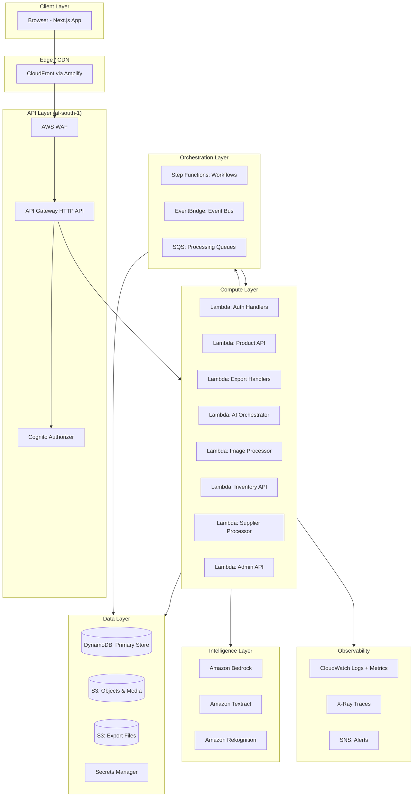
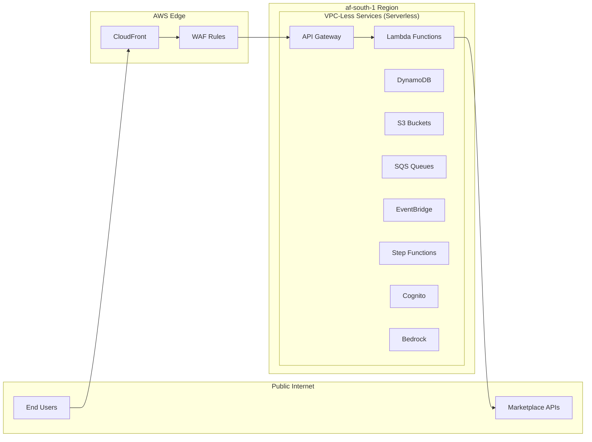
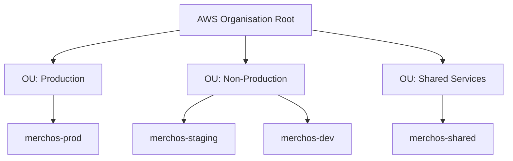
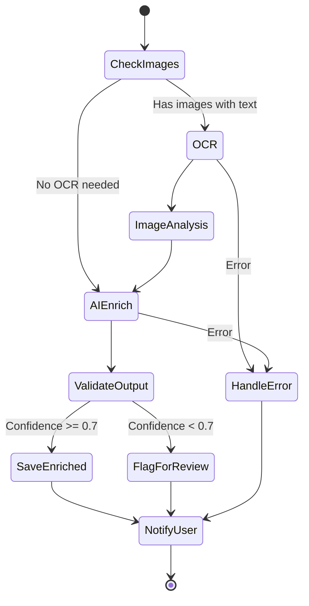
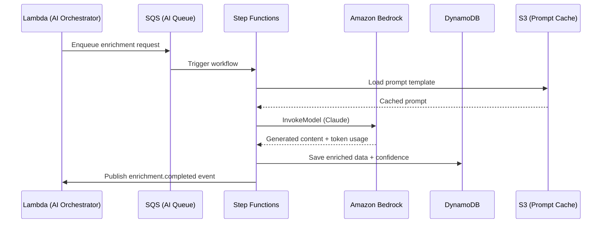
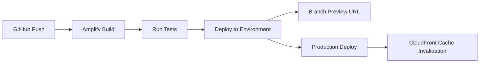

# MerchOS Engineering Blueprint

## Volume 05 — AWS Architecture

---

| Field | Value |
|-------|-------|
| **Document ID** | MERCH-005 |
| **Title** | AWS Architecture |
| **Version** | 0.1 |
| **Status** | Draft |
| **Owner** | Wadzanai Maparura |
| **Technical Lead** | Kiro AI |
| **Created** | 2026-06-27 |
| **Last Updated** | 2026-06-27 |
| **Next Review** | 2026-07-11 |
| **Classification** | Internal — Confidential |
| **Related Documents** | MERCH-004 (NFRs), MERCH-006 (Security), MERCH-018 (DevOps) |

---

## Revision History

| Version | Date | Author | Change Description |
|---------|------|--------|-------------------|
| 0.1 | 2026-06-27 | Kiro AI / Wadzanai Maparura | Initial draft |

---

## Table of Contents

1. [Purpose](#1-purpose)
2. [Scope](#2-scope)
3. [Architecture Principles](#3-architecture-principles)
4. [High-Level Architecture](#4-high-level-architecture)
5. [AWS Account Strategy](#5-aws-account-strategy)
6. [Amazon S3](#6-amazon-s3)
7. [AWS Lambda](#7-aws-lambda)
8. [Amazon DynamoDB](#8-amazon-dynamodb)
9. [Amazon API Gateway](#9-amazon-api-gateway)
10. [Amazon Cognito](#10-amazon-cognito)
11. [AWS Step Functions](#11-aws-step-functions)
12. [Amazon EventBridge](#12-amazon-eventbridge)
13. [Amazon SQS](#13-amazon-sqs)
14. [Amazon SNS](#14-amazon-sns)
15. [Amazon Bedrock](#15-amazon-bedrock)
16. [Amazon Textract](#16-amazon-textract)
17. [Amazon Rekognition](#17-amazon-rekognition)
18. [Amazon CloudWatch](#18-amazon-cloudwatch)
19. [AWS Amplify](#19-aws-amplify)
20. [AWS CDK](#20-aws-cdk)
21. [AWS Secrets Manager](#21-aws-secrets-manager)
22. [Assumptions](#22-assumptions)
23. [Dependencies](#23-dependencies)
24. [References](#24-references)

---


## 1. Purpose

This document defines the complete AWS architecture for MerchOS. Every AWS service is documented individually with purpose, configuration, IAM permissions, security controls, scaling strategy, monitoring, failure recovery, cost considerations, and future improvements.

---

## 2. Scope

Covers all AWS services used in MerchOS production, staging, and development environments. Excludes application logic (MERCH-017) and CI/CD pipeline details (MERCH-018).

---

## 3. Architecture Principles

| # | Principle | AWS Implementation |
|---|-----------|-------------------|
| 1 | Serverless First | Lambda, DynamoDB on-demand, S3, managed services only |
| 2 | Event-Driven | EventBridge bus, SQS queues, S3 event notifications |
| 3 | Least Privilege | Per-function IAM roles; no shared service accounts |
| 4 | Infrastructure as Code | 100% AWS CDK (TypeScript); no console-created resources |
| 5 | Multi-Tenant Isolation | Partition key prefixing; IAM conditions; tenant context in every request |
| 6 | Encryption Everywhere | SSE-S3, DynamoDB encryption, TLS 1.2+, Secrets Manager |
| 7 | Observe Everything | X-Ray tracing, CloudWatch metrics, structured logging |
| 8 | Design for Failure | Retry + backoff, DLQ, circuit breakers, graceful degradation |
| 9 | Cost Awareness | On-demand scaling, lifecycle policies, right-sized Lambda |
| 10 | Region Strategy | Primary: af-south-1; AI services: cross-region where needed |

---

## 4. High-Level Architecture



### Network Architecture



> **Note:** MerchOS uses a VPC-less architecture. All services are serverless and communicate via AWS service endpoints. No VPC, subnets, or NAT Gateways are required, significantly reducing cost and complexity.

---

## 5. AWS Account Strategy

### 5.1 Multi-Account Structure

| Account | Purpose | Environment |
|---------|---------|-------------|
| **merchos-prod** | Production workloads | Production |
| **merchos-staging** | Pre-production testing | Staging |
| **merchos-dev** | Development & experimentation | Development |
| **merchos-shared** | Shared services (CI/CD, monitoring, security) | Shared |

### 5.2 Account Organisation



### 5.3 Service Control Policies

| Policy | Applied To | Effect |
|--------|-----------|--------|
| Deny region outside af-south-1 (except Bedrock regions) | All accounts | Prevents accidental resource creation in wrong region |
| Deny root user actions | All accounts | Root credentials locked; MFA required |
| Require encryption on S3 | All accounts | All buckets must have SSE enabled |
| Deny public S3 buckets | All accounts | No bucket can be made public |

---


## 6. Amazon S3

### Purpose
Primary object storage for all binary/large data: product images, export files, supplier uploads, static assets, backups, and AI processing artifacts.

### Bucket Architecture

| Bucket | Purpose | Lifecycle | Access Pattern |
|--------|---------|-----------|----------------|
| `merchos-{env}-media` | Product images (originals + variants) | Standard → IA (90d) → Glacier (365d) | Read-heavy; CDN-served |
| `merchos-{env}-exports` | Generated export files (CSV, flat files) | Standard → Delete (90d) | Write-once; download within 7d |
| `merchos-{env}-imports` | Supplier uploads (CSV, Excel, PDF) | Standard → Delete (30d) | Write-once; processed then archived |
| `merchos-{env}-assets` | Static frontend assets | Standard (Amplify-managed) | CDN-served; immutable deployments |
| `merchos-{env}-backups` | DynamoDB exports, audit archives | Standard → Glacier (30d) | Write-quarterly; read on DR |

### Configuration

| Setting | Value | Rationale |
|---------|-------|-----------|
| Versioning | Enabled (media, exports) | Accidental overwrite protection |
| Server-Side Encryption | SSE-S3 (AES-256) | Default encryption; no KMS cost |
| Block Public Access | All blocked | No public buckets ever |
| CORS | Restricted to app domain | Frontend direct upload support |
| Transfer Acceleration | Enabled (media bucket) | Fast uploads from user browsers |
| Intelligent-Tiering | Enabled (media) | Auto-optimise storage cost |

### IAM Permissions

```json
{
  "Effect": "Allow",
  "Action": [
    "s3:GetObject",
    "s3:PutObject",
    "s3:DeleteObject"
  ],
  "Resource": "arn:aws:s3:::merchos-${env}-media/${tenantId}/*",
  "Condition": {
    "StringEquals": {
      "aws:PrincipalTag/tenantId": "${tenantId}"
    }
  }
}
```

### Scaling
- Unlimited storage capacity
- 5,500 GET/s and 3,500 PUT/s per prefix (partition by tenantId)
- Multipart upload for files > 100MB

### Monitoring
- S3 Storage Lens for cost analysis
- CloudWatch metrics: BucketSizeBytes, NumberOfObjects
- S3 access logging to dedicated logging bucket
- CloudTrail data events for security audit

### Failure Recovery
- Versioning enables object-level recovery
- Cross-region replication to eu-west-1 for DR
- S3 Object Lock for compliance retention (backups)

### Cost Optimisation
- Lifecycle policies move data to cheaper tiers automatically
- Intelligent-Tiering eliminates manual tier management
- Delete incomplete multipart uploads after 7 days
- Estimated cost: $0.023/GB/month (Standard), $0.01/GB (IA)

---

## 7. AWS Lambda

### Purpose
All business logic compute. Every API handler, event processor, data transformer, and async worker runs as a Lambda function.

### Function Catalogue

| Function Group | Count | Runtime | Memory | Timeout | Trigger |
|----------------|-------|---------|--------|---------|---------|
| Auth handlers | 4 | Node.js 20 | 512MB | 10s | API Gateway |
| Product API | 8 | Node.js 20 | 512MB | 29s | API Gateway |
| Export processors | 5 | Node.js 20 | 1024MB | 15min | Step Functions |
| AI orchestrators | 4 | Node.js 20 | 1024MB | 15min | Step Functions |
| Image processors | 5 | Node.js 20 | 2048MB | 5min | S3 Event / SQS |
| Inventory handlers | 4 | Node.js 20 | 512MB | 29s | API Gateway |
| Supplier processors | 4 | Node.js 20 | 1024MB | 15min | SQS |
| Event handlers | 6 | Node.js 20 | 512MB | 60s | EventBridge |
| Admin API | 5 | Node.js 20 | 512MB | 29s | API Gateway |
| Scheduled tasks | 3 | Node.js 20 | 512MB | 5min | EventBridge Schedule |

### Configuration Standards

| Setting | Standard | Rationale |
|---------|----------|-----------|
| Runtime | Node.js 20.x | TypeScript native; fast cold start; AWS SDK v3 included |
| Architecture | arm64 (Graviton2) | 20% cheaper; 10–20% faster |
| Bundling | esbuild (tree-shaking) | Minimal deployment package; faster cold start |
| Layers | Shared utilities layer only | Reduce duplication; common logging/auth middleware |
| Environment Variables | Service config only (no secrets) | Secrets from Secrets Manager at runtime |
| Dead Letter Queue | SQS DLQ per async function | Capture all failed invocations |
| Tracing | X-Ray active tracing enabled | Distributed tracing across all functions |
| Logging | Structured JSON (powertools) | Lambda Powertools for TypeScript |
| Provisioned Concurrency | Auth (5), Product API (10) | Eliminate cold starts on critical paths |

### IAM Permissions
Each function has a dedicated IAM role with minimal permissions:

```yaml
ProductApiRole:
  - dynamodb:GetItem, PutItem, Query, UpdateItem (product table only)
  - s3:GetObject (media bucket, tenant-scoped)
  - events:PutEvents (event bus)
  - logs:CreateLogGroup, PutLogEvents
  - xray:PutTraceSegments
```

### Scaling
- Default concurrency: 1,000 (request increase to 3,000 for production)
- Reserved concurrency for critical functions (auth: 100, product API: 200)
- SQS-triggered functions use batch size control for throttling
- Burst concurrency: 3,000 initial burst in af-south-1

### Monitoring
- CloudWatch Metrics: Duration, Errors, Throttles, ConcurrentExecutions, IteratorAge
- Custom metrics via Lambda Powertools: business operations, tenant attribution
- X-Ray traces with annotations (tenantId, operation, outcome)
- CloudWatch Alarms on error rate > 1%

### Failure Recovery
- Async invocations: retry 2x then DLQ
- SQS triggers: message returns to queue on failure; DLQ after maxReceiveCount (3)
- Step Functions: built-in retry with catch states
- API Gateway: returns error to client; client retries

### Cost Optimisation
- arm64 = 20% cost reduction
- Right-sized memory (benchmarked with Lambda Power Tuning)
- < 100ms functions billed at 1ms granularity
- Avoid unnecessary dependencies (smaller package = faster cold start)
- Estimated: $0.20 per 1M invocations + $0.0000166667/GB-s

---

## 8. Amazon DynamoDB

### Purpose
Primary database for all application data: products, tenants, users, marketplace schemas, inventory, audit logs, and operational metadata.

### Table Design (Single-Table)

| Table | Partition Key | Sort Key | Billing | Encryption |
|-------|--------------|----------|---------|------------|
| `merchos-{env}-main` | `PK` (String) | `SK` (String) | On-demand | AWS-owned key |
| `merchos-{env}-audit` | `PK` (String) | `SK` (String) | On-demand | AWS-owned key |

### Global Secondary Indexes

| Index | Partition Key | Sort Key | Purpose |
|-------|--------------|----------|---------|
| GSI1 | `GSI1PK` | `GSI1SK` | Inverted access patterns (e.g., marketplace → products) |
| GSI2 | `GSI2PK` | `GSI2SK` | Status-based queries (e.g., all draft products) |
| GSI3 | `entityType` | `updatedAt` | Type-based listing with time ordering |

### Access Patterns (Key Examples)

| Access Pattern | PK | SK | Index |
|---------------|----|----|-------|
| Get product by ID | `TENANT#t1` | `PROD#p1` | Table |
| List products for tenant | `TENANT#t1` | `PROD#` (begins_with) | Table |
| Get product variants | `TENANT#t1#PROD#p1` | `VAR#` (begins_with) | Table |
| Get marketplace schema | `MKT#takealot` | `SCHEMA#v1` | Table |
| List exports for tenant | `TENANT#t1` | `EXPORT#` (begins_with) | Table |
| Get products by status | `TENANT#t1#STATUS#active` | `PROD#` | GSI1 |
| Recent activity across types | `TENANT#t1` | (timestamp desc) | GSI3 |

### Configuration

| Setting | Value | Rationale |
|---------|-------|-----------|
| Billing Mode | On-demand (PAY_PER_REQUEST) | Unpredictable workload; no capacity planning |
| Point-in-Time Recovery | Enabled | Continuous backups; 35-day recovery window |
| Encryption | AWS-owned key (free) | Sufficient for current threat model |
| TTL | Enabled (ttl attribute) | Auto-expire sessions, temp records |
| Stream | Enabled (NEW_AND_OLD_IMAGES) | Event sourcing; trigger downstream processing |
| Contributor Insights | Enabled | Identify hot partitions and access patterns |

### IAM Permissions
```json
{
  "Effect": "Allow",
  "Action": ["dynamodb:GetItem", "dynamodb:PutItem", "dynamodb:Query", "dynamodb:UpdateItem"],
  "Resource": "arn:aws:dynamodb:af-south-1:*:table/merchos-prod-main",
  "Condition": {
    "ForAllValues:StringLike": {
      "dynamodb:LeadingKeys": ["TENANT#${tenantId}*"]
    }
  }
}
```

### Scaling
- On-demand: auto-scales from 0 to millions of requests
- Single partition: 3,000 RCU / 1,000 WCU (design partition keys to distribute)
- Table size: no limit (design for billions of items)
- GSI: independent scaling from base table

### Monitoring
- ConsumedReadCapacityUnits, ConsumedWriteCapacityUnits
- ThrottledRequests (alarm on > 0)
- SystemErrors
- Contributor Insights: top accessed partitions
- SuccessfulRequestLatency (alarm on > 20ms average)

### Failure Recovery
- PITR: restore to any second in 35-day window
- DynamoDB Streams: replay events for recovery
- On-demand backup before major operations
- Multi-AZ by default (built into DynamoDB)

### Cost Optimisation
- On-demand eliminates over-provisioning
- TTL removes expired data automatically (free)
- GSI projections: project only needed attributes (not ALL)
- Batch operations reduce per-request overhead
- Estimated: $1.25/million WCU, $0.25/million RCU, $0.25/GB storage

---


## 9. Amazon API Gateway

### Purpose
Managed REST/HTTP API surface for all client-facing and internal APIs. Handles routing, authentication, rate limiting, request validation, and CORS.

### API Design

| API | Type | Auth | Purpose |
|-----|------|------|---------|
| `merchos-{env}-api` | HTTP API | Cognito JWT | Primary platform API (products, exports, etc.) |
| `merchos-{env}-admin-api` | HTTP API | Cognito JWT (admin group) | Platform administration |
| `merchos-{env}-webhook-api` | HTTP API | API Key + Signature | Inbound marketplace webhooks |

### Configuration

| Setting | Value | Rationale |
|---------|-------|-----------|
| API Type | HTTP API (v2) | Lower cost; lower latency; sufficient features |
| Protocol | HTTPS only | TLS 1.2+ enforced |
| Stage | $default (auto-deploy) | Simplified deployment; no stage management |
| Throttling | 1,000 req/s per route (default) | Prevent abuse; adjustable per route |
| Burst | 5,000 requests | Handle traffic spikes |
| Payload Size | 10MB max | Sufficient for bulk operations |
| Timeout | 29 seconds | Lambda max for synchronous invocation |
| CORS | Restricted to app domains | `*.merchos.com`, `localhost:3000` (dev) |
| Access Logging | Enabled (JSON format) | Request-level audit trail |

### Request Validation
- JSON Schema validation at API Gateway (before Lambda invocation)
- Required headers: Authorization, X-Tenant-ID, Content-Type
- Path parameter type validation

### IAM Permissions
- API Gateway invoke permission granted only to CloudFront/WAF
- Lambda functions have `execute-api:Invoke` only for their routes

### Monitoring
- Metrics: Count, Latency, 4XXError, 5XXError, IntegrationLatency
- Access logs: requestId, ip, method, path, status, latency, tenantId
- Alarm: 5XX rate > 1% over 5 minutes

### Cost
- HTTP API: $1.00 per million requests
- No idle cost; purely usage-based
- Data transfer: $0.09/GB (first 10TB)

---

## 10. Amazon Cognito

### Purpose
User authentication, registration, MFA, and multi-tenant authorisation. Provides JWT tokens consumed by API Gateway authorizers.

### Architecture

| Component | Configuration |
|-----------|---------------|
| User Pool | Single pool; multi-tenant via custom attributes |
| App Client | SPA client (no secret); PKCE flow |
| Custom Attributes | `custom:tenantId`, `custom:role`, `custom:tier` |
| Groups | Per-role groups: owner, admin, manager, editor, viewer, platform-admin |
| Triggers | Pre-signup (validation), Post-confirmation (tenant creation), Pre-token (claims enrichment) |

### Configuration

| Setting | Value |
|---------|-------|
| MFA | Optional (user-configurable); TOTP + SMS |
| Password Policy | Min 8, require uppercase + number + special |
| Account Recovery | Email verification code |
| Email | SES integration (custom domain) |
| Token Validity | Access: 1h, ID: 1h, Refresh: 30d |
| Advanced Security | Enabled (adaptive authentication, compromised credential detection) |
| Self-signup | Enabled with email verification |

### Lambda Triggers

| Trigger | Function | Purpose |
|---------|----------|---------|
| Pre Sign-up | `cognito-pre-signup` | Validate email domain; check invitation |
| Post Confirmation | `cognito-post-confirm` | Create tenant record; assign default role |
| Pre Token Generation | `cognito-pre-token` | Inject tenantId, role, tier into token claims |
| Custom Message | `cognito-custom-message` | Branded email templates |

### IAM Permissions
- Lambda triggers: `cognito-idp:AdminGetUser`, `cognito-idp:AdminUpdateUserAttributes`
- API handlers: token validation only (no Cognito API calls needed)

### Scaling
- Cognito: 80 requests/second default (increasable to 1,000+)
- User pool: unlimited users
- Token validation: stateless JWT verification (no Cognito call needed)

### Cost
- Free tier: 50,000 MAU (monthly active users)
- Beyond: $0.0055/MAU
- Advanced Security: $0.050/MAU

---

## 11. AWS Step Functions

### Purpose
Orchestrate complex multi-step workflows: product enrichment, bulk export, supplier ingestion, and onboarding flows. Provides visual workflow monitoring, built-in retry/error handling, and audit trail.

### Workflow Catalogue

| Workflow | Type | Trigger | Duration | Steps |
|----------|------|---------|----------|-------|
| Product Enrichment | Standard | EventBridge (product.created) | 30s–2min | OCR → Image Analysis → AI Enrichment → Save |
| Bulk Export | Standard | API request | 1min–15min | Validate → Chunk → Process → Merge → Upload |
| Supplier Ingestion | Standard | S3 upload event | 1min–30min | Parse → Normalize → Deduplicate → Save → Report |
| Bulk AI Enrichment | Standard | API request | 5min–60min | Queue → Process batch → Aggregate → Notify |
| Tenant Onboarding | Standard | Post-registration | 5s–30s | Create records → Configure defaults → Send welcome |

### Configuration

| Setting | Value | Rationale |
|---------|-------|-----------|
| Type | Standard (not Express) | Long-running; exactly-once; visual history |
| Logging | ALL events to CloudWatch | Full execution audit trail |
| Tracing | X-Ray enabled | Distributed trace continuation |
| Retry | 3 attempts, exponential backoff (2x, max 60s) | Resilient to transient failures |
| Catch | All errors → error handler state → notification | No silent failures |

### Example: Product Enrichment Workflow



### Cost
- Standard workflows: $0.025 per 1,000 state transitions
- Express workflows: $1.00 per million requests (for high-volume, short-duration)
- Estimated: ~$50/month at growth scale

---

## 12. Amazon EventBridge

### Purpose
Central event bus for decoupled inter-service communication. All domain events flow through EventBridge, enabling loose coupling, event replay, and extensibility.

### Event Bus Architecture

| Bus | Purpose | Sources | Targets |
|-----|---------|---------|---------|
| `merchos-{env}-events` | Platform domain events | All Lambda functions | Step Functions, Lambda handlers, SQS |
| `default` | AWS service events | S3, DynamoDB Streams | Lambda processors |

### Event Schema Examples

```json
{
  "source": "merchos.product-hub",
  "detail-type": "product.created",
  "detail": {
    "tenantId": "t_abc123",
    "productId": "p_def456",
    "title": "Wireless Headphones",
    "category": "electronics",
    "timestamp": "2026-06-27T10:30:00Z"
  }
}
```

### Event Catalogue

| Source | Event Type | Consumers |
|--------|-----------|-----------|
| product-hub | product.created | PIE (enrichment), IIE (image analysis) |
| product-hub | product.updated | Export Engine (staleness check) |
| product-hub | product.enriched | Export Engine (readiness check) |
| export-engine | export.completed | Notification Service |
| export-engine | export.failed | Notification Service, Admin alerts |
| inventory | inventory.low_stock | Notification Service |
| supplier | catalogue.ingested | Product Hub (import) |
| marketplace | schema.updated | Admin alerts, Validation Engine |

### Configuration

| Setting | Value |
|---------|-------|
| Schema Registry | Enabled (auto-discover) |
| Archive | Enabled (30-day retention) |
| Replay | Available for debugging/reprocessing |
| Dead Letter Queue | SQS DLQ per rule |
| Retry Policy | 24 hours, 185 retries (default) |

### Cost
- $1.00 per million events published
- No cost for event delivery/matching
- Archive: $0.10/GB stored
- Estimated: ~$10/month at growth scale

---

## 13. Amazon SQS

### Purpose
Asynchronous message queuing for buffering workloads, decoupling producers from consumers, and handling backpressure during peak load.

### Queue Architecture

| Queue | Type | Purpose | Consumers | DLQ |
|-------|------|---------|-----------|-----|
| `merchos-{env}-bulk-import` | Standard | Buffer bulk product imports | Lambda (batch size: 10) | Yes |
| `merchos-{env}-ai-enrichment` | Standard | Buffer AI enrichment requests | Lambda (batch size: 5) | Yes |
| `merchos-{env}-export-chunks` | Standard | Buffer export file chunks | Lambda (batch size: 1) | Yes |
| `merchos-{env}-image-processing` | Standard | Buffer image processing jobs | Lambda (batch size: 5) | Yes |
| `merchos-{env}-notifications` | Standard | Buffer notification delivery | Lambda (batch size: 10) | Yes |
| `merchos-{env}-marketplace-sync` | FIFO | Ordered marketplace push events | Lambda (batch size: 1) | Yes |

### Configuration

| Setting | Standard Queues | FIFO Queues |
|---------|----------------|-------------|
| Visibility Timeout | 6x Lambda timeout | 6x Lambda timeout |
| Message Retention | 14 days | 14 days |
| Max Message Size | 256KB | 256KB |
| Delay | 0 (immediate) | 0 |
| Redrive Policy | maxReceiveCount: 3 | maxReceiveCount: 3 |
| Encryption | SSE-SQS | SSE-SQS |

### Cost
- $0.40 per million requests (Standard)
- $0.50 per million requests (FIFO)
- No idle cost
- Estimated: ~$5/month at growth scale

---

## 14. Amazon SNS

### Purpose
Fan-out notifications and multi-channel delivery (email, SMS, push) for user alerts, system notifications, and inter-service broadcast.

### Topic Architecture

| Topic | Purpose | Subscribers |
|-------|---------|-------------|
| `merchos-{env}-user-notifications` | User-facing alerts | Email (SES), SMS, Push |
| `merchos-{env}-system-alerts` | Operational alerts | Slack webhook, PagerDuty, Email |
| `merchos-{env}-export-events` | Export lifecycle events | SQS (notification queue), Lambda |
| `merchos-{env}-admin-alerts` | Platform admin alerts | Email, Slack |

### Configuration
- Message filtering: attribute-based subscription filters
- Encryption: SSE-SNS enabled
- Delivery retry: exponential backoff
- Dead Letter Queue: per-subscription DLQ

### Cost
- $0.50 per million publishes
- Email: $0 (via SES)
- SMS: $0.075/message (SA)
- Estimated: ~$5/month at growth scale

---


## 15. Amazon Bedrock

### Purpose
Managed LLM inference for product intelligence: description generation, attribute extraction, category recommendation, SEO optimisation, and translation.

### Model Configuration

| Use Case | Model | Max Input Tokens | Max Output Tokens | Temperature |
|----------|-------|-----------------|-------------------|-------------|
| Description generation | Claude 3.5 Sonnet | 4,000 | 2,000 | 0.7 |
| Attribute extraction | Claude 3.5 Sonnet | 8,000 | 4,000 | 0.2 |
| Category recommendation | Claude 3.5 Sonnet | 4,000 | 1,000 | 0.1 |
| SEO optimisation | Claude 3.5 Sonnet | 4,000 | 2,000 | 0.5 |
| Translation | Claude 3.5 Sonnet | 4,000 | 4,000 | 0.3 |
| Fallback (cost-optimised) | Claude 3 Haiku | 4,000 | 2,000 | Varies |

### Architecture



### Configuration

| Setting | Value | Rationale |
|---------|-------|-----------|
| Region | us-east-1 (if not in af-south-1) | Bedrock model availability |
| Provisioned Throughput | No (on-demand) | Cost predictability at current scale |
| Model Access | Claude 3.5 Sonnet, Claude 3 Haiku, Titan Text | Multiple models for fallback |
| Guardrails | Enabled | Content filtering; topic blocking |
| Knowledge Base | Custom (marketplace schemas) | RAG for category recommendation |

### IAM Permissions
```json
{
  "Effect": "Allow",
  "Action": [
    "bedrock:InvokeModel",
    "bedrock:InvokeModelWithResponseStream"
  ],
  "Resource": [
    "arn:aws:bedrock:us-east-1::foundation-model/anthropic.claude-3-5-sonnet*",
    "arn:aws:bedrock:us-east-1::foundation-model/anthropic.claude-3-haiku*"
  ]
}
```

### Scaling
- On-demand: scales with request volume
- Rate limits: model-dependent (typically 100–1,000 requests/min)
- Queuing via SQS absorbs burst beyond rate limits
- Per-tenant rate limiting in application layer

### Monitoring
- Custom metrics: tokens consumed (input + output), latency, model errors
- Per-tenant token tracking for billing attribution
- Alarm: error rate > 5%, latency > 30s
- Cost tracking: daily token consumption report

### Cost
- Claude 3.5 Sonnet: $3.00/million input tokens, $15.00/million output tokens
- Claude 3 Haiku: $0.25/million input tokens, $1.25/million output tokens
- Estimated: $200–$1,000/month depending on AI usage volume

---

## 16. Amazon Textract

### Purpose
OCR (Optical Character Recognition) for extracting text and structured data from product images, supplier documents, invoices, and packaging labels.

### Use Cases

| Use Case | Textract Feature | Input | Output |
|----------|-----------------|-------|--------|
| Product label OCR | DetectDocumentText | Product images (S3) | Raw text lines + confidence |
| Supplier invoice parsing | AnalyzeDocument (Tables) | PDF invoices (S3) | Table cells + key-value pairs |
| Catalogue extraction | AnalyzeDocument (Tables + Forms) | PDF catalogues (S3) | Structured table data |
| Packaging text | DetectDocumentText | Packaging photos (S3) | Text blocks + bounding boxes |

### Configuration

| Setting | Value |
|---------|-------|
| Async processing | StartDocumentTextDetection (for large documents) |
| Sync processing | DetectDocumentText (for single images, < 5s) |
| Output location | S3 (textract-output prefix) |
| Notification | SNS topic on completion (async) |
| Features | TABLES, FORMS, SIGNATURES (as needed) |

### Cost
- DetectDocumentText: $1.50 per 1,000 pages
- AnalyzeDocument (Tables): $15.00 per 1,000 pages
- Estimated: $50–$200/month

---

## 17. Amazon Rekognition

### Purpose
Image analysis for product categorisation, compliance checking, content moderation, and quality assessment.

### Use Cases

| Use Case | API | Purpose |
|----------|-----|---------|
| Product categorisation | DetectLabels | Identify product type from image |
| Content moderation | DetectModerationLabels | Detect prohibited/inappropriate content |
| Text in images | DetectText | Find text overlays, watermarks, brand names |
| Image quality | DetectLabels + Custom | Assess blur, lighting, composition |

### Configuration

| Setting | Value |
|---------|-------|
| Min confidence | 70% (labels), 50% (moderation) |
| Max labels | 20 per image |
| Image source | S3 object reference |
| Region | af-south-1 (if available) or closest |

### Cost
- DetectLabels: $1.00 per 1,000 images
- DetectModerationLabels: $1.00 per 1,000 images
- DetectText: $1.00 per 1,000 images
- Estimated: $50–$150/month

---

## 18. Amazon CloudWatch

### Purpose
Centralised observability: logs, metrics, dashboards, alarms, and anomaly detection for the entire platform.

### Components

| Component | Purpose | Configuration |
|-----------|---------|---------------|
| Log Groups | Lambda function logs, API access logs | Retention: 30 days; encrypted |
| Metrics | Built-in + custom business metrics | 1-minute resolution |
| Dashboards | Platform health, per-tenant usage | Auto-refreshing; shared with team |
| Alarms | Threshold and anomaly-based alerts | SNS notification targets |
| Insights | Log analytics queries | Saved queries for common investigations |
| Contributor Insights | Hot partition detection (DynamoDB) | Enabled on main table |

### Dashboard Layout

| Dashboard | Metrics Displayed |
|-----------|------------------|
| Platform Health | API latency, error rates, Lambda concurrency, DynamoDB throttles |
| Business Metrics | Products created, exports generated, AI enrichments, active tenants |
| Cost & Usage | Daily AWS spend, per-service breakdown, per-tenant attribution |
| AI Performance | Token consumption, model latency, confidence scores, error rates |

### Cost
- Logs: $0.50/GB ingested, $0.03/GB stored
- Metrics: $0.30/metric/month (custom), free (standard)
- Dashboards: $3.00/dashboard/month
- Alarms: $0.10/alarm/month
- Estimated: $50–$200/month

---

## 19. AWS Amplify

### Purpose
Frontend hosting, CI/CD pipeline for the Next.js web application, branch previews, and custom domain management.

### Configuration

| Setting | Value |
|---------|-------|
| Framework | Next.js 14 (SSR) |
| Build | Amplify-managed (auto-detect) |
| Hosting | Amplify Hosting (CloudFront-backed) |
| Branch deployments | main → production, develop → staging, feature/* → preview |
| Custom domain | merchos.com (with www redirect) |
| SSL | Auto-provisioned ACM certificate |
| Environment variables | API endpoint, Cognito config, feature flags |
| Build timeout | 30 minutes |
| Artifacts | Cached (node_modules, .next) |

### CI/CD Pipeline



### Cost
- Build: $0.01/build minute
- Hosting: $0.15/GB served
- SSR: $0.0000556/request + compute
- Estimated: $20–$100/month

---

## 20. AWS CDK

### Purpose
Infrastructure as Code (IaC) framework. All AWS resources are defined in TypeScript CDK constructs, version-controlled, and deployed via CDK pipelines.

### Project Structure

```
infrastructure/
├── bin/
│   └── merchos-app.ts          # CDK app entry point
├── lib/
│   ├── stacks/
│   │   ├── auth-stack.ts       # Cognito, Lambda triggers
│   │   ├── api-stack.ts        # API Gateway, Lambda handlers
│   │   ├── data-stack.ts       # DynamoDB, S3 buckets
│   │   ├── intelligence-stack.ts # Bedrock, Textract, Rekognition config
│   │   ├── orchestration-stack.ts # Step Functions, EventBridge, SQS
│   │   ├── monitoring-stack.ts # CloudWatch, alarms, dashboards
│   │   └── frontend-stack.ts   # Amplify hosting
│   ├── constructs/
│   │   ├── lambda-function.ts  # Standard Lambda construct (shared config)
│   │   ├── api-route.ts        # Reusable API route pattern
│   │   └── queue-processor.ts  # SQS → Lambda pattern
│   └── config/
│       ├── environments.ts     # Per-environment configuration
│       └── constants.ts        # Shared constants
├── test/
│   └── stacks/                 # CDK snapshot + assertion tests
├── cdk.json
└── tsconfig.json
```

### Standards

| Standard | Implementation |
|----------|---------------|
| CDK Nag | Enabled (AwsSolutions pack) — all rules passing |
| Aspects | Tagging aspect: environment, service, tenant-scope |
| Naming convention | `merchos-{env}-{service}-{resource}` |
| Stack dependencies | Explicit cross-stack references via exports |
| Secrets | Imported from Secrets Manager (never in CDK code) |
| Testing | Snapshot tests + fine-grained assertions |

### Cost
- CDK itself: Free (CloudFormation charges apply)
- CloudFormation: Free for AWS resources
- S3 for CDK assets: minimal ($0.01/month)

---

## 21. AWS Secrets Manager

### Purpose
Secure storage and automatic rotation of sensitive credentials: third-party API keys, database credentials (if any), and internal service secrets.

### Secret Catalogue

| Secret | Purpose | Rotation |
|--------|---------|----------|
| `merchos/{env}/takealot-api-key` | Takealot Seller API access | Manual (on provider change) |
| `merchos/{env}/amazon-sp-api` | Amazon SP-API credentials | 90-day rotation |
| `merchos/{env}/shopify-api-keys` | Shopify Admin API keys (per-tenant) | Manual |
| `merchos/{env}/woocommerce-keys` | WooCommerce REST API keys (per-tenant) | Manual |
| `merchos/{env}/ses-smtp` | SES SMTP credentials | 90-day rotation |
| `merchos/{env}/webhook-signing-key` | Inbound webhook signature verification | 30-day rotation |

### Configuration

| Setting | Value |
|---------|-------|
| Encryption | AWS KMS (aws/secretsmanager key) |
| Access | Per-Lambda IAM role (specific secret ARN only) |
| Caching | Lambda extension caches for 5 minutes |
| Versioning | Automatic (AWSCURRENT, AWSPREVIOUS) |
| Cross-account | Not needed (single-account per env) |

### Cost
- $0.40/secret/month
- $0.05 per 10,000 API calls
- Estimated: ~$5/month

---

## 22. Assumptions

| # | Assumption | Impact if Invalid |
|---|-----------|-------------------|
| A1 | af-south-1 has all required services | Cross-region calls with added latency |
| A2 | VPC-less architecture is sufficient (no private subnet needs) | Must add VPC (adds NAT Gateway cost ~$32/month) |
| A3 | Single-region deployment meets availability targets | Multi-region adds significant complexity and cost |
| A4 | On-demand DynamoDB pricing remains cost-effective | Switch to provisioned + auto-scaling |
| A5 | Lambda concurrency limits can be increased as needed | Implement request queuing |

---

## 23. Dependencies

| Dependency | Services Affected | Risk |
|-----------|------------------|------|
| AWS af-south-1 region availability | All services | Low |
| Bedrock model access (may require us-east-1) | AI features | Medium |
| CloudFormation stack limits (500 resources) | CDK deployment | Low (mitigated by stack splitting) |
| Lambda runtime deprecation (Node.js 20) | All compute | Low (18-month notice from AWS) |

---

## 24. References

| # | Reference |
|---|-----------|
| 1 | AWS Well-Architected Framework — Serverless Lens |
| 2 | AWS Lambda Developer Guide |
| 3 | Amazon DynamoDB Developer Guide — Best Practices |
| 4 | AWS CDK Developer Guide |
| 5 | Amazon Bedrock User Guide |
| 6 | MERCH-004 (Non-Functional Requirements) |
| 7 | MERCH-006 (Security Architecture) |
| 8 | MERCH-018 (DevOps & CI/CD) |

---

*End of Volume 05 — AWS Architecture*

*Previous: Volume 04 — Non-Functional Requirements (MERCH-004)*
*Next: Volume 06 — Security Architecture (MERCH-006)*
