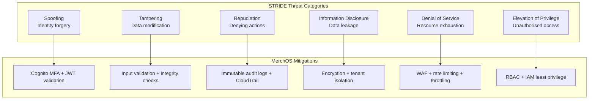
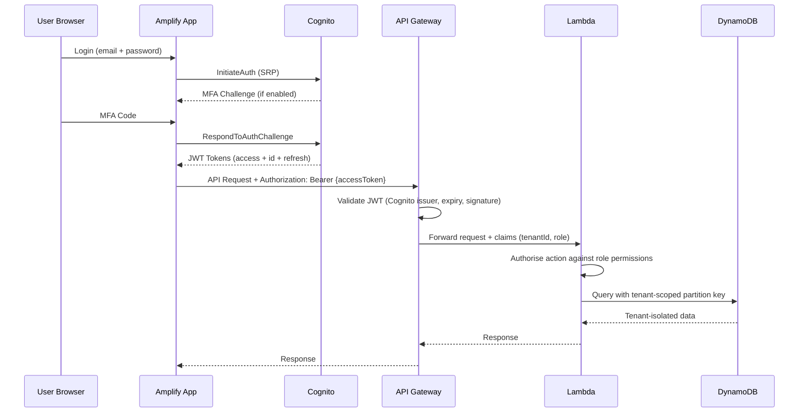
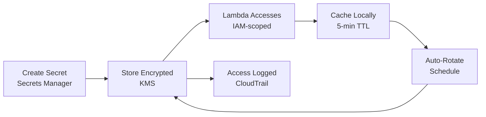
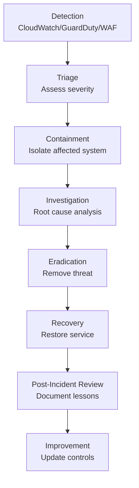

# MerchOS Engineering Blueprint

## Volume 06 — Security Architecture

---

| Field | Value |
|-------|-------|
| **Document ID** | MERCH-006 |
| **Title** | Security Architecture |
| **Version** | 0.1 |
| **Status** | Draft |
| **Owner** | Wadzanai Maparura |
| **Technical Lead** | Kiro AI |
| **Created** | 2026-06-27 |
| **Last Updated** | 2026-06-27 |
| **Next Review** | 2026-07-11 |
| **Classification** | Internal — Confidential |
| **Related Documents** | MERCH-004 (NFRs), MERCH-005 (AWS Architecture), MERCH-010 (Cognito) |

---

## Revision History

| Version | Date | Author | Change Description |
|---------|------|--------|-------------------|
| 0.1 | 2026-06-27 | Kiro AI / Wadzanai Maparura | Initial draft |

---

## Table of Contents

1. [Purpose](#1-purpose)
2. [Scope](#2-scope)
3. [Security Principles](#3-security-principles)
4. [Threat Model](#4-threat-model)
5. [Identity & Access Management](#5-identity--access-management)
6. [Multi-Tenant Isolation](#6-multi-tenant-isolation)
7. [Data Protection](#7-data-protection)
8. [API Security](#8-api-security)
9. [Application Security](#9-application-security)
10. [Infrastructure Security](#10-infrastructure-security)
11. [Secret Management](#11-secret-management)
12. [Incident Response](#12-incident-response)
13. [Compliance (POPIA)](#13-compliance-popia)
14. [Security Monitoring & Audit](#14-security-monitoring--audit)
15. [Security Testing](#15-security-testing)
16. [Assumptions](#16-assumptions)
17. [Dependencies](#17-dependencies)
18. [References](#18-references)

---


## 1. Purpose

This document defines the complete security architecture for MerchOS. Security is embedded in every layer — from identity to data to infrastructure — following a "secure by design" approach aligned with the AWS Well-Architected Security Pillar.

---

## 2. Scope

Covers: authentication, authorisation, multi-tenant isolation, data protection (at rest and in transit), API security, application security, infrastructure hardening, secret management, incident response, POPIA compliance, security monitoring, and testing.

---

## 3. Security Principles

| # | Principle | Implementation |
|---|-----------|---------------|
| 1 | **Defence in Depth** | Multiple independent layers of security; no single point of failure |
| 2 | **Least Privilege** | Every IAM role, user, and service has minimal required permissions |
| 3 | **Zero Trust** | Every request authenticated and authorised regardless of origin |
| 4 | **Encrypt Everything** | All data encrypted at rest (AES-256) and in transit (TLS 1.2+) |
| 5 | **Fail Secure** | On error, deny access rather than grant; log the failure |
| 6 | **Audit Everything** | Complete audit trail for all data access and modifications |
| 7 | **Automate Security** | Security checks in CI/CD; no manual security exceptions |
| 8 | **Isolate Tenants** | Complete data separation; no shared context between tenants |
| 9 | **Rotate Credentials** | All secrets rotated automatically; no long-lived credentials |
| 10 | **Security as Code** | Security controls defined in CDK; version-controlled; reviewable |

---

## 4. Threat Model

### 4.1 STRIDE Analysis



### 4.2 Threat Catalogue

| # | Threat | Category | Likelihood | Impact | Mitigation | Residual Risk |
|---|--------|----------|-----------|--------|-----------|---------------|
| T-001 | Credential stuffing attack | Spoofing | High | Medium | MFA, account lockout, Cognito Advanced Security | Low |
| T-002 | Cross-tenant data access | Info Disclosure | Low | Critical | Partition key isolation, authorisation middleware, testing | Very Low |
| T-003 | API abuse / DDoS | DoS | Medium | High | WAF, rate limiting, API Gateway throttling | Low |
| T-004 | JWT token theft | Spoofing | Medium | High | Short-lived tokens (1h), secure storage, refresh rotation | Low |
| T-005 | Injection attacks (NoSQL) | Tampering | Medium | High | Parameterised queries, input validation, schema enforcement | Very Low |
| T-006 | Insider threat (compromised dev) | Elevation | Low | Critical | Least privilege IAM, MFA on AWS console, audit trail | Low |
| T-007 | Supply chain attack (dependency) | Tampering | Medium | High | Dependency scanning, lockfiles, CDK Nag | Low |
| T-008 | Data exfiltration via export | Info Disclosure | Low | High | Export audit logging, file access logging, anomaly detection | Low |
| T-009 | AI prompt injection | Tampering | Medium | Medium | Input sanitisation, output validation, guardrails | Low |
| T-010 | Session hijacking | Spoofing | Low | High | Secure cookies, token binding, device verification | Very Low |

### 4.3 Attack Surface Map

| Attack Surface | Exposure | Protection |
|---------------|----------|-----------|
| API Gateway endpoints | Public (authenticated) | WAF, JWT validation, rate limiting, schema validation |
| Amplify frontend | Public | CSP headers, CORS, XSS prevention, SRI |
| S3 buckets | Private (signed URLs) | Block public access, signed URLs (15min expiry), bucket policies |
| Cognito user pool | Public (auth endpoints) | Advanced Security, MFA, brute force protection |
| Lambda functions | Private (AWS-internal) | IAM invoke permissions, VPC-less (no network exposure) |
| DynamoDB | Private (AWS-internal) | IAM policies, encryption, no public endpoints |
| Marketplace API keys | Private (Secrets Manager) | Rotation, per-tenant isolation, access logging |

---

## 5. Identity & Access Management

### 5.1 Authentication Architecture



### 5.2 Token Architecture

| Token | Purpose | Lifetime | Storage (Client) | Rotation |
|-------|---------|----------|------------------|----------|
| Access Token (JWT) | API authorisation | 1 hour | Memory only (never localStorage) | New on refresh |
| ID Token (JWT) | User identity claims | 1 hour | Memory only | New on refresh |
| Refresh Token | Obtain new access/ID tokens | 30 days | Secure HTTP-only cookie | Rotated on use |

### 5.3 IAM Role Architecture

| Role | Scope | Permissions | Principle |
|------|-------|-------------|-----------|
| `merchos-{env}-auth-lambda` | Cognito triggers | cognito-idp:Admin*, dynamodb:PutItem (tenant creation) | Minimal Cognito + DB write |
| `merchos-{env}-product-api` | Product CRUD | dynamodb:Query/Put/Update (tenant-scoped), s3:Get/Put (media) | Tenant-scoped data access |
| `merchos-{env}-export-processor` | Export generation | dynamodb:Query, s3:PutObject (exports), sqs:SendMessage | Read products, write exports |
| `merchos-{env}-ai-orchestrator` | AI enrichment | bedrock:InvokeModel, dynamodb:Query/Update, s3:GetObject | AI invoke + data read/write |
| `merchos-{env}-admin-api` | Platform admin | Broader DynamoDB access (cross-tenant read), cloudwatch:Get* | Admin-scoped; not tenant-limited |

### 5.4 Role-Based Access Control (RBAC)

| Permission | Owner | Admin | Manager | Editor | Viewer |
|-----------|:-----:|:-----:|:-------:|:------:|:------:|
| Manage billing & subscription | ✓ | — | — | — | — |
| Manage tenant settings | ✓ | ✓ | — | — | — |
| Manage users & roles | ✓ | ✓ | — | — | — |
| Delete products | ✓ | ✓ | ✓ | — | — |
| Create/edit products | ✓ | ✓ | ✓ | ✓ | — |
| Generate exports | ✓ | ✓ | ✓ | ✓ | — |
| View data | ✓ | ✓ | ✓ | ✓ | ✓ |

---

## 6. Multi-Tenant Isolation

### 6.1 Isolation Strategy

MerchOS uses **silo isolation at the data layer** (partition key prefixing) with **shared infrastructure** (pooled compute, shared tables). This provides strong logical isolation while maintaining cost efficiency.

```mermaid
graph TB
    subgraph Shared_Infra["Shared Infrastructure (Pooled)"]
        API[API Gateway - Shared]
        LAMBDA[Lambda Functions - Shared]
        DDB[DynamoDB Table - Shared]
        S3[S3 Buckets - Shared]
    end

    subgraph Isolation["Tenant Isolation Points"]
        JWT[JWT Claims: tenantId]
        MIDDLEWARE[Authorisation Middleware]
        PK[Partition Key: TENANT#tenantId]
        PREFIX[S3 Prefix: /{tenantId}/]
    end

    subgraph Tenants["Tenant Data (Isolated)"]
        T1[Tenant A Data]
        T2[Tenant B Data]
        T3[Tenant C Data]
    end

    API --> JWT
    JWT --> MIDDLEWARE
    MIDDLEWARE --> LAMBDA
    LAMBDA --> PK
    PK --> T1
    PK --> T2
    PK --> T3
    LAMBDA --> PREFIX
```

### 6.2 Isolation Controls

| Layer | Control | Implementation | Verification |
|-------|---------|---------------|--------------|
| API | Tenant context extraction | JWT `custom:tenantId` claim → request context | Unit test: missing tenantId → 403 |
| Middleware | Tenant authorisation check | Every handler validates tenantId matches resource | Integration test: cross-tenant → 403 |
| DynamoDB | Partition key prefixing | All queries include `PK = TENANT#{tenantId}` | IAM condition + code review |
| S3 | Prefix isolation | Object keys: `{tenantId}/{type}/{id}` | Bucket policy + signed URL scoping |
| Lambda | Tenant context propagation | tenantId injected into every service call | Unit test: missing context → error |
| Logging | Tenant attribution | tenantId in every log entry (not PII) | Log review automation |

### 6.3 Cross-Tenant Protection Testing

| Test Type | Frequency | Method |
|-----------|-----------|--------|
| Unit tests (isolation middleware) | Every CI build | Mock cross-tenant requests; verify 403 |
| Integration tests | Every deployment | Create 2 tenants; verify complete isolation |
| Chaos testing | Monthly | Attempt cross-tenant access patterns |
| Security review | Quarterly | Code audit of tenant isolation logic |
| Penetration testing | Annually | Third-party tester attempts cross-tenant access |

---

## 7. Data Protection

### 7.1 Encryption at Rest

| Service | Encryption Method | Key Management | Key Rotation |
|---------|------------------|----------------|--------------|
| DynamoDB | AWS-owned key (free) | AWS managed | Automatic |
| S3 | SSE-S3 (AES-256) | AWS managed | Automatic |
| SQS | SSE-SQS | AWS managed | Automatic |
| CloudWatch Logs | AWS-owned key | AWS managed | Automatic |
| Secrets Manager | AWS KMS (default key) | AWS managed | Automatic |
| Cognito | AWS-owned key | AWS managed | Automatic |

### 7.2 Encryption in Transit

| Communication Path | Protocol | Minimum Version |
|-------------------|----------|-----------------|
| Browser → CloudFront | HTTPS | TLS 1.2 |
| CloudFront → API Gateway | HTTPS | TLS 1.2 |
| API Gateway → Lambda | AWS internal (encrypted) | N/A |
| Lambda → DynamoDB | HTTPS (SDK) | TLS 1.2 |
| Lambda → S3 | HTTPS (SDK) | TLS 1.2 |
| Lambda → Bedrock | HTTPS (SDK) | TLS 1.2 |
| Lambda → External APIs | HTTPS | TLS 1.2 |

### 7.3 Data Classification

| Classification | Examples | Controls |
|---------------|----------|----------|
| **Public** | Marketing content, public docs | No special controls |
| **Internal** | Architecture docs, code | Access control; no public exposure |
| **Confidential** | Product data, tenant info | Encryption, access logging, tenant isolation |
| **Restricted** | Passwords, API keys, PII | Encryption, Secrets Manager, audit logging, minimal access |

### 7.4 PII Handling

| PII Type | Storage | Access | Retention | Deletion |
|----------|---------|--------|-----------|----------|
| Email address | Cognito + DynamoDB | Auth + notification services | While active | 30 days post-account-deletion |
| Name | Cognito + DynamoDB | Profile display | While active | 30 days post-account-deletion |
| Phone (if MFA SMS) | Cognito | Auth service only | While active | Immediate on account deletion |
| IP address | CloudWatch Logs | Security investigation only | 30 days | Auto-expire |
| Payment info | NOT stored (third-party processor) | N/A | N/A | N/A |

---

## 8. API Security

### 8.1 API Gateway Security Controls

| Control | Configuration | Purpose |
|---------|---------------|---------|
| Authentication | Cognito JWT authorizer | Reject unauthenticated requests |
| Rate limiting | 1,000 req/s per route (configurable) | Prevent abuse |
| Burst throttling | 5,000 requests | Handle legitimate traffic spikes |
| Request validation | JSON Schema validation | Reject malformed payloads before Lambda |
| Payload size limit | 10MB | Prevent resource exhaustion |
| WAF integration | AWS WAF v2 rules | Block known attack patterns |
| Access logging | Enabled (JSON) | Security audit trail |
| mTLS | Not required (JWT sufficient) | N/A |

### 8.2 WAF Rules

| Rule | Purpose | Action |
|------|---------|--------|
| AWS Managed — Core Rule Set | OWASP Top 10 protection | Block |
| AWS Managed — Known Bad Inputs | SQLi, XSS, command injection | Block |
| AWS Managed — IP Reputation | Known malicious IPs | Block |
| Rate-based rule | > 2,000 requests in 5 minutes per IP | Block (temporary) |
| Geo-restriction | Block non-target regions (configurable) | Count (log only initially) |
| Custom — Bot detection | Non-browser user agents without API key | Challenge |

### 8.3 API Security Headers

| Header | Value | Purpose |
|--------|-------|---------|
| `Strict-Transport-Security` | `max-age=31536000; includeSubDomains` | Force HTTPS |
| `Content-Security-Policy` | Strict CSP (self + CDN) | Prevent XSS |
| `X-Content-Type-Options` | `nosniff` | Prevent MIME confusion |
| `X-Frame-Options` | `DENY` | Prevent clickjacking |
| `X-XSS-Protection` | `0` (CSP is sufficient) | Deprecated; rely on CSP |
| `Referrer-Policy` | `strict-origin-when-cross-origin` | Limit referrer leakage |
| `Permissions-Policy` | `camera=(), microphone=(), geolocation=()` | Disable unused browser APIs |

---

## 9. Application Security

### 9.1 Input Validation

| Layer | Validation Type | Implementation |
|-------|----------------|---------------|
| API Gateway | JSON Schema | Request body schema validation (structure, types) |
| Lambda handler | Business validation | Field-level rules (lengths, formats, allowed values) |
| DynamoDB write | Conditional expressions | Optimistic locking; prevent invalid state transitions |
| AI input | Prompt sanitisation | Strip control characters; limit input length; no user-injected prompts |

### 9.2 Output Encoding

| Context | Encoding | Library |
|---------|----------|---------|
| HTML rendering | HTML entity encoding | React (auto-escapes by default) |
| JSON API responses | JSON serialisation (native) | Built-in JSON.stringify |
| CSV export | CSV escaping (quotes, delimiters) | Custom serialiser with proper escaping |
| URL parameters | URL encoding | encodeURIComponent |

### 9.3 Dependency Security

| Control | Tool | Frequency | Action on Finding |
|---------|------|-----------|-------------------|
| Known vulnerability scan | `npm audit` | Every CI build | Block merge on high/critical |
| Licence compliance | `license-checker` | Weekly | Alert on copyleft licences |
| Outdated dependencies | `npm outdated` | Weekly | PR with updates (automated) |
| Lock file integrity | `npm ci` (not `npm install`) | Every build | Fail on lock file mismatch |
| CDK security scanning | CDK Nag (AwsSolutions) | Every CDK synth | Block deployment on failures |

---

## 10. Infrastructure Security

### 10.1 AWS Account Security

| Control | Implementation |
|---------|---------------|
| Root account | MFA enabled; credentials stored in physical safe; never used for operations |
| IAM users | None (SSO via AWS IAM Identity Center) |
| Service accounts | IAM roles only; no long-lived access keys |
| MFA | Required for all human access to AWS console |
| SCPs | Region restriction, deny public S3, deny root actions |
| CloudTrail | Enabled in all accounts; all regions; management + data events |
| GuardDuty | Enabled for threat detection (malicious activity, compromised credentials) |
| Config | AWS Config rules for compliance drift detection |
| Access Analyzer | Enabled (flag unintended public/cross-account access) |

### 10.2 Network Security

| Layer | Control |
|-------|---------|
| No VPC required | All services are AWS-managed serverless (no EC2, no subnets) |
| No public endpoints (data) | DynamoDB, SQS, Secrets Manager only accessible via AWS SDK (IAM auth) |
| S3 access | Block all public access; pre-signed URLs for client access |
| API Gateway | Only public-facing endpoint; WAF-protected |
| Cross-region | Bedrock calls via AWS SDK (IAM-authenticated, TLS) |

### 10.3 CDK Nag Security Rules

| Rule Pack | Category | Examples |
|-----------|----------|----------|
| AwsSolutions-S1 | S3 | Bucket logging enabled |
| AwsSolutions-S2 | S3 | Block public access |
| AwsSolutions-DDB3 | DynamoDB | Point-in-time recovery enabled |
| AwsSolutions-IAM4 | IAM | No managed policies (use inline) |
| AwsSolutions-IAM5 | IAM | No wildcard resources |
| AwsSolutions-L1 | Lambda | Latest runtime version |
| AwsSolutions-COG1 | Cognito | Strong password policy |
| AwsSolutions-COG2 | Cognito | MFA enabled |

---


## 11. Secret Management

### 11.1 Secret Handling Rules

| Rule | Implementation |
|------|---------------|
| No secrets in source code | Pre-commit hooks scan for secrets; git-secrets installed |
| No secrets in environment variables | Lambda reads from Secrets Manager at runtime |
| No secrets in CDK code | CDK references Secrets Manager ARNs; values never in templates |
| No secrets in logs | Structured logging masks sensitive fields automatically |
| No secrets in error messages | Generic error messages to clients; detailed logs server-side only |

### 11.2 Secret Lifecycle



### 11.3 Rotation Schedule

| Secret Type | Rotation Period | Method |
|-------------|----------------|--------|
| Internal service keys | 30 days | Automatic (Lambda rotation function) |
| Third-party API keys | On provider mandate | Manual with notification |
| Webhook signing keys | 30 days | Automatic |
| SES SMTP credentials | 90 days | Automatic |
| Cognito client secret | N/A (public client, no secret) | N/A |

---

## 12. Incident Response

### 12.1 Incident Classification

| Severity | Definition | Response Time | Examples |
|----------|-----------|---------------|----------|
| **P1 — Critical** | Data breach; complete service outage; active attack | < 15 minutes | Cross-tenant data leak, DDoS, credential compromise |
| **P2 — High** | Partial outage; security vulnerability exploited | < 1 hour | API errors > 5%, single-tenant data exposure |
| **P3 — Medium** | Degraded performance; potential vulnerability | < 4 hours | Elevated error rates, suspicious activity patterns |
| **P4 — Low** | Minor security event; informational | < 24 hours | Failed login spikes, dependency vulnerability discovered |

### 12.2 Incident Response Process



### 12.3 Containment Actions

| Scenario | Immediate Action |
|----------|-----------------|
| Compromised API key | Rotate key in Secrets Manager; deploy immediately |
| Suspected data breach | Revoke affected user tokens; enable enhanced logging |
| DDoS attack | Engage AWS Shield; tighten WAF rules; enable geo-blocking |
| Cross-tenant access | Disable affected API endpoint; audit all recent access |
| Compromised user account | Force password reset; revoke sessions; enable MFA |
| Malicious dependency | Remove dependency; redeploy clean version; audit impact |

---

## 13. Compliance (POPIA)

### 13.1 POPIA Requirements Mapping

| POPIA Principle | Section | MerchOS Implementation |
|----------------|---------|----------------------|
| Accountability | s8 | Information Officer appointed; processing records maintained |
| Processing limitation | s9-12 | Data collected only for stated purpose; consent recorded |
| Purpose specification | s13-14 | Privacy policy defines purposes; no secondary use without consent |
| Further processing | s15 | No data sharing with third parties without consent |
| Information quality | s16 | User can update their data; validation on input |
| Openness | s17-18 | Privacy policy published; data processing register available |
| Security safeguards | s19-22 | Encryption, access control, breach notification |
| Data subject participation | s23-25 | User can access, correct, delete their data |

### 13.2 Data Subject Rights Implementation

| Right | API Endpoint | SLA | Implementation |
|-------|-------------|-----|---------------|
| Access (what data do you have?) | `GET /privacy/my-data` | 72 hours | Export all user + tenant data as JSON |
| Correction | `PUT /privacy/my-data` | 48 hours | User self-service data correction |
| Deletion (right to be forgotten) | `DELETE /privacy/my-data` | 30 days | Account deletion cascade; data purge |
| Object to processing | `POST /privacy/objection` | 48 hours | Disable automated processing; manual review |
| Data portability | `GET /privacy/export` | 72 hours | Full data export in standard JSON format |

### 13.3 Breach Notification

| Requirement | Implementation |
|-------------|---------------|
| Notify Information Regulator | Within 72 hours of discovery |
| Notify affected data subjects | As soon as reasonably possible |
| Document the breach | Incident report with scope, impact, remediation |
| Preserve evidence | Immutable audit logs; no log deletion during investigation |

---

## 14. Security Monitoring & Audit

### 14.1 Security Event Sources

| Source | Events Captured | Retention |
|--------|----------------|-----------|
| CloudTrail | All AWS API calls (management + data events) | 90 days (hot) + S3 indefinite |
| API Gateway Access Logs | All API requests (IP, path, status, latency) | 30 days |
| Cognito | Auth events (login, failure, MFA, password change) | 30 days |
| WAF Logs | Blocked/allowed requests with rule match details | 30 days |
| GuardDuty | Threat findings (malicious activity) | 90 days |
| Lambda Logs | Application logs (structured JSON) | 30 days |
| DynamoDB Streams | Data changes (for audit table) | 24 hours (stream) + indefinite (audit table) |

### 14.2 Security Alarms

| Alarm | Condition | Severity | Action |
|-------|-----------|----------|--------|
| Failed login spike | > 50 failed logins in 5 minutes | P3 | Investigate; check for credential stuffing |
| Cross-tenant access attempt | Any 403 on tenant mismatch | P2 | Immediate investigation |
| GuardDuty finding (High) | Any HIGH severity finding | P1 | Incident response activation |
| Root account usage | Any root API call | P1 | Immediate investigation (should never happen) |
| Secret access anomaly | Unusual secret access pattern | P3 | Investigate; verify legitimate access |
| WAF block rate spike | > 1,000 blocks in 5 minutes | P3 | Review WAF logs; assess attack |
| DLQ messages (security) | Any message in auth DLQ | P2 | Investigate failed auth processing |

### 14.3 Audit Trail Design

| Event | Captured Data | Storage | Retention |
|-------|--------------|---------|-----------|
| User login | userId, tenantId, IP, device, timestamp, success/fail | DynamoDB (audit table) | 2 years |
| Data modification | userId, tenantId, entity, action, before/after, timestamp | DynamoDB (audit table) | 2 years |
| Export generation | userId, tenantId, marketplace, product count, timestamp | DynamoDB (audit table) | 2 years |
| Admin action | adminId, action, target, timestamp | DynamoDB (audit table) | Indefinite |
| API access | requestId, tenantId, path, method, status, latency | CloudWatch Logs | 30 days |

---

## 15. Security Testing

### 15.1 Testing Matrix

| Test Type | Frequency | Tool/Method | Scope |
|-----------|-----------|-------------|-------|
| SAST (Static Analysis) | Every CI build | ESLint security rules, CDK Nag | All code |
| Dependency scanning | Every CI build | `npm audit`, Snyk | All dependencies |
| Secret scanning | Every commit | git-secrets, pre-commit hooks | All repositories |
| Unit tests (security) | Every CI build | Vitest | Auth, authorisation, isolation |
| Integration tests (isolation) | Every deployment | Vitest + API calls | Multi-tenant scenarios |
| DAST (Dynamic Analysis) | Weekly (staging) | OWASP ZAP | Running application |
| Penetration testing | Annually | Third-party firm | Full platform |
| Chaos engineering (security) | Quarterly | Custom scripts | Failure mode testing |
| Compliance audit | Annually | Internal + external | POPIA controls |

### 15.2 Security Acceptance Criteria

Every pull request must pass:
1. No high/critical vulnerabilities in `npm audit`
2. CDK Nag passes with zero suppressions (or justified documented suppressions)
3. No secrets detected in code or commits
4. Tenant isolation unit tests pass
5. RBAC permission tests pass
6. Input validation tests cover all API endpoints

---

## 16. Assumptions

| # | Assumption | Impact if Invalid |
|---|-----------|-------------------|
| A1 | AWS managed encryption (SSE-S3, DynamoDB) meets compliance needs | Require CMK (KMS) — adds cost |
| A2 | JWT validation is sufficient (no token introspection needed) | Need Cognito API call per request — adds latency |
| A3 | Single Cognito user pool supports multi-tenant at scale | May need per-tenant pools — adds complexity |
| A4 | VPC-less architecture is secure (no network-level isolation) | Must add VPC with private subnets |
| A5 | POPIA does not require data residency certification | May need formal certification process |

---

## 17. Dependencies

| Dependency | Security Relevance |
|-----------|-------------------|
| AWS Cognito | Authentication foundation |
| AWS WAF | API protection layer |
| AWS CloudTrail | Audit trail completeness |
| AWS GuardDuty | Threat detection |
| AWS Secrets Manager | Credential security |
| POPIA regulatory guidance | Compliance requirements |
| Third-party pentest provider | Annual security validation |

---

## 18. References

| # | Reference |
|---|-----------|
| 1 | AWS Well-Architected Framework — Security Pillar |
| 2 | OWASP Top 10 (2021) |
| 3 | OWASP API Security Top 10 (2023) |
| 4 | POPIA Act — Protection of Personal Information Act (South Africa) |
| 5 | AWS Security Best Practices |
| 6 | CIS AWS Foundations Benchmark |
| 7 | NIST Cybersecurity Framework |
| 8 | MERCH-004 (Non-Functional Requirements — Security section) |
| 9 | MERCH-005 (AWS Architecture — IAM details) |

---

*End of Volume 06 — Security Architecture*

*Previous: Volume 05 — AWS Architecture (MERCH-005)*
*Next: Volume 07 — AI Architecture (MERCH-007)*
