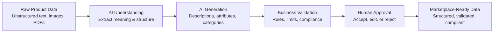
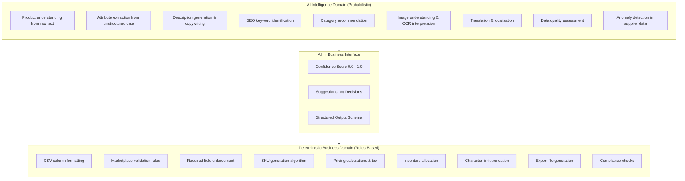
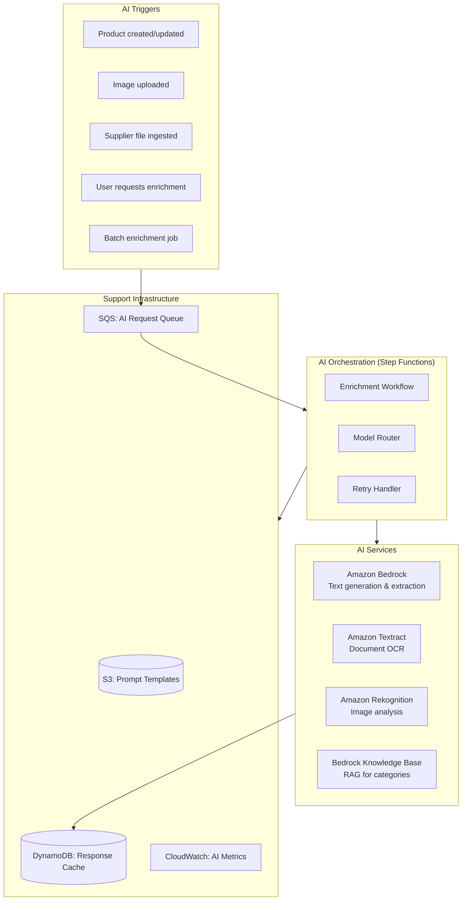
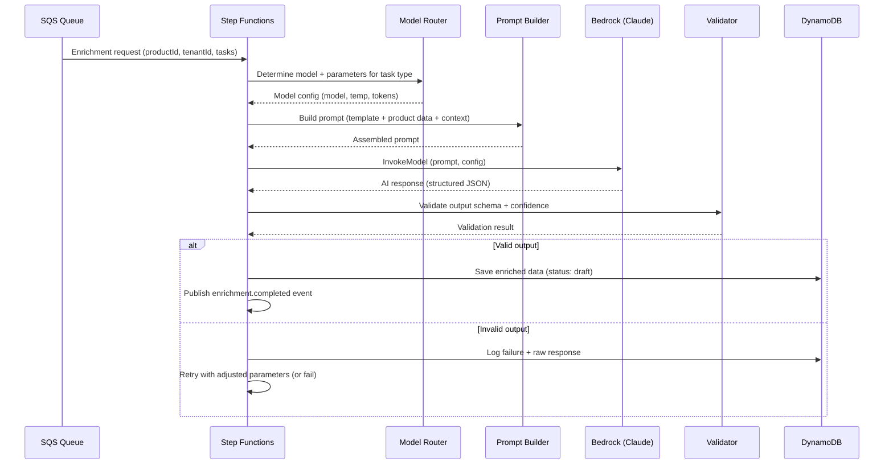
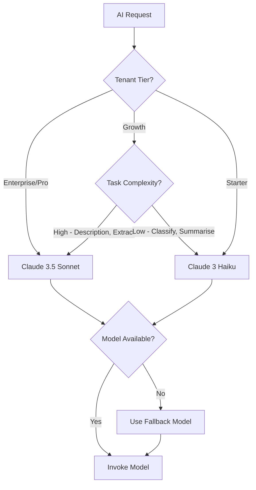
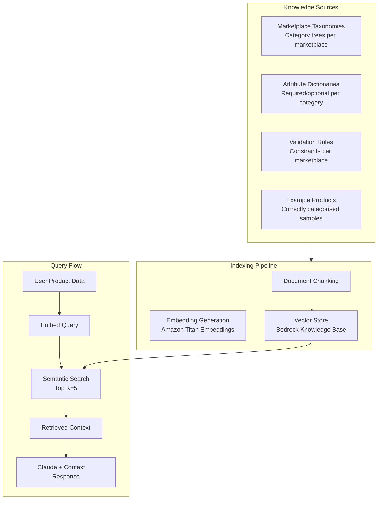
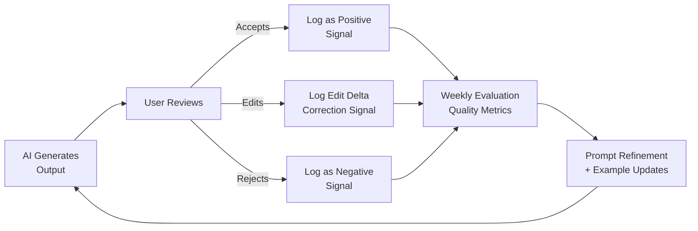
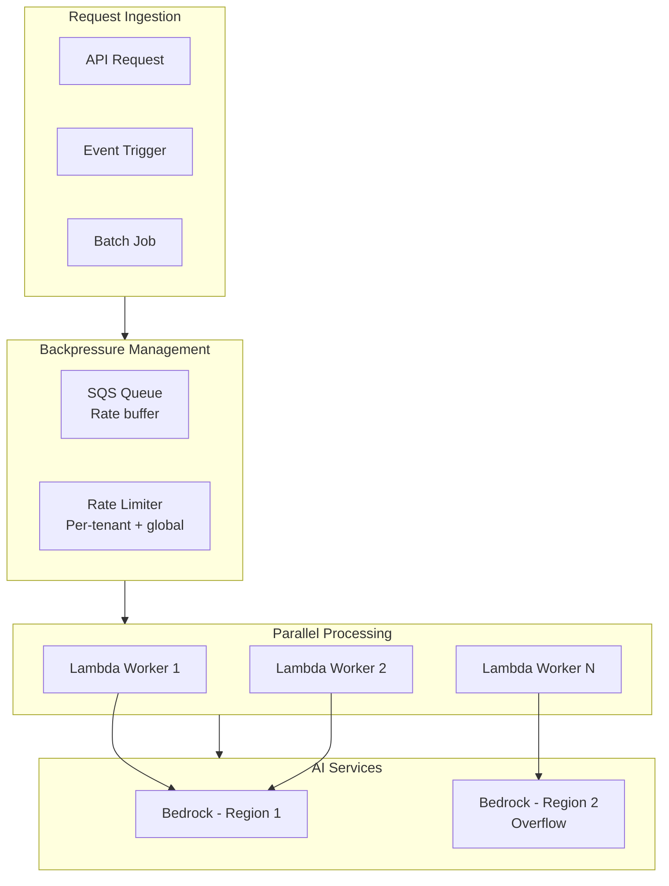

# MerchOS Engineering Blueprint

## Volume 07 — AI Architecture

---

| Field | Value |
|-------|-------|
| **Document ID** | MERCH-007 |
| **Title** | AI Architecture |
| **Version** | 0.1 |
| **Status** | Draft |
| **Owner** | Wadzanai Maparura |
| **Technical Lead** | Kiro AI |
| **Created** | 2026-06-27 |
| **Last Updated** | 2026-06-27 |
| **Next Review** | 2026-07-11 |
| **Classification** | Internal — Confidential |
| **Related Documents** | MERCH-005 (AWS Architecture), MERCH-009 (Product Intelligence), MERCH-010 (Image Intelligence) |

---

## Revision History

| Version | Date | Author | Change Description |
|---------|------|--------|-------------------|
| 0.1 | 2026-06-27 | Kiro AI / Wadzanai Maparura | Initial draft |

---

## Table of Contents

1. [Purpose](#1-purpose)
2. [Scope](#2-scope)
3. [AI Philosophy](#3-ai-philosophy)
4. [AI vs Deterministic Boundary](#4-ai-vs-deterministic-boundary)
5. [AI Service Architecture](#5-ai-service-architecture)
6. [Model Strategy](#6-model-strategy)
7. [Prompt Engineering](#7-prompt-engineering)
8. [RAG Architecture](#8-rag-architecture)
9. [Confidence & Quality](#9-confidence--quality)
10. [AI Governance](#10-ai-governance)
11. [Cost Management](#11-cost-management)
12. [Performance & Scaling](#12-performance--scaling)
13. [Monitoring & Evaluation](#13-monitoring--evaluation)
14. [Future AI Roadmap](#14-future-ai-roadmap)
15. [Assumptions](#15-assumptions)
16. [Dependencies](#16-dependencies)
17. [References](#17-references)

---


## 1. Purpose

This document defines the AI architecture for MerchOS — how artificial intelligence is integrated, governed, and operationalised within the platform. It establishes the clear boundary between AI intelligence and deterministic business logic, ensuring that AI augments human decision-making without replacing business rules.

---

## 2. Scope

Covers: AI philosophy, service architecture, model strategy, prompt engineering, RAG (Retrieval-Augmented Generation), confidence scoring, governance, cost management, performance, monitoring, and future roadmap. Specific engine implementations are detailed in MERCH-009 (Product Intelligence) and MERCH-010 (Image Intelligence).

---

## 3. AI Philosophy

### 3.1 Core Tenets

| Tenet | Description | Enforcement |
|-------|-------------|-------------|
| **AI recommends, rules decide** | AI generates suggestions; deterministic logic validates and applies | Confidence thresholds; human approval required |
| **Transparency** | Users see what AI did, why, and how confident it is | Confidence scores on every output; reasoning traces |
| **Human-in-the-loop** | No AI output goes to marketplace without human approval | Approval workflow before export; review UI |
| **Fail gracefully** | Platform works without AI; AI failure never breaks core functionality | Graceful degradation; AI features show "unavailable" |
| **Cost-conscious** | Every AI call has a purpose and a budget | Per-tenant token budgets; credit system; caching |
| **Auditable** | Every AI decision is logged for debugging and improvement | Input, output, model, version, timestamp logged |
| **Improvable** | AI quality improves over time from user feedback | Correction tracking; prompt iteration; A/B testing |

### 3.2 AI Value Chain



---

## 4. AI vs Deterministic Boundary

### 4.1 Responsibility Matrix



### 4.2 Decision Authority Table

| Decision | AI Authority | Business Authority | Human Authority |
|----------|-------------|-------------------|----------------|
| Product description text | Generates draft | Validates length/format | Approves final content |
| Category assignment | Recommends top 3 | Validates against taxonomy | Selects or overrides |
| Attribute values | Extracts with confidence | Validates type/range/format | Confirms or corrects |
| Pricing | Never | Calculates from rules | Sets base price |
| Required fields | Suggests values | Enforces presence | Provides missing data |
| Image compliance | Flags issues | Enforces hard rules | Reviews edge cases |
| Export format | Never | Generates deterministically | Initiates export |
| Inventory levels | Never | Calculates from events | Adjusts manually |

### 4.3 Override Rules

| Scenario | Behaviour |
|----------|-----------|
| AI confidence ≥ 0.9 | Auto-suggest (user sees as "recommended") |
| AI confidence 0.7–0.89 | Suggest with "review recommended" flag |
| AI confidence < 0.7 | Flag for mandatory human review |
| AI unavailable | Feature disabled; manual fallback available |
| AI output fails validation | Rejected; user notified; logged for prompt improvement |
| User corrects AI output | Correction logged for future improvement |

---

## 5. AI Service Architecture

### 5.1 Service Topology



### 5.2 Processing Pipeline



---

## 6. Model Strategy

### 6.1 Model Selection

| Use Case | Primary Model | Fallback Model | Rationale |
|----------|--------------|----------------|-----------|
| Description generation | Claude 3.5 Sonnet | Claude 3 Haiku | Quality for customer-facing text |
| Attribute extraction | Claude 3.5 Sonnet | Claude 3 Haiku | Accuracy for structured extraction |
| Category recommendation | Claude 3.5 Sonnet + RAG | Claude 3 Haiku + RAG | Taxonomy knowledge critical |
| SEO optimisation | Claude 3.5 Sonnet | Claude 3 Haiku | Creative + analytical |
| Translation | Claude 3.5 Sonnet | Amazon Titan | Multi-language quality |
| Simple classification | Claude 3 Haiku | Amazon Titan Lite | Cost-effective for simple tasks |
| Summarisation | Claude 3 Haiku | Amazon Titan | Cost-effective; adequate quality |

### 6.2 Model Routing Logic



### 6.3 Model Version Pinning

| Principle | Implementation |
|-----------|---------------|
| Pin to specific model version | Use versioned model ID (e.g., `anthropic.claude-3-5-sonnet-20241022-v2:0`) |
| Test before upgrading | New model versions tested on evaluation set before promotion |
| Rollback capability | Previous model version always available; switchable via config |
| A/B testing | Route percentage of traffic to new model; compare quality metrics |

---

## 7. Prompt Engineering

### 7.1 Prompt Architecture

| Component | Purpose | Storage |
|-----------|---------|---------|
| System prompt | Role definition, constraints, output format | S3 (versioned) |
| Context injection | Marketplace rules, tenant preferences, category info | Built at runtime from DynamoDB |
| User input | Product data, images, supplier text | From request payload |
| Output schema | JSON Schema defining expected response structure | S3 (versioned) |
| Few-shot examples | High-quality input/output pairs for guidance | S3 (versioned) |

### 7.2 Prompt Template Structure

```
[SYSTEM]
You are MerchOS Product Intelligence, an AI assistant that generates 
marketplace-ready product content.

Rules:
- Output ONLY valid JSON matching the provided schema
- Include confidence scores (0.0-1.0) for each generated field
- Never invent specifications not present in the input data
- Respect character limits specified in the marketplace constraints
- If uncertain about a value, set confidence below 0.7

[CONTEXT]
Marketplace: {marketplace_name}
Category: {target_category}
Character Limits: {field_limits}
Required Attributes: {required_attributes}
Tenant Preferences: {tone, language, brand_voice}

[INPUT]
Product Data:
{raw_product_data}

[OUTPUT SCHEMA]
{json_schema}

[FEW-SHOT EXAMPLES]
Example 1: {input_1} → {output_1}
Example 2: {input_2} → {output_2}
```

### 7.3 Prompt Management

| Practice | Implementation |
|----------|---------------|
| Version control | Prompts stored in S3 with versioning; tagged by model version |
| A/B testing | Multiple prompt variants tested; winner promoted |
| Tenant customisation | Tenant-specific tone/language injected into context |
| Prompt caching | Identical prompts cached to avoid redundant Bedrock calls |
| Token optimisation | Prompts reviewed monthly for token efficiency |
| Evaluation | Prompt changes tested against evaluation dataset before deployment |

---

## 8. RAG Architecture

### 8.1 Knowledge Base Design

MerchOS uses Retrieval-Augmented Generation (RAG) to ground AI responses in factual marketplace data — particularly for category recommendation and attribute mapping.



### 8.2 Knowledge Base Contents

| Knowledge Type | Source | Update Frequency | Embedding Strategy |
|---------------|--------|-----------------|-------------------|
| Takealot categories (3 levels) | Marketplace Knowledge Base (MERCH-008) | On schema update | Per-category chunk with path |
| Amazon browse nodes | SP-API category feed | Monthly | Per-node with attributes |
| Makro categories | Manual curation | On schema update | Per-category chunk |
| Attribute dictionaries | Per-marketplace schema | On schema update | Per-category attributes |
| Example products | Curated training set | Monthly | Product + correct category |
| Validation rules | Marketplace Knowledge Base | On schema update | Per-rule with context |

### 8.3 RAG Performance Targets

| Metric | Target |
|--------|--------|
| Category recommendation accuracy (top 1) | > 75% |
| Category recommendation accuracy (top 3) | > 90% |
| Retrieval relevance (manual evaluation) | > 85% |
| Query latency (embedding + search + generation) | < 5 seconds |
| Knowledge base freshness | < 24 hours after schema update |

---


## 9. Confidence & Quality

### 9.1 Confidence Score Framework

Every AI output includes a confidence score (0.0–1.0) that determines downstream behaviour:

| Score Range | Label | UX Treatment | System Behaviour |
|-------------|-------|-------------|-----------------|
| 0.95–1.0 | Very High | Green badge; auto-accept suggestion | Auto-populate field (user can override) |
| 0.85–0.94 | High | Green badge; "Recommended" | Auto-populate; no review required |
| 0.70–0.84 | Medium | Yellow badge; "Review suggested" | Populate but flag for human review |
| 0.50–0.69 | Low | Orange badge; "Needs review" | Suggest but require confirmation |
| 0.0–0.49 | Very Low | Red badge; "Manual input needed" | Do not populate; show as reference only |

### 9.2 Quality Evaluation

| Dimension | Measurement Method | Target |
|-----------|-------------------|--------|
| **Accuracy** | Human evaluation on random sample (weekly) | > 85% "acceptable without edit" |
| **Relevance** | Category recommendation precision@3 | > 90% |
| **Completeness** | Extracted attributes vs. available attributes | > 75% recall |
| **Consistency** | Same input produces similar outputs | < 10% variance between runs |
| **Safety** | No hallucinated specifications or false claims | 0 safety violations |
| **User acceptance** | % of AI suggestions accepted without edit | > 60% |

### 9.3 Quality Improvement Loop



---

## 10. AI Governance

### 10.1 Governance Framework

| Domain | Policy | Enforcement |
|--------|--------|-------------|
| **Content Safety** | AI must not generate harmful, offensive, or misleading content | Bedrock Guardrails; output validation; content filters |
| **Factual Accuracy** | AI must not hallucinate product specifications | Confidence thresholds; source attribution; human review |
| **Bias Prevention** | AI outputs must not discriminate by brand, price tier, or origin | Regular bias audits; diverse training examples |
| **Data Privacy** | AI must not memorise or leak tenant-specific product data | No fine-tuning on tenant data; stateless inference |
| **Intellectual Property** | AI must not copy verbatim from training data | Originality checks; plagiarism detection on descriptions |
| **Explainability** | Users can understand why AI made a recommendation | Reasoning traces; confidence justification |

### 10.2 Bedrock Guardrails Configuration

| Guardrail | Configuration | Purpose |
|-----------|---------------|---------|
| Content Filters | Block hate, violence, sexual, misconduct content | Ensure marketplace-appropriate output |
| Denied Topics | Pricing manipulation, competitor defamation, health claims | Prevent business/legal risk |
| Word Filters | Brand-specific blocked words (configurable per tenant) | Respect brand guidelines |
| Sensitive Information | Block PII in outputs (SSN, credit cards, etc.) | Data protection |
| Grounding Check | Validate output against input source material | Reduce hallucination |

### 10.3 AI Ethics Checklist

- [ ] Does the AI clearly disclose it generated the content?
- [ ] Can the user override any AI suggestion?
- [ ] Is there a fallback if AI is unavailable?
- [ ] Is AI cost transparent to the user (credits visible)?
- [ ] Is AI performance being measured and reported?
- [ ] Are user corrections being used to improve quality?
- [ ] Is there a process to handle AI errors or complaints?

---

## 11. Cost Management

### 11.1 Token Economics

| Model | Input Cost | Output Cost | Avg Tokens/Product | Cost/Product |
|-------|-----------|-------------|-------------------|--------------|
| Claude 3.5 Sonnet | $3.00/1M tokens | $15.00/1M tokens | 3,000 in / 1,500 out | ~$0.031 |
| Claude 3 Haiku | $0.25/1M tokens | $1.25/1M tokens | 3,000 in / 1,500 out | ~$0.0026 |
| Titan Embeddings | $0.02/1M tokens | N/A | 500 per query | ~$0.00001 |

### 11.2 Cost Control Mechanisms

| Mechanism | Implementation | Purpose |
|-----------|---------------|---------|
| Per-tenant credit budgets | DynamoDB counter; checked before each AI call | Prevent runaway costs |
| Model routing by tier | Starter → Haiku; Growth → mixed; Pro/Enterprise → Sonnet | Align cost to revenue |
| Prompt caching | Hash prompt; serve cached response for identical inputs | Eliminate duplicate costs |
| Response caching | Cache AI responses for similar products (same category/type) | Reduce repeat inference |
| Batch optimisation | Group similar products for efficient batch processing | Amortise system prompt tokens |
| Token monitoring | Real-time tracking per tenant per model | Early cost alert |
| Budget alerts | Notify at 80% and 100% of monthly AI budget per tenant | Prevent surprise charges |

### 11.3 Credit System

| Tier | Monthly AI Credits | Equivalent Products (Sonnet) | Equivalent Products (Haiku) |
|------|-------------------|-----------------------------|-----------------------------|
| Starter | 50 credits | ~50 products | ~600 products |
| Growth | 500 credits | ~500 products | ~6,000 products |
| Professional | 5,000 credits | ~5,000 products | ~60,000 products |
| Enterprise | Custom | Unlimited (managed budget) | Unlimited |

*1 credit = 1 full product enrichment (description + attributes + category) on Claude 3.5 Sonnet*

---

## 12. Performance & Scaling

### 12.1 Latency Targets

| Operation | Target (p95) | Strategy |
|-----------|-------------|----------|
| Single product enrichment (Sonnet) | < 15s | Direct inference; no queuing |
| Single product enrichment (Haiku) | < 5s | Direct inference |
| Category recommendation (RAG) | < 8s | Embedding + search + inference |
| Batch enrichment (100 products) | < 10min | Parallel processing (10 concurrent) |
| Batch enrichment (1,000 products) | < 60min | Parallel processing (20 concurrent) |
| OCR (single page) | < 5s | Textract sync API |
| Image analysis | < 3s | Rekognition sync API |

### 12.2 Scaling Architecture



### 12.3 Rate Limit Handling

| Scenario | Strategy |
|----------|----------|
| Bedrock rate limit hit | Exponential backoff; retry from SQS; cross-region fallback |
| Tenant exceeds AI budget | Reject request; notify user; suggest upgrade |
| Batch overwhelms capacity | SQS absorbs burst; Lambda scales within concurrency limit |
| Peak hours (many tenants) | Priority queuing (Enterprise > Pro > Growth > Starter) |

---

## 13. Monitoring & Evaluation

### 13.1 AI-Specific Metrics

| Metric | Source | Alarm Threshold |
|--------|--------|----------------|
| AI request latency (p95) | CloudWatch custom metric | > 20s |
| AI error rate | CloudWatch custom metric | > 5% |
| Token consumption (daily) | CloudWatch custom metric | > 120% of daily budget |
| Average confidence score | CloudWatch custom metric | < 0.70 (quality degradation) |
| User acceptance rate | Application analytics | < 50% (prompt needs improvement) |
| Cache hit rate | CloudWatch custom metric | < 20% (cache not effective) |
| Model availability | Bedrock health check | Any failure |
| Guardrail trigger rate | Bedrock Guardrails | > 5% (prompt may need adjustment) |

### 13.2 Evaluation Framework

| Evaluation Type | Frequency | Method | Sample Size |
|----------------|-----------|--------|-------------|
| Automated quality check | Every enrichment | Schema validation + confidence thresholds | 100% |
| User feedback (accept/edit/reject) | Continuous | Application event tracking | 100% |
| Human evaluation (manual review) | Weekly | Random sample reviewed by product expert | 50 products |
| Prompt regression testing | On prompt change | Evaluation dataset (200 products with ground truth) | 200 |
| A/B testing (model/prompt variants) | On change | Traffic splitting; statistical comparison | 500+ per variant |
| Bias audit | Monthly | Category/brand distribution analysis | Full month data |

### 13.3 AI Dashboard

| Panel | Metrics Displayed |
|-------|------------------|
| Quality | Acceptance rate, confidence distribution, edit frequency |
| Performance | Latency (p50/p95/p99), throughput, queue depth |
| Cost | Tokens consumed (by model, by tenant), daily spend, budget utilisation |
| Errors | Error rate, error types, guardrail triggers, timeout rate |
| Models | Model usage distribution, version distribution, fallback frequency |

---

## 14. Future AI Roadmap

| Phase | Capability | Approach | Timeline |
|-------|-----------|----------|----------|
| Phase 2 | Fine-tuned category model | Custom classifier trained on platform data | 6 months post-launch |
| Phase 2 | Multi-modal enrichment | Image + text combined for better extraction | 6 months post-launch |
| Phase 3 | Personalised suggestions | Per-tenant prompt tuning based on correction history | 9 months |
| Phase 3 | Automated prompt optimisation | DSPy/OPRO for systematic prompt improvement | 9 months |
| Phase 4 | Competitive intelligence | Price comparison and positioning suggestions | 12 months |
| Phase 4 | Demand forecasting | Predict product performance before listing | 12 months |
| Phase 4 | Auto-enrichment (no human) | High-confidence products auto-approved | 12 months |
| Future | Custom model training | Platform-specific model on anonymised aggregate data | 18+ months |

---

## 15. Assumptions

| # | Assumption | Impact if Invalid |
|---|-----------|-------------------|
| A1 | Bedrock Claude maintains current quality and pricing | Model switch or cost structure change needed |
| A2 | RAG with marketplace taxonomies provides sufficient category accuracy | Need custom classifier (more engineering effort) |
| A3 | Users prefer suggestions over auto-applied AI changes | UX redesign for auto-mode |
| A4 | Token costs decrease over time (industry trend) | Budget recalculation; tier adjustment |
| A5 | Prompt engineering achieves > 85% quality without fine-tuning | Fine-tuning infrastructure needed earlier |
| A6 | Cross-region Bedrock calls have acceptable latency (< 500ms overhead) | Need region-local model access |

---

## 16. Dependencies

| Dependency | Impact | Risk |
|-----------|--------|------|
| Amazon Bedrock (Claude models) | Core AI capability | Medium — model availability |
| Amazon Textract | OCR capability | Low — stable service |
| Amazon Rekognition | Image analysis | Low — stable service |
| Bedrock Knowledge Bases | RAG capability | Medium — feature maturity |
| Marketplace taxonomy data | RAG content | Medium — data quality |
| User feedback signals | Quality improvement | Low — built into platform |

---

## 17. References

| # | Reference |
|---|-----------|
| 1 | Amazon Bedrock User Guide |
| 2 | Anthropic Claude Model Card & Documentation |
| 3 | AWS Machine Learning Lens (Well-Architected) |
| 4 | Amazon Bedrock Knowledge Bases Developer Guide |
| 5 | MERCH-005 (AWS Architecture — Bedrock section) |
| 6 | MERCH-009 (Product Intelligence Engine) |
| 7 | MERCH-010 (Image Intelligence Engine) |
| 8 | Prompt Engineering Guide (Anthropic) |

---

*End of Volume 07 — AI Architecture*

*Previous: Volume 06 — Security Architecture (MERCH-006)*
*Next: Volume 08 — Marketplace Intelligence Engine (MERCH-008)*
