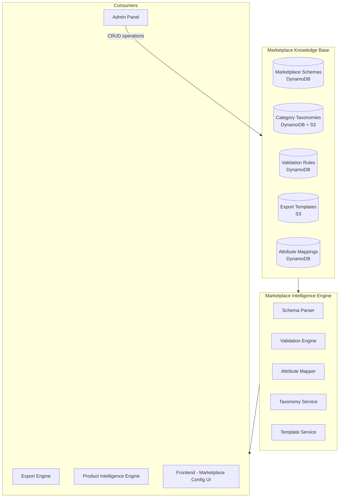
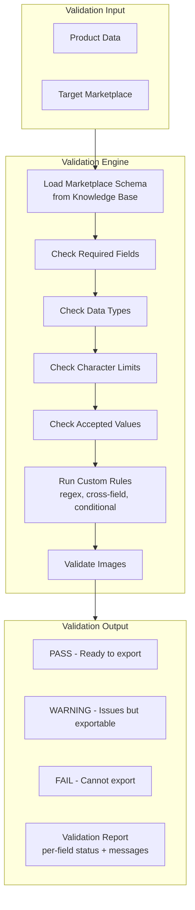
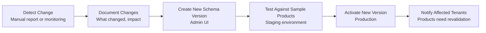

# MerchOS Engineering Blueprint

## Volume 08 — Marketplace Intelligence Engine

---

| Field | Value |
|-------|-------|
| **Document ID** | MERCH-008 |
| **Title** | Marketplace Intelligence Engine |
| **Version** | 0.1 |
| **Status** | Draft |
| **Owner** | Wadzanai Maparura |
| **Technical Lead** | Kiro AI |
| **Created** | 2026-06-27 |
| **Last Updated** | 2026-06-27 |
| **Next Review** | 2026-07-11 |
| **Classification** | Internal — Confidential |
| **Related Documents** | MERCH-007 (AI Architecture), MERCH-013 (Export Engine), MERCH-014 (Database Design) |

---

## Revision History

| Version | Date | Author | Change Description |
|---------|------|--------|-------------------|
| 0.1 | 2026-06-27 | Kiro AI / Wadzanai Maparura | Initial draft |

---

## Table of Contents

1. [Purpose](#1-purpose)
2. [Scope](#2-scope)
3. [Architecture Overview](#3-architecture-overview)
4. [Knowledge Base Design](#4-knowledge-base-design)
5. [Takealot Marketplace](#5-takealot-marketplace)
6. [Amazon Marketplace](#6-amazon-marketplace)
7. [Makro Marketplace](#7-makro-marketplace)
8. [Shopify](#8-shopify)
9. [WooCommerce](#9-woocommerce)
10. [Validation Engine](#10-validation-engine)
11. [Schema Versioning](#11-schema-versioning)
12. [Adding New Marketplaces](#12-adding-new-marketplaces)
13. [Assumptions](#13-assumptions)
14. [Dependencies](#14-dependencies)
15. [References](#15-references)

---


## 1. Purpose

This document defines the Marketplace Intelligence Engine — the knowledge-base-driven system that stores all marketplace schemas, validation rules, category taxonomies, and export templates. This engine ensures MerchOS can support any marketplace via configuration, not code changes.

---

## 2. Scope

Covers: Knowledge base architecture, per-marketplace specifications (Takealot, Amazon, Makro, Shopify, WooCommerce), CSV column documentation, category taxonomies, validation rules, image requirements, and the process for adding new marketplaces.

---

## 3. Architecture Overview



### 3.1 Design Principles

| Principle | Implementation |
|-----------|---------------|
| **Configuration over code** | All marketplace rules in DynamoDB/S3; no hardcoded logic |
| **Version controlled** | Every schema change tracked with version history |
| **Marketplace agnostic engine** | Same validation/export code works for any marketplace |
| **Admin manageable** | Platform admins update schemas without developer intervention |
| **AI-consumable** | Schemas feed into RAG knowledge base for AI recommendations |

---

## 4. Knowledge Base Design

### 4.1 Data Model

| Entity | Storage | Key Pattern | Contents |
|--------|---------|-------------|----------|
| Marketplace | DynamoDB | `MKT#{id}` / `META` | Name, region, integration method, status, config |
| Schema (CSV spec) | DynamoDB | `MKT#{id}` / `SCHEMA#v{n}` | Columns array with full metadata |
| Column Definition | DynamoDB (nested) | Within schema item | Name, type, required, limits, validation, examples |
| Category Taxonomy | DynamoDB + S3 | `MKT#{id}#CAT` / `{path}` | Category tree with IDs, paths, attributes |
| Validation Rule | DynamoDB | `MKT#{id}#RULE` / `{ruleId}` | Rule type, expression, error message, severity |
| Attribute Mapping | DynamoDB | `MKT#{id}#MAP` / `{sourceField}` | Source → target field mapping with transforms |
| Image Requirements | DynamoDB | `MKT#{id}` / `IMAGE_REQS` | Dimensions, formats, count, size limits |
| Export Template | S3 | `templates/{mktId}/v{n}/template.json` | Column ordering, headers, encoding, delimiter |

### 4.2 Column Definition Schema

Every CSV column across all marketplaces is documented with this structure:

```json
{
  "columnName": "product_title",
  "displayName": "Product Title",
  "required": true,
  "dataType": "string",
  "characterLimit": { "min": 5, "max": 150 },
  "validationRules": [
    { "type": "regex", "pattern": "^[^<>]+$", "message": "No HTML tags allowed" },
    { "type": "forbidden_words", "words": ["best", "cheapest", "#1"], "message": "No superlatives" }
  ],
  "acceptedValues": null,
  "defaultValue": null,
  "marketplaceNotes": "Takealot truncates at 150 chars. Include brand name first.",
  "example": "Samsung Galaxy S24 Ultra 256GB - Titanium Black",
  "mappedFrom": "product.title",
  "transformRule": "truncate(150)",
  "category": "required",
  "sortOrder": 1
}
```

---

## 5. Takealot Marketplace

### 5.1 Marketplace Overview

| Attribute | Value |
|-----------|-------|
| **Marketplace** | Takealot |
| **Region** | South Africa |
| **URL** | https://www.takealot.com |
| **Seller Portal** | https://seller.takealot.com |
| **Integration Method** | CSV Upload (primary) + Seller API (limited) |
| **Market Position** | #1 South African online marketplace (~15M monthly visitors) |
| **Priority** | P0 (Phase 1) |
| **Update Frequency** | Quarterly (CSV format changes) |

### 5.2 CSV Specification

| # | Column Name | Required | Data Type | Char Limit | Validation Rules | Accepted Values | Marketplace Notes | Example |
|---|-------------|----------|-----------|-----------|-----------------|----------------|-------------------|---------|
| 1 | offer_id | Yes | String | 50 | Alphanumeric + dash/underscore | — | Unique per seller; your internal reference | `SKU-ELEC-001` |
| 2 | barcode | Yes | String | 13 | Valid EAN-13 or UPC-A; checksum validation | — | Must be genuine; Takealot verifies against GS1 | `6001234567890` |
| 3 | product_title | Yes | String | 150 | No HTML; no superlatives; brand first | — | Brand + Model + Key Attribute + Variant | `Samsung Galaxy S24 Ultra 256GB Titanium Black` |
| 4 | brand | Yes | String | 100 | Must match Takealot brand list | Brand registry | Request new brand via seller support if not listed | `Samsung` |
| 5 | category | Yes | String | — | Must match Takealot taxonomy exactly | Category tree | Use full path separated by " > " | `Electronics > Cell Phones > Smartphones` |
| 6 | description | Yes | String | 5000 | HTML allowed (limited tags); no external links | — | Detailed product description with features | `<p>The Samsung Galaxy S24 Ultra...</p>` |
| 7 | selling_price | Yes | Decimal | — | > 0; max 2 decimal places; ZAR | — | Price in Rands including VAT | `24999.00` |
| 8 | rrp | No | Decimal | — | >= selling_price; max 2 decimal places | — | Recommended retail price (for "was" pricing) | `27999.00` |
| 9 | stock_quantity | Yes | Integer | — | >= 0; whole numbers only | — | Available stock; 0 = not buyable | `150` |
| 10 | lead_time | Yes | Integer | — | 1-14 | 1-14 days | Business days to dispatch | `2` |
| 11 | image_url_1 | Yes | URL | 500 | Valid HTTPS URL; image must be accessible | .jpg, .png | Primary image; white background; min 1000x1000px | `https://cdn.example.com/img1.jpg` |
| 12 | image_url_2 | No | URL | 500 | Valid HTTPS URL | .jpg, .png | Additional angle/lifestyle image | `https://cdn.example.com/img2.jpg` |
| 13 | image_url_3 | No | URL | 500 | Valid HTTPS URL | .jpg, .png | Additional image | — |
| 14 | image_url_4 | No | URL | 500 | Valid HTTPS URL | .jpg, .png | Additional image | — |
| 15 | weight_kg | Conditional | Decimal | — | > 0; reasonable for product type | — | Required for physical products; used for shipping | `0.234` |
| 16 | length_cm | Conditional | Decimal | — | > 0 | — | Package dimension | `16.5` |
| 17 | width_cm | Conditional | Decimal | — | > 0 | — | Package dimension | `7.8` |
| 18 | height_cm | Conditional | Decimal | — | > 0 | — | Package dimension | `0.9` |
| 19 | warranty | No | String | 200 | — | — | Warranty description | `2 Year Manufacturer Warranty` |
| 20 | key_feature_1 | No | String | 200 | Plain text; no HTML | — | Bullet point feature | `200MP Camera with AI Photo Processing` |
| 21 | key_feature_2 | No | String | 200 | Plain text; no HTML | — | Bullet point feature | `6.8" Dynamic AMOLED Display` |
| 22 | key_feature_3 | No | String | 200 | Plain text; no HTML | — | Bullet point feature | `5000mAh Battery with 45W Fast Charging` |
| 23 | key_feature_4 | No | String | 200 | Plain text; no HTML | — | Bullet point feature | `S Pen Built-in` |
| 24 | key_feature_5 | No | String | 200 | Plain text; no HTML | — | Bullet point feature | `Titanium Frame` |
| 25 | variant_group_id | Conditional | String | 50 | Same for all variants in group | — | Groups variants together; required if variants exist | `SAMS24U-GROUP` |
| 26 | variant_attribute | Conditional | String | 100 | — | — | The attribute that varies (e.g., "Colour", "Size") | `Colour` |
| 27 | variant_value | Conditional | String | 100 | — | — | The value of the varying attribute | `Titanium Black` |

### 5.3 Category Taxonomy

| Level | Example | Depth |
|-------|---------|-------|
| L1 (Department) | Electronics, Fashion, Home & Garden, Baby, Sports | ~20 departments |
| L2 (Category) | Cell Phones, Laptops, TVs, Audio | ~200 categories |
| L3 (Sub-Category) | Smartphones, Feature Phones, Accessories | ~1,500 sub-categories |

**Taxonomy rules:**
- Must use exact Takealot taxonomy string
- Full path required (e.g., `Electronics > Cell Phones > Smartphones`)
- Separator: ` > ` (space-arrow-space)
- Taxonomy updated quarterly by Takealot

### 5.4 Mandatory Attributes (by category)

| Category | Mandatory Attributes |
|----------|---------------------|
| Electronics > Smartphones | Brand, Model, Storage, RAM, Screen Size, OS |
| Fashion > Clothing | Brand, Size, Colour, Material, Gender |
| Home > Furniture | Material, Dimensions, Assembly Required, Weight |
| Baby > Toys | Age Range, Safety Certification, Material |
| Sports > Fitness | Type, Weight Capacity, Dimensions |

### 5.5 Image Requirements

| Requirement | Specification |
|-------------|--------------|
| Minimum resolution | 1000 × 1000 pixels |
| Maximum file size | 5MB |
| Formats | JPEG, PNG |
| Background | White/clean (primary image) |
| Minimum images | 1 (primary) |
| Maximum images | 8 |
| Watermarks | Not allowed |
| Text overlays | Not allowed |
| Lifestyle images | Allowed for secondary images |

### 5.6 Common Errors

| Error | Cause | Resolution |
|-------|-------|-----------|
| `INVALID_BARCODE` | EAN-13 checksum fails | Verify barcode with GS1 validator |
| `BRAND_NOT_FOUND` | Brand not in Takealot registry | Request brand addition via seller support |
| `CATEGORY_MISMATCH` | Category path doesn't match taxonomy | Use exact taxonomy path from Takealot |
| `IMAGE_TOO_SMALL` | Image below 1000×1000px | Upload higher resolution image |
| `PRICE_BELOW_MINIMUM` | Selling price below Takealot minimum | Check category minimum price rules |
| `DUPLICATE_OFFER_ID` | offer_id already exists for seller | Use unique identifier per product |
| `MISSING_DIMENSIONS` | Physical product without weight/dimensions | Add shipping dimensions |

### 5.7 API Integration Strategy

| Capability | Method | Status |
|-----------|--------|--------|
| Product listing (create) | CSV upload via Seller Portal | Phase 1 |
| Product listing (update) | CSV upload via Seller Portal | Phase 1 |
| Stock update | Seller API (if available) | Phase 2 |
| Order retrieval | Seller API | Phase 3 |
| Price update | CSV upload | Phase 1 |
| Category browse | Scraped/documented taxonomy | Phase 1 |

---


## 6. Amazon Marketplace

### 6.1 Marketplace Overview

| Attribute | Value |
|-----------|-------|
| **Marketplace** | Amazon (South Africa / Global) |
| **Region** | South Africa (amazon.co.za) + Global |
| **Integration Method** | Selling Partner API (SP-API) + Flat Files |
| **Market Position** | Largest global marketplace; new in SA (launched 2024) |
| **Priority** | P0 (Phase 1) |
| **Update Frequency** | Continuous (API versioned) |

### 6.2 CSV Specification (Flat File — Generic Template)

| # | Column Name | Required | Data Type | Char Limit | Validation Rules | Accepted Values | Marketplace Notes | Example |
|---|-------------|----------|-----------|-----------|-----------------|----------------|-------------------|---------|
| 1 | sku | Yes | String | 40 | Alphanumeric + limited special chars | — | Seller-defined unique identifier | `ELEC-SAM-S24U-BLK` |
| 2 | product-id | Yes | String | 16 | Valid ASIN, EAN, UPC, or ISBN | ASIN/EAN/UPC/ISBN | Primary product identifier | `6001234567890` |
| 3 | product-id-type | Yes | String | 4 | Enum | ASIN, EAN, UPC, ISBN | Type of product-id | `EAN` |
| 4 | item_name | Yes | String | 200 | No HTML; follow Amazon title formula | — | Brand + Line + Material + Key Feature + Size + Colour | `Samsung Galaxy S24 Ultra Smartphone, 256GB, Titanium Black` |
| 5 | brand_name | Yes | String | 50 | Must match Amazon Brand Registry | — | Registered brand name | `Samsung` |
| 6 | item_type | Yes | String | — | Must match Amazon browse node keyword | Amazon keyword list | Category keyword | `cell-phone` |
| 7 | external_product_id | Conditional | String | 16 | Valid EAN/UPC | — | Required if no ASIN match found | `6001234567890` |
| 8 | standard_price | Yes | Decimal | — | > 0; currency matches marketplace | — | Listing price in local currency | `24999.00` |
| 9 | quantity | Yes | Integer | — | >= 0 | — | Available inventory | `150` |
| 10 | product_description | Yes | String | 2000 | No HTML in flat file; limited formatting | — | Full product description | `The Samsung Galaxy S24 Ultra features...` |
| 11 | bullet_point1 | Yes | String | 500 | No HTML; no promotional text | — | Key feature bullet | `200MP Camera with AI Processing` |
| 12 | bullet_point2 | No | String | 500 | Same rules as bullet_point1 | — | Key feature | `6.8 inch Dynamic AMOLED 2X Display` |
| 13 | bullet_point3 | No | String | 500 | Same rules | — | Key feature | `5000mAh Battery, 45W Fast Charging` |
| 14 | bullet_point4 | No | String | 500 | Same rules | — | Key feature | `Built-in S Pen with AI Features` |
| 15 | bullet_point5 | No | String | 500 | Same rules | — | Key feature | `Titanium Frame, IP68 Water Resistant` |
| 16 | main_image_url | Yes | URL | 2000 | Valid HTTPS; pure white background (RGB 255,255,255) | .jpg, .png, .gif, .tiff | Must fill 85%+ of frame; no text/graphics | `https://cdn.example.com/main.jpg` |
| 17 | other_image_url1-8 | No | URL | 2000 | Valid HTTPS URL | .jpg, .png | Additional images (up to 8) | — |
| 18 | fulfillment_channel | Yes | String | — | Enum | DEFAULT, AMAZON_NA | DEFAULT = merchant fulfilled; AMAZON = FBA | `DEFAULT` |
| 19 | package_weight | Conditional | Decimal | — | > 0; in kg or lbs depending on marketplace | — | Shipping weight | `0.234` |
| 20 | package_dimensions | Conditional | String | — | LxWxH format | — | Package dimensions | `16.5 x 7.8 x 0.9 cm` |
| 21 | search_terms | No | String | 250 | No brand names; no ASINs; comma separated | — | Hidden search keywords | `smartphone, mobile phone, 5G, android` |
| 22 | recommended_browse_nodes | Yes | String | — | Valid Amazon browse node ID | Numeric node ID | Category classification | `2407760031` |

### 6.3 Category Taxonomy

- Amazon uses **Browse Node IDs** (numeric) mapped to category paths
- Taxonomy depth: up to 8 levels
- Product Type definitions determine required attributes per category
- Browse Tree Guide (BTG) available via SP-API

### 6.4 Image Requirements

| Requirement | Specification |
|-------------|--------------|
| Minimum resolution | 1000 × 1000 pixels (1600 × 1600 recommended for zoom) |
| Maximum file size | 10MB |
| Formats | JPEG (.jpg), PNG, GIF, TIFF |
| Background (main) | Pure white (RGB 255,255,255) |
| Product fill | 85%+ of frame |
| Text/graphics on main | Not allowed |
| Minimum images | 1 (main) |
| Maximum images | 9 (1 main + 8 additional) |

### 6.5 API Integration Strategy

| Capability | SP-API Endpoint | Phase |
|-----------|----------------|-------|
| List products | Listings API (putListingsItem) | Phase 1 |
| Update products | Listings API (patchListingsItem) | Phase 1 |
| Check listing status | Listings API (getListingsItem) | Phase 1 |
| Upload images | Listings API (image attribute) | Phase 1 |
| Get categories | Catalog API (searchCatalogItems) | Phase 1 |
| Submit feed (bulk) | Feeds API (createFeed) | Phase 2 |
| Inventory sync | Inventory API (updateInventory) | Phase 2 |
| Pricing update | Pricing API | Phase 2 |

---

## 7. Makro Marketplace

### 7.1 Marketplace Overview

| Attribute | Value |
|-----------|-------|
| **Marketplace** | Makro (Marketplace Portal) |
| **Region** | South Africa |
| **URL** | https://www.makro.co.za |
| **Integration Method** | CSV Upload via Marketplace Portal |
| **Market Position** | Major SA retailer; growing online marketplace |
| **Priority** | P1 (Phase 1) |
| **Update Frequency** | Semi-annually |

### 7.2 CSV Specification

| # | Column Name | Required | Data Type | Char Limit | Validation Rules | Accepted Values | Marketplace Notes | Example |
|---|-------------|----------|-----------|-----------|-----------------|----------------|-------------------|---------|
| 1 | seller_sku | Yes | String | 40 | Alphanumeric; unique per seller | — | Your internal SKU reference | `MKR-ELEC-001` |
| 2 | ean | Yes | String | 13 | Valid EAN-13 | — | Product barcode | `6001234567890` |
| 3 | product_name | Yes | String | 200 | No HTML; descriptive title | — | Clear product title | `Samsung Galaxy S24 Ultra 256GB Black` |
| 4 | brand | Yes | String | 50 | Must exist in Makro brand registry | — | Brand name | `Samsung` |
| 5 | category_path | Yes | String | — | Must match Makro taxonomy | Category list | Full category path | `Technology > Phones > Smartphones` |
| 6 | description | Yes | String | 3000 | Basic HTML allowed | — | Product description | `Premium smartphone with...` |
| 7 | price_incl_vat | Yes | Decimal | — | > 0; includes 15% VAT | — | Selling price in ZAR (VAT inclusive) | `24999.00` |
| 8 | stock | Yes | Integer | — | >= 0 | — | Available quantity | `50` |
| 9 | delivery_days | Yes | Integer | — | 1-10 | 1-10 | Business days to deliver | `3` |
| 10 | main_image | Yes | URL | 500 | Valid HTTPS; accessible | .jpg, .png | Primary product image | `https://cdn.example.com/main.jpg` |
| 11 | image_2-5 | No | URL | 500 | Valid HTTPS | .jpg, .png | Additional images | — |
| 12 | weight_kg | Yes | Decimal | — | > 0 | — | Product weight for shipping | `0.234` |
| 13 | length_cm | Yes | Decimal | — | > 0 | — | Package length | `16.5` |
| 14 | width_cm | Yes | Decimal | — | > 0 | — | Package width | `7.8` |
| 15 | height_cm | Yes | Decimal | — | > 0 | — | Package height | `0.9` |
| 16 | condition | Yes | String | — | Enum | New, Refurbished | Product condition | `New` |
| 17 | vat_rate | Yes | String | — | Enum | 15, 0 | VAT percentage (15% standard, 0% exempt) | `15` |

### 7.3 Image Requirements

| Requirement | Specification |
|-------------|--------------|
| Minimum resolution | 800 × 800 pixels |
| Maximum file size | 5MB |
| Formats | JPEG, PNG |
| Background | White preferred |
| Maximum images | 5 |

### 7.4 API Integration Strategy

| Capability | Method | Phase |
|-----------|--------|-------|
| Product listing | CSV upload via portal | Phase 1 |
| Stock update | CSV upload | Phase 1 |
| Price update | CSV upload | Phase 1 |
| API integration | No public API documented | Phase 3 (if available) |

---


## 8. Shopify

### 8.1 Marketplace Overview

| Attribute | Value |
|-----------|-------|
| **Marketplace** | Shopify |
| **Region** | Global (SA sellers with Shopify stores) |
| **Integration Method** | Admin REST API + GraphQL Admin API |
| **Market Position** | Leading DTC (Direct-to-Consumer) commerce platform |
| **Priority** | P1 (Phase 1) |
| **Update Frequency** | API versioned quarterly (e.g., 2024-01, 2024-04) |

### 8.2 Product Data Specification (Admin API)

| # | Field | Required | Data Type | Char Limit | Validation Rules | Notes | Example |
|---|-------|----------|-----------|-----------|-----------------|-------|---------|
| 1 | title | Yes | String | 255 | Non-empty | Product title | `Samsung Galaxy S24 Ultra` |
| 2 | body_html | No | String | Unlimited | Valid HTML | Full description | `<p>Premium smartphone...</p>` |
| 3 | vendor | No | String | 255 | — | Brand/manufacturer | `Samsung` |
| 4 | product_type | No | String | 255 | — | Category/type | `Smartphones` |
| 5 | tags | No | String | — | Comma-separated | Searchable tags | `samsung, smartphone, 5G` |
| 6 | variants[].price | Yes | Decimal | — | >= 0 | Variant price | `24999.00` |
| 7 | variants[].sku | No | String | 255 | Unique recommended | Seller SKU | `SAM-S24U-BLK-256` |
| 8 | variants[].barcode | No | String | 255 | Valid EAN/UPC | Product barcode | `6001234567890` |
| 9 | variants[].inventory_quantity | No | Integer | — | >= 0 | Stock level (via Inventory API) | `150` |
| 10 | variants[].weight | No | Decimal | — | >= 0 | Weight in weight_unit | `0.234` |
| 11 | variants[].weight_unit | No | String | — | Enum | kg, g, lb, oz | `kg` |
| 12 | variants[].option1 | Conditional | String | 255 | — | First option value (e.g., size) | `256GB` |
| 13 | variants[].option2 | Conditional | String | 255 | — | Second option (e.g., colour) | `Titanium Black` |
| 14 | images[].src | No | URL | — | Valid HTTPS | Image URL | `https://cdn.example.com/img.jpg` |
| 15 | images[].position | No | Integer | — | >= 1 | Display order | `1` |
| 16 | status | Yes | String | — | Enum | active, draft, archived | `active` |
| 17 | metafields[] | No | Object | — | Valid namespace/key | Custom structured data | SEO, specs |

### 8.3 Image Requirements

| Requirement | Specification |
|-------------|--------------|
| Maximum file size | 20MB |
| Formats | JPEG, PNG, GIF, WebP |
| Maximum resolution | 4472 × 4472 pixels |
| Recommended resolution | 2048 × 2048 pixels |
| Maximum images per product | 250 |
| CDN | Shopify-hosted (uploaded via API) |

### 8.4 API Integration Strategy

| Capability | API | Phase |
|-----------|-----|-------|
| Create product | POST /admin/api/2024-04/products.json | Phase 1 |
| Update product | PUT /admin/api/2024-04/products/{id}.json | Phase 1 |
| Upload image | POST /admin/api/2024-04/products/{id}/images.json | Phase 1 |
| Sync inventory | POST /admin/api/2024-04/inventory_levels/set.json | Phase 2 |
| Update pricing | PUT variant pricing | Phase 2 |
| Get collections | GET /admin/api/2024-04/custom_collections.json | Phase 2 |
| Webhook (product update) | products/update topic | Phase 2 |
| GraphQL bulk operations | POST /admin/api/2024-04/graphql.json | Phase 3 |

### 8.5 Authentication

| Method | Details |
|--------|---------|
| Type | OAuth 2.0 (per-store access token) |
| Scopes required | `write_products`, `read_products`, `write_inventory`, `read_inventory` |
| Token storage | Secrets Manager (per-tenant, per-store) |
| Rate limits | 40 requests/second (REST); cost-based (GraphQL) |

---

## 9. WooCommerce

### 9.1 Marketplace Overview

| Attribute | Value |
|-----------|-------|
| **Marketplace** | WooCommerce |
| **Region** | Global (self-hosted WordPress stores) |
| **Integration Method** | WooCommerce REST API v3 |
| **Market Position** | Most popular open-source e-commerce (30%+ market share) |
| **Priority** | P2 (Phase 1) |
| **Update Frequency** | API stable (v3); WordPress plugin updates |

### 9.2 Product Data Specification (REST API)

| # | Field | Required | Data Type | Char Limit | Validation Rules | Notes | Example |
|---|-------|----------|-----------|-----------|-----------------|-------|---------|
| 1 | name | Yes | String | — | Non-empty | Product title | `Samsung Galaxy S24 Ultra` |
| 2 | type | Yes | String | — | Enum | simple, grouped, external, variable | `simple` |
| 3 | regular_price | Yes | String | — | Numeric string; > 0 | Regular price | `"24999.00"` |
| 4 | sale_price | No | String | — | < regular_price | Discounted price | `"22999.00"` |
| 5 | description | No | String | — | HTML allowed | Full description | `<p>Premium smartphone...</p>` |
| 6 | short_description | No | String | — | HTML allowed | Summary description | `<p>Samsung's flagship...</p>` |
| 7 | sku | No | String | — | Unique per store | Product SKU | `SAM-S24U-BLK` |
| 8 | stock_quantity | Conditional | Integer | — | >= 0 (if manage_stock) | Stock level | `150` |
| 9 | manage_stock | No | Boolean | — | — | Enable stock management | `true` |
| 10 | categories[].id | No | Integer | — | Valid category ID | Category assignment | `15` |
| 11 | tags[].name | No | String | — | — | Product tags | `samsung` |
| 12 | images[].src | No | URL | — | Valid URL | Product image | `https://cdn.example.com/img.jpg` |
| 13 | images[].position | No | Integer | — | >= 0 | Image sort order | `0` |
| 14 | weight | No | String | — | Numeric string | Weight (store unit) | `"0.234"` |
| 15 | dimensions.length | No | String | — | Numeric string | Length (store unit) | `"16.5"` |
| 16 | dimensions.width | No | String | — | Numeric string | Width | `"7.8"` |
| 17 | dimensions.height | No | String | — | Numeric string | Height | `"0.9"` |
| 18 | attributes[] | No | Array | — | Name + options | Product attributes | `[{name: "Color", options: ["Black"]}]` |
| 19 | meta_data[] | No | Array | — | Key-value pairs | Custom fields | `[{key: "warranty", value: "2 years"}]` |

### 9.3 Image Requirements

| Requirement | Specification |
|-------------|--------------|
| Maximum file size | WordPress default (varies by host; typically 10–50MB) |
| Formats | JPEG, PNG, GIF, WebP |
| Recommended resolution | 1000 × 1000+ pixels |
| Maximum images | Unlimited (WordPress media library) |
| Hosting | Self-hosted (uploaded to WordPress media) |

### 9.4 API Integration Strategy

| Capability | Endpoint | Phase |
|-----------|----------|-------|
| Create product | POST /wp-json/wc/v3/products | Phase 2 |
| Update product | PUT /wp-json/wc/v3/products/{id} | Phase 2 |
| Batch create/update | POST /wp-json/wc/v3/products/batch | Phase 2 |
| Manage categories | GET/POST /wp-json/wc/v3/products/categories | Phase 2 |
| Manage images | Via product create/update (src URL) | Phase 2 |
| Inventory update | PUT /wp-json/wc/v3/products/{id} (stock_quantity) | Phase 2 |
| Webhook (product update) | WooCommerce webhooks | Phase 3 |

### 9.5 Authentication

| Method | Details |
|--------|---------|
| Type | OAuth 1.0a (REST API keys) or Basic Auth (HTTPS only) |
| Credentials | Consumer Key + Consumer Secret (per-store) |
| Token storage | Secrets Manager (per-tenant, per-store) |
| Rate limits | Server-dependent (typically 100–300 req/min) |

---


## 10. Validation Engine

### 10.1 Validation Architecture



### 10.2 Validation Rule Types

| Rule Type | Description | Example |
|-----------|-------------|---------|
| `required` | Field must have a non-empty value | `barcode` is required |
| `data_type` | Value must match expected type (string, integer, decimal, URL, email) | `selling_price` must be decimal |
| `min_length` | String must be at least N characters | `product_title` min 5 chars |
| `max_length` | String must not exceed N characters | `product_title` max 150 chars |
| `regex` | Value must match regular expression | Barcode: `^\d{13}$` |
| `enum` | Value must be one of accepted values | `condition` in [New, Refurbished] |
| `range` | Numeric value must be within min-max | `lead_time` between 1-14 |
| `url` | Value must be valid HTTPS URL | `image_url_1` valid URL |
| `checksum` | Value passes algorithmic validation | EAN-13 check digit valid |
| `cross_field` | Validation depends on another field's value | If `variant_group_id` present, `variant_value` required |
| `conditional` | Field required only under certain conditions | `weight_kg` required if category is physical product |
| `forbidden_words` | String must not contain specific words | No "best", "cheapest" in title |
| `image_dimensions` | Image meets minimum pixel requirements | Min 1000×1000 for Takealot |
| `custom_function` | Complex validation via custom Lambda | Category-specific attribute validation |

### 10.3 Validation Response Schema

```json
{
  "productId": "p_abc123",
  "marketplace": "takealot",
  "overallStatus": "FAIL",
  "score": 72,
  "totalFields": 27,
  "passedFields": 20,
  "failedFields": 4,
  "warningFields": 3,
  "errors": [
    {
      "field": "barcode",
      "rule": "checksum",
      "severity": "error",
      "message": "EAN-13 check digit is invalid. Expected 0, got 3.",
      "currentValue": "6001234567893",
      "suggestion": "Verify barcode with GS1 database"
    },
    {
      "field": "category",
      "rule": "enum",
      "severity": "error",
      "message": "Category 'Electronics > Phones' not found in Takealot taxonomy.",
      "currentValue": "Electronics > Phones",
      "suggestion": "Did you mean 'Electronics > Cell Phones > Smartphones'?"
    }
  ],
  "warnings": [
    {
      "field": "description",
      "rule": "max_length",
      "severity": "warning",
      "message": "Description is 4800/5000 characters. Consider shortening for readability.",
      "currentValue": "(truncated)"
    }
  ]
}
```

### 10.4 Marketplace Readiness Score

The readiness score (0–100%) is calculated as:

```
Score = (required_fields_passed / total_required_fields) × 70% 
      + (optional_fields_filled / total_optional_fields) × 20%
      + (image_compliance_score) × 10%
```

| Score Range | Status | UX Display |
|-------------|--------|-----------|
| 95–100% | Ready | Green badge; export enabled |
| 80–94% | Almost Ready | Yellow badge; export with warnings |
| 50–79% | Needs Work | Orange badge; export blocked |
| 0–49% | Incomplete | Red badge; significant data missing |

---

## 11. Schema Versioning

### 11.1 Version Strategy

| Aspect | Implementation |
|--------|---------------|
| Version format | Semantic: `{major}.{minor}` (e.g., `1.0`, `1.1`, `2.0`) |
| Major version | Breaking change (new required field, removed field, changed validation) |
| Minor version | Non-breaking change (new optional field, relaxed rule, added accepted value) |
| Active versions | Only latest version used for new exports; previous version for re-exports |
| Migration path | Admin creates new version; exports auto-use latest; old exports flagged |

### 11.2 Schema Change Detection



### 11.3 Change Impact Assessment

| Change Type | Impact | Action Required |
|-------------|--------|----------------|
| New required field added | High — existing products now invalid | Notify tenants; provide grace period; AI can suggest values |
| Required field removed | Low — no negative impact | Update schema; remove from validation |
| Character limit changed | Medium — some products may now exceed | Revalidate all affected products; truncation suggestions |
| New accepted value added | Low — expands options | Update enum list; no product impact |
| Accepted value removed | High — products using removed value now invalid | Notify tenants; suggest replacements |
| Taxonomy restructured | High — category paths changed | Full remapping required; AI can suggest new categories |

---

## 12. Adding New Marketplaces

### 12.1 Marketplace Onboarding Process

| Step | Action | Owner | Duration |
|------|--------|-------|----------|
| 1 | Research marketplace requirements (CSV spec, API docs, image rules) | Product | 2–5 days |
| 2 | Document CSV specification (every column in standard format) | Product | 2–3 days |
| 3 | Map category taxonomy (extract or document full tree) | Product | 1–3 days |
| 4 | Define attribute mappings (MerchOS fields → marketplace columns) | Product + Engineering | 1–2 days |
| 5 | Configure validation rules (per column, per category) | Engineering | 1–2 days |
| 6 | Create export template (column ordering, encoding, delimiter) | Engineering | 1 day |
| 7 | Load into Knowledge Base (DynamoDB + S3) | Admin | 1 day |
| 8 | Test with sample products (validate output against marketplace) | QA | 2–3 days |
| 9 | Update RAG knowledge base (category recommendations) | Engineering | 1 day |
| 10 | Enable for tenants (feature flag rollout) | Operations | 1 day |

**Total: 12–21 days (no code deployment required)**

### 12.2 Zero-Code Marketplace Addition

The entire process of adding a new marketplace is configuration-only:

| Component | Method | Storage |
|-----------|--------|---------|
| Marketplace metadata | Admin UI → DynamoDB | `MKT#{newId}` / `META` |
| Column definitions | Admin UI → DynamoDB | `MKT#{newId}` / `SCHEMA#v1` |
| Category taxonomy | CSV upload → DynamoDB | `MKT#{newId}#CAT` / `{path}` |
| Validation rules | Admin UI → DynamoDB | `MKT#{newId}#RULE` / `{id}` |
| Attribute mappings | Admin UI → DynamoDB | `MKT#{newId}#MAP` / `{field}` |
| Export template | Upload → S3 | `templates/{newId}/v1/template.json` |
| Image requirements | Admin UI → DynamoDB | `MKT#{newId}` / `IMAGE_REQS` |

---

## 13. Assumptions

| # | Assumption | Impact if Invalid |
|---|-----------|-------------------|
| A1 | Takealot CSV format is stable within quarters | More frequent schema updates needed |
| A2 | Amazon SP-API is accessible from af-south-1 | Cross-region API calls with latency |
| A3 | Makro will maintain their current CSV upload process | Need alternative integration path |
| A4 | Shopify API versioning provides 12-month deprecation window | More frequent API adapter updates |
| A5 | All marketplace rules can be expressed as configuration (no custom code) | Need marketplace-specific adapter code for edge cases |

---

## 14. Dependencies

| Dependency | Impact | Risk |
|-----------|--------|------|
| Takealot Seller Portal documentation | Complete schema definition | Medium (not always public) |
| Amazon SP-API access (developer account) | API integration | Low (well-documented) |
| Makro Marketplace Portal access | Schema documentation | High (limited documentation) |
| Shopify Partner account | API access and testing | Low |
| WooCommerce test store | Integration testing | Low (self-hosted) |
| Marketplace taxonomy data | Category recommendation AI | Medium (manual curation needed) |

---

## 15. References

| # | Reference |
|---|-----------|
| 1 | Takealot Seller Centre Documentation |
| 2 | Amazon SP-API Listings API Reference |
| 3 | Amazon Browse Tree Guide |
| 4 | Shopify Admin API Reference (2024-04) |
| 5 | WooCommerce REST API Documentation (v3) |
| 6 | MERCH-007 (AI Architecture — RAG section) |
| 7 | MERCH-013 (Export Engine) |
| 8 | MERCH-014 (Database Design — marketplace schemas) |

---

*End of Volume 08 — Marketplace Intelligence Engine*

*Previous: Volume 07 — AI Architecture (MERCH-007)*
*Next: Volume 09 — Product Intelligence Engine (MERCH-009)*
