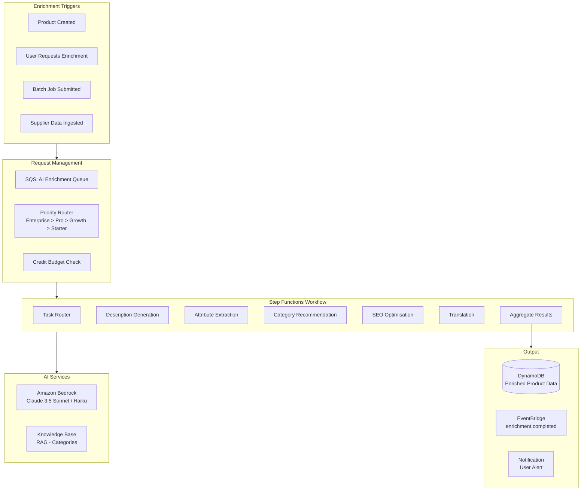
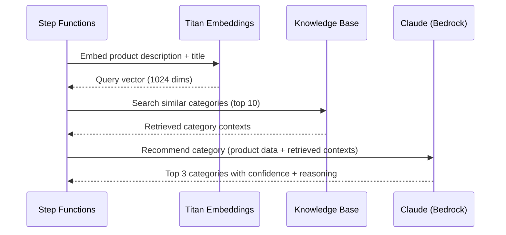
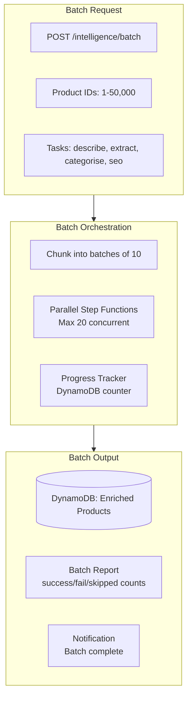

# MerchOS Engineering Blueprint

## Volume 09 — Product Intelligence Engine

---

| Field | Value |
|-------|-------|
| **Document ID** | MERCH-009 |
| **Title** | Product Intelligence Engine |
| **Version** | 0.1 |
| **Status** | Draft |
| **Owner** | Wadzanai Maparura |
| **Technical Lead** | Kiro AI |
| **Created** | 2026-06-27 |
| **Last Updated** | 2026-06-27 |
| **Next Review** | 2026-07-11 |
| **Classification** | Internal — Confidential |
| **Related Documents** | MERCH-007 (AI Architecture), MERCH-008 (Marketplace Intelligence), MERCH-010 (Image Intelligence) |

---

## Revision History

| Version | Date | Author | Change Description |
|---------|------|--------|-------------------|
| 0.1 | 2026-06-27 | Kiro AI / Wadzanai Maparura | Initial draft |

---

## Table of Contents

1. [Purpose](#1-purpose)
2. [Scope](#2-scope)
3. [Engine Architecture](#3-engine-architecture)
4. [Description Generation](#4-description-generation)
5. [Attribute Extraction](#5-attribute-extraction)
6. [Category Recommendation](#6-category-recommendation)
7. [SEO Optimisation](#7-seo-optimisation)
8. [Translation](#8-translation)
9. [Batch Processing](#9-batch-processing)
10. [Quality Assurance](#10-quality-assurance)
11. [Integration Points](#11-integration-points)
12. [Assumptions](#12-assumptions)
13. [Dependencies](#13-dependencies)
14. [References](#14-references)

---


## 1. Purpose

This document defines the Product Intelligence Engine (PIE) — the AI-powered system responsible for enriching product data through description generation, attribute extraction, category recommendation, SEO optimisation, and translation.

---

## 2. Scope

Covers: Engine architecture, each AI capability in detail (inputs, outputs, prompts, quality targets), batch processing, quality assurance, and integration points. Excludes image-specific intelligence (covered in MERCH-010).

---

## 3. Engine Architecture



### 3.1 Component Responsibilities

| Component | Responsibility |
|-----------|---------------|
| SQS Queue | Buffer requests; handle backpressure; ensure no request lost |
| Priority Router | Order processing by tenant tier; Enterprise first |
| Credit Budget Check | Verify tenant has available AI credits before processing |
| Step Functions Workflow | Orchestrate multi-step enrichment; handle retry/failure |
| Task Router | Determine which AI tasks to run based on product state and request |
| Bedrock (Claude) | LLM inference for text generation and extraction |
| Knowledge Base (RAG) | Category taxonomy retrieval for grounded recommendations |
| Aggregator | Combine results from multiple AI tasks; calculate composite confidence |

### 3.2 Enrichment Task Selection

| Product State | Tasks Executed | Rationale |
|---------------|---------------|-----------|
| New product (minimal data) | Extract → Describe → Categorise → SEO | Full enrichment pipeline |
| Product with description but no attributes | Extract → Categorise | Fill gaps only |
| Product with all fields but no SEO | SEO only | Optimise existing content |
| Re-enrichment request (user override) | User-selected tasks | Targeted re-processing |
| Translation request | Translate only | Language-specific |

---

## 4. Description Generation

### 4.1 Overview

| Attribute | Detail |
|-----------|--------|
| **Purpose** | Generate marketplace-ready product descriptions from raw/minimal product data |
| **AWS Service** | Amazon Bedrock (Claude 3.5 Sonnet) |
| **Input** | Product title, attributes, category, brand, images (labels from IIE), marketplace target |
| **Output** | Generated description (marketplace-specific format) + confidence score |
| **Latency Target** | < 10 seconds (p95) |
| **Quality Target** | > 70% acceptance rate without edit |

### 4.2 Input/Output Schema

**Input:**
```json
{
  "productId": "p_abc123",
  "tenantId": "t_xyz789",
  "title": "Samsung Galaxy S24 Ultra 256GB",
  "brand": "Samsung",
  "category": "Electronics > Smartphones",
  "existingAttributes": { "storage": "256GB", "colour": "Titanium Black" },
  "imageLabels": ["smartphone", "Samsung logo", "camera array"],
  "targetMarketplace": "takealot",
  "marketplaceConstraints": { "maxLength": 5000, "htmlAllowed": true },
  "tenantPreferences": { "tone": "professional", "language": "en" }
}
```

**Output:**
```json
{
  "description": "<p>Experience the pinnacle of smartphone innovation with the Samsung Galaxy S24 Ultra...</p>",
  "confidence": 0.87,
  "tokenUsage": { "input": 1200, "output": 800 },
  "modelVersion": "anthropic.claude-3-5-sonnet-20241022-v2:0",
  "metadata": {
    "wordCount": 245,
    "readabilityScore": 72,
    "keywordsIncluded": ["Samsung", "Galaxy S24 Ultra", "256GB", "smartphone"]
  }
}
```

### 4.3 Generation Strategies

| Strategy | When Used | Approach |
|----------|-----------|----------|
| Full generation | No existing description | Generate from scratch using all available product data |
| Enhancement | Short/low-quality description exists | Expand and improve while preserving key facts |
| Adaptation | Description exists but for wrong marketplace | Reformat for target marketplace (length, HTML, tone) |
| Variant generation | Multiple marketplaces from one product | Generate marketplace-specific versions in parallel |

### 4.4 Quality Controls

| Control | Implementation |
|---------|---------------|
| Length validation | Output must be within marketplace limits (auto-truncation if exceeded) |
| Fact verification | No specifications generated that aren't in input data |
| Brand voice | Tenant-configurable tone (professional, casual, technical) |
| Forbidden content | No competitor mentions, no unsubstantiated claims |
| Readability | Flesch-Kincaid score monitored; target: 60–70 |
| Uniqueness | No verbatim copying from input; original composition required |

---

## 5. Attribute Extraction

### 5.1 Overview

| Attribute | Detail |
|-----------|--------|
| **Purpose** | Extract structured product attributes from unstructured text (supplier descriptions, OCR output) |
| **AWS Service** | Amazon Bedrock (Claude 3.5 Sonnet) |
| **Input** | Raw text (supplier description, OCR text, product title), target attribute schema |
| **Output** | Structured key-value attributes with per-attribute confidence |
| **Latency Target** | < 8 seconds (p95) |
| **Quality Target** | > 85% extraction accuracy on known attributes |

### 5.2 Input/Output Schema

**Input:**
```json
{
  "productId": "p_abc123",
  "rawText": "Samsung Galaxy S24 Ultra. 6.8-inch Dynamic AMOLED 2X, 200MP camera, 12GB RAM, 256GB storage, 5000mAh battery, Titanium frame, IP68, S Pen built-in. Available in Titanium Black.",
  "ocrText": "Model: SM-S928B/DS\nStorage: 256GB\nColour: Titanium Black",
  "targetSchema": [
    { "name": "brand", "type": "string", "required": true },
    { "name": "model", "type": "string", "required": true },
    { "name": "storage", "type": "string", "required": true },
    { "name": "ram", "type": "string", "required": false },
    { "name": "screen_size", "type": "string", "required": true },
    { "name": "battery", "type": "string", "required": false },
    { "name": "colour", "type": "string", "required": true }
  ]
}
```

**Output:**
```json
{
  "attributes": [
    { "name": "brand", "value": "Samsung", "confidence": 0.99, "source": "rawText" },
    { "name": "model", "value": "Galaxy S24 Ultra", "confidence": 0.98, "source": "rawText" },
    { "name": "storage", "value": "256GB", "confidence": 0.99, "source": "ocrText" },
    { "name": "ram", "value": "12GB", "confidence": 0.95, "source": "rawText" },
    { "name": "screen_size", "value": "6.8 inches", "confidence": 0.97, "source": "rawText" },
    { "name": "battery", "value": "5000mAh", "confidence": 0.96, "source": "rawText" },
    { "name": "colour", "value": "Titanium Black", "confidence": 0.99, "source": "both" }
  ],
  "unmatched": ["camera: 200MP", "frame: Titanium", "waterproof: IP68", "stylus: S Pen"],
  "completeness": 1.0,
  "overallConfidence": 0.97
}
```

### 5.3 Extraction Strategies

| Source | Strategy | Challenges |
|--------|----------|-----------|
| Supplier product description | NLP extraction; schema-guided parsing | Inconsistent formatting; multiple languages |
| OCR output (from Textract) | Structured text parsing; key-value extraction | OCR errors; layout complexity |
| Product title | Pattern matching + NLP | Limited information density |
| Combined sources | Multi-source fusion; highest-confidence wins | Conflicting values between sources |

### 5.4 Conflict Resolution

When multiple sources provide different values for the same attribute:

| Scenario | Resolution |
|----------|-----------|
| OCR and text agree | Use value with highest confidence; combined confidence boosted |
| OCR and text conflict | Flag for human review; present both options |
| Multiple mentions (same source) | Use most specific/detailed mention |
| Value partially extracted | Attempt completion; flag low confidence if ambiguous |

---

## 6. Category Recommendation

### 6.1 Overview

| Attribute | Detail |
|-----------|--------|
| **Purpose** | Recommend correct marketplace category from product data |
| **AWS Service** | Amazon Bedrock (Claude 3.5 Sonnet) + Bedrock Knowledge Base (RAG) |
| **Input** | Product title, attributes, brand, description, target marketplace |
| **Output** | Top 3 category recommendations with confidence + reasoning |
| **Latency Target** | < 8 seconds (p95) |
| **Quality Target** | Correct category in top 3 > 90% of the time |

### 6.2 RAG-Enhanced Recommendation Flow



### 6.3 Output Schema

```json
{
  "recommendations": [
    {
      "rank": 1,
      "categoryPath": "Electronics > Cell Phones > Smartphones",
      "categoryId": "cat_12345",
      "confidence": 0.92,
      "reasoning": "Product is identified as a Samsung smartphone (Galaxy S24 Ultra) with mobile phone specifications including storage, RAM, and screen size."
    },
    {
      "rank": 2,
      "categoryPath": "Electronics > Cell Phones > Phablets",
      "categoryId": "cat_12346",
      "confidence": 0.65,
      "reasoning": "6.8-inch screen size places this at the phablet boundary, but S24 Ultra is primarily marketed as a smartphone."
    },
    {
      "rank": 3,
      "categoryPath": "Electronics > Tablets > Android Tablets",
      "categoryId": "cat_22345",
      "confidence": 0.12,
      "reasoning": "Large screen and S Pen could indicate tablet, but RAM/storage/camera specs confirm smartphone."
    }
  ],
  "marketplace": "takealot",
  "overallConfidence": 0.92
}
```

---

## 7. SEO Optimisation

### 7.1 Overview

| Attribute | Detail |
|-----------|--------|
| **Purpose** | Optimise product content for marketplace search visibility |
| **AWS Service** | Amazon Bedrock (Claude 3.5 Sonnet) |
| **Input** | Current product title, description, attributes, target marketplace |
| **Output** | Optimised title, description with keywords, search terms, bullet points |
| **Latency Target** | < 10 seconds (p95) |
| **Quality Target** | Keyword coverage > 80%; no keyword stuffing |

### 7.2 SEO Tasks

| Task | Input | Output | Marketplace Rules |
|------|-------|--------|-------------------|
| Title optimisation | Current title + attributes | Optimised title (brand + model + key attrs) | Takealot: 150 chars; Amazon: 200 chars |
| Keyword extraction | Description + category | Primary + secondary keywords | Marketplace-specific search behaviour |
| Bullet point generation | Attributes + description | 5 feature bullet points | Amazon: 500 chars each; Takealot: 200 chars |
| Search terms | Product data + category | Hidden search keywords | Amazon: 250 chars; no brand names |
| Description enrichment | Existing description | SEO-enhanced description | Natural keyword inclusion; no stuffing |

### 7.3 SEO Quality Rules

| Rule | Enforcement |
|------|-------------|
| No keyword stuffing | Keyword density < 3%; natural language required |
| Brand in title (position 1) | Title formula: Brand + Model + Key Attribute + Variant |
| No superlatives without proof | "Best", "#1", "Cheapest" blocked by validation |
| Marketplace-specific keywords | Use marketplace search data (if available) |
| Mobile-optimised descriptions | Key info in first 200 characters (mobile truncation) |

---

## 8. Translation

### 8.1 Overview

| Attribute | Detail |
|-----------|--------|
| **Purpose** | Translate product content between languages while preserving commercial intent |
| **AWS Service** | Amazon Bedrock (Claude 3.5 Sonnet) |
| **Input** | Source text, source language, target language, product context |
| **Output** | Translated text with quality indicators |
| **Latency Target** | < 12 seconds (p95) |
| **Supported Languages** | English, Afrikaans, Zulu (Phase 1); expandable |

### 8.2 Translation Rules

| Rule | Implementation |
|------|---------------|
| Preserve brand names | Never translate brand names, model numbers, or technical terms |
| Maintain formatting | HTML structure, bullet points, and paragraphs preserved |
| Cultural adaptation | Localise units (e.g., cm vs inches) and cultural references |
| SEO preservation | Maintain keyword relevance in target language |
| Character limits | Respect marketplace character limits in target language |
| Terminology consistency | Use consistent translations for technical terms across products |

---

## 9. Batch Processing

### 9.1 Batch Architecture



### 9.2 Batch Constraints

| Constraint | Value | Rationale |
|-----------|-------|-----------|
| Max products per batch | 50,000 | Tenant tier dependent; prevents resource monopolisation |
| Max concurrent enrichments per tenant | 20 | Fair resource sharing across tenants |
| Max concurrent enrichments (platform) | 200 | Bedrock rate limits + Lambda concurrency |
| Batch timeout | 4 hours | Prevent runaway jobs |
| Credit check | Pre-validated for entire batch | Fail fast if insufficient credits |
| Retry per product | 2 attempts | Transient failures recovered; persistent failures logged |

### 9.3 Batch Priority

| Tier | Max Concurrency | Queue Priority | Estimated Throughput |
|------|----------------|----------------|---------------------|
| Enterprise | 20 parallel | Highest | ~120 products/min |
| Professional | 10 parallel | High | ~60 products/min |
| Growth | 5 parallel | Medium | ~30 products/min |
| Starter | 2 parallel | Low | ~12 products/min |

---

## 10. Quality Assurance

### 10.1 Quality Gates

| Gate | Check | Action on Failure |
|------|-------|-------------------|
| Schema validation | Output matches expected JSON schema | Retry with adjusted parameters |
| Confidence threshold | Overall confidence ≥ 0.5 | Flag for manual review |
| Content safety | No harmful/inappropriate content | Block; log; alert |
| Fact checking | No attributes hallucinated beyond input | Remove ungrounded claims |
| Length compliance | Within marketplace character limits | Truncate or regenerate |
| Language detection | Output in correct language | Regenerate with explicit language instruction |

### 10.2 Feedback Integration

| Signal | Collection Method | Usage |
|--------|------------------|-------|
| User accepts suggestion | Click tracking (accept button) | Positive signal — reinforce approach |
| User edits suggestion | Diff tracking (before/after) | Correction signal — identify patterns |
| User rejects suggestion | Click tracking (reject button) | Negative signal — flag prompt issue |
| Export validation pass | Validation engine result | Quality confirmation |
| Export validation fail | Validation engine errors | AI output quality issue |

### 10.3 Continuous Improvement

| Activity | Frequency | Output |
|----------|-----------|--------|
| Acceptance rate monitoring | Daily | Dashboard metric; alarm if < 50% |
| Prompt regression testing | On every prompt change | Pass/fail against evaluation set |
| User correction analysis | Weekly | Prompt adjustment recommendations |
| Model comparison (A/B) | On model update | Statistical quality comparison |
| Manual evaluation | Monthly | Human-reviewed sample (100 products) |

---

## 11. Integration Points

### 11.1 Inbound (Consumed)

| Source | Data | Trigger |
|--------|------|---------|
| Product Hub | Raw product data (title, attributes, media refs) | product.created / user request |
| Image Intelligence Engine | Image labels, OCR text, quality scores | image.analysed event |
| Marketplace Intelligence | Target schemas, category taxonomies, constraints | On enrichment (queried) |
| Supplier Intelligence | Normalised supplier data | supplier.data.normalised event |
| Tenant Configuration | Tone, language, brand preferences | On enrichment (queried) |

### 11.2 Outbound (Produced)

| Target | Data | Method |
|--------|------|--------|
| Product Hub | Enriched descriptions, extracted attributes, category | DynamoDB write (draft status) |
| EventBridge | enrichment.completed / enrichment.failed events | Event publication |
| Notification Service | User notification (enrichment ready for review) | Via EventBridge |
| Analytics | AI usage metrics (tokens, latency, confidence) | CloudWatch custom metrics |
| Export Engine | Marketplace-ready product data (after approval) | Via Product Hub |

### 11.3 Event Schema

```json
{
  "source": "merchos.product-intelligence",
  "detail-type": "enrichment.completed",
  "detail": {
    "tenantId": "t_xyz789",
    "productId": "p_abc123",
    "tasks": ["describe", "extract", "categorise"],
    "overallConfidence": 0.89,
    "tokensUsed": { "input": 4500, "output": 3200 },
    "creditsConsumed": 1,
    "duration_ms": 8500,
    "status": "success"
  }
}
```

---

## 12. Assumptions

| # | Assumption | Impact if Invalid |
|---|-----------|-------------------|
| A1 | Claude 3.5 Sonnet provides sufficient quality for all text tasks | Need specialised models or fine-tuning |
| A2 | Structured JSON output from LLM is reliable | Need output parsing/retry logic (already implemented) |
| A3 | RAG provides better category accuracy than LLM alone | May simplify to direct LLM categorisation |
| A4 | User correction feedback improves quality over time | Need formal evaluation to prove ROI |
| A5 | Batch processing completes within 4-hour window for 50K products | May need increased parallelism or faster models |

---

## 13. Dependencies

| Dependency | Impact |
|-----------|--------|
| Amazon Bedrock (Claude 3.5 Sonnet) | Core AI capability |
| Bedrock Knowledge Base | RAG for category recommendation |
| Image Intelligence Engine (MERCH-010) | Image labels and OCR text as input |
| Marketplace Intelligence (MERCH-008) | Category taxonomies and constraints |
| Product Hub | Product data source and enrichment target |
| AWS Step Functions | Workflow orchestration |
| Amazon SQS | Request buffering and prioritisation |

---

## 14. References

| # | Reference |
|---|-----------|
| 1 | MERCH-007 (AI Architecture) |
| 2 | MERCH-008 (Marketplace Intelligence Engine) |
| 3 | MERCH-010 (Image Intelligence Engine) |
| 4 | Amazon Bedrock InvokeModel API Reference |
| 5 | Anthropic Prompt Engineering Guide |
| 6 | AWS Step Functions Developer Guide |

---

*End of Volume 09 — Product Intelligence Engine*

*Previous: Volume 08 — Marketplace Intelligence Engine (MERCH-008)*
*Next: Volume 10 — Image Intelligence Engine (MERCH-010)*
