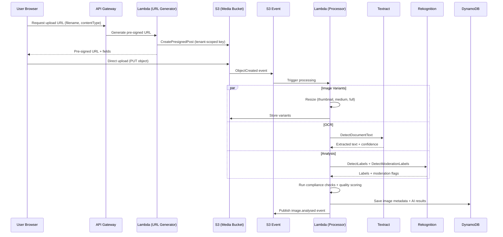

# MerchOS Engineering Blueprint

## Volume 10 — Image Intelligence Engine

---

| Field | Value |
|-------|-------|
| **Document ID** | MERCH-010 |
| **Title** | Image Intelligence Engine |
| **Version** | 0.1 |
| **Status** | Draft |
| **Owner** | Wadzanai Maparura |
| **Technical Lead** | Kiro AI |
| **Created** | 2026-06-27 |
| **Last Updated** | 2026-06-27 |
| **Next Review** | 2026-07-11 |
| **Classification** | Internal — Confidential |
| **Related Documents** | MERCH-007 (AI Architecture), MERCH-009 (Product Intelligence), MERCH-005 (AWS Architecture) |

---

## Revision History

| Version | Date | Author | Change Description |
|---------|------|--------|-------------------|
| 0.1 | 2026-06-27 | Kiro AI / Wadzanai Maparura | Initial draft |

---

## Table of Contents

1. [Purpose](#1-purpose)
2. [Scope](#2-scope)
3. [Engine Architecture](#3-engine-architecture)
4. [Image Upload & Storage](#4-image-upload--storage)
5. [OCR Processing (Textract)](#5-ocr-processing-textract)
6. [Image Analysis (Rekognition)](#6-image-analysis-rekognition)
7. [Marketplace Compliance Checking](#7-marketplace-compliance-checking)
8. [Image Processing & Transformation](#8-image-processing--transformation)
9. [Quality Scoring](#9-quality-scoring)
10. [Integration Points](#10-integration-points)
11. [Assumptions](#11-assumptions)
12. [Dependencies](#12-dependencies)
13. [References](#13-references)

---


## 1. Purpose

This document defines the Image Intelligence Engine (IIE) — the system responsible for all image-related AI processing: OCR text extraction, image analysis and labelling, marketplace compliance validation, image quality scoring, and image transformation.

---

## 2. Scope

Covers: Image upload pipeline, OCR via Amazon Textract, image analysis via Amazon Rekognition, marketplace-specific compliance checking, image transformation (resize, background removal), quality scoring, and integration with Product Intelligence Engine. Excludes text-based AI (covered in MERCH-009).

---

## 3. Engine Architecture

```mermaid
graph TB
    subgraph Upload["Image Upload"]
        BROWSER[Browser Direct Upload<br/>Pre-signed URL]
        SUPPLIER[Supplier File Ingestion<br/>Bulk images]
    end

    subgraph Storage["Image Storage (S3)"]
        ORIGINAL[(Original Images<br/>merchos-{env}-media/{tenantId}/originals/)]
        VARIANTS[(Processed Variants<br/>merchos-{env}-media/{tenantId}/variants/)]
    end

    subgraph Processing["Image Processing Pipeline"]
        TRIGGER[S3 Event Trigger]
        LAMBDA[Lambda: Image Processor]
        RESIZE[Resize & Optimise]
        THUMB[Generate Thumbnails]
    end

    subgraph Intelligence["Image Intelligence"]
        TEXTRACT[Amazon Textract<br/>OCR]
        REKOG[Amazon Rekognition<br/>Labels + Moderation]
        COMPLIANCE[Compliance Checker<br/>Marketplace rules]
        QUALITY[Quality Scorer]
    end

    subgraph Output["Results"]
        DDB[(DynamoDB<br/>Image metadata + AI results)]
        EVENT[EventBridge<br/>image.analysed]
        PIE[Product Intelligence Engine<br/>Labels + OCR text]
    end

    Upload --> Storage
    Storage --> TRIGGER --> Processing
    TRIGGER --> Intelligence
    Processing --> VARIANTS
    Intelligence --> Output
```

### 3.1 Processing Pipeline Flow



---

## 4. Image Upload & Storage

### 4.1 Upload Flow

| Step | Method | Details |
|------|--------|---------|
| 1. Request upload URL | `POST /images/upload-url` | Returns pre-signed S3 URL (15-min expiry) |
| 2. Client uploads directly to S3 | HTTP PUT to pre-signed URL | Bypasses API Gateway (no 10MB limit) |
| 3. S3 event triggers processing | S3 ObjectCreated notification | Automatic; no polling |
| 4. Processing pipeline executes | Lambda (triggered by S3 event) | Parallel: resize + OCR + analysis |
| 5. Results stored | DynamoDB + S3 | Metadata in DB; variants in S3 |

### 4.2 Storage Architecture

| Path Pattern | Content | Lifecycle |
|-------------|---------|-----------|
| `{tenantId}/originals/{productId}/{imageId}.{ext}` | Original uploaded image | Indefinite (while product active) |
| `{tenantId}/variants/{productId}/{imageId}/thumb.webp` | Thumbnail (200×200) | Regeneratable; delete on product delete |
| `{tenantId}/variants/{productId}/{imageId}/medium.webp` | Medium (800×800) | Regeneratable |
| `{tenantId}/variants/{productId}/{imageId}/full.webp` | Full quality (original size, optimised) | Regeneratable |
| `{tenantId}/variants/{productId}/{imageId}/marketplace/{mktId}.jpg` | Marketplace-specific variant | Generated on export |

### 4.3 Upload Constraints

| Constraint | Value |
|-----------|-------|
| Max file size | 10MB |
| Accepted formats | JPEG, PNG, WebP, TIFF |
| Max images per product | 12 |
| Max resolution | 10,000 × 10,000 pixels |
| Min resolution | 200 × 200 pixels |
| Naming | System-generated UUID (original filename stored as metadata) |

---

## 5. OCR Processing (Textract)

### 5.1 Overview

| Attribute | Detail |
|-----------|--------|
| **Purpose** | Extract text from product images (labels, packaging, specifications) |
| **AWS Service** | Amazon Textract (DetectDocumentText, AnalyzeDocument) |
| **Input** | S3 object reference (original image) |
| **Output** | Extracted text blocks with confidence, bounding boxes, and structure |
| **Latency** | < 5 seconds (sync) for single page; async for multi-page |

### 5.2 Processing Modes

| Mode | API | Use Case | Trigger |
|------|-----|----------|---------|
| Quick OCR | DetectDocumentText | Product images with text (labels, specs) | All uploaded images |
| Document Analysis | AnalyzeDocument (TABLES, FORMS) | Supplier PDFs, invoices, catalogues | Supplier file ingestion |
| Async Processing | StartDocumentTextDetection | Multi-page documents (> 1 page) | Large supplier documents |

### 5.3 Output Schema

```json
{
  "imageId": "img_abc123",
  "productId": "p_def456",
  "ocrResult": {
    "rawText": "Samsung Galaxy S24 Ultra\n256GB | Titanium Black\nModel: SM-S928B/DS",
    "blocks": [
      {
        "text": "Samsung Galaxy S24 Ultra",
        "confidence": 0.98,
        "type": "LINE",
        "boundingBox": { "top": 0.1, "left": 0.2, "width": 0.6, "height": 0.05 }
      },
      {
        "text": "256GB | Titanium Black",
        "confidence": 0.95,
        "type": "LINE",
        "boundingBox": { "top": 0.17, "left": 0.25, "width": 0.5, "height": 0.04 }
      }
    ],
    "tables": [],
    "keyValuePairs": [
      { "key": "Model", "value": "SM-S928B/DS", "confidence": 0.92 }
    ],
    "overallConfidence": 0.95,
    "language": "en",
    "pageCount": 1
  },
  "processingTime_ms": 2300
}
```

### 5.4 OCR Quality Handling

| Scenario | Strategy |
|----------|----------|
| Low confidence (< 0.7) | Flag for manual review; include in product with warning |
| No text detected | Skip OCR results; don't flag as error (image may have no text) |
| Multiple languages detected | Process all; tag language per block |
| Rotated/skewed text | Textract handles automatically; no pre-processing needed |
| Handwritten text | Lower confidence expected; flag for review if < 0.5 |

---

## 6. Image Analysis (Rekognition)

### 6.1 Overview

| Attribute | Detail |
|-----------|--------|
| **Purpose** | Identify product type, detect content issues, analyse image quality |
| **AWS Service** | Amazon Rekognition (DetectLabels, DetectModerationLabels, DetectText) |
| **Input** | S3 object reference (original image) |
| **Output** | Labels with confidence, moderation flags, text regions |
| **Latency** | < 3 seconds per image |

### 6.2 Analysis Tasks

| Task | Rekognition API | Purpose | Output |
|------|----------------|---------|--------|
| Label Detection | DetectLabels | Identify objects, scenes, concepts | Labels: "Phone", "Electronics", "Samsung" |
| Content Moderation | DetectModerationLabels | Detect inappropriate content | Moderation categories + confidence |
| Text Detection | DetectText | Find text overlays / watermarks | Text regions + bounding boxes |
| Face Detection | DetectFaces (optional) | Detect faces for lifestyle images | Face count + positions |

### 6.3 Label Output Schema

```json
{
  "imageId": "img_abc123",
  "analysisResult": {
    "labels": [
      { "name": "Phone", "confidence": 98.5, "parents": ["Electronics"] },
      { "name": "Cell Phone", "confidence": 97.2, "parents": ["Phone", "Electronics"] },
      { "name": "Mobile Phone", "confidence": 96.8, "parents": ["Phone"] },
      { "name": "Electronics", "confidence": 95.1, "parents": [] },
      { "name": "Camera", "confidence": 72.3, "parents": ["Electronics"] }
    ],
    "moderation": {
      "flagged": false,
      "labels": []
    },
    "textRegions": [
      { "text": "Samsung", "confidence": 99.1, "type": "WORD" },
      { "text": "GALAXY", "confidence": 97.8, "type": "WORD" }
    ],
    "dominantColors": ["#1a1a2e", "#c4c4c4", "#ffffff"],
    "imageProperties": {
      "quality": { "brightness": 72, "sharpness": 85 },
      "orientation": "ROTATE_0"
    }
  }
}
```

### 6.4 Label-to-Category Mapping

Rekognition labels feed into Product Intelligence Engine for category recommendation:

| Rekognition Labels | Likely Category | Confidence Boost |
|-------------------|----------------|-----------------|
| Phone, Cell Phone, Mobile Phone | Electronics > Smartphones | +0.15 |
| Laptop, Computer, Notebook | Electronics > Computers > Laptops | +0.15 |
| Shoe, Footwear, Sneaker | Fashion > Shoes | +0.12 |
| Furniture, Table, Chair | Home > Furniture | +0.10 |
| Toy, Game, Plaything | Baby & Kids > Toys | +0.10 |

---

## 7. Marketplace Compliance Checking

### 7.1 Compliance Rules Engine

```mermaid
graph TB
    subgraph Input["Image + Marketplace"]
        IMG[Uploaded Image]
        MKT[Target Marketplace Rules]
    end

    subgraph Checks["Compliance Checks"]
        DIM[Dimension Check<br/>Min resolution met?]
        SIZE[File Size Check<br/>Under max size?]
        FORMAT[Format Check<br/>Accepted format?]
        BG[Background Check<br/>White background? (if required)]
        WM[Watermark Detection<br/>Text overlays present?]
        CONTENT[Content Moderation<br/>Appropriate content?]
        FILL[Product Fill Check<br/>Product fills 85%+ of frame?]
    end

    subgraph Output["Compliance Result"]
        PASS[PASS - Marketplace ready]
        WARN[WARNING - Minor issues]
        FAIL[FAIL - Must fix before export]
    end

    Input --> Checks --> Output
```

### 7.2 Per-Marketplace Rules

| Check | Takealot | Amazon | Makro | Shopify | WooCommerce |
|-------|----------|--------|-------|---------|-------------|
| Min resolution | 1000×1000 | 1000×1000 (1600 recommended) | 800×800 | None (recommended 2048) | None (recommended 1000) |
| Max file size | 5MB | 10MB | 5MB | 20MB | Host-dependent |
| White background (primary) | Required | Required (pure RGB 255,255,255) | Preferred | Not required | Not required |
| Watermark/text overlay | Not allowed | Not allowed | Not allowed | Allowed | Allowed |
| Product fill (primary) | 80%+ | 85%+ | 70%+ | Not enforced | Not enforced |
| Content moderation | Required | Required | Required | Store owner responsibility | Store owner responsibility |
| Max images | 8 | 9 | 5 | 250 | Unlimited |
| Format | JPEG, PNG | JPEG, PNG, GIF, TIFF | JPEG, PNG | JPEG, PNG, GIF, WebP | JPEG, PNG, GIF, WebP |

### 7.3 Compliance Output

```json
{
  "imageId": "img_abc123",
  "marketplace": "takealot",
  "overallStatus": "WARNING",
  "checks": [
    { "check": "dimensions", "status": "PASS", "detail": "2400×2400 exceeds minimum 1000×1000" },
    { "check": "fileSize", "status": "PASS", "detail": "1.2MB under 5MB limit" },
    { "check": "format", "status": "PASS", "detail": "JPEG is accepted" },
    { "check": "background", "status": "WARNING", "detail": "Background is light grey (#f0f0f0), not pure white. Consider editing." },
    { "check": "watermark", "status": "PASS", "detail": "No text overlays detected" },
    { "check": "moderation", "status": "PASS", "detail": "No inappropriate content" },
    { "check": "productFill", "status": "PASS", "detail": "Product fills approximately 82% of frame" }
  ],
  "score": 90,
  "recommendations": [
    "Consider replacing background with pure white for optimal Takealot compliance"
  ]
}
```

---

## 8. Image Processing & Transformation

### 8.1 Automatic Transformations (On Upload)

| Transformation | Input | Output | Purpose |
|---------------|-------|--------|---------|
| Thumbnail generation | Original | 200×200 WebP (fit, pad white) | UI previews, list views |
| Medium variant | Original | 800×800 WebP (fit, pad white) | Product detail page |
| Full optimised | Original | Original dimensions, WebP (quality 85) | Full-size viewing |
| EXIF stripping | Original | Clean metadata | Privacy + consistency |
| Orientation correction | EXIF rotation data | Correctly oriented image | Display correctness |

### 8.2 On-Demand Transformations

| Transformation | Trigger | Purpose |
|---------------|---------|---------|
| Marketplace-specific resize | Export to specific marketplace | Meet marketplace dimension requirements |
| Background removal | User request (P2 feature) | Clean white background for marketplaces |
| Format conversion | Export requirement | Convert WebP → JPEG/PNG for marketplace compatibility |
| Compression | File size exceeds marketplace limit | Reduce file size while maintaining quality |

### 8.3 Background Removal (Phase 2)

| Attribute | Detail |
|-----------|--------|
| **Purpose** | Remove background and replace with pure white for marketplace compliance |
| **Method** | Lambda + Sharp library (initial); potential upgrade to ML-based (Bedrock/custom) |
| **Trigger** | User-initiated; or automated when compliance check fails on background |
| **Output** | New image variant with white background |
| **Quality** | Preview before saving; user approval required |

---

## 9. Quality Scoring

### 9.1 Image Quality Score (0–100)

| Factor | Weight | Measurement | Source |
|--------|--------|-------------|--------|
| Resolution | 25% | Pixels relative to marketplace minimum | Image metadata |
| Sharpness | 20% | Rekognition image quality (sharpness) | Rekognition |
| Brightness | 15% | Rekognition image quality (brightness) | Rekognition |
| Background compliance | 15% | White background detection | Custom analysis |
| Product fill | 15% | Percentage of frame occupied by product | Custom analysis |
| No watermarks/text | 10% | Text detection result (none = good) | Rekognition DetectText |

### 9.2 Quality Score Bands

| Score | Rating | Action |
|-------|--------|--------|
| 90–100 | Excellent | Ready for any marketplace |
| 75–89 | Good | Ready with minor recommendations |
| 50–74 | Fair | Usable but improvements recommended |
| 25–49 | Poor | May fail marketplace validation |
| 0–24 | Unusable | Must replace before export |

---

## 10. Integration Points

### 10.1 Inbound

| Source | Data | Trigger |
|--------|------|---------|
| User upload | Product images | Pre-signed URL upload to S3 |
| Supplier ingestion | Bulk product images | S3 batch upload from supplier files |
| Product Hub | Image association with products | API call (associate image to product) |
| Marketplace Intelligence | Per-marketplace image requirements | Queried during compliance check |

### 10.2 Outbound

| Target | Data | Method |
|--------|------|--------|
| Product Intelligence Engine | Labels, OCR text, quality score | EventBridge event (image.analysed) |
| Product Hub | Image metadata, variants, compliance status | DynamoDB write |
| Export Engine | Marketplace-ready image URLs | Queried during export |
| Frontend | Thumbnail URLs, quality scores, compliance status | API response |

### 10.3 Events Published

| Event | Detail |
|-------|--------|
| `image.uploaded` | Image stored in S3; processing initiated |
| `image.processed` | Variants generated; metadata extracted |
| `image.analysed` | OCR + Rekognition complete; labels and text available |
| `image.compliance.checked` | Marketplace compliance evaluation complete |
| `image.quality.scored` | Quality score calculated |

---

## 11. Assumptions

| # | Assumption | Impact if Invalid |
|---|-----------|-------------------|
| A1 | Rekognition available in af-south-1 | Cross-region calls (latency) or alternative service |
| A2 | Sharp library sufficient for image transformations | Need dedicated image processing service |
| A3 | White background detection achievable via colour analysis | Need ML-based background segmentation |
| A4 | Pre-signed URL upload handles all file sizes (up to 10MB) | Need multipart upload for larger files |
| A5 | Rekognition labels are consistent enough for category hints | Reduce reliance on image-based categorisation |

---

## 12. Dependencies

| Dependency | Impact |
|-----------|--------|
| Amazon Textract | OCR capability |
| Amazon Rekognition | Label detection, moderation, text detection |
| Amazon S3 | Image storage and event triggers |
| Sharp (npm library) | Image resizing and format conversion in Lambda |
| Product Intelligence Engine (MERCH-009) | Consumes OCR text and labels |
| Marketplace Intelligence (MERCH-008) | Image requirement rules per marketplace |

---

## 13. References

| # | Reference |
|---|-----------|
| 1 | Amazon Textract Developer Guide |
| 2 | Amazon Rekognition Developer Guide |
| 3 | Sharp Image Processing Library Documentation |
| 4 | MERCH-007 (AI Architecture) |
| 5 | MERCH-008 (Marketplace Intelligence — Image Requirements) |
| 6 | MERCH-009 (Product Intelligence Engine — integration) |

---

*End of Volume 10 — Image Intelligence Engine*

*Previous: Volume 09 — Product Intelligence Engine (MERCH-009)*
*Next: Volume 11 — Supplier Intelligence (MERCH-011)*
