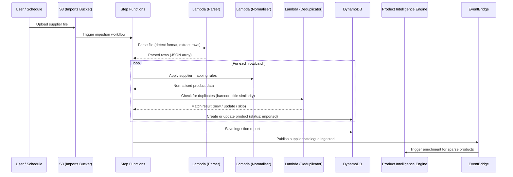
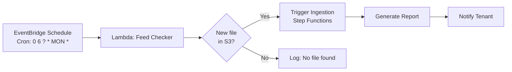

# MerchOS Engineering Blueprint

## Volume 11 — Supplier Intelligence

---

| Field | Value |
|-------|-------|
| **Document ID** | MERCH-011 |
| **Title** | Supplier Intelligence |
| **Version** | 0.1 |
| **Status** | Draft |
| **Owner** | Wadzanai Maparura |
| **Technical Lead** | Kiro AI |
| **Created** | 2026-06-27 |
| **Last Updated** | 2026-06-27 |
| **Next Review** | 2026-07-11 |
| **Classification** | Internal — Confidential |
| **Related Documents** | MERCH-009 (Product Intelligence), MERCH-010 (Image Intelligence), MERCH-014 (Database Design) |

---

## Revision History

| Version | Date | Author | Change Description |
|---------|------|--------|-------------------|
| 0.1 | 2026-06-27 | Kiro AI / Wadzanai Maparura | Initial draft |

---

## Table of Contents

1. [Purpose](#1-purpose)
2. [Scope](#2-scope)
3. [Engine Architecture](#3-engine-architecture)
4. [Supplier Onboarding](#4-supplier-onboarding)
5. [Catalogue Ingestion](#5-catalogue-ingestion)
6. [Data Normalisation](#6-data-normalisation)
7. [Deduplication](#7-deduplication)
8. [Quality Scoring](#8-quality-scoring)
9. [Price Tracking](#9-price-tracking)
10. [Scheduled Feeds](#10-scheduled-feeds)
11. [Integration Points](#11-integration-points)
12. [Assumptions](#12-assumptions)
13. [Dependencies](#13-dependencies)
14. [References](#14-references)

---


## 1. Purpose

This document defines the Supplier Intelligence Engine — the system responsible for ingesting, normalising, deduplicating, and scoring supplier data. It transforms chaotic, inconsistent supplier catalogues into structured product data ready for the MerchOS Product Hub.

---

## 2. Scope

Covers: Supplier onboarding, multi-format catalogue ingestion (CSV, Excel, PDF), data normalisation pipeline, deduplication logic, supplier quality scoring, price change tracking, and scheduled feed automation.

---

## 3. Engine Architecture

```mermaid
graph TB
    subgraph Input["Supplier Data Sources"]
        CSV[CSV Files]
        EXCEL[Excel Files]
        PDF[PDF Catalogues]
        API_FEED[API Feeds (future)]
        EMAIL[Email Attachments (future)]
    end

    subgraph Ingestion["Ingestion Layer"]
        UPLOAD[S3 Upload<br/>merchos-{env}-imports/{tenantId}/]
        TRIGGER[S3 Event / Schedule Trigger]
        PARSER[Format Parser<br/>CSV / Excel / PDF]
    end

    subgraph Processing["Processing Pipeline (Step Functions)"]
        NORMALIZE[Data Normalisation<br/>Map supplier cols → MerchOS schema]
        DEDUPE[Deduplication<br/>Match existing products]
        ENRICH[Trigger AI Enrichment<br/>If data sparse]
        VALIDATE[Validation<br/>Required fields, types]
    end

    subgraph Output["Output"]
        PRODUCTS[(Product Hub<br/>New/Updated products)]
        REPORT[Ingestion Report<br/>Success/Error/Skipped]
        METRICS[Quality Score<br/>Supplier scorecard]
        EVENT[EventBridge<br/>supplier.catalogue.ingested]
    end

    Input --> Ingestion --> Processing --> Output
```

### 3.1 Workflow Detail



---

## 4. Supplier Onboarding

### 4.1 Supplier Profile

| Field | Required | Description | Example |
|-------|----------|-------------|---------|
| supplier_id | Auto | System-generated unique ID | `sup_abc123` |
| name | Yes | Supplier/distributor name | `TechDistro SA` |
| contact_email | Yes | Primary contact email | `orders@techdistro.co.za` |
| contact_phone | No | Contact phone | `+27 11 234 5678` |
| data_format | Yes | Primary format of supplier catalogues | `csv`, `excel`, `pdf` |
| update_frequency | Yes | How often supplier sends updates | `weekly`, `monthly`, `on_demand` |
| column_mapping_id | Yes | Reference to custom column mapping | `map_xyz456` |
| default_category | No | Default category if not in supplier data | `Uncategorised` |
| currency | Yes | Supplier price currency | `ZAR` |
| vat_inclusive | Yes | Are supplier prices VAT-inclusive? | `true` / `false` |
| lead_time_days | No | Default lead time from this supplier | `3` |
| notes | No | Free-text notes | `Sends price list every Monday` |

### 4.2 Column Mapping Configuration

Each supplier has a custom column mapping that translates their format into MerchOS schema:

```json
{
  "mappingId": "map_xyz456",
  "supplierId": "sup_abc123",
  "supplierName": "TechDistro SA",
  "format": "csv",
  "delimiter": ",",
  "hasHeader": true,
  "encoding": "utf-8",
  "mappings": [
    { "supplierColumn": "Item Code", "merchosField": "supplier_sku", "transform": null },
    { "supplierColumn": "Product Name", "merchosField": "title", "transform": null },
    { "supplierColumn": "Description", "merchosField": "description", "transform": null },
    { "supplierColumn": "Barcode", "merchosField": "barcode", "transform": "trim" },
    { "supplierColumn": "Brand", "merchosField": "brand", "transform": "titleCase" },
    { "supplierColumn": "Cost Ex VAT", "merchosField": "cost_price", "transform": "parseDecimal" },
    { "supplierColumn": "RRP Incl", "merchosField": "rrp", "transform": "parseDecimal" },
    { "supplierColumn": "Qty Available", "merchosField": "stock_quantity", "transform": "parseInt" },
    { "supplierColumn": "Weight (g)", "merchosField": "weight_kg", "transform": "gramsToKg" },
    { "supplierColumn": "Category", "merchosField": "category", "transform": null },
    { "supplierColumn": "Image URL", "merchosField": "image_url", "transform": "validateUrl" }
  ],
  "skipRules": [
    { "field": "Qty Available", "condition": "equals", "value": "0", "action": "skip" }
  ],
  "defaultValues": {
    "condition": "New",
    "lead_time_days": 3
  }
}
```

### 4.3 Supported Transforms

| Transform | Description | Example |
|-----------|-------------|---------|
| `trim` | Remove leading/trailing whitespace | `" SKU-001 "` → `"SKU-001"` |
| `titleCase` | Capitalise first letter of each word | `"samsung electronics"` → `"Samsung Electronics"` |
| `upperCase` | Convert to uppercase | `"sku-001"` → `"SKU-001"` |
| `parseDecimal` | Parse string to decimal number | `"R 1,299.99"` → `1299.99` |
| `parseInt` | Parse string to integer | `"150 units"` → `150` |
| `gramsToKg` | Convert grams to kilograms | `"234"` → `0.234` |
| `mmToCm` | Convert millimetres to centimetres | `"165"` → `16.5` |
| `validateUrl` | Validate and clean URL | Strip whitespace; ensure https |
| `stripHtml` | Remove HTML tags | `"<b>Bold</b>"` → `"Bold"` |
| `splitFirst` | Take first value from delimiter-split | `"Red/Blue/Green"` → `"Red"` |
| `mapValue` | Map using lookup table | `"Y"` → `"Yes"` |
| `concatenate` | Join multiple fields | `"{Brand} {Model}"` → `"Samsung S24"` |

---

## 5. Catalogue Ingestion

### 5.1 Supported Formats

| Format | Parser | Size Limit | Notes |
|--------|--------|-----------|-------|
| CSV | Lambda (Papa Parse) | 50MB (100K rows) | Auto-detect delimiter (comma, semicolon, tab) |
| Excel (.xlsx) | Lambda (SheetJS) | 20MB (100K rows) | First sheet by default; configurable |
| Excel (.xls) | Lambda (SheetJS) | 20MB | Legacy format support |
| PDF (tables) | Textract (AnalyzeDocument) | 50 pages | Table extraction; requires OCR |
| PDF (text) | Textract (DetectDocumentText) | 50 pages | Unstructured text → AI extraction |

### 5.2 Ingestion Process

| Step | Action | Error Handling |
|------|--------|---------------|
| 1. File upload | User uploads to S3 via pre-signed URL | Validate file type and size |
| 2. Format detection | Detect file type from extension + magic bytes | Reject unsupported formats |
| 3. Parsing | Extract rows into JSON array | Log parse errors; skip malformed rows |
| 4. Header mapping | Match columns to supplier mapping config | Alert if expected columns missing |
| 5. Row processing | Apply transforms + validation per row | Per-row error logging; continue processing |
| 6. Product creation/update | Write to DynamoDB (Product Hub) | Retry on throttle; DLQ on failure |
| 7. Report generation | Summarise: processed, created, updated, skipped, errors | Always generated |
| 8. Event publication | Notify downstream systems | EventBridge event |

### 5.3 Ingestion Report Schema

```json
{
  "reportId": "rpt_abc123",
  "tenantId": "t_xyz789",
  "supplierId": "sup_abc123",
  "fileName": "techdistro_pricelist_2026-06.csv",
  "startedAt": "2026-06-27T10:00:00Z",
  "completedAt": "2026-06-27T10:03:45Z",
  "duration_ms": 225000,
  "summary": {
    "totalRows": 5000,
    "processed": 4850,
    "created": 320,
    "updated": 4200,
    "skipped": 150,
    "errors": 330
  },
  "errors": [
    { "row": 45, "field": "barcode", "error": "Invalid EAN-13 checksum", "value": "6001234567893" },
    { "row": 102, "field": "cost_price", "error": "Cannot parse as decimal", "value": "TBC" }
  ],
  "priceChanges": {
    "increased": 120,
    "decreased": 45,
    "unchanged": 4035,
    "averageChangePercent": 3.2
  }
}
```

---

## 6. Data Normalisation

### 6.1 Normalisation Pipeline

| Stage | Operation | Purpose |
|-------|-----------|---------|
| 1. Type coercion | Convert strings to correct types (number, boolean) | Type consistency |
| 2. Unit conversion | Normalise units (g→kg, mm→cm, inches→cm) | Standard measurement units |
| 3. Currency handling | Convert to base currency; handle VAT-inclusive/exclusive | Consistent pricing |
| 4. Text cleaning | Trim, normalise whitespace, strip unwanted characters | Clean data |
| 5. Enum mapping | Map supplier values to MerchOS enums | Consistent vocabulary |
| 6. Barcode validation | Validate EAN-13/UPC-A checksums | Data integrity |
| 7. URL validation | Check image URLs are valid and accessible | Working image links |
| 8. Default injection | Fill missing fields from supplier defaults | Completeness |

### 6.2 Normalisation Rules

| Field | Normalisation |
|-------|--------------|
| title | Trim; remove double spaces; max 200 chars |
| brand | Trim; title case; match against known brands list |
| barcode | Trim; validate checksum; zero-pad to 13 digits |
| cost_price | Parse numeric; strip currency symbols; ensure positive |
| weight_kg | Convert from g/lbs if needed; store as decimal kg |
| dimensions (L/W/H) | Convert from mm/inches if needed; store as decimal cm |
| category | Map supplier category to MerchOS internal category if mapping exists |
| image_url | Validate URL format; check HTTPS; verify accessibility |

---

## 7. Deduplication

### 7.1 Matching Strategy

| Priority | Match Criteria | Confidence | Action |
|----------|---------------|-----------|--------|
| 1 (Exact) | Barcode (EAN-13) matches existing product | 99% | Update existing product |
| 2 (Exact) | Supplier SKU matches existing from same supplier | 99% | Update existing product |
| 3 (High) | Brand + Model Number match | 90% | Update existing (prompt confirm) |
| 4 (Medium) | Title similarity > 90% (Levenshtein/Jaccard) | 75% | Suggest merge; human review |
| 5 (Low) | Title similarity 70–90% | 50% | Flag as potential duplicate |
| 6 (None) | No match found | N/A | Create new product |

### 7.2 Merge Behaviour

| Scenario | Behaviour |
|----------|-----------|
| Exact match (barcode) | Update: price, stock, description (if richer), timestamp |
| Exact match (supplier SKU) | Update: price, stock, attributes (if more complete) |
| Probable match (needs confirm) | Create as pending-merge; user resolves in UI |
| New product | Create in draft status; trigger AI enrichment if sparse |
| Conflicting data (e.g., different price for same barcode) | Use latest supplier data; log price change history |

---

## 8. Quality Scoring

### 8.1 Supplier Quality Score (0–100)

| Factor | Weight | Measurement |
|--------|--------|-------------|
| Data completeness | 30% | % of expected fields provided (non-empty) |
| Data accuracy | 25% | % of valid barcodes, correct types, parseable values |
| Consistency | 20% | Format consistency across rows (same units, naming) |
| Timeliness | 15% | Freshness of data (updated within expected frequency) |
| Image provision | 10% | % of products with valid image URLs |

### 8.2 Score Interpretation

| Score | Rating | Implications |
|-------|--------|-------------|
| 90–100 | Excellent | Minimal manual intervention; auto-import trusted |
| 75–89 | Good | Minor cleanup needed; mostly automated |
| 50–74 | Fair | Significant gaps; AI enrichment recommended |
| 25–49 | Poor | Major issues; manual review required for most products |
| 0–24 | Very Poor | Data barely usable; supplier education needed |

### 8.3 Quality Improvement Actions

| Quality Issue | Automated Action | Manual Action |
|--------------|------------------|---------------|
| Missing barcodes | Flag products; suggest barcode lookup | Contact supplier for barcodes |
| Invalid prices | Skip row; log error | Review with supplier |
| Missing descriptions | Trigger AI description generation | None needed (AI handles) |
| No images | Flag products as image-needed | Request from supplier |
| Inconsistent units | Apply heuristic conversion | Confirm unit system with supplier |

---

## 9. Price Tracking

### 9.1 Price Change Detection

| Event | Tracking | Notification |
|-------|----------|-------------|
| Price increase > 5% | Log change; update product cost | Notify seller (in-app + email) |
| Price decrease > 5% | Log change; update product cost | Notify seller (opportunity alert) |
| Price increase > 20% | Log change; hold update pending review | Urgent notification; require confirmation |
| New product added by supplier | Create product; set initial price | Notify seller (new catalogue item) |
| Product removed by supplier | Flag as potentially discontinued | Notify seller; suggest stock review |

### 9.2 Price History Model

```json
{
  "productId": "p_abc123",
  "supplierId": "sup_abc123",
  "priceHistory": [
    { "date": "2026-06-01", "costPrice": 850.00, "rrp": 1299.00, "source": "catalogue_import" },
    { "date": "2026-06-15", "costPrice": 875.00, "rrp": 1349.00, "source": "catalogue_import" },
    { "date": "2026-06-27", "costPrice": 900.00, "rrp": 1399.00, "source": "catalogue_import" }
  ],
  "currentCost": 900.00,
  "currentRrp": 1399.00,
  "averageCost30d": 875.00,
  "trend": "increasing"
}
```

---

## 10. Scheduled Feeds

### 10.1 Schedule Configuration

| Setting | Options | Default |
|---------|---------|---------|
| Frequency | hourly, daily, weekly, monthly, on_demand | weekly |
| Day (weekly) | Monday–Sunday | Monday |
| Time (UTC) | 00:00–23:00 | 06:00 |
| Source | S3 bucket path, SFTP (future), API endpoint (future) | S3 |
| Notification on complete | email, in-app, both, none | both |
| Auto-approve imports | true/false (requires quality score > 85) | false |

### 10.2 Scheduled Feed Architecture



---

## 11. Integration Points

### 11.1 Inbound

| Source | Data | Method |
|--------|------|--------|
| User upload | Supplier files (CSV, Excel, PDF) | S3 pre-signed URL |
| Scheduled feed | Supplier files (S3 path) | EventBridge schedule → Lambda |
| Admin | Supplier profile configuration | API + Admin UI |
| Marketplace Intelligence | Category mapping reference | DynamoDB query |

### 11.2 Outbound

| Target | Data | Method |
|--------|------|--------|
| Product Hub | Normalised product records (create/update) | DynamoDB write |
| Product Intelligence Engine | Products needing AI enrichment | EventBridge event |
| Image Intelligence Engine | Image URLs for download and processing | EventBridge event |
| Notification Service | Ingestion reports, price alerts | EventBridge → SNS |
| Analytics | Supplier quality scores, ingestion metrics | CloudWatch custom metrics |

### 11.3 Events Published

| Event | Payload Summary |
|-------|----------------|
| `supplier.catalogue.ingested` | supplierId, tenantId, summary (created, updated, errors) |
| `supplier.price.changed` | productId, supplierId, oldPrice, newPrice, changePercent |
| `supplier.product.new` | productId, supplierId, basic product info |
| `supplier.quality.scored` | supplierId, score, breakdown |

---

## 12. Assumptions

| # | Assumption | Impact if Invalid |
|---|-----------|-------------------|
| A1 | Supplier catalogues have consistent column ordering between updates | Need intelligent column detection per upload |
| A2 | Barcodes (EAN-13) are reliable product identifiers | Deduplication accuracy decreases significantly |
| A3 | CSV/Excel covers 90%+ of supplier format needs | Need additional parsers (XML, JSON, custom) |
| A4 | Textract can reliably extract tables from supplier PDFs | Manual data entry fallback needed for complex PDFs |
| A5 | Suppliers update catalogues at least monthly | Data freshness may be a problem; need staleness alerts |

---

## 13. Dependencies

| Dependency | Impact |
|-----------|--------|
| Amazon S3 | File storage and event triggering |
| AWS Step Functions | Ingestion workflow orchestration |
| Amazon Textract | PDF catalogue parsing |
| Product Hub | Target for normalised product data |
| Product Intelligence Engine | AI enrichment for sparse products |
| Marketplace Intelligence | Category mapping reference data |

---

## 14. References

| # | Reference |
|---|-----------|
| 1 | MERCH-009 (Product Intelligence Engine) |
| 2 | MERCH-010 (Image Intelligence Engine) |
| 3 | MERCH-014 (Database Design — supplier entities) |
| 4 | Amazon Textract AnalyzeDocument API |
| 5 | Papa Parse CSV Library |
| 6 | SheetJS Excel Library |

---

*End of Volume 11 — Supplier Intelligence*

*Previous: Volume 10 — Image Intelligence Engine (MERCH-010)*
*Next: Volume 12 — Inventory Engine (MERCH-012)*
