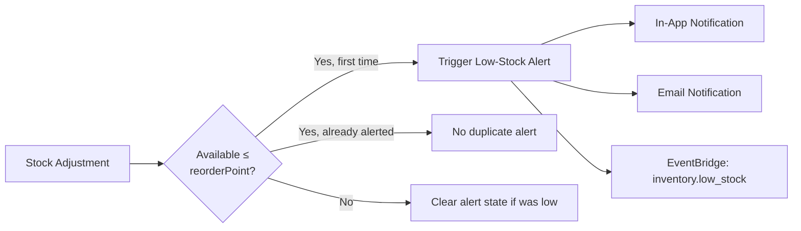
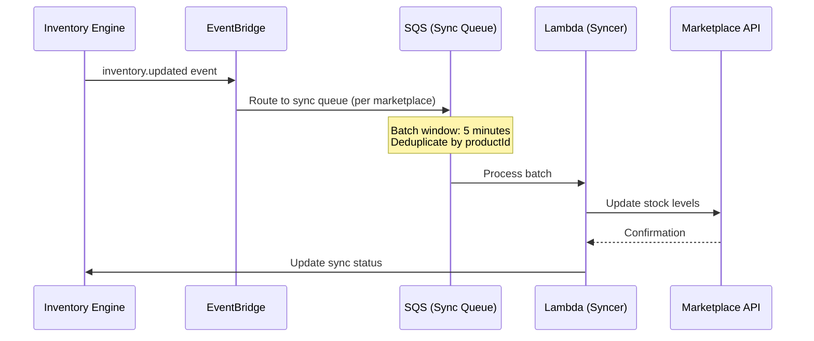

# MerchOS Engineering Blueprint

## Volume 12 — Inventory Engine

---

| Field | Value |
|-------|-------|
| **Document ID** | MERCH-012 |
| **Title** | Inventory Engine |
| **Version** | 0.1 |
| **Status** | Draft |
| **Owner** | Wadzanai Maparura |
| **Technical Lead** | Kiro AI |
| **Created** | 2026-06-27 |
| **Last Updated** | 2026-06-27 |
| **Next Review** | 2026-07-11 |
| **Classification** | Internal — Confidential |
| **Related Documents** | MERCH-003 (Functional Requirements), MERCH-013 (Export Engine), MERCH-014 (Database Design) |

---

## Revision History

| Version | Date | Author | Change Description |
|---------|------|--------|-------------------|
| 0.1 | 2026-06-27 | Kiro AI / Wadzanai Maparura | Initial draft |

---

## Table of Contents

1. [Purpose](#1-purpose)
2. [Scope](#2-scope)
3. [Engine Architecture](#3-engine-architecture)
4. [Stock Management](#4-stock-management)
5. [Stock Adjustments](#5-stock-adjustments)
6. [Multi-Warehouse](#6-multi-warehouse)
7. [Allocation Rules](#7-allocation-rules)
8. [Low-Stock Alerts](#8-low-stock-alerts)
9. [Marketplace Sync](#9-marketplace-sync)
10. [Bulk Operations](#10-bulk-operations)
11. [Audit Trail](#11-audit-trail)
12. [Integration Points](#12-integration-points)
13. [Assumptions](#13-assumptions)
14. [Dependencies](#14-dependencies)
15. [References](#15-references)

---


## 1. Purpose

This document defines the Inventory Engine — the system responsible for real-time stock tracking, adjustments, multi-warehouse management, marketplace allocation, low-stock alerting, and cross-channel inventory synchronisation.

---

## 2. Scope

Covers: Stock data model, adjustment operations, multi-warehouse support, allocation rules, alerting, marketplace sync strategy, bulk operations, and complete audit trail. Excludes order management and fulfilment (out of scope for Phase 1–3).

---

## 3. Engine Architecture

```mermaid
graph TB
    subgraph Sources["Stock Update Sources"]
        MANUAL[Manual Adjustment<br/>UI / API]
        SUPPLIER[Supplier Feed<br/>Ingestion update]
        BULK[Bulk CSV Import]
        SYNC_IN[Marketplace Inbound<br/>(future: order deduction)]
    end

    subgraph Engine["Inventory Engine"]
        API_HANDLER[Lambda: Inventory API]
        ADJUSTER[Lambda: Stock Adjuster<br/>Atomic DynamoDB writes]
        ALLOCATOR[Lambda: Allocation Engine]
        ALERTER[Lambda: Alert Checker]
        SYNCER[Lambda: Marketplace Syncer]
    end

    subgraph Storage["Data Storage"]
        DDB[(DynamoDB<br/>Stock records)]
        HISTORY[(DynamoDB<br/>Movement history)]
    end

    subgraph Outputs["Outputs"]
        EVENT[EventBridge<br/>inventory.updated]
        NOTIFY[SNS<br/>Low-stock alerts]
        MARKETPLACE[Marketplace APIs<br/>Stock push]
    end

    Sources --> Engine
    Engine --> Storage
    Engine --> Outputs
```

---

## 4. Stock Management

### 4.1 Stock Record Model

| Field | Type | Description |
|-------|------|-------------|
| `productId` | String | Product this stock belongs to |
| `variantId` | String | Specific variant (if applicable) |
| `tenantId` | String | Owning tenant |
| `warehouseId` | String | Warehouse/location (default: `default`) |
| `quantityOnHand` | Integer | Physical stock available |
| `quantityReserved` | Integer | Reserved for pending exports/orders |
| `quantityAvailable` | Integer | Calculated: onHand - reserved |
| `reorderPoint` | Integer | Low-stock threshold |
| `reorderQuantity` | Integer | Suggested reorder amount |
| `lastUpdated` | ISO DateTime | Last stock change timestamp |
| `lastCountDate` | ISO DateTime | Last physical stock count |
| `version` | Integer | Optimistic locking version |

### 4.2 Calculated Fields

```
quantityAvailable = quantityOnHand - quantityReserved
isLowStock = quantityAvailable <= reorderPoint
isOutOfStock = quantityAvailable <= 0
```

### 4.3 Stock States

| State | Condition | Export Behaviour |
|-------|-----------|-----------------|
| **In Stock** | available > reorderPoint | Include in exports normally |
| **Low Stock** | 0 < available ≤ reorderPoint | Include; trigger alert |
| **Out of Stock** | available ≤ 0 | Exclude from exports (configurable) |
| **Reserved** | reserved > 0 | Portion held for pending operations |
| **Oversold** | available < 0 | Critical alert; block all channels |

---

## 5. Stock Adjustments

### 5.1 Adjustment Types

| Type | Operation | Use Case |
|------|-----------|----------|
| `receive` | Add to onHand | Stock received from supplier |
| `sell` | Deduct from onHand | Order fulfilled / sold |
| `return` | Add to onHand | Customer return received |
| `damage` | Deduct from onHand | Damaged/defective stock removed |
| `count` | Set onHand to exact value | Physical stock count reconciliation |
| `transfer` | Deduct from source, add to destination | Inter-warehouse transfer |
| `reserve` | Add to reserved | Hold stock for pending export/order |
| `release` | Deduct from reserved | Release hold (cancelled/expired) |
| `writeoff` | Deduct from onHand | Expired/obsolete stock written off |

### 5.2 Adjustment Request Schema

```json
{
  "productId": "p_abc123",
  "variantId": "v_def456",
  "warehouseId": "default",
  "adjustmentType": "receive",
  "quantity": 100,
  "reason": "PO-2026-0045 received from TechDistro",
  "reference": "PO-2026-0045",
  "timestamp": "2026-06-27T14:30:00Z"
}
```

### 5.3 Atomic Operations

All stock adjustments use DynamoDB conditional writes to prevent race conditions:

```
UpdateExpression: SET quantityOnHand = quantityOnHand + :qty, version = version + 1
ConditionExpression: version = :expectedVersion AND quantityOnHand + :qty >= 0
```

If the condition fails (version mismatch or negative result), the operation is retried with fresh data or rejected.

### 5.4 Adjustment Validation

| Rule | Enforcement |
|------|-------------|
| Quantity must be positive integer | API validation (400 if invalid) |
| Cannot deduct more than available | Conditional expression (prevents negative) |
| Reason required for all adjustments | API validation (400 if missing) |
| Warehouse must exist | Lookup validation |
| Product/variant must exist | Lookup validation |
| Version check (optimistic locking) | DynamoDB condition expression |

---

## 6. Multi-Warehouse

### 6.1 Warehouse Model

| Field | Type | Description |
|-------|------|-------------|
| `warehouseId` | String | Unique identifier |
| `tenantId` | String | Owning tenant |
| `name` | String | Display name |
| `code` | String | Short code (e.g., `JHB`, `CPT`) |
| `address` | Object | Physical location |
| `isDefault` | Boolean | Primary warehouse for tenant |
| `priority` | Integer | Allocation priority (lower = higher priority) |
| `isActive` | Boolean | Active/deactivated |

### 6.2 Multi-Warehouse Stock View

| View | Calculation | Use Case |
|------|-------------|----------|
| Per-warehouse available | Per location: onHand - reserved | Warehouse operations |
| Total available (all warehouses) | Sum across all active warehouses | Marketplace listing quantity |
| Marketplace-specific allocation | Allocation rules applied per channel | Per-marketplace stock number |

### 6.3 Tier Availability

| Tier | Max Warehouses | Feature |
|------|---------------|---------|
| Starter | 1 (default only) | Single location tracking |
| Growth | 2 | Two locations |
| Professional | 10 | Multi-location + allocation rules |
| Enterprise | Unlimited | Full multi-warehouse with priority |

---

## 7. Allocation Rules

### 7.1 Allocation Strategy (Phase 2+)

Allocation rules determine how available stock is distributed across marketplaces:

| Strategy | Description | Example |
|----------|-------------|---------|
| **Equal** | Divide evenly across channels | 100 units → 20 per marketplace (5 channels) |
| **Percentage** | Allocate by configured percentage | Takealot: 40%, Amazon: 30%, Shopify: 30% |
| **Priority** | Fill highest-priority channel first, remainder to others | Takealot gets all; overflow to Amazon |
| **Fixed reserve** | Reserve minimum per channel; distribute remainder | 10 per channel minimum; rest to highest-demand |
| **Demand-based** | Allocate proportional to recent sales velocity (future) | Higher sellers get more |

### 7.2 Allocation Configuration

```json
{
  "tenantId": "t_xyz789",
  "defaultStrategy": "percentage",
  "rules": [
    { "marketplace": "takealot", "percentage": 40, "minimumReserve": 5 },
    { "marketplace": "amazon", "percentage": 30, "minimumReserve": 5 },
    { "marketplace": "shopify", "percentage": 20, "minimumReserve": 2 },
    { "marketplace": "makro", "percentage": 10, "minimumReserve": 2 }
  ],
  "outOfStockBehaviour": "exclude_from_export",
  "oversellProtection": true
}
```

### 7.3 Allocation Calculation

```
For each marketplace:
  allocated = floor(totalAvailable × percentage)
  allocated = max(allocated, minimumReserve)
  allocated = min(allocated, totalAvailable - sum_of_other_minimums)
  
Total allocated must not exceed totalAvailable
```

---

## 8. Low-Stock Alerts

### 8.1 Alert Configuration

| Setting | Default | Configurable |
|---------|---------|-------------|
| Low-stock threshold | 10 units | Per product/variant |
| Out-of-stock alert | 0 units | Always (not configurable) |
| Notification channels | In-app + email | Per user preference |
| Alert frequency | Once per state change | No repeated alerts for same state |
| Digest mode | Daily summary (optional) | Tenant preference |
| Critical threshold | 0 (out of stock) | Not configurable |

### 8.2 Alert Trigger Flow



### 8.3 Alert Payload

```json
{
  "alertType": "low_stock",
  "tenantId": "t_xyz789",
  "products": [
    {
      "productId": "p_abc123",
      "title": "Samsung Galaxy S24 Ultra 256GB Black",
      "sku": "SAM-S24U-BLK",
      "currentStock": 3,
      "reorderPoint": 10,
      "reorderQuantity": 50,
      "supplierId": "sup_abc123",
      "supplierName": "TechDistro SA"
    }
  ],
  "timestamp": "2026-06-27T15:00:00Z"
}
```

---

## 9. Marketplace Sync

### 9.1 Sync Strategy

| Marketplace | Sync Method | Frequency | Phase |
|-------------|-------------|-----------|-------|
| Takealot | CSV re-upload (stock column) | On change (batched 5 min) | Phase 2 |
| Amazon | SP-API Inventory Update | Near real-time (per change) | Phase 2 |
| Shopify | Admin API Inventory Levels | Near real-time (per change) | Phase 2 |
| WooCommerce | REST API stock_quantity | Near real-time (per change) | Phase 2 |
| Makro | CSV re-upload | Batch (daily) | Phase 2 |

### 9.2 Sync Architecture



### 9.3 Sync Status Tracking

| Status | Meaning |
|--------|---------|
| `synced` | Marketplace stock matches MerchOS |
| `pending` | Change queued; not yet pushed |
| `syncing` | Push in progress |
| `failed` | Push failed; will retry |
| `out_of_sync` | Known discrepancy (manual fix needed) |
| `not_connected` | Marketplace not configured for sync |

---

## 10. Bulk Operations

### 10.1 Bulk Stock Update (CSV)

| Column | Required | Description |
|--------|----------|-------------|
| sku | Yes | Product SKU (match identifier) |
| quantity | Yes | New stock quantity (absolute) or adjustment (+/-) |
| adjustment_type | No | `set` (default) or `adjust` |
| warehouse | No | Warehouse code (default if omitted) |
| reason | No | Reason for adjustment |

### 10.2 Bulk Processing

| Constraint | Value |
|-----------|-------|
| Max rows per import | 50,000 |
| Processing mode | Async (job with progress tracking) |
| Conflict handling | Last-write-wins with version validation |
| Error handling | Per-row errors logged; valid rows processed |
| Report | Summary + error detail downloadable |

---

## 11. Audit Trail

### 11.1 Movement Record

Every stock change creates an immutable movement record:

```json
{
  "movementId": "mov_abc123",
  "tenantId": "t_xyz789",
  "productId": "p_abc123",
  "variantId": "v_def456",
  "warehouseId": "default",
  "type": "receive",
  "quantity": 100,
  "previousOnHand": 50,
  "newOnHand": 150,
  "previousAvailable": 45,
  "newAvailable": 145,
  "reason": "PO-2026-0045 received from TechDistro",
  "reference": "PO-2026-0045",
  "userId": "u_abc123",
  "source": "manual",
  "timestamp": "2026-06-27T14:30:00Z"
}
```

### 11.2 Audit Queries

| Query | Access Pattern |
|-------|---------------|
| All movements for a product | PK: `TENANT#t1#PROD#p1`, SK begins_with: `MOV#` |
| All movements in date range | GSI: tenantId + timestamp range |
| Movements by user | GSI: tenantId + userId + timestamp |
| Movements by type | Filter on type field |
| Movements by reference | GSI: tenantId + reference |

---

## 12. Integration Points

### 12.1 Inbound

| Source | Data | Trigger |
|--------|------|---------|
| User (UI/API) | Manual stock adjustments | API call |
| Supplier Intelligence | Stock quantities from supplier feeds | supplier.catalogue.ingested event |
| Bulk import | CSV with stock quantities | S3 upload |
| Marketplace (future) | Order deductions, returns | Webhook / API poll |

### 12.2 Outbound

| Target | Data | Method |
|--------|------|--------|
| Export Engine | Available stock per product per marketplace | Queried during export |
| Marketplace APIs | Stock level updates | SQS → Lambda → API |
| Notification Service | Low-stock / out-of-stock alerts | EventBridge → SNS |
| Product Hub | Stock status (in-stock/low/out) | DynamoDB update |
| Analytics | Inventory metrics, movement volume | CloudWatch custom metrics |

---

## 13. Assumptions

| # | Assumption | Impact if Invalid |
|---|-----------|-------------------|
| A1 | DynamoDB conditional writes provide sufficient concurrency control | Need distributed locking (more complex) |
| A2 | 5-minute batch window acceptable for marketplace sync | Need real-time WebSocket or more frequent polling |
| A3 | Single stock count per product sufficient (no lot/batch tracking) | Need lot-level inventory model |
| A4 | Oversell protection at MerchOS level is sufficient | Need marketplace-level reservation (not always possible) |
| A5 | Sellers manually reconcile stock (no POS/WMS integration Phase 1-3) | Integration demand may be higher than expected |

---

## 14. Dependencies

| Dependency | Impact |
|-----------|--------|
| DynamoDB (conditional writes) | Atomic stock operations |
| EventBridge | Stock change event propagation |
| SQS | Marketplace sync buffering |
| Marketplace APIs (Shopify, Amazon, WooCommerce) | Stock sync targets |
| Supplier Intelligence | Inbound stock updates |
| Export Engine | Consumes available stock |

---

## 15. References

| # | Reference |
|---|-----------|
| 1 | MERCH-003 (Functional Requirements — Inventory section) |
| 2 | MERCH-013 (Export Engine — stock integration) |
| 3 | MERCH-014 (Database Design — inventory entities) |
| 4 | DynamoDB Conditional Writes Documentation |
| 5 | Amazon SP-API Inventory API Reference |
| 6 | Shopify Inventory API Reference |

---

*End of Volume 12 — Inventory Engine*

*Previous: Volume 11 — Supplier Intelligence (MERCH-011)*
*Next: Volume 13 — Export Engine (MERCH-013)*
