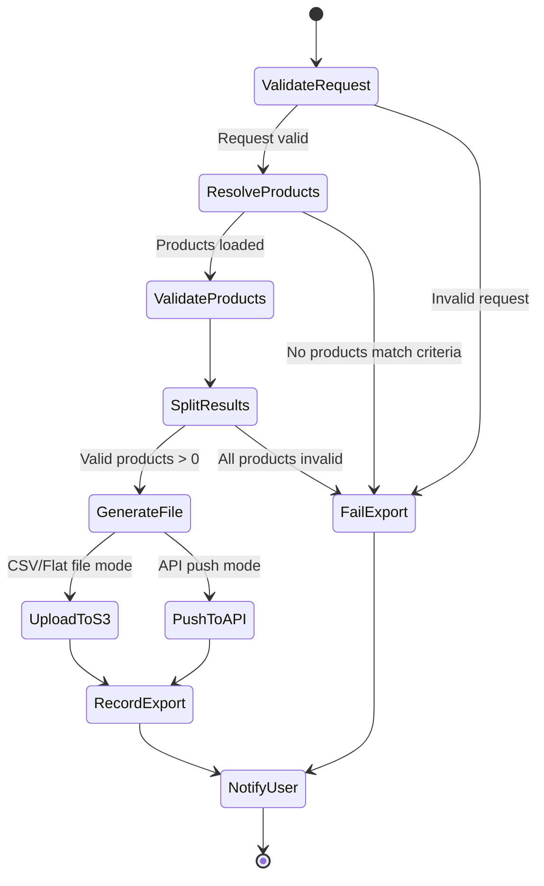
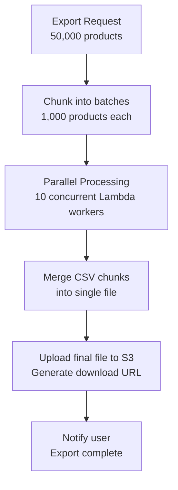

# MerchOS Engineering Blueprint

## Volume 13 — Export Engine

---

| Field | Value |
|-------|-------|
| **Document ID** | MERCH-013 |
| **Title** | Export Engine |
| **Version** | 0.1 |
| **Status** | Draft |
| **Owner** | Wadzanai Maparura |
| **Technical Lead** | Kiro AI |
| **Created** | 2026-06-27 |
| **Last Updated** | 2026-06-27 |
| **Next Review** | 2026-07-11 |
| **Classification** | Internal — Confidential |
| **Related Documents** | MERCH-008 (Marketplace Intelligence), MERCH-012 (Inventory Engine), MERCH-014 (Database Design) |

---

## Revision History

| Version | Date | Author | Change Description |
|---------|------|--------|-------------------|
| 0.1 | 2026-06-27 | Kiro AI / Wadzanai Maparura | Initial draft |

---

## Table of Contents

1. [Purpose](#1-purpose)
2. [Scope](#2-scope)
3. [Engine Architecture](#3-engine-architecture)
4. [Export Workflow](#4-export-workflow)
5. [Validation Pipeline](#5-validation-pipeline)
6. [CSV Generation](#6-csv-generation)
7. [API Push](#7-api-push)
8. [Delta Exports](#8-delta-exports)
9. [Scheduled Exports](#9-scheduled-exports)
10. [Export History & Downloads](#10-export-history--downloads)
11. [Bulk Export (50K+)](#11-bulk-export-50k)
12. [Integration Points](#12-integration-points)
13. [Assumptions](#13-assumptions)
14. [Dependencies](#14-dependencies)
15. [References](#15-references)

---


## 1. Purpose

This document defines the Export Engine — the system that generates marketplace-specific export files (CSV, flat files) and pushes products directly to marketplace APIs. It is the final step in the product-to-marketplace pipeline, ensuring every export is validated, correctly formatted, and compliant.

---

## 2. Scope

Covers: Export workflow orchestration, validation pipeline, CSV/flat file generation, direct API push, delta exports, scheduled exports, export history management, and bulk export architecture. Excludes marketplace schema definitions (MERCH-008) and inventory logic (MERCH-012).

---

## 3. Engine Architecture

```mermaid
graph TB
    subgraph Triggers["Export Triggers"]
        MANUAL[Manual Export Request<br/>User selects products + marketplace]
        SCHEDULE[Scheduled Export<br/>EventBridge cron]
        API_TRIGGER[API-triggered Export<br/>External system request]
    end

    subgraph Workflow["Export Workflow (Step Functions)"]
        RESOLVE[Resolve Products<br/>Apply filters, load data]
        VALIDATE[Validate All Products<br/>Against marketplace schema]
        SPLIT[Split: valid vs invalid]
        GENERATE[Generate Export File<br/>CSV / Flat File / API Payload]
        UPLOAD[Upload to S3<br/>Signed download URL]
        PUSH[API Push<br/>(if direct integration)]
        NOTIFY[Notify User<br/>Export ready / failures]
    end

    subgraph Data["Data Sources"]
        PRODUCTS[(Product Hub<br/>Product data)]
        SCHEMAS[(Marketplace Intelligence<br/>Schema + rules)]
        INVENTORY[(Inventory Engine<br/>Stock levels)]
        IMAGES[(Image Engine<br/>Image URLs)]
    end

    subgraph Output["Export Output"]
        S3[(S3: Export Files<br/>CSV / Flat File)]
        HISTORY[(DynamoDB: Export History)]
        EVENT[EventBridge: export.completed]
    end

    Triggers --> Workflow
    Data --> Workflow
    Workflow --> Output
```

---

## 4. Export Workflow

### 4.1 Step Functions Workflow



### 4.2 Export Request Schema

```json
{
  "exportId": "exp_auto_generated",
  "tenantId": "t_xyz789",
  "marketplace": "takealot",
  "mode": "csv",
  "productSelection": {
    "type": "filter",
    "filters": {
      "status": "active",
      "categories": ["Electronics > Smartphones"],
      "tags": ["summer-sale"],
      "readinessScoreMin": 80,
      "includeOutOfStock": false
    }
  },
  "options": {
    "deltaOnly": false,
    "sinceLastExport": false,
    "includeImages": true,
    "encoding": "utf-8-bom",
    "delimiter": ","
  }
}
```

### 4.3 Export Modes

| Mode | Description | Output | Use Case |
|------|-------------|--------|----------|
| `csv` | Generate downloadable CSV file | S3 file + signed URL | Takealot, Makro (portal upload) |
| `flat_file` | Generate Amazon flat file format | S3 file + signed URL | Amazon SP-API feed submission |
| `api_push` | Push directly to marketplace API | API response + status tracking | Shopify, WooCommerce, Amazon |
| `preview` | Generate first 10 rows for review | In-memory response | Pre-export validation |

---

## 5. Validation Pipeline

### 5.1 Pre-Export Validation

Every product goes through marketplace-specific validation before inclusion in an export:

| Stage | Check | Failure Action |
|-------|-------|---------------|
| 1. Required fields | All mandatory fields populated | Exclude from export; log error |
| 2. Data types | Values match expected types | Exclude; log specific field error |
| 3. Character limits | All fields within marketplace limits | Auto-truncate (warning) or exclude (if critical) |
| 4. Accepted values | Enums and categories match marketplace vocabulary | Exclude; suggest correction |
| 5. Image compliance | Images meet marketplace requirements | Include with warning; or exclude if no valid primary image |
| 6. Stock check | Product has available stock (if configured) | Exclude zero-stock products |
| 7. Cross-field | Conditional rules (e.g., variants need group_id) | Exclude; log dependency error |
| 8. Custom rules | Tenant-specific export rules | Apply per configuration |

### 5.2 Validation Report

```json
{
  "exportId": "exp_abc123",
  "marketplace": "takealot",
  "validationSummary": {
    "totalProducts": 500,
    "passed": 475,
    "failedValidation": 20,
    "excludedOutOfStock": 5,
    "passRate": "95%"
  },
  "failures": [
    {
      "productId": "p_001",
      "sku": "PROD-001",
      "title": "Widget Pro Max",
      "errors": [
        { "field": "barcode", "rule": "checksum", "message": "Invalid EAN-13 check digit" },
        { "field": "category", "rule": "enum", "message": "Category not found in taxonomy" }
      ]
    }
  ],
  "warnings": [
    {
      "productId": "p_002",
      "sku": "PROD-002",
      "warnings": [
        { "field": "description", "rule": "max_length", "message": "Truncated from 5200 to 5000 characters" }
      ]
    }
  ]
}
```

---

## 6. CSV Generation

### 6.1 Generation Process

| Step | Action | Detail |
|------|--------|--------|
| 1 | Load export template | Column ordering, headers, encoding from Marketplace Knowledge Base |
| 2 | Apply attribute mappings | Map MerchOS fields → marketplace columns using mapping rules |
| 3 | Apply transforms | Character limit truncation, format conversion, value mapping |
| 4 | Resolve images | Generate public URLs for product images (temporary signed URLs) |
| 5 | Resolve inventory | Get allocated stock for this marketplace |
| 6 | Build rows | One row per product (or per variant if marketplace requires) |
| 7 | Write CSV | Headers + rows with correct delimiter, encoding, line endings |
| 8 | Upload to S3 | Store in exports bucket with metadata |
| 9 | Generate download URL | Pre-signed URL (24-hour expiry) |

### 6.2 CSV Configuration

| Setting | Takealot | Amazon | Makro |
|---------|----------|--------|-------|
| Delimiter | `,` | `\t` (tab) | `,` |
| Encoding | UTF-8 with BOM | UTF-8 | UTF-8 with BOM |
| Line ending | `\r\n` (CRLF) | `\r\n` | `\r\n` |
| Quote character | `"` (double quote) | `"` | `"` |
| Escape | `""` (double) | `""` | `""` |
| Header row | Yes | Yes (template-specific) | Yes |
| Empty values | Empty string | Empty string | Empty string |
| File extension | `.csv` | `.txt` (flat file) | `.csv` |

### 6.3 Image URL Strategy

| Marketplace | Image Handling |
|-------------|---------------|
| Takealot | Public HTTPS URLs required; MerchOS generates S3 pre-signed URLs (7-day expiry) |
| Amazon | Public HTTPS URLs; or upload via SP-API image attribute |
| Makro | Public HTTPS URLs required |
| Shopify | Upload via API (not URL in CSV) |
| WooCommerce | Upload via API (src URL → WP downloads) |

---

## 7. API Push

### 7.1 Direct Integration Architecture

```mermaid
sequenceDiagram
    participant EXP as Export Engine
    participant SQS as SQS (Push Queue)
    participant PUSH as Lambda (API Pusher)
    participant MKT as Marketplace API
    participant DB as DynamoDB

    EXP->>SQS: Enqueue push jobs (per product)
    loop For each product (rate-limited)
        SQS->>PUSH: Process push job
        PUSH->>MKT: Create/Update product
        alt Success
            MKT-->>PUSH: 200 OK (listing ID)
            PUSH->>DB: Update sync status = synced
        else Rate Limited
            MKT-->>PUSH: 429 Too Many Requests
            PUSH->>SQS: Return to queue (visibility timeout)
        else Error
            MKT-->>PUSH: 4xx/5xx Error
            PUSH->>DB: Update sync status = failed; log error
        end
    end
    PUSH->>EXP: Batch complete notification
```

### 7.2 Per-Marketplace API Configuration

| Marketplace | API | Rate Limit | Batch Support | Auth |
|-------------|-----|-----------|---------------|------|
| Shopify | Admin REST API | 40 req/s (bucket) | No (per-product) | OAuth 2.0 |
| WooCommerce | REST API v3 | 100–300 req/min (server-dependent) | Yes (batch endpoint, 100 items) | API Key + Secret |
| Amazon | SP-API Feeds + Listings | 10 req/s per feed type | Yes (JSON feed, 10K items) | SP-API OAuth |

### 7.3 Push Status Tracking

| Status | Meaning | Next Action |
|--------|---------|-------------|
| `queued` | Product in push queue | Wait for processing |
| `pushing` | API call in progress | Wait |
| `synced` | Successfully pushed | None (monitor for changes) |
| `failed` | Push failed (logged) | Retry or manual fix |
| `rate_limited` | Temporarily held back | Auto-retry after cooldown |
| `skipped` | Product unchanged since last push | No action needed |

---

## 8. Delta Exports

### 8.1 Change Detection

Delta exports only include products modified since the last export to the same marketplace:

| Change Type | Detection Method | Included in Delta? |
|-------------|-----------------|-------------------|
| Product data changed | `updatedAt` > last export timestamp | Yes |
| Stock quantity changed | Inventory update event | Yes (if stock column in export) |
| Price changed | Price field `updatedAt` | Yes |
| New product added | `createdAt` > last export timestamp | Yes |
| Image changed | Image metadata `updatedAt` | Yes |
| No change | All timestamps before last export | No (skipped) |

### 8.2 Delta Export Process

1. Query last successful export timestamp for this tenant + marketplace
2. Query all products with `updatedAt > lastExportTimestamp`
3. Validate only changed products
4. Generate export with only changed products
5. Record new export timestamp

### 8.3 Full vs Delta Decision

| Scenario | Recommendation |
|----------|---------------|
| First export to marketplace | Full export (all products) |
| Regular recurring export | Delta export (changes only) |
| After marketplace schema change | Full export (all products re-validated) |
| After bulk product update | Full export (many changes) |
| User explicitly requests full | Full export |

---

## 9. Scheduled Exports

### 9.1 Schedule Configuration

```json
{
  "scheduleId": "sch_abc123",
  "tenantId": "t_xyz789",
  "marketplace": "takealot",
  "frequency": "daily",
  "time": "06:00",
  "timezone": "Africa/Johannesburg",
  "mode": "csv",
  "deltaOnly": true,
  "filters": {
    "status": "active",
    "readinessScoreMin": 90,
    "includeOutOfStock": false
  },
  "notification": {
    "onSuccess": "email",
    "onFailure": "email",
    "onEmpty": "none"
  },
  "isActive": true
}
```

### 9.2 Schedule Options

| Frequency | EventBridge Expression | Phase |
|-----------|----------------------|-------|
| Hourly | `rate(1 hour)` | Professional+ |
| Daily | `cron(0 {hour} * * ? *)` | Growth+ |
| Weekly | `cron(0 {hour} ? * {day} *)` | Growth+ |
| Real-time (on change) | EventBridge rule on product.updated | Enterprise |
| Custom | Cron expression | Enterprise |

### 9.3 Tier Restrictions

| Tier | Scheduled Exports | Minimum Interval |
|------|-------------------|-----------------|
| Starter | Not available | — |
| Growth | Daily | 24 hours |
| Professional | Hourly | 1 hour |
| Enterprise | Real-time | On change (batched 5 min) |

---

## 10. Export History & Downloads

### 10.1 Export Record

```json
{
  "exportId": "exp_abc123",
  "tenantId": "t_xyz789",
  "marketplace": "takealot",
  "mode": "csv",
  "status": "completed",
  "triggeredBy": "user",
  "userId": "u_def456",
  "createdAt": "2026-06-27T10:00:00Z",
  "completedAt": "2026-06-27T10:02:15Z",
  "duration_ms": 135000,
  "productCount": 475,
  "fileSize_bytes": 1245000,
  "fileName": "takealot_export_2026-06-27_475products.csv",
  "s3Key": "exports/t_xyz789/exp_abc123/takealot_export.csv",
  "downloadUrl": "https://s3.af-south-1.amazonaws.com/...(pre-signed)",
  "downloadUrlExpiry": "2026-06-28T10:00:00Z",
  "validationSummary": {
    "passed": 475,
    "failed": 20,
    "warnings": 8
  },
  "deltaInfo": {
    "isDelta": true,
    "sinceExportId": "exp_prev123",
    "changesIncluded": { "updated": 45, "new": 5 }
  }
}
```

### 10.2 Retention Policy

| Item | Retention | Storage |
|------|-----------|---------|
| Export record (metadata) | 2 years | DynamoDB |
| Export file (CSV) | 90 days | S3 Standard → deleted |
| Download URL | 24 hours | Pre-signed URL expiry |
| Validation report | 90 days (with export) | DynamoDB |
| Export event | 30 days | EventBridge archive |

---

## 11. Bulk Export (50K+)

### 11.1 Large Export Architecture

For exports exceeding 10,000 products, the engine uses a chunked parallel strategy:



### 11.2 Chunking Strategy

| Products | Chunk Size | Concurrent Workers | Est. Duration |
|----------|-----------|-------------------|---------------|
| 1–1,000 | All (single job) | 1 | < 30s |
| 1,001–10,000 | 1,000 per chunk | 5 | < 2 min |
| 10,001–50,000 | 1,000 per chunk | 10 | < 10 min |
| 50,001–100,000 | 2,000 per chunk | 20 | < 15 min |

### 11.3 Progress Tracking

| Event | Payload |
|-------|---------|
| `export.started` | exportId, totalProducts, estimatedDuration |
| `export.progress` | exportId, processedProducts, percentComplete |
| `export.completed` | exportId, fileUrl, productCount, duration |
| `export.failed` | exportId, error, processedBefore failure |

---

## 12. Integration Points

### 12.1 Inbound (Consumed)

| Source | Data | Purpose |
|--------|------|---------|
| Product Hub | Product records (attributes, descriptions, categories) | Core export data |
| Marketplace Intelligence | Schema, mappings, validation rules, templates | Format/validate |
| Inventory Engine | Available stock per marketplace | Stock column values |
| Image Intelligence | Marketplace-compliant image URLs | Image columns |
| Tenant config | Marketplace connections, preferences | Auth + settings |

### 12.2 Outbound (Produced)

| Target | Data | Method |
|--------|------|--------|
| S3 (exports bucket) | Generated CSV/flat files | Direct S3 write |
| Marketplace APIs | Product data (API push mode) | HTTP API calls |
| DynamoDB | Export records, validation reports | Direct write |
| EventBridge | export.started/completed/failed events | Event publish |
| Notification Service | User alerts (export ready) | Via EventBridge |
| Analytics | Export metrics (count, pass rate, duration) | CloudWatch metrics |

---

## 13. Assumptions

| # | Assumption | Impact if Invalid |
|---|-----------|-------------------|
| A1 | CSV file generation in Lambda memory is feasible for 50K rows | Need S3 streaming write or EFS |
| A2 | Pre-signed URLs (24h) sufficient for user download workflow | Need longer-lived URLs or custom download endpoint |
| A3 | Marketplace portal accepts UTF-8 BOM encoding consistently | Per-marketplace encoding configuration |
| A4 | Parallel chunk processing maintains row ordering | Need sort-merge step after parallel processing |
| A5 | Image URLs remain valid for duration of marketplace processing | Need longer-lived signed URLs or public CDN |

---

## 14. Dependencies

| Dependency | Impact |
|-----------|--------|
| Marketplace Intelligence (MERCH-008) | Schema, mappings, validation rules |
| Inventory Engine (MERCH-012) | Stock availability per marketplace |
| Image Intelligence (MERCH-010) | Marketplace-compliant image URLs |
| Product Hub | Source product data |
| AWS Step Functions | Workflow orchestration |
| Amazon S3 | File storage and download delivery |
| Marketplace APIs (Shopify, WooCommerce, Amazon) | Direct push targets |

---

## 15. References

| # | Reference |
|---|-----------|
| 1 | MERCH-008 (Marketplace Intelligence Engine) |
| 2 | MERCH-012 (Inventory Engine) |
| 3 | MERCH-003 (Functional Requirements — Export section) |
| 4 | MERCH-014 (Database Design — export entities) |
| 5 | Amazon SP-API Feeds API Reference |
| 6 | Shopify Admin API — Products |
| 7 | WooCommerce REST API — Product Batch |

---

*End of Volume 13 — Export Engine*

*Previous: Volume 12 — Inventory Engine (MERCH-012)*
*Next: Volume 14 — Database Design (MERCH-014)*
