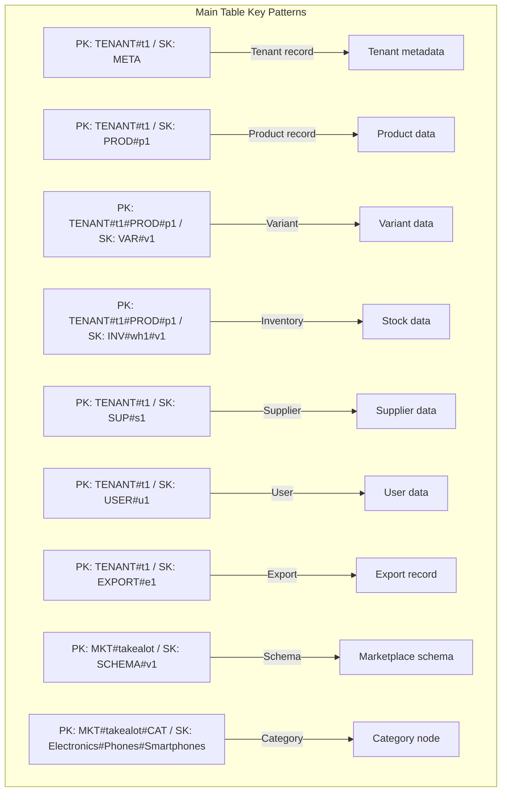
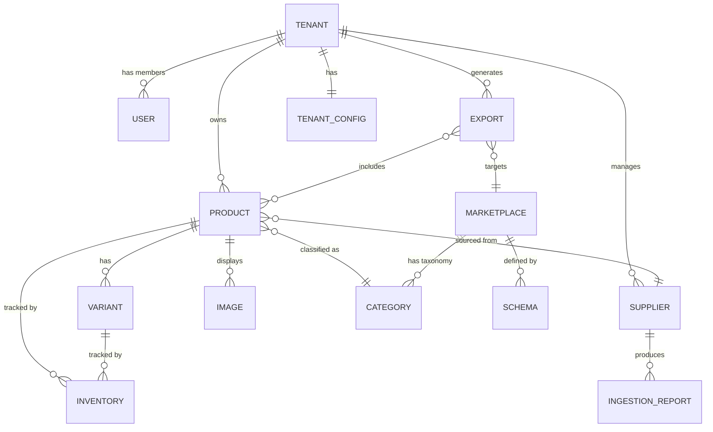

# MerchOS Engineering Blueprint

## Volume 14 — Database Design

---

| Field | Value |
|-------|-------|
| **Document ID** | MERCH-014 |
| **Title** | Database Design |
| **Version** | 0.1 |
| **Status** | Draft |
| **Owner** | Wadzanai Maparura |
| **Technical Lead** | Kiro AI |
| **Created** | 2026-06-27 |
| **Last Updated** | 2026-06-27 |
| **Next Review** | 2026-07-11 |
| **Classification** | Internal — Confidential |
| **Related Documents** | MERCH-005 (AWS Architecture), MERCH-003 (Functional Requirements), MERCH-015 (API Specifications) |

---

## Revision History

| Version | Date | Author | Change Description |
|---------|------|--------|-------------------|
| 0.1 | 2026-06-27 | Kiro AI / Wadzanai Maparura | Initial draft |

---

## Table of Contents

1. [Purpose](#1-purpose)
2. [Scope](#2-scope)
3. [Design Philosophy](#3-design-philosophy)
4. [Table Architecture](#4-table-architecture)
5. [Entity Definitions](#5-entity-definitions)
6. [Access Patterns](#6-access-patterns)
7. [Key Design (PK/SK)](#7-key-design-pksk)
8. [Global Secondary Indexes](#8-global-secondary-indexes)
9. [Entity Relationship Diagram](#9-entity-relationship-diagram)
10. [Data Lifecycle](#10-data-lifecycle)
11. [Capacity & Scaling](#11-capacity--scaling)
12. [Assumptions](#12-assumptions)
13. [Dependencies](#13-dependencies)
14. [References](#14-references)

---

## 1. Purpose

This document defines the complete database design for MerchOS — a single-table DynamoDB architecture supporting all platform entities, access patterns, and multi-tenant isolation requirements.

---

## 2. Scope

Covers: Single-table design philosophy, table architecture, all entity definitions with key patterns, access pattern catalogue, GSI design, entity relationships, data lifecycle, and capacity planning. Excludes application-level query logic (MERCH-017) and API contracts (MERCH-015).

---

## 3. Design Philosophy

### 3.1 Single-Table Design

MerchOS uses a **single-table design** for DynamoDB — all entities stored in one table with carefully designed partition and sort key patterns. A secondary audit table handles immutable event records.

| Principle | Rationale |
|-----------|-----------|
| Single table for operational data | Minimise round-trips; enable transactional writes across entity types |
| Composite keys (PK + SK) | Support hierarchical access patterns (tenant → entity → sub-entity) |
| GSIs for inverted access | Query across tenants (admin), by status, or by time |
| Denormalisation over joins | DynamoDB has no joins; embed related data where access patterns require |
| Overloaded keys | Same table stores products, variants, suppliers, inventory — differentiated by key pattern |
| Tenant-first partitioning | Every PK starts with `TENANT#{tenantId}` for isolation + hot-key distribution |

### 3.2 Naming Conventions

| Convention | Pattern | Example |
|-----------|---------|---------|
| Partition Key value | `TENANT#{tenantId}` or `TENANT#{tenantId}#{entity}#{id}` | `TENANT#t_abc123` |
| Sort Key value | `{ENTITY}#{id}` or `{ENTITY}#{subtype}#{id}` | `PROD#p_def456` |
| Entity type attribute | `entityType` (always present) | `product`, `variant`, `supplier` |
| Timestamps | ISO 8601 UTC | `2026-06-27T10:30:00.000Z` |
| IDs | Prefixed UUIDs | `p_`, `t_`, `v_`, `exp_`, `sup_`, `img_` |

---

## 4. Table Architecture

### 4.1 Tables

| Table | Purpose | Billing | PITR | Stream |
|-------|---------|---------|------|--------|
| `merchos-{env}-main` | All operational data | On-demand | Enabled | NEW_AND_OLD_IMAGES |
| `merchos-{env}-audit` | Immutable audit/event log | On-demand | Enabled | Disabled |

### 4.2 Main Table Schema

| Attribute | Type | Key | Description |
|-----------|------|-----|-------------|
| `PK` | String | Partition Key | Primary partition (tenant-scoped) |
| `SK` | String | Sort Key | Entity identifier / hierarchy |
| `GSI1PK` | String | GSI1 Partition | Inverted access pattern |
| `GSI1SK` | String | GSI1 Sort | Inverted sort |
| `GSI2PK` | String | GSI2 Partition | Status/type queries |
| `GSI2SK` | String | GSI2 Sort | Status sort |
| `GSI3PK` | String | GSI3 Partition | Time-based queries |
| `GSI3SK` | String | GSI3 Sort | Timestamp sort |
| `entityType` | String | — | Entity discriminator |
| `tenantId` | String | — | Tenant identifier (denormalised) |
| `createdAt` | String | — | Creation timestamp |
| `updatedAt` | String | — | Last update timestamp |
| `ttl` | Number | — | TTL epoch (for auto-expiry items) |
| `version` | Number | — | Optimistic locking version |
| `data` | Map | — | Entity-specific attributes |

---

## 5. Entity Definitions

### 5.1 Tenant

| Attribute | Type | Description |
|-----------|------|-------------|
| PK | `TENANT#{tenantId}` | — |
| SK | `META` | — |
| entityType | `tenant` | — |
| data.name | String | Tenant/company name |
| data.tier | String | starter / growth / professional / enterprise |
| data.status | String | active / suspended / cancelled |
| data.ownerId | String | Owner user ID |
| data.settings | Map | Preferences, marketplace connections |
| data.usage | Map | Current usage counters (products, AI credits, storage) |
| data.quotas | Map | Tier-based limits |

### 5.2 Product

| Attribute | Type | Description |
|-----------|------|-------------|
| PK | `TENANT#{tenantId}` | — |
| SK | `PROD#{productId}` | — |
| GSI1PK | `TENANT#{tenantId}#STATUS#{status}` | Query by status |
| GSI1SK | `PROD#{productId}` | — |
| GSI2PK | `TENANT#{tenantId}#CAT#{category}` | Query by category |
| GSI2SK | `PROD#{productId}` | — |
| GSI3PK | `TENANT#{tenantId}` | — |
| GSI3SK | `{updatedAt}` | Time-ordered listing |
| entityType | `product` | — |
| data.title | String | Product title |
| data.description | String | Product description (HTML) |
| data.brand | String | Brand name |
| data.category | String | Internal category path |
| data.sku | String | Internal SKU |
| data.barcode | String | EAN-13 / UPC |
| data.status | String | draft / active / archived |
| data.attributes | Map | Key-value product attributes |
| data.images | List | Image references (ordered) |
| data.pricing | Map | { costPrice, rrp, sellingPrice, currency } |
| data.completenessScore | Number | 0–100 marketplace readiness |
| data.aiEnrichment | Map | { status, confidence, lastEnrichedAt } |
| data.tags | List | User-defined tags |
| data.supplierId | String | Source supplier reference |

### 5.3 Product Variant

| Attribute | Type | Description |
|-----------|------|-------------|
| PK | `TENANT#{tenantId}#PROD#{productId}` | Nested under product |
| SK | `VAR#{variantId}` | — |
| entityType | `variant` | — |
| data.sku | String | Variant-specific SKU |
| data.barcode | String | Variant-specific barcode |
| data.options | Map | { colour: "Black", size: "256GB" } |
| data.pricing | Map | Variant-specific pricing (overrides parent) |
| data.images | List | Variant-specific images |
| data.weight | Number | Weight in kg |
| data.dimensions | Map | { length, width, height } in cm |

### 5.4 Inventory Record

| Attribute | Type | Description |
|-----------|------|-------------|
| PK | `TENANT#{tenantId}#PROD#{productId}` | — |
| SK | `INV#{warehouseId}#{variantId}` | Per-warehouse per-variant |
| entityType | `inventory` | — |
| data.quantityOnHand | Number | Physical stock |
| data.quantityReserved | Number | Reserved stock |
| data.quantityAvailable | Number | Calculated available |
| data.reorderPoint | Number | Low-stock threshold |
| data.version | Number | Optimistic lock |
| data.lastUpdated | String | Last adjustment timestamp |

### 5.5 Supplier

| Attribute | Type | Description |
|-----------|------|-------------|
| PK | `TENANT#{tenantId}` | — |
| SK | `SUP#{supplierId}` | — |
| entityType | `supplier` | — |
| data.name | String | Supplier name |
| data.contactEmail | String | Contact email |
| data.dataFormat | String | csv / excel / pdf |
| data.columnMappingId | String | Mapping config reference |
| data.qualityScore | Number | 0–100 quality score |
| data.lastIngestion | String | Last feed timestamp |
| data.productCount | Number | Products from this supplier |

### 5.6 Marketplace Schema

| Attribute | Type | Description |
|-----------|------|-------------|
| PK | `MKT#{marketplaceId}` | Not tenant-scoped (global) |
| SK | `SCHEMA#v{version}` | Versioned schema |
| entityType | `marketplace_schema` | — |
| data.columns | List | Column definitions array |
| data.imageRequirements | Map | Dimension, format, count rules |
| data.integrationMethod | String | csv / api / both |
| data.status | String | active / deprecated |

### 5.7 Marketplace Category

| Attribute | Type | Description |
|-----------|------|-------------|
| PK | `MKT#{marketplaceId}#CAT` | — |
| SK | `{level1}#{level2}#{level3}` | Full category path |
| entityType | `marketplace_category` | — |
| data.categoryId | String | Marketplace internal ID |
| data.displayName | String | Human-readable name |
| data.fullPath | String | Complete category path string |
| data.depth | Number | Level depth (1, 2, 3) |
| data.parentPath | String | Parent category path |
| data.mandatoryAttributes | List | Required attributes for this category |

### 5.8 Export Record

| Attribute | Type | Description |
|-----------|------|-------------|
| PK | `TENANT#{tenantId}` | — |
| SK | `EXPORT#{exportId}` | — |
| GSI3PK | `TENANT#{tenantId}` | — |
| GSI3SK | `{createdAt}` | Time-ordered |
| entityType | `export` | — |
| data.marketplace | String | Target marketplace |
| data.mode | String | csv / api_push |
| data.status | String | pending / processing / completed / failed |
| data.productCount | Number | Products in export |
| data.s3Key | String | Export file location |
| data.validationSummary | Map | { passed, failed, warnings } |
| data.triggeredBy | String | user / schedule / api |

### 5.9 User

| Attribute | Type | Description |
|-----------|------|-------------|
| PK | `TENANT#{tenantId}` | — |
| SK | `USER#{userId}` | — |
| GSI1PK | `USER#{email}` | Lookup by email |
| GSI1SK | `META` | — |
| entityType | `user` | — |
| data.email | String | User email |
| data.name | String | Display name |
| data.role | String | owner / admin / manager / editor / viewer |
| data.status | String | active / invited / disabled |
| data.cognitoSub | String | Cognito user sub ID |

### 5.10 Audit Event (Audit Table)

| Attribute | Type | Description |
|-----------|------|-------------|
| PK | `TENANT#{tenantId}#{entityType}#{entityId}` | — |
| SK | `{timestamp}#{eventId}` | Time-ordered events |
| entityType | `audit_event` | — |
| data.action | String | created / updated / deleted / exported |
| data.userId | String | Who performed action |
| data.changes | Map | { field: { old, new } } |
| data.metadata | Map | Additional context |

---

## 6. Access Patterns

### 6.1 Access Pattern Catalogue

| # | Access Pattern | PK | SK | Index | Operation |
|---|---------------|----|----|-------|-----------|
| AP-01 | Get tenant by ID | `TENANT#{tenantId}` | `META` | Table | GetItem |
| AP-02 | List all products for tenant | `TENANT#{tenantId}` | begins_with(`PROD#`) | Table | Query |
| AP-03 | Get product by ID | `TENANT#{tenantId}` | `PROD#{productId}` | Table | GetItem |
| AP-04 | Get product variants | `TENANT#{tenantId}#PROD#{productId}` | begins_with(`VAR#`) | Table | Query |
| AP-05 | Get product inventory | `TENANT#{tenantId}#PROD#{productId}` | begins_with(`INV#`) | Table | Query |
| AP-06 | List products by status | `TENANT#{tenantId}#STATUS#{status}` | begins_with(`PROD#`) | GSI1 | Query |
| AP-07 | List products by category | `TENANT#{tenantId}#CAT#{category}` | begins_with(`PROD#`) | GSI2 | Query |
| AP-08 | List products by last updated | `TENANT#{tenantId}` | (sort by updatedAt) | GSI3 | Query |
| AP-09 | List suppliers for tenant | `TENANT#{tenantId}` | begins_with(`SUP#`) | Table | Query |
| AP-10 | Get supplier by ID | `TENANT#{tenantId}` | `SUP#{supplierId}` | Table | GetItem |
| AP-11 | List exports for tenant | `TENANT#{tenantId}` | begins_with(`EXPORT#`) | Table | Query |
| AP-12 | List recent exports (time-ordered) | `TENANT#{tenantId}` | (sort by createdAt) | GSI3 | Query |
| AP-13 | Get marketplace schema | `MKT#{marketplaceId}` | `SCHEMA#v{version}` | Table | GetItem |
| AP-14 | List marketplace categories | `MKT#{marketplaceId}#CAT` | begins_with(`{prefix}`) | Table | Query |
| AP-15 | Get user by email | `USER#{email}` | `META` | GSI1 | Query |
| AP-16 | List users for tenant | `TENANT#{tenantId}` | begins_with(`USER#`) | Table | Query |
| AP-17 | Get inventory for product (all warehouses) | `TENANT#{tenantId}#PROD#{productId}` | begins_with(`INV#`) | Table | Query |
| AP-18 | Get audit trail for entity | `TENANT#{tenantId}#{entityType}#{entityId}` | (all events) | Audit Table | Query |
| AP-19 | List all products (admin cross-tenant) | `entityType=product` | (scan with filter) | GSI3 | Scan (admin only) |
| AP-20 | Search products (full-text) | — | — | Application layer | DynamoDB + client-side or OpenSearch (future) |

### 6.2 Write Patterns

| # | Write Pattern | Operation | Consistency |
|---|--------------|-----------|-------------|
| WP-01 | Create product | PutItem (condition: SK not exists) | Strong |
| WP-02 | Update product | UpdateItem (condition: version match) | Strong |
| WP-03 | Delete product (soft) | UpdateItem (set status=archived) | Strong |
| WP-04 | Adjust inventory | UpdateItem (conditional: version + non-negative) | Strong |
| WP-05 | Create export | PutItem | Strong |
| WP-06 | Bulk import products | BatchWriteItem (25 per batch) | Eventually consistent within batch |
| WP-07 | Create audit event | PutItem (audit table) | Strong |
| WP-08 | Update tenant usage | UpdateItem (atomic counter) | Strong |

---

## 7. Key Design (PK/SK)

### 7.1 Key Pattern Summary

### 7.2 Partition Key Distribution

| PK Pattern | Cardinality | Hot Key Risk | Mitigation |
|-----------|-------------|-------------|-----------|
| `TENANT#{tenantId}` | High (1 per tenant) | Low (spread across tenants) | Even distribution |
| `TENANT#{tenantId}#PROD#{productId}` | Very High | Very Low | Fine-grained partitioning |
| `MKT#{marketplaceId}` | Low (5 marketplaces) | Medium (read-heavy) | DAX cache (if needed) |
| `MKT#{marketplaceId}#CAT` | Low | Medium (category lookups) | Cache at application layer |

---

## 8. Global Secondary Indexes

### 8.1 GSI Definitions

| GSI | PK | SK | Projection | Purpose |
|-----|----|----|-----------|---------|
| GSI1 | `GSI1PK` | `GSI1SK` | ALL | Inverted access: status queries, email lookup |
| GSI2 | `GSI2PK` | `GSI2SK` | ALL | Category-based queries |
| GSI3 | `GSI3PK` | `GSI3SK` | ALL | Time-ordered queries (recent products, exports) |

### 8.2 GSI Usage Matrix

| Query | GSI | GSI1PK Value | GSI1SK Value |
|-------|-----|-------------|-------------|
| Products by status | GSI1 | `TENANT#t1#STATUS#active` | `PROD#p1` |
| User by email | GSI1 | `USER#email@example.com` | `META` |
| Products by category | GSI2 | `TENANT#t1#CAT#Electronics` | `PROD#p1` |
| Recent products | GSI3 | `TENANT#t1` | `2026-06-27T10:30:00Z` |
| Recent exports | GSI3 | `TENANT#t1` | `2026-06-27T10:30:00Z` |

### 8.3 GSI Cost Considerations

| Consideration | Strategy |
|--------------|----------|
| ALL projection doubles storage | Accept for flexibility; revisit if cost issue |
| Write amplification (3 GSIs) | ~4x write cost; acceptable for on-demand |
| GSI throttling | Independent capacity; on-demand scales independently |
| Sparse indexes | Not all items populate all GSI keys (save cost) |

---

## 9. Entity Relationship Diagram

---

## 10. Data Lifecycle

### 10.1 Lifecycle Policies

| Entity | Creation | Active Life | Archive | Deletion |
|--------|----------|------------|---------|----------|
| Product | On import/create | Indefinite (while active) | On user archive | 30 days after archive |
| Variant | With parent product | Follows parent | Follows parent | Follows parent |
| Inventory | On first stock event | While product active | With product | With product |
| Export record | On export start | 90 days (metadata) | Move to S3 | Auto-delete (TTL) |
| Export file (S3) | On export complete | 90 days | Deleted (lifecycle) | S3 lifecycle |
| Audit event | On data change | 2 years | S3 Glacier export | Never (compliance) |
| Session data | On login | 30 days | Deleted (TTL) | DynamoDB TTL |
| Marketplace schema | On admin creation | Indefinite | Version superseded | Never (historical) |
| Supplier | On registration | Indefinite | On deactivation | On tenant deletion |

### 10.2 TTL Strategy

| Item Type | TTL Field | Duration | Purpose |
|-----------|-----------|----------|---------|
| Session tokens | `ttl` | 30 days | Auto-cleanup of expired sessions |
| Export notifications | `ttl` | 7 days | Transient notification records |
| Temporary processing state | `ttl` | 1 hour | Step Function intermediary state |
| Invitation records | `ttl` | 7 days | Expire unclaimed invitations |

### 10.3 Data Volume Projections

| Entity | Items per Tenant (avg) | Items at 1,000 Tenants | Item Size (avg) |
|--------|----------------------|----------------------|-----------------|
| Products | 5,000 | 5,000,000 | 2 KB |
| Variants | 15,000 | 15,000,000 | 500 B |
| Inventory records | 5,000 | 5,000,000 | 200 B |
| Export records | 500 | 500,000 | 1 KB |
| Audit events (annual) | 50,000 | 50,000,000 | 500 B |
| Users | 5 | 5,000 | 500 B |
| Suppliers | 10 | 10,000 | 1 KB |
| **Total estimated** | — | **~75M items** | **~50 GB** |

---

## 11. Capacity & Scaling

### 11.1 Capacity Mode

| Table | Mode | Rationale |
|-------|------|-----------|
| Main table | On-demand | Unpredictable workload; auto-scales; no capacity planning |
| Audit table | On-demand | Write-heavy bursts during imports; read-rare |

### 11.2 Partition Sizing

| Partition Pattern | Expected Items | Read/Write Intensity |
|------------------|----------------|---------------------|
| `TENANT#{tenantId}` (small seller) | ~5K items | Low (10–50 ops/s) |
| `TENANT#{tenantId}` (large distributor) | ~500K items | Medium (100–500 ops/s) |
| `MKT#{marketplaceId}` | ~2K items (schema + categories) | Read-heavy (cached) |
| Single partition throughput limit | — | 3,000 RCU / 1,000 WCU |

### 11.3 Scaling Considerations

| Scenario | Solution |
|----------|----------|
| Hot partition (popular tenant) | Partition splits automatically (DynamoDB managed) |
| Large item (> 400KB) | Overflow to S3; store S3 reference in DynamoDB |
| High-volume batch writes | BatchWriteItem (25 items); back off on throttle |
| Cross-partition transactions | DynamoDB TransactWriteItems (max 100 items, 4MB) |
| Full-text search | Application-layer search (future: OpenSearch integration) |

---

## 12. Assumptions

| # | Assumption | Impact if Invalid |
|---|-----------|-------------------|
| A1 | Single-table design handles all identified access patterns | Additional tables or GSIs needed |
| A2 | 3 GSIs are sufficient for all query patterns | Additional GSIs (max 20 per table) |
| A3 | Product items stay under 400KB | S3 overflow pattern needed for large descriptions |
| A4 | On-demand capacity is cost-effective at projected volume | Switch to provisioned + auto-scaling |
| A5 | DynamoDB Streams are sufficient for event sourcing | Need dedicated event store (EventBridge archive) |
| A6 | 75M items at 50GB is within comfortable DynamoDB range | Absolutely (DynamoDB handles billions) |

---

## 13. Dependencies

| Dependency | Impact |
|-----------|--------|
| DynamoDB service availability | All data operations |
| DynamoDB Streams | Audit trail + event propagation |
| S3 | Overflow storage for large items |
| CloudWatch | Capacity monitoring |
| PITR (Point-in-Time Recovery) | Backup and restore capability |
| All application services | Every module reads/writes to this schema |

---

## 14. References

| # | Reference |
|---|-----------|
| 1 | Amazon DynamoDB Developer Guide — Best Practices |
| 2 | Alex DeBrie — "The DynamoDB Book" (single-table design patterns) |
| 3 | AWS re:Invent — Advanced DynamoDB Design Patterns |
| 4 | MERCH-005 (AWS Architecture — DynamoDB section) |
| 5 | MERCH-003 (Functional Requirements — data entities) |
| 6 | MERCH-015 (API Specifications — data contracts) |

---

*End of Volume 14 — Database Design*

*Previous: Volume 13 — Export Engine (MERCH-013)*
*Next: Volume 15 — API Specifications (MERCH-015)*
