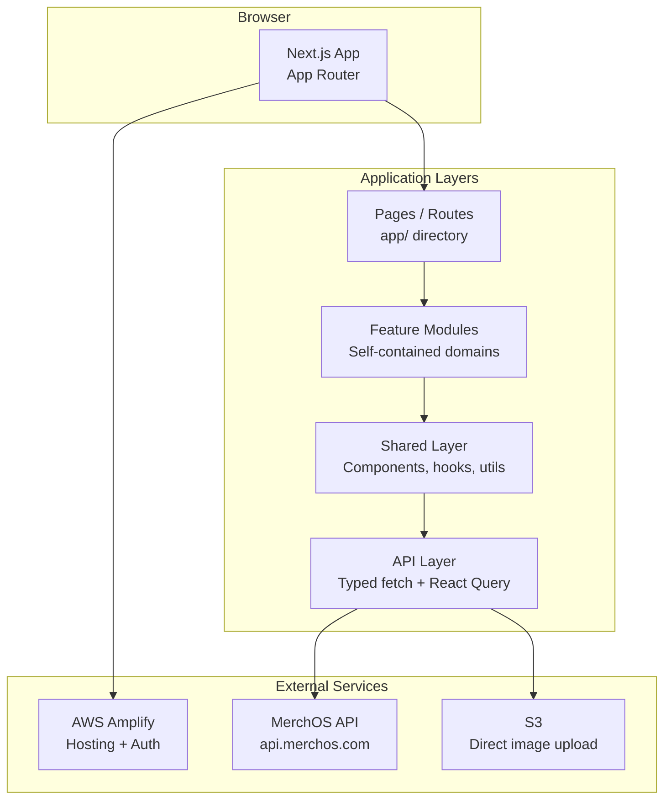
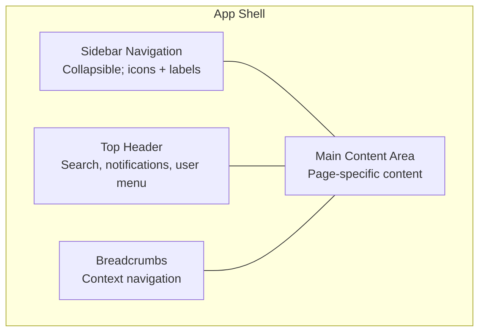

# MerchOS Engineering Blueprint

## Volume 16 — Frontend Architecture

---

| Field | Value |
|-------|-------|
| **Document ID** | MERCH-016 |
| **Title** | Frontend Architecture |
| **Version** | 0.1 |
| **Status** | Draft |
| **Owner** | Wadzanai Maparura |
| **Technical Lead** | Kiro AI |
| **Created** | 2026-06-27 |
| **Last Updated** | 2026-06-27 |
| **Next Review** | 2026-07-11 |
| **Classification** | Internal — Confidential |
| **Related Documents** | MERCH-015 (API Specifications), MERCH-005 (AWS Architecture — Amplify), MERCH-004 (NFRs — Usability) |

---

## Revision History

| Version | Date | Author | Change Description |
|---------|------|--------|-------------------|
| 0.1 | 2026-06-27 | Kiro AI / Wadzanai Maparura | Initial draft |

---

## Table of Contents

1. [Purpose](#1-purpose)
2. [Scope](#2-scope)
3. [Technology Stack](#3-technology-stack)
4. [Application Architecture](#4-application-architecture)
5. [Routing & Page Structure](#5-routing--page-structure)
6. [State Management](#6-state-management)
7. [Authentication Integration](#7-authentication-integration)
8. [Design System](#8-design-system)
9. [Performance](#9-performance)
10. [Testing Strategy](#10-testing-strategy)
11. [Deployment](#11-deployment)
12. [Assumptions](#12-assumptions)
13. [Dependencies](#13-dependencies)
14. [References](#14-references)

---


## 1. Purpose

This document defines the frontend architecture for MerchOS — a modern React-based web application hosted on AWS Amplify, providing the seller-facing interface for all platform capabilities.

---

## 2. Scope

Covers: Technology stack, application structure, routing, state management, authentication integration, design system, performance optimisation, testing, and deployment. Excludes backend logic (MERCH-017) and API contracts (MERCH-015).

---

## 3. Technology Stack

| Layer | Technology | Version | Rationale |
|-------|-----------|---------|-----------|
| Framework | Next.js | 14.x (App Router) | SSR/SSG flexibility; React ecosystem; Amplify-native |
| Language | TypeScript | 5.x | Type safety; refactoring confidence; developer productivity |
| UI Library | React | 18.x | Component model; ecosystem; Next.js requirement |
| Styling | Tailwind CSS | 3.x | Utility-first; fast iteration; consistent design tokens |
| Component Library | shadcn/ui | Latest | Accessible; customisable; Tailwind-native; not a dependency |
| State (Server) | TanStack Query (React Query) | 5.x | Server state caching; optimistic updates; background refetch |
| State (Client) | Zustand | 4.x | Lightweight; TypeScript-friendly; minimal boilerplate |
| Forms | React Hook Form + Zod | 7.x / 3.x | Performance; validation; type-safe schemas |
| Auth | AWS Amplify Auth (Cognito) | 6.x | Direct Cognito integration; token management |
| HTTP Client | Fetch API (native) + custom wrapper | — | No unnecessary dependencies; built-in streaming |
| Charts | Recharts | 2.x | React-native; responsive; composable |
| Tables | TanStack Table | 8.x | Headless; sorting, filtering, pagination built-in |
| Icons | Lucide React | Latest | Consistent icon set; tree-shakeable |
| Package Manager | pnpm | 8.x | Fast; disk-efficient; strict hoisting |
| Build | Next.js (Turbopack in dev) | — | Fast HMR; optimised production builds |
| Testing | Vitest + Testing Library + Playwright | Latest | Unit + integration + E2E |
| Linting | ESLint + Prettier | Latest | Code quality; consistent formatting |

---

## 4. Application Architecture



### 4.1 Project Structure

```
src/
├── app/                        # Next.js App Router (pages + layouts)
│   ├── (auth)/                 # Auth pages (login, register, reset)
│   ├── (dashboard)/            # Authenticated app shell
│   │   ├── products/           # Product management pages
│   │   ├── exports/            # Export management pages
│   │   ├── inventory/          # Inventory pages
│   │   ├── suppliers/          # Supplier management
│   │   ├── intelligence/       # AI enrichment UI
│   │   ├── marketplaces/       # Marketplace configuration
│   │   ├── analytics/          # Dashboard + reports
│   │   └── settings/           # Tenant + user settings
│   ├── layout.tsx              # Root layout
│   └── page.tsx                # Landing / redirect
├── features/                   # Feature modules (domain logic)
│   ├── products/               # Product-related components, hooks, types
│   ├── exports/
│   ├── inventory/
│   ├── suppliers/
│   ├── intelligence/
│   └── marketplaces/
├── shared/                     # Shared across features
│   ├── components/             # Generic UI components
│   │   ├── ui/                 # shadcn/ui primitives
│   │   ├── layout/             # Shell, sidebar, header
│   │   └── data-display/       # Tables, cards, badges
│   ├── hooks/                  # Shared custom hooks
│   ├── lib/                    # Utilities, constants, helpers
│   ├── api/                    # API client, types, React Query hooks
│   └── stores/                 # Zustand global stores
├── styles/                     # Global styles, Tailwind config
└── types/                      # Shared TypeScript types
```

### 4.2 Feature Module Structure

Each feature is self-contained:

```
features/products/
├── components/          # Feature-specific components
│   ├── ProductForm.tsx
│   ├── ProductTable.tsx
│   ├── ProductCard.tsx
│   └── BulkImportWizard.tsx
├── hooks/               # Feature-specific hooks
│   ├── useProducts.ts   # React Query hooks
│   └── useProductForm.ts
├── types/               # Feature-specific types
│   └── product.types.ts
└── utils/               # Feature-specific utilities
    └── product.validators.ts
```

---

## 5. Routing & Page Structure

### 5.1 Route Map

| Route | Page | Auth Required | Layout |
|-------|------|--------------|--------|
| `/login` | Login page | No | Auth layout |
| `/register` | Registration | No | Auth layout |
| `/forgot-password` | Password reset | No | Auth layout |
| `/` | Dashboard (redirect) | Yes | App shell |
| `/products` | Product list | Yes | App shell |
| `/products/new` | Create product | Yes | App shell |
| `/products/[id]` | Product detail/edit | Yes | App shell |
| `/products/import` | Bulk import wizard | Yes | App shell |
| `/exports` | Export history | Yes | App shell |
| `/exports/new` | Create new export | Yes | App shell |
| `/exports/[id]` | Export detail + download | Yes | App shell |
| `/inventory` | Inventory overview | Yes | App shell |
| `/inventory/[productId]` | Product stock detail | Yes | App shell |
| `/suppliers` | Supplier list | Yes | App shell |
| `/suppliers/[id]` | Supplier detail + feeds | Yes | App shell |
| `/intelligence` | AI enrichment queue | Yes | App shell |
| `/marketplaces` | Marketplace connections | Yes | App shell |
| `/analytics` | Dashboard + metrics | Yes | App shell |
| `/settings` | Tenant settings | Yes | App shell |
| `/settings/team` | Team management | Yes | App shell |
| `/settings/billing` | Billing + usage | Yes | App shell |

### 5.2 App Shell Layout



---

## 6. State Management

### 6.1 State Strategy

| State Type | Solution | Examples |
|-----------|----------|----------|
| Server state (API data) | TanStack Query | Products list, export history, inventory |
| Client-only state (UI) | Zustand | Sidebar open/closed, modal visibility, form drafts |
| Form state | React Hook Form | Product creation form, export configuration |
| URL state | Next.js searchParams | Filters, pagination cursor, sort order |
| Auth state | Amplify Auth + context | User session, tenant info, permissions |

### 6.2 React Query Configuration

```typescript
const queryClient = new QueryClient({
  defaultOptions: {
    queries: {
      staleTime: 30_000,        // 30s before refetch
      gcTime: 5 * 60_000,       // 5min cache retention
      retry: 2,                  // Retry failed requests twice
      refetchOnWindowFocus: true, // Refresh on tab focus
    },
    mutations: {
      retry: 1,
    },
  },
});
```

### 6.3 Optimistic Updates

For immediate UI responsiveness:
- Product status change → instant UI update → API call → rollback on error
- Inventory adjustment → instant counter update → API call → rollback on error
- Notification mark-as-read → instant badge decrement → API call

---

## 7. Authentication Integration

### 7.1 Auth Flow

| Step | Component | Action |
|------|-----------|--------|
| 1 | Login page | User enters credentials |
| 2 | Amplify Auth | `signIn()` → Cognito SRP flow |
| 3 | MFA (if enabled) | `confirmSignIn()` with TOTP code |
| 4 | Token storage | Access + ID tokens in memory; refresh in secure cookie |
| 5 | Route guard | Middleware checks auth; redirects to login if needed |
| 6 | API calls | Auto-inject `Authorization: Bearer {token}` |
| 7 | Token refresh | Automatic via Amplify (transparent to user) |
| 8 | Logout | `signOut()` → clear tokens → redirect to login |

### 7.2 Route Protection

```typescript
// Next.js Middleware (middleware.ts)
export function middleware(request: NextRequest) {
  const token = request.cookies.get('auth-token');
  if (!token && request.nextUrl.pathname.startsWith('/(dashboard)')) {
    return NextResponse.redirect(new URL('/login', request.url));
  }
}
```

### 7.3 Permission-Based UI

| Element | Behaviour |
|---------|-----------|
| Navigation items | Show/hide based on user role |
| Action buttons (delete, export) | Disabled or hidden for insufficient role |
| Settings pages | Accessible only to Owner/Admin |
| Billing page | Accessible only to Owner |

---

## 8. Design System

### 8.1 Design Tokens

| Token | Value | Usage |
|-------|-------|-------|
| Primary colour | `#2563eb` (Blue 600) | CTAs, links, focus states |
| Success | `#16a34a` (Green 600) | Confirmations, passed validation |
| Warning | `#d97706` (Amber 600) | Warnings, low confidence |
| Error | `#dc2626` (Red 600) | Errors, failed validation |
| Neutral | `#6b7280` (Gray 500) | Secondary text, borders |
| Background | `#ffffff` / `#f9fafb` | Page and card backgrounds |
| Font | `Inter` | System-like; clean; legible |
| Border radius | `0.5rem` (8px) | Consistent rounded corners |
| Spacing scale | 4px base (Tailwind default) | 1, 2, 3, 4, 6, 8, 12, 16... |

### 8.2 Component Library (shadcn/ui)

| Category | Components |
|----------|-----------|
| Layout | Card, Sheet, Dialog, Tabs, Separator |
| Forms | Input, Select, Textarea, Checkbox, Switch, DatePicker |
| Data Display | Table, Badge, Avatar, Progress, Skeleton |
| Feedback | Alert, Toast, Tooltip |
| Navigation | Breadcrumb, Sidebar, DropdownMenu, Command |
| Actions | Button, ButtonGroup, ToggleGroup |

### 8.3 Responsive Breakpoints

| Breakpoint | Width | Layout |
|-----------|-------|--------|
| Mobile | < 768px | Single column; bottom nav; collapsed sidebar |
| Tablet | 768–1024px | Collapsible sidebar; adapted tables |
| Desktop | 1024–1440px | Full sidebar; multi-column layouts |
| Wide | > 1440px | Max-width container; comfortable spacing |

---

## 9. Performance

### 9.1 Performance Targets

| Metric | Target | Measurement |
|--------|--------|-------------|
| Lighthouse Performance Score | > 80 | Lighthouse CI |
| First Contentful Paint (FCP) | < 1.5s | Core Web Vitals |
| Largest Contentful Paint (LCP) | < 2.5s | Core Web Vitals |
| Time to Interactive (TTI) | < 3.5s | Lighthouse |
| Cumulative Layout Shift (CLS) | < 0.1 | Core Web Vitals |
| Bundle size (initial JS) | < 200KB gzipped | Webpack bundle analyser |

### 9.2 Optimisation Strategies

| Strategy | Implementation |
|----------|---------------|
| Code splitting | Next.js automatic per-route; dynamic imports for heavy components |
| Image optimisation | Next.js `<Image>` with automatic WebP, lazy loading, blur placeholder |
| Data prefetching | React Query `prefetchQuery` on route transition |
| Virtualisation | TanStack Virtual for large product lists (1000+ rows) |
| Skeleton loading | Skeleton components while data fetches |
| Static generation | Marketing pages (if any) use SSG; app pages use CSR/SSR |
| Bundle analysis | Regular bundle size monitoring; tree-shaking validation |
| CDN caching | Amplify CloudFront for static assets; long cache headers |

---

## 10. Testing Strategy

| Type | Tool | Coverage Target | Scope |
|------|------|----------------|-------|
| Unit tests | Vitest + Testing Library | > 70% | Component logic, hooks, utilities |
| Integration tests | Vitest + MSW (API mocking) | Key user flows | Form submissions, data fetching |
| E2E tests | Playwright | Critical paths | Login, create product, export, onboarding |
| Visual regression | Playwright screenshots | Key pages | Detect unintended visual changes |
| Accessibility | axe-core (Vitest plugin) | Zero violations | WCAG 2.1 AA compliance |
| Performance | Lighthouse CI | Score > 80 | Every deployment |

### 10.1 Testing Priorities

| Priority | Tests |
|----------|-------|
| P0 (every PR) | Unit tests, lint, type check |
| P1 (every deploy) | Integration tests, E2E critical paths |
| P2 (nightly) | Full E2E suite, visual regression, accessibility audit |
| P3 (weekly) | Performance benchmarks, bundle size tracking |

---

## 11. Deployment

### 11.1 Amplify Configuration

| Setting | Value |
|---------|-------|
| Framework | Next.js (SSR) |
| Branch deployments | `main` → production, `develop` → staging, `feature/*` → preview |
| Build command | `pnpm build` |
| Output directory | `.next` |
| Environment variables | API URL, Cognito config, feature flags |
| Custom domain | `app.merchos.com` |
| SSL | Auto-provisioned ACM certificate |
| Cache invalidation | Automatic on deploy |

### 11.2 Environment Strategy

| Environment | Branch | URL | Purpose |
|-------------|--------|-----|---------|
| Production | `main` | app.merchos.com | Live users |
| Staging | `develop` | staging.merchos.com | Pre-production testing |
| Preview | `feature/*` | {branch}.d.merchos.com | PR review |
| Local | — | localhost:3000 | Development |

---

## 12. Assumptions

| # | Assumption | Impact if Invalid |
|---|-----------|-------------------|
| A1 | Next.js App Router is stable enough for production | Fall back to Pages Router |
| A2 | shadcn/ui provides sufficient component coverage | Build custom components |
| A3 | Amplify SSR hosting handles Next.js 14 features | Fall back to CloudFront + Lambda@Edge |
| A4 | TanStack Query handles all server state needs | Add additional caching layer |
| A5 | Mobile-responsive web is sufficient (no native app Phase 1-3) | Accelerate mobile app roadmap |

---

## 13. Dependencies

| Dependency | Impact |
|-----------|--------|
| AWS Amplify Hosting | Frontend deployment and hosting |
| MerchOS API (MERCH-015) | All data operations |
| AWS Cognito (via Amplify Auth) | Authentication |
| S3 (pre-signed URLs) | Direct image uploads |
| Next.js framework | Application foundation |
| React ecosystem | UI component model |

---

## 14. References

| # | Reference |
|---|-----------|
| 1 | Next.js Documentation (App Router) |
| 2 | Tailwind CSS Documentation |
| 3 | shadcn/ui Component Library |
| 4 | TanStack Query Documentation |
| 5 | AWS Amplify Hosting — Next.js |
| 6 | MERCH-015 (API Specifications) |
| 7 | MERCH-004 (NFRs — Usability requirements) |

---

*End of Volume 16 — Frontend Architecture*

*Previous: Volume 15 — API Specifications (MERCH-015)*
*Next: Volume 17 — Backend Architecture (MERCH-017)*
