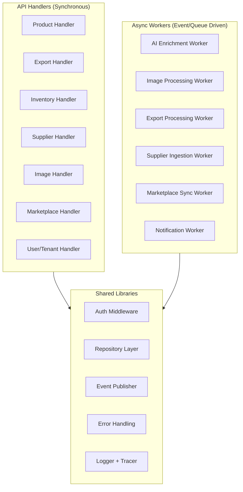

# MerchOS Engineering Blueprint

## Volume 17 — Backend Architecture

---

| Field | Value |
|-------|-------|
| **Document ID** | MERCH-017 |
| **Title** | Backend Architecture |
| **Version** | 0.1 |
| **Status** | Draft |
| **Owner** | Wadzanai Maparura |
| **Technical Lead** | Kiro AI |
| **Created** | 2026-06-27 |
| **Last Updated** | 2026-06-27 |
| **Next Review** | 2026-07-11 |
| **Classification** | Internal — Confidential |
| **Related Documents** | MERCH-005 (AWS Architecture), MERCH-014 (Database Design), MERCH-015 (API Specifications) |

---

## Revision History

| Version | Date | Author | Change Description |
|---------|------|--------|-------------------|
| 0.1 | 2026-06-27 | Kiro AI / Wadzanai Maparura | Initial draft |

---

## Table of Contents

1. [Purpose](#1-purpose)
2. [Scope](#2-scope)
3. [Technology Stack](#3-technology-stack)
4. [Service Architecture](#4-service-architecture)
5. [Lambda Function Design](#5-lambda-function-design)
6. [Middleware Pipeline](#6-middleware-pipeline)
7. [Repository Pattern](#7-repository-pattern)
8. [Event-Driven Communication](#8-event-driven-communication)
9. [Error Handling & Resilience](#9-error-handling--resilience)
10. [Code Organisation](#10-code-organisation)
11. [Testing Strategy](#11-testing-strategy)
12. [Assumptions](#12-assumptions)
13. [Dependencies](#13-dependencies)
14. [References](#14-references)

---


## 1. Purpose

This document defines the backend application architecture — how Lambda functions are structured, how business logic is organised, how services communicate, and the patterns used to ensure maintainability, testability, and resilience.

---

## 2. Scope

Covers: Technology stack, service architecture, Lambda function design patterns, middleware pipeline, repository pattern, event-driven communication, error handling, code organisation, and testing strategy. Excludes AWS infrastructure details (MERCH-005) and API contract definitions (MERCH-015).

---

## 3. Technology Stack

| Layer | Technology | Version | Rationale |
|-------|-----------|---------|-----------|
| Runtime | Node.js | 20.x LTS | Fast cold start; AWS SDK v3 included; TypeScript native |
| Language | TypeScript | 5.x | Type safety; interfaces; compile-time error detection |
| Build | esbuild (via CDK bundling) | Latest | Fast bundling; tree-shaking; minimal package size |
| AWS SDK | @aws-sdk v3 (modular) | 3.x | Import only needed clients; smaller bundles |
| Validation | Zod | 3.x | Runtime type validation; TypeScript inference |
| Logging | @aws-lambda-powertools/logger | 2.x | Structured JSON; correlation IDs; sampling |
| Tracing | @aws-lambda-powertools/tracer | 2.x | X-Ray integration; annotation; subsegments |
| Metrics | @aws-lambda-powertools/metrics | 2.x | Custom CloudWatch metrics from code |
| Middleware | Middy | 5.x | Lambda middleware pattern; composable handlers |
| Testing | Vitest | 1.x | Fast; TypeScript-native; compatible with Jest API |
| Mocking | aws-sdk-client-mock | Latest | Mock AWS SDK v3 clients in tests |

---

## 4. Service Architecture

### 4.1 Logical Services



### 4.2 Handler Responsibilities

| Handler Type | Trigger | Responsibility | Response |
|-------------|---------|---------------|----------|
| API Handler | API Gateway | Validate input, call service, return response | Synchronous JSON |
| Event Handler | EventBridge | React to domain events; trigger side effects | No response (fire-and-forget) |
| Queue Worker | SQS | Process buffered work (batches, retries) | Acknowledge/fail message |
| Step Function Task | Step Functions | Execute one step of workflow | State output |
| Scheduled Handler | EventBridge Schedule | Run periodic tasks (cleanup, reports) | No response |

---

## 5. Lambda Function Design

### 5.1 Handler Pattern

Every Lambda follows a consistent three-layer pattern:

```
┌─────────────────────────────────────┐
│         Middleware Stack            │  (Middy)
│  - Auth, logging, error handling    │
├─────────────────────────────────────┤
│          Handler Function           │  (Thin orchestrator)
│  - Parse input, call service, return│
├─────────────────────────────────────┤
│          Service Layer              │  (Business logic)
│  - Domain logic, validation, rules  │
├─────────────────────────────────────┤
│          Repository Layer           │  (Data access)
│  - DynamoDB, S3, Secrets Manager    │
└─────────────────────────────────────┘
```

### 5.2 Example Handler

```typescript
// handlers/products/createProduct.ts
import middy from '@middy/core';
import { authMiddleware } from '@shared/middleware/auth';
import { validationMiddleware } from '@shared/middleware/validation';
import { errorMiddleware } from '@shared/middleware/error';
import { createProductSchema } from './schemas';
import { ProductService } from '@services/product.service';

const handler = async (event: APIGatewayProxyEventV2) => {
  const { tenantId, userId } = event.requestContext.authorizer;
  const body = event.parsedBody; // validated by middleware
  
  const product = await ProductService.create(tenantId, userId, body);
  
  return { statusCode: 201, body: JSON.stringify({ data: product }) };
};

export const main = middy(handler)
  .use(authMiddleware())
  .use(validationMiddleware(createProductSchema))
  .use(errorMiddleware());
```

### 5.3 Lambda Configuration Standards

| Setting | API Handlers | Async Workers | AI Workers |
|---------|-------------|---------------|-----------|
| Memory | 512MB | 1024MB | 2048MB |
| Timeout | 29s | 900s (15min) | 900s |
| Architecture | arm64 | arm64 | arm64 |
| Bundling | esbuild (tree-shake) | esbuild | esbuild |
| Layers | Shared utilities | Shared utilities | Shared + AI libs |
| DLQ | N/A (API returns error) | SQS DLQ | SQS DLQ |
| Concurrency | Reserved (200) | Unreserved | Reserved (50) |
| Tracing | X-Ray active | X-Ray active | X-Ray active |

---

## 6. Middleware Pipeline

### 6.1 Middleware Stack (Middy)

| Middleware | Order | Purpose |
|-----------|-------|---------|
| `powertools-logger` | 1st | Inject logger; set correlation ID |
| `powertools-tracer` | 2nd | Start X-Ray subsegment |
| `authMiddleware` | 3rd | Validate JWT; extract tenantId + role |
| `tenantMiddleware` | 4th | Inject tenant context; check quotas |
| `validationMiddleware` | 5th | Validate request body against Zod schema |
| `errorMiddleware` | Last | Catch errors; format error responses; log |

### 6.2 Auth Middleware

```typescript
// shared/middleware/auth.ts
export const authMiddleware = () => ({
  before: async (request) => {
    const claims = request.event.requestContext?.authorizer?.jwt?.claims;
    if (!claims?.['custom:tenantId']) throw new UnauthorizedError();
    
    request.event.tenantContext = {
      tenantId: claims['custom:tenantId'],
      userId: claims.sub,
      role: claims['custom:role'],
      tier: claims['custom:tier'],
      email: claims.email,
    };
  }
});
```

### 6.3 Tenant Context Propagation

Every function call includes tenant context — passed through the entire call chain:

```typescript
interface TenantContext {
  tenantId: string;
  userId: string;
  role: 'owner' | 'admin' | 'manager' | 'editor' | 'viewer';
  tier: 'starter' | 'growth' | 'professional' | 'enterprise';
  email: string;
}
```

---

## 7. Repository Pattern

### 7.1 Data Access Layer

All DynamoDB interactions are abstracted behind repository interfaces:

```typescript
// repositories/product.repository.ts
export class ProductRepository {
  async create(tenantId: string, product: CreateProductDTO): Promise<Product>;
  async getById(tenantId: string, productId: string): Promise<Product | null>;
  async list(tenantId: string, options: ListOptions): Promise<PaginatedResult<Product>>;
  async update(tenantId: string, productId: string, updates: Partial<Product>): Promise<Product>;
  async delete(tenantId: string, productId: string): Promise<void>;
  async batchCreate(tenantId: string, products: CreateProductDTO[]): Promise<BatchResult>;
}
```

### 7.2 Repository Benefits

| Benefit | Description |
|---------|-------------|
| Testability | Mock repository in unit tests; no DynamoDB dependency |
| Encapsulation | Key construction, GSI selection hidden from services |
| Consistency | All queries go through single point; tenant isolation guaranteed |
| Migration | Change data store without touching business logic |

### 7.3 Repository Conventions

| Convention | Rule |
|-----------|------|
| Always require tenantId | First parameter of every method |
| Return domain objects | Not raw DynamoDB items |
| Handle pagination internally | Return `PaginatedResult<T>` with cursor |
| Version-checked updates | Include version in update condition |
| Throw typed exceptions | `NotFoundError`, `ConflictError`, `ValidationError` |

---

## 8. Event-Driven Communication

### 8.1 Event Publishing

```typescript
// shared/events/publisher.ts
export class EventPublisher {
  async publish(event: DomainEvent): Promise<void> {
    await this.eventBridge.putEvents({
      Entries: [{
        Source: `merchos.${event.source}`,
        DetailType: event.type,
        Detail: JSON.stringify({
          tenantId: event.tenantId,
          ...event.payload,
          timestamp: new Date().toISOString(),
          correlationId: event.correlationId,
        }),
        EventBusName: this.busName,
      }],
    });
  }
}
```

### 8.2 Event Contracts

| Event | Source | Consumers | Purpose |
|-------|--------|-----------|---------|
| `product.created` | product-hub | PIE, IIE | Trigger enrichment |
| `product.updated` | product-hub | Export Engine | Staleness detection |
| `product.enriched` | product-intelligence | Export Engine | Readiness check |
| `image.analysed` | image-intelligence | PIE | Labels + OCR available |
| `export.completed` | export-engine | Notification | Alert user |
| `inventory.updated` | inventory-engine | Marketplace Sync | Push stock changes |
| `inventory.low_stock` | inventory-engine | Notification | Alert user |
| `supplier.ingested` | supplier-intelligence | PIE, Notification | Products imported |

### 8.3 Event Processing Guarantees

| Guarantee | Implementation |
|-----------|---------------|
| At-least-once delivery | EventBridge default; consumers must be idempotent |
| Ordering within partition | SQS FIFO for ordered events (marketplace sync) |
| Dead-letter handling | Failed events go to DLQ; alarm on DLQ depth |
| Replay capability | EventBridge Archive (30-day retention) |
| Idempotency | Event ID check before processing; skip duplicates |

---

## 9. Error Handling & Resilience

### 9.1 Error Hierarchy

```typescript
// shared/errors/
export class AppError extends Error { statusCode: number; code: string; }
export class ValidationError extends AppError { /* 400 */ }
export class UnauthorizedError extends AppError { /* 401 */ }
export class ForbiddenError extends AppError { /* 403 */ }
export class NotFoundError extends AppError { /* 404 */ }
export class ConflictError extends AppError { /* 409 */ }
export class QuotaExceededError extends AppError { /* 429 */ }
export class InternalError extends AppError { /* 500 */ }
export class ServiceUnavailableError extends AppError { /* 503 */ }
```

### 9.2 Resilience Patterns

| Pattern | Implementation | Use Case |
|---------|---------------|----------|
| Retry with backoff | AWS SDK built-in + custom for Bedrock | Transient failures |
| Circuit breaker | Custom implementation per external API | Marketplace APIs |
| Dead-letter queue | SQS DLQ on all async processors | Failed message capture |
| Timeout | Lambda timeout + per-call timeouts | Prevent hanging |
| Graceful degradation | Feature flags; AI unavailable = manual fallback | Service outages |
| Idempotency | Request ID + conditional writes | Duplicate prevention |
| Bulkhead | Reserved concurrency per function group | Resource isolation |

### 9.3 Retry Strategy

| Target | Max Retries | Backoff | Jitter |
|--------|-------------|---------|--------|
| DynamoDB | 3 (SDK default) | Exponential (100ms base) | Full jitter |
| Bedrock | 2 | Exponential (1s base) | Full jitter |
| S3 | 3 (SDK default) | Exponential (100ms base) | Full jitter |
| External APIs (marketplace) | 3 | Exponential (2s base) | Full jitter |
| SQS message processing | 3 (maxReceiveCount) | Visibility timeout | N/A |

---

## 10. Code Organisation

### 10.1 Monorepo Structure

```
backend/
├── packages/
│   ├── shared/                    # Shared code (published as internal package)
│   │   ├── middleware/            # Middy middlewares
│   │   ├── repositories/         # Data access layer
│   │   ├── events/               # Event publisher + schemas
│   │   ├── errors/               # Error classes
│   │   ├── utils/                # Common utilities
│   │   ├── types/                # Shared TypeScript types
│   │   └── config/               # Environment config
│   ├── services/                  # Business logic services
│   │   ├── product.service.ts
│   │   ├── export.service.ts
│   │   ├── inventory.service.ts
│   │   ├── intelligence.service.ts
│   │   ├── supplier.service.ts
│   │   └── marketplace.service.ts
│   └── handlers/                  # Lambda entry points
│       ├── api/                   # API Gateway handlers
│       │   ├── products/
│       │   ├── exports/
│       │   ├── inventory/
│       │   ├── suppliers/
│       │   ├── images/
│       │   ├── marketplaces/
│       │   └── users/
│       ├── workers/               # Async event/queue handlers
│       │   ├── enrichment/
│       │   ├── image-processing/
│       │   ├── export-processing/
│       │   ├── supplier-ingestion/
│       │   └── marketplace-sync/
│       └── scheduled/             # Cron/scheduled handlers
│           ├── cleanup/
│           └── reports/
├── infrastructure/                # CDK stacks (see MERCH-005)
├── tests/
│   ├── unit/
│   ├── integration/
│   └── fixtures/
├── package.json
├── tsconfig.json
├── vitest.config.ts
└── pnpm-workspace.yaml
```

### 10.2 Dependency Rules

| Layer | Can Import | Cannot Import |
|-------|-----------|---------------|
| Handlers | Services, Shared | Other handlers |
| Services | Repositories, Events, Shared | Handlers, other services (directly) |
| Repositories | Shared (types, config) | Services, handlers |
| Shared | External packages only | Application code |

---

## 11. Testing Strategy

### 11.1 Testing Pyramid

| Level | Tool | Target | Coverage |
|-------|------|--------|----------|
| Unit | Vitest | Services, repositories (mocked), utilities | > 80% |
| Integration | Vitest + aws-sdk-client-mock | Handler → Service → Repository (mocked AWS) | Key flows |
| Contract | Vitest | API request/response schema validation | All endpoints |
| E2E (API) | Vitest + real API (staging) | Full API call chain | Critical paths |
| Load | Artillery / k6 | Performance under concurrent load | Monthly |

### 11.2 Unit Test Example

```typescript
// services/__tests__/product.service.test.ts
describe('ProductService.create', () => {
  const mockRepo = vi.mocked(ProductRepository);
  
  it('creates a product with generated SKU', async () => {
    mockRepo.create.mockResolvedValue(mockProduct);
    
    const result = await ProductService.create('t_123', 'u_456', validInput);
    
    expect(result.sku).toMatch(/^T123-ELEC-\d{4}$/);
    expect(mockRepo.create).toHaveBeenCalledWith('t_123', expect.objectContaining({
      title: validInput.title,
      status: 'draft',
    }));
  });
  
  it('rejects duplicate barcode', async () => {
    mockRepo.findByBarcode.mockResolvedValue(existingProduct);
    
    await expect(
      ProductService.create('t_123', 'u_456', duplicateBarcodeInput)
    ).rejects.toThrow(ConflictError);
  });
});
```

### 11.3 Test Configuration

| Setting | Value |
|---------|-------|
| Test runner | Vitest (parallel execution) |
| Mocking | vi.mock for modules; aws-sdk-client-mock for AWS |
| Coverage | Istanbul via Vitest; enforce > 80% on CI |
| Fixtures | Shared test data in `tests/fixtures/` |
| Environment variables | `.env.test` loaded automatically |
| CI integration | Run on every PR; block merge if failing |

---

## 12. Assumptions

| # | Assumption | Impact if Invalid |
|---|-----------|-------------------|
| A1 | Lambda cold starts acceptable for API handlers with provisioned concurrency | Need additional warm-up strategy |
| A2 | Monorepo with shared packages scales to 50+ Lambda functions | May need workspace tooling (Nx/Turborepo) |
| A3 | Node.js 20 is stable for production Lambda workloads | Wait for next LTS or use Node 18 |
| A4 | Middy middleware pattern sufficient for all cross-cutting concerns | Need custom Lambda wrapper |
| A5 | Event-driven communication handles all inter-service needs | Need synchronous service-to-service calls for some patterns |

---

## 13. Dependencies

| Dependency | Impact |
|-----------|--------|
| Node.js 20 runtime | All Lambda functions |
| TypeScript compiler | Build-time type checking |
| AWS SDK v3 | All AWS service interactions |
| Lambda Powertools | Logging, tracing, metrics |
| Middy | Lambda middleware framework |
| Zod | Runtime validation |
| DynamoDB | Primary data store |
| EventBridge | Inter-service events |
| All engine volumes (MERCH-009 through 013) | Business logic implementation |

---

## 14. References

| # | Reference |
|---|-----------|
| 1 | AWS Lambda Developer Guide |
| 2 | AWS Lambda Powertools for TypeScript |
| 3 | Middy Lambda Middleware Framework |
| 4 | MERCH-005 (AWS Architecture — Lambda section) |
| 5 | MERCH-014 (Database Design) |
| 6 | MERCH-015 (API Specifications) |
| 7 | Clean Architecture (Robert C. Martin) |
| 8 | Hexagonal Architecture (Ports and Adapters) |

---

*End of Volume 17 — Backend Architecture*

*Previous: Volume 16 — Frontend Architecture (MERCH-016)*
*Next: Volume 18 — DevOps & CI/CD (MERCH-018)*
