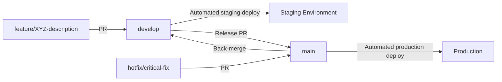
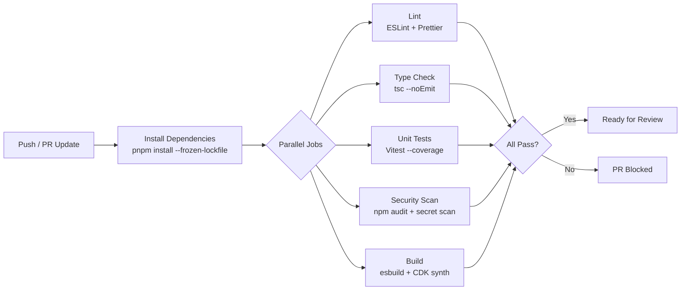

# MerchOS Engineering Blueprint

## Volume 18 — DevOps & CI/CD

---

| Field | Value |
|-------|-------|
| **Document ID** | MERCH-018 |
| **Title** | DevOps & CI/CD |
| **Version** | 0.1 |
| **Status** | Draft |
| **Owner** | Wadzanai Maparura |
| **Technical Lead** | Kiro AI |
| **Created** | 2026-06-27 |
| **Last Updated** | 2026-06-27 |
| **Next Review** | 2026-07-11 |
| **Classification** | Internal — Confidential |
| **Related Documents** | MERCH-005 (AWS Architecture), MERCH-017 (Backend Architecture), MERCH-016 (Frontend Architecture) |

---

## Revision History

| Version | Date | Author | Change Description |
|---------|------|--------|-------------------|
| 0.1 | 2026-06-27 | Kiro AI / Wadzanai Maparura | Initial draft |

---

## Table of Contents

1. [Purpose](#1-purpose)
2. [Scope](#2-scope)
3. [DevOps Principles](#3-devops-principles)
4. [Repository Strategy](#4-repository-strategy)
5. [Branching Model](#5-branching-model)
6. [CI Pipeline](#6-ci-pipeline)
7. [CD Pipeline](#7-cd-pipeline)
8. [Infrastructure Deployment (CDK)](#8-infrastructure-deployment-cdk)
9. [Environment Management](#9-environment-management)
10. [Release Strategy](#10-release-strategy)
11. [Quality Gates](#11-quality-gates)
12. [Secrets & Configuration](#12-secrets--configuration)
13. [Assumptions](#13-assumptions)
14. [Dependencies](#14-dependencies)
15. [References](#15-references)

---


## 1. Purpose

This document defines the DevOps practices, CI/CD pipelines, deployment strategy, and release management for MerchOS. Every code change follows an automated path from commit to production.

---

## 2. Scope

Covers: Repository strategy, branching model, CI pipeline (build/test/lint/security), CD pipeline (deploy to environments), CDK infrastructure deployment, environment management, release strategy, quality gates, and secrets management. Excludes monitoring (MERCH-019) and cost optimisation (MERCH-020).

---

## 3. DevOps Principles

| Principle | Implementation |
|-----------|---------------|
| **Everything as code** | Infrastructure (CDK), pipelines (GitHub Actions), configuration (env files) |
| **Automate everything** | No manual deployment steps; automated testing, building, deploying |
| **Deploy frequently** | Multiple deploys per day to staging; daily to production |
| **Fail fast** | Quick feedback loops; tests run in < 5 minutes; deploy in < 10 minutes |
| **Immutable deployments** | Lambda versions pinned; rollback = redeploy previous version |
| **Environment parity** | Staging mirrors production configuration (scaled down) |
| **Feature flags** | New features behind flags; decouple deploy from release |
| **Observability from day one** | Every deploy includes logging, metrics, and tracing |

---

## 4. Repository Strategy

### 4.1 Repository Structure

| Repository | Contents | CI/CD |
|-----------|----------|-------|
| `merchos-platform` | Backend (Lambda handlers, services, shared), Infrastructure (CDK) | GitHub Actions → CDK deploy |
| `merchos-web` | Frontend (Next.js application) | GitHub Actions → Amplify deploy |
| `merchos-docs` | Engineering Blueprint, ADRs, API docs | GitHub Pages (static) |

### 4.2 Monorepo Layout (merchos-platform)

```
merchos-platform/
├── .github/
│   └── workflows/
│       ├── ci.yml              # PR checks (lint, test, build)
│       ├── cd-staging.yml      # Deploy to staging (on merge to develop)
│       ├── cd-production.yml   # Deploy to production (on merge to main)
│       └── cdk-diff.yml        # Show infra changes on PR
├── backend/                    # Application code (see MERCH-017)
├── infrastructure/             # CDK stacks (see MERCH-005)
├── scripts/                    # Utility scripts
├── package.json                # Root workspace
├── pnpm-workspace.yaml
└── turbo.json                  # Turborepo config (build orchestration)
```

---

## 5. Branching Model

### 5.1 Branch Strategy (GitHub Flow + Develop)



### 5.2 Branch Rules

| Branch | Purpose | Protection Rules |
|--------|---------|-----------------|
| `main` | Production-ready code | Require PR; 1 approval; CI pass; no force push |
| `develop` | Integration branch; staging deploys | Require PR; CI pass; no force push |
| `feature/*` | Feature development | Named: `feature/{ticket}-{description}` |
| `hotfix/*` | Emergency production fixes | PR directly to main; fast-track review |
| `release/*` | Release preparation (optional) | Used for major releases only |

### 5.3 PR Requirements

| Requirement | Enforcement |
|-------------|-------------|
| All CI checks pass | GitHub required status checks |
| At least 1 code review approval | GitHub branch protection |
| No merge conflicts | GitHub auto-check |
| PR description template filled | PR template |
| Linked to GitHub issue | Convention (not enforced) |
| CDK diff reviewed (if infra changes) | Workflow comment on PR |

---

## 6. CI Pipeline

### 6.1 CI Workflow (on every PR)



### 6.2 CI Job Details

| Job | Tool | Duration Target | Failure Action |
|-----|------|----------------|---------------|
| Install | pnpm install --frozen-lockfile | < 30s | Fail (lockfile mismatch) |
| Lint | ESLint (strict mode) | < 60s | Fail (block merge) |
| Type check | TypeScript compiler (noEmit) | < 60s | Fail (block merge) |
| Unit tests | Vitest (parallel) | < 3min | Fail (block merge) |
| Coverage | Istanbul (via Vitest) | < 30s | Fail if < 80% on changed files |
| Security | npm audit (high+critical) | < 30s | Fail (block merge) |
| Secret scan | git-secrets / trufflehog | < 30s | Fail (block merge) |
| Build (backend) | esbuild bundle | < 60s | Fail (block merge) |
| CDK synth | cdk synth --all | < 2min | Fail (block merge) |
| CDK Nag | CDK Nag (AwsSolutions) | < 30s | Fail (block merge) |
| CDK diff | cdk diff (comment on PR) | < 2min | Informational (no block) |

### 6.3 CI Configuration

```yaml
# .github/workflows/ci.yml (simplified)
name: CI
on: [pull_request]
jobs:
  lint-and-types:
    runs-on: ubuntu-latest
    steps:
      - uses: actions/checkout@v4
      - uses: pnpm/action-setup@v2
      - run: pnpm install --frozen-lockfile
      - run: pnpm lint
      - run: pnpm typecheck

  test:
    runs-on: ubuntu-latest
    steps:
      - uses: actions/checkout@v4
      - uses: pnpm/action-setup@v2
      - run: pnpm install --frozen-lockfile
      - run: pnpm test --coverage
      - uses: codecov/codecov-action@v3

  security:
    runs-on: ubuntu-latest
    steps:
      - uses: actions/checkout@v4
      - run: pnpm audit --audit-level=high
      - uses: trufflesecurity/trufflehog@v3

  build:
    runs-on: ubuntu-latest
    steps:
      - uses: actions/checkout@v4
      - uses: pnpm/action-setup@v2
      - run: pnpm install --frozen-lockfile
      - run: pnpm build
      - run: cd infrastructure && npx cdk synth --all
```

---

## 7. CD Pipeline

### 7.1 Staging Deployment (on merge to develop)

| Step | Action | Duration |
|------|--------|----------|
| 1 | Trigger on merge to `develop` | Immediate |
| 2 | Run full CI (redundant safety check) | 3 min |
| 3 | CDK deploy to staging account | 5–10 min |
| 4 | Run integration tests against staging API | 3 min |
| 5 | Amplify auto-deploys frontend (develop branch) | 3–5 min |
| 6 | Notify team (Slack) | Immediate |

### 7.2 Production Deployment (on merge to main)

| Step | Action | Duration |
|------|--------|----------|
| 1 | Trigger on merge to `main` | Immediate |
| 2 | Run full CI | 3 min |
| 3 | CDK deploy to production account | 5–10 min |
| 4 | Run smoke tests against production API | 2 min |
| 5 | Amplify auto-deploys frontend (main branch) | 3–5 min |
| 6 | Tag release in GitHub | Immediate |
| 7 | Notify team + publish release notes | Immediate |
| 8 | Monitor for 15 min (elevated alerting) | 15 min |

### 7.3 Deployment Strategy

| Aspect | Strategy |
|--------|----------|
| Backend (Lambda) | Atomic deployment via CDK; all-or-nothing per stack |
| Frontend (Amplify) | Amplify managed deployment; instant cache invalidation |
| Infrastructure (CDK) | CloudFormation changeset; reviewed before apply |
| Rollback | Redeploy previous commit (CDK + Amplify auto-rollback on failure) |
| Database migrations | No schema migrations (DynamoDB); new attributes added backward-compatible |
| Feature flags | LaunchDarkly or custom DynamoDB-based flags (per-tenant) |

---

## 8. Infrastructure Deployment (CDK)

### 8.1 CDK Pipeline

| Stage | Action |
|-------|--------|
| Synth | Generate CloudFormation templates from TypeScript |
| Nag | Run CDK Nag security/best-practice checks |
| Diff | Show changeset (on PR as comment; before deploy) |
| Deploy | Apply changeset to target environment |
| Verify | Post-deploy smoke test |

### 8.2 Stack Deployment Order

| Order | Stack | Dependencies |
|-------|-------|-------------|
| 1 | Data Stack (DynamoDB, S3) | None |
| 2 | Auth Stack (Cognito) | None |
| 3 | API Stack (API Gateway, Lambda handlers) | Data, Auth |
| 4 | Orchestration Stack (Step Functions, EventBridge, SQS) | Data, API |
| 5 | Intelligence Stack (Bedrock config, Textract, Rekognition) | Data |
| 6 | Monitoring Stack (CloudWatch, Alarms, Dashboards) | All |
| 7 | Frontend Stack (Amplify) | Auth, API |

### 8.3 CDK Best Practices

| Practice | Implementation |
|----------|---------------|
| Construct abstractions | Reusable L3 constructs for Lambda + API + DDB patterns |
| Environment config | Per-environment values in `config/environments.ts` |
| No hardcoded values | All config from context or Secrets Manager |
| Snapshot testing | CDK assertion tests verify no unintended changes |
| Tagging | Automatic tags: environment, service, cost-centre, team |
| Removal policy | RETAIN for production data (DynamoDB, S3); DESTROY for dev |

---

## 9. Environment Management

### 9.1 Environments

| Environment | AWS Account | Branch | URL | Purpose |
|-------------|-------------|--------|-----|---------|
| Development | merchos-dev | feature/* (local) | localhost | Local development |
| Staging | merchos-staging | develop | staging.merchos.com | Integration testing; demo |
| Production | merchos-prod | main | app.merchos.com | Live users |

### 9.2 Environment Configuration

| Config Item | Dev | Staging | Production |
|------------|-----|---------|-----------|
| DynamoDB mode | On-demand | On-demand | On-demand |
| Lambda memory | Standard | Standard | Standard + provisioned concurrency |
| Bedrock region | us-east-1 | us-east-1 | us-east-1 |
| Log retention | 7 days | 14 days | 30 days |
| Alarms | Disabled | Email only | PagerDuty + Slack + Email |
| WAF | Disabled | Count mode | Block mode |
| Feature flags | All enabled | Match production | Controlled rollout |
| Data | Synthetic test data | Subset of anonymised data | Real tenant data |

---

## 10. Release Strategy

### 10.1 Release Cadence

| Release Type | Frequency | Process |
|-------------|-----------|---------|
| Standard | Multiple per day | Merge to develop → auto-deploy staging → merge to main → auto-deploy prod |
| Hotfix | As needed | hotfix branch → PR to main → deploy → back-merge to develop |
| Major release | Monthly (if needed) | Release branch → testing → deploy with elevated monitoring |

### 10.2 Feature Flags

| Flag Type | Implementation | Lifecycle |
|-----------|---------------|-----------|
| Per-feature | DynamoDB config item | Created before dev; removed after full rollout |
| Per-tenant | Tenant config attribute | Controlled rollout to specific tenants |
| Percentage | Random sampling | Gradual rollout (10% → 50% → 100%) |
| Kill switch | Global off switch | Emergency disable of feature |

### 10.3 Rollback Procedure

| Scenario | Action | Duration |
|----------|--------|----------|
| Frontend regression | Amplify revert to previous deployment | < 2 min |
| Backend regression | Redeploy previous commit via CDK | < 10 min |
| Infrastructure regression | CDK rollback (CloudFormation) | < 10 min |
| Data corruption | DynamoDB PITR restore (point-in-time) | < 30 min |
| Critical bug (P1) | Feature flag disable + hotfix | < 5 min (flag) |

---

## 11. Quality Gates

### 11.1 Gate Progression

| Gate | Stage | Criteria | Enforcement |
|------|-------|----------|-------------|
| G1: Code Quality | PR | Lint pass, type check pass, no secrets | Automated (CI) |
| G2: Test Coverage | PR | Unit tests pass; coverage ≥ 80% on changed files | Automated (CI) |
| G3: Security | PR | No high/critical vulnerabilities; CDK Nag pass | Automated (CI) |
| G4: Peer Review | PR | 1+ approval; CDK diff reviewed | GitHub protection rules |
| G5: Integration | Staging | Integration tests pass against staging | Automated (CD) |
| G6: Smoke Test | Production | Critical path smoke tests pass | Automated (CD) |
| G7: Monitoring | Post-deploy | No error rate spike for 15 min | Manual (on-call observes) |

---

## 12. Secrets & Configuration

### 12.1 Secret Management in CI/CD

| Secret Type | Storage | Access |
|-------------|---------|--------|
| AWS credentials (deploy) | GitHub OIDC → IAM Role | Assumed during workflow run |
| Third-party API keys | AWS Secrets Manager | Deployed via CDK reference |
| GitHub tokens | GitHub Actions secrets | Available to workflows |
| Environment variables | GitHub Actions environment secrets | Per-environment isolation |

### 12.2 No Long-Lived Credentials

| Rule | Implementation |
|------|---------------|
| No AWS access keys in GitHub | OIDC federation (AssumeRoleWithWebIdentity) |
| No secrets in code | Pre-commit secret scanning; git-secrets |
| No secrets in CDK | Reference Secrets Manager ARNs; never values |
| No secrets in logs | Structured logging masks sensitive fields |
| Rotation | Automated rotation schedules (Secrets Manager) |

---

## 13. Assumptions

| # | Assumption | Impact if Invalid |
|---|-----------|-------------------|
| A1 | GitHub Actions provides sufficient CI/CD compute and minutes | Need self-hosted runners or alternative CI |
| A2 | CDK deployment completes within 15 minutes | Need stack parallelisation or optimisation |
| A3 | GitHub OIDC federation works with all required AWS accounts | Need IAM user with access keys (less secure) |
| A4 | Amplify handles Next.js SSR deployment without issues | Fall back to self-managed CloudFront + Lambda@Edge |
| A5 | Feature flags via DynamoDB sufficient (no dedicated service needed) | Integrate LaunchDarkly or similar |

---

## 14. Dependencies

| Dependency | Impact |
|-----------|--------|
| GitHub (repositories + Actions) | Source control and CI/CD |
| AWS CDK | Infrastructure deployment |
| AWS Amplify | Frontend deployment |
| AWS IAM (OIDC) | Secure CI/CD authentication |
| AWS Secrets Manager | Secret storage and rotation |
| pnpm | Package management |
| Turborepo | Monorepo build orchestration |

---

## 15. References

| # | Reference |
|---|-----------|
| 1 | GitHub Actions Documentation |
| 2 | AWS CDK Pipelines |
| 3 | AWS Amplify CI/CD |
| 4 | GitHub OIDC with AWS |
| 5 | MERCH-005 (AWS Architecture — CDK section) |
| 6 | MERCH-016 (Frontend — Deployment) |
| 7 | MERCH-017 (Backend — Code Organisation) |
| 8 | DORA Metrics (Deployment Frequency, Lead Time, Change Failure Rate, MTTR) |

---

*End of Volume 18 — DevOps & CI/CD*

*Previous: Volume 17 — Backend Architecture (MERCH-017)*
*Next: Volume 19 — Monitoring & Operations (MERCH-019)*
