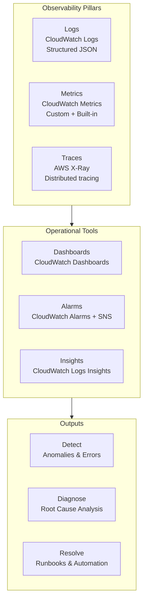
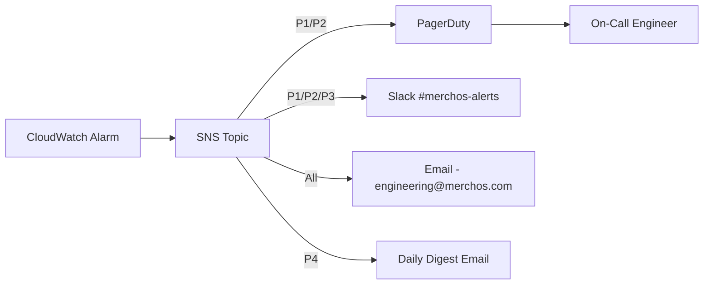
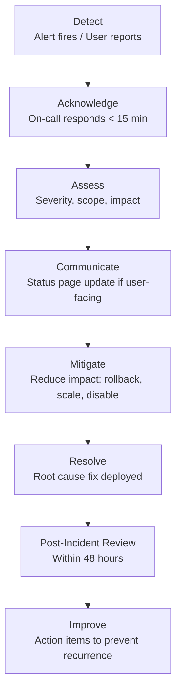

# MerchOS Engineering Blueprint

## Volume 19 — Monitoring & Operations

---

| Field | Value |
|-------|-------|
| **Document ID** | MERCH-019 |
| **Title** | Monitoring & Operations |
| **Version** | 0.1 |
| **Status** | Draft |
| **Owner** | Wadzanai Maparura |
| **Technical Lead** | Kiro AI |
| **Created** | 2026-06-27 |
| **Last Updated** | 2026-06-27 |
| **Next Review** | 2026-07-11 |
| **Classification** | Internal — Confidential |
| **Related Documents** | MERCH-005 (AWS Architecture), MERCH-004 (NFRs — Observability), MERCH-018 (DevOps) |

---

## Revision History

| Version | Date | Author | Change Description |
|---------|------|--------|-------------------|
| 0.1 | 2026-06-27 | Kiro AI / Wadzanai Maparura | Initial draft |

---

## Table of Contents

1. [Purpose](#1-purpose)
2. [Scope](#2-scope)
3. [Observability Strategy](#3-observability-strategy)
4. [Logging](#4-logging)
5. [Metrics](#5-metrics)
6. [Tracing](#6-tracing)
7. [Dashboards](#7-dashboards)
8. [Alerting](#8-alerting)
9. [Incident Management](#9-incident-management)
10. [Runbooks](#10-runbooks)
11. [SLA Management](#11-sla-management)
12. [Assumptions](#12-assumptions)
13. [Dependencies](#13-dependencies)
14. [References](#14-references)

---


## 1. Purpose

This document defines the monitoring, observability, alerting, and operational practices for MerchOS. The goal is complete visibility into platform health, enabling rapid detection, diagnosis, and resolution of issues.

---

## 2. Scope

Covers: Three pillars of observability (logs, metrics, traces), dashboards, alerting strategy, incident management process, runbooks, and SLA management. Excludes security monitoring (MERCH-006) and cost monitoring (MERCH-020).

---

## 3. Observability Strategy

### 3.1 Three Pillars



### 3.2 Observability Standards

| Standard | Implementation |
|----------|---------------|
| Every Lambda has structured logging | Lambda Powertools Logger (JSON) |
| Every Lambda emits custom metrics | Lambda Powertools Metrics |
| Every request has a correlation ID | Propagated via `X-Correlation-ID` header |
| Every service interaction is traced | X-Ray active tracing on all functions |
| Tenant context on all telemetry | `tenantId` on logs, metrics (dimension), traces (annotation) |
| PII never in logs | Sensitive fields masked by logger middleware |

---

## 4. Logging

### 4.1 Log Format

```json
{
  "level": "INFO",
  "message": "Product created successfully",
  "timestamp": "2026-06-27T10:30:00.123Z",
  "service": "product-api",
  "function": "createProduct",
  "requestId": "req_abc123",
  "correlationId": "corr_xyz789",
  "tenantId": "t_abc123",
  "userId": "u_def456",
  "xrayTraceId": "1-abc-def",
  "data": {
    "productId": "p_ghi789",
    "action": "create",
    "duration_ms": 145
  }
}
```

### 4.2 Log Levels

| Level | Usage | Examples |
|-------|-------|----------|
| ERROR | Operation failed; requires attention | Unhandled exception, DLQ message, external API failure |
| WARN | Unexpected but handled; potential issue | Retry succeeded, slow response, approaching quota |
| INFO | Normal operations; key business events | Product created, export completed, user login |
| DEBUG | Detailed diagnostic information | Query parameters, response bodies, cache hit/miss |

### 4.3 Log Configuration

| Setting | Production | Staging | Development |
|---------|-----------|---------|-------------|
| Level | INFO | DEBUG | DEBUG |
| Retention | 30 days | 14 days | 7 days |
| Sampling (DEBUG) | 5% | 100% | 100% |
| Export to S3 | Yes (after 30d → Glacier) | No | No |
| Log group per function | Yes | Yes | Yes |

### 4.4 Key Log Queries (CloudWatch Insights)

| Query Name | Purpose | Query |
|-----------|---------|-------|
| Errors by service | Error distribution | `filter @message like /ERROR/ | stats count() by service` |
| Slow requests | Performance issues | `filter data.duration_ms > 1000 | sort data.duration_ms desc` |
| Tenant activity | Per-tenant debugging | `filter tenantId = "t_abc123" | sort @timestamp desc` |
| Export failures | Export troubleshooting | `filter service = "export-engine" and level = "ERROR"` |
| AI latency | AI performance | `filter service = "ai-orchestrator" | stats avg(data.duration_ms)` |

---

## 5. Metrics

### 5.1 Metric Categories

| Category | Source | Examples |
|----------|--------|----------|
| AWS Built-in | CloudWatch (automatic) | Lambda duration, errors, throttles, DynamoDB RCU/WCU |
| Custom Business | Lambda Powertools Metrics | Products created, exports generated, AI enrichments |
| Custom Technical | Lambda Powertools Metrics | Cache hit rate, cold start rate, queue depth |
| Derived/Composite | CloudWatch Math | Error rate %, availability %, cost per product |

### 5.2 Key Metrics Catalogue

| Metric | Namespace | Dimensions | Alarm Threshold |
|--------|-----------|-----------|-----------------|
| API Error Rate (5xx) | `MerchOS/API` | service, endpoint | > 1% (5min) |
| API Latency (p95) | `MerchOS/API` | service, endpoint | > 2000ms |
| Products Created | `MerchOS/Business` | tenantId | N/A (tracking) |
| Exports Generated | `MerchOS/Business` | marketplace | N/A (tracking) |
| Export Validation Pass Rate | `MerchOS/Business` | marketplace | < 90% |
| AI Enrichments Completed | `MerchOS/AI` | model, taskType | N/A (tracking) |
| AI Credits Consumed | `MerchOS/AI` | tenantId, model | > 80% of budget |
| AI Average Confidence | `MerchOS/AI` | taskType | < 0.70 |
| AI Latency (p95) | `MerchOS/AI` | model | > 20s |
| Lambda Cold Starts | `MerchOS/Performance` | function | > 10% rate |
| DynamoDB Throttles | `AWS/DynamoDB` | table | > 0 |
| SQS DLQ Depth | `AWS/SQS` | queue | > 0 |
| Active Tenants (daily) | `MerchOS/Business` | — | N/A (tracking) |

### 5.3 Metric Emission Pattern

```typescript
// Using Lambda Powertools Metrics
import { Metrics, MetricUnits } from '@aws-lambda-powertools/metrics';

const metrics = new Metrics({ namespace: 'MerchOS/Business' });

metrics.addDimension('tenantId', tenantId);
metrics.addDimension('marketplace', 'takealot');
metrics.addMetric('ExportsGenerated', MetricUnits.Count, 1);
metrics.addMetric('ExportProductCount', MetricUnits.Count, productCount);
metrics.addMetric('ExportDuration', MetricUnits.Milliseconds, duration);
metrics.publishStoredMetrics();
```

---

## 6. Tracing

### 6.1 X-Ray Configuration

| Setting | Value |
|---------|-------|
| Tracing mode | Active (all Lambda functions) |
| Sampling rate (production) | 5% of requests (100% for errors) |
| Sampling rate (staging) | 100% |
| Annotations | tenantId, operation, outcome |
| Metadata | Request/response bodies (non-PII) |
| Subsegments | DynamoDB calls, S3 calls, Bedrock calls, external APIs |

### 6.2 Trace Propagation

```
Client → API Gateway → Lambda Handler → Service → Repository → DynamoDB
                                        → Event Publisher → EventBridge
                                        → Bedrock (AI call)
```

Each hop creates a subsegment with timing, outcome, and annotations.

### 6.3 X-Ray Service Map

The X-Ray service map provides a visual topology of all service interactions, showing:
- Request flow between services
- Latency at each hop
- Error rates per service
- Dependency health (DynamoDB, S3, Bedrock, external APIs)

---

## 7. Dashboards

### 7.1 Dashboard Catalogue

| Dashboard | Audience | Refresh | Key Widgets |
|-----------|----------|---------|-------------|
| Platform Health | Engineering | 1 min | API errors, latency, Lambda concurrency, DDB throttles |
| Business Metrics | Product + Leadership | 5 min | Products created, exports, active tenants, AI usage |
| AI Performance | AI/ML team | 5 min | Model latency, confidence, token usage, cache hit rate |
| Per-Tenant | Support + Admin | On demand | Usage, errors, exports, AI credits for specific tenant |
| Cost & Usage | Finance + Engineering | 1 hour | Daily AWS spend, per-service cost, per-tenant cost |
| Deployment | DevOps | 5 min | Deploy frequency, change failure rate, MTTR |

### 7.2 Platform Health Dashboard Layout

| Row | Widget 1 | Widget 2 | Widget 3 |
|-----|----------|----------|----------|
| 1 | API Request Rate (line) | API Error Rate % (line) | API Latency p95 (line) |
| 2 | Lambda Concurrent Executions | Lambda Errors (stacked) | Lambda Throttles |
| 3 | DynamoDB RCU/WCU Consumed | DynamoDB Throttled Requests | DynamoDB Latency |
| 4 | SQS Messages In Flight | SQS DLQ Depth (alarm) | Step Functions Active |
| 5 | Active Alarms Summary | Recent Deployments | Error Log Stream |

---

## 8. Alerting

### 8.1 Alert Severity Levels

| Severity | Response Time | Notification Channel | Examples |
|----------|--------------|---------------------|----------|
| P1 — Critical | < 15 min | PagerDuty + Slack + Email | Service down, data breach, DLQ flooding |
| P2 — High | < 1 hour | Slack + Email | Error rate > 5%, AI model unavailable |
| P3 — Medium | < 4 hours | Slack | Error rate > 1%, elevated latency, DLQ messages |
| P4 — Low | Next business day | Email digest | Cost anomaly, dependency update, performance drift |

### 8.2 Alert Catalogue

| Alert | Condition | Severity | Action |
|-------|-----------|----------|--------|
| API Error Rate Critical | 5xx rate > 5% for 5 min | P1 | Page on-call; check recent deploy; investigate |
| API Error Rate Elevated | 5xx rate > 1% for 5 min | P3 | Investigate; check logs |
| API Latency Degraded | p95 > 2000ms for 5 min | P3 | Check DynamoDB, Lambda cold starts |
| Lambda Throttling | Any throttle events | P2 | Check concurrency limits; request increase |
| DynamoDB Throttling | Any throttle events | P2 | Check hot partitions; review access patterns |
| DLQ Messages Present | Any DLQ depth > 0 | P3 | Investigate failed messages; fix and replay |
| DLQ Flooding | DLQ depth > 100 in 5 min | P1 | Systemic failure; investigate root cause |
| Deployment Failed | CD pipeline failure | P2 | Check pipeline logs; rollback if needed |
| AI Model Unavailable | Bedrock errors > 10% for 5 min | P2 | Check Bedrock status; activate fallback model |
| AI Budget Exceeded | Tenant > 100% AI credits | P4 | Inform tenant; block further AI calls |
| Cost Anomaly | Daily spend > 150% of forecast | P4 | Investigate spike; check for runaway jobs |
| Certificate Expiry | < 14 days to expiry | P3 | Renew certificate (usually auto-managed) |

### 8.3 Alert Routing



---

## 9. Incident Management

### 9.1 Incident Process



### 9.2 Incident Roles

| Role | Responsibility |
|------|---------------|
| Incident Commander | Coordinates response; makes decisions; communicates status |
| Technical Lead | Investigates root cause; implements fix |
| Communications | Updates stakeholders; status page; customer notifications |
| Scribe | Documents timeline, actions, decisions during incident |

### 9.3 Post-Incident Review Template

| Section | Content |
|---------|---------|
| Summary | What happened, when, how long, who was affected |
| Timeline | Minute-by-minute events from detection to resolution |
| Root Cause | Technical root cause analysis (5 Whys) |
| Impact | Users affected, data affected, revenue impact |
| What Went Well | Things that worked during response |
| What Could Improve | Gaps in detection, response, or communication |
| Action Items | Specific improvements with owners and deadlines |

---

## 10. Runbooks

### 10.1 Runbook Catalogue

| Runbook | Trigger | Steps Summary |
|---------|---------|---------------|
| RB-001: API Error Rate Spike | P1/P2 API error alarm | Check recent deploy → Rollback if correlated → Check DynamoDB → Check external APIs |
| RB-002: DLQ Messages | DLQ alarm | Identify failed function → Read DLQ messages → Fix root cause → Replay messages |
| RB-003: DynamoDB Throttle | Throttle alarm | Check Contributor Insights → Identify hot key → Fix access pattern or add caching |
| RB-004: Lambda Throttle | Throttle alarm | Check concurrency usage → Request limit increase → Add SQS buffer |
| RB-005: AI Service Degraded | Bedrock error alarm | Check Bedrock health → Switch to fallback model → Notify AI team |
| RB-006: Deployment Rollback | Deploy failure or post-deploy regression | Identify failing component → CDK rollback or Amplify revert → Verify recovery |
| RB-007: Tenant Data Issue | Support ticket | Identify tenant → Query audit logs → Assess scope → Fix data → Notify tenant |
| RB-008: Cost Spike | Budget alarm | Identify cost driver → Check for runaway jobs → Kill if needed → Root cause |

### 10.2 Runbook Format

Each runbook includes:
1. **Trigger**: What alarm or event starts this runbook
2. **Context**: What this means and potential causes
3. **Diagnosis Steps**: Step-by-step investigation procedure
4. **Resolution Options**: Potential fixes ranked by speed/safety
5. **Escalation**: When and how to escalate
6. **Verification**: How to confirm the issue is resolved
7. **Follow-up**: Post-resolution actions (review, preventions)

---

## 11. SLA Management

### 11.1 Platform SLA

| Metric | Target | Measurement | Reporting |
|--------|--------|-------------|-----------|
| Uptime | 99.9% | Synthetic monitoring (5-min checks) | Monthly report |
| API Latency (p95) | < 500ms | CloudWatch percentile metric | Weekly dashboard |
| Export Success Rate | > 98% | Export engine metrics | Weekly dashboard |
| AI Enrichment Success | > 95% | AI engine metrics | Weekly dashboard |
| Incident Response (P1) | < 15 minutes | Incident tracker | Per-incident |
| Incident Resolution (P1) | < 2 hours | Incident tracker | Per-incident |

### 11.2 SLA Monitoring

| Component | Monitor Type | Check Frequency |
|-----------|-------------|----------------|
| API availability | Synthetic API call (health endpoint) | Every 5 minutes |
| Frontend availability | Synthetic page load | Every 5 minutes |
| Auth service | Synthetic login flow | Every 15 minutes |
| Export engine | Synthetic test export | Every 30 minutes |
| AI service | Synthetic enrichment call | Every 30 minutes |

### 11.3 SLA Reporting

- **Monthly**: Platform uptime report, incident summary, SLA compliance
- **Weekly**: Engineering metrics (latency, error rate, deploy frequency)
- **Real-time**: Status page (statuspage.io or equivalent) for user-facing status

---

## 12. Assumptions

| # | Assumption | Impact if Invalid |
|---|-----------|-------------------|
| A1 | CloudWatch is sufficient for all observability needs | Need third-party tool (Datadog, Grafana Cloud) |
| A2 | X-Ray 5% sampling provides enough production visibility | Increase sampling (cost increase) |
| A3 | Synthetic monitoring (5-min) is sufficient for SLA measurement | Need 1-min checks (more Canary cost) |
| A4 | PagerDuty is available for on-call management | Use SNS + Lambda for custom escalation |
| A5 | CloudWatch Dashboards meet executive reporting needs | Need BI tool (QuickSight, Metabase) |

---

## 13. Dependencies

| Dependency | Impact |
|-----------|--------|
| Amazon CloudWatch | Logs, metrics, alarms, dashboards |
| AWS X-Ray | Distributed tracing |
| Amazon SNS | Alert routing |
| PagerDuty (or similar) | On-call management and escalation |
| Slack | Real-time alert notifications |
| CloudWatch Synthetics | Availability monitoring (canaries) |
| Status page provider | User-facing status communication |

---

## 14. References

| # | Reference |
|---|-----------|
| 1 | AWS Well-Architected — Operational Excellence Pillar |
| 2 | Amazon CloudWatch User Guide |
| 3 | AWS X-Ray Developer Guide |
| 4 | AWS Lambda Powertools — Observability |
| 5 | Google SRE Book — Monitoring Distributed Systems |
| 6 | MERCH-004 (NFRs — Observability section) |
| 7 | MERCH-005 (AWS Architecture — CloudWatch section) |
| 8 | MERCH-018 (DevOps & CI/CD) |

---

*End of Volume 19 — Monitoring & Operations*

*Previous: Volume 18 — DevOps & CI/CD (MERCH-018)*
*Next: Volume 20 — Cost Optimisation (MERCH-020)*
