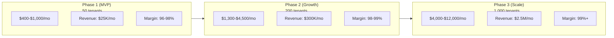
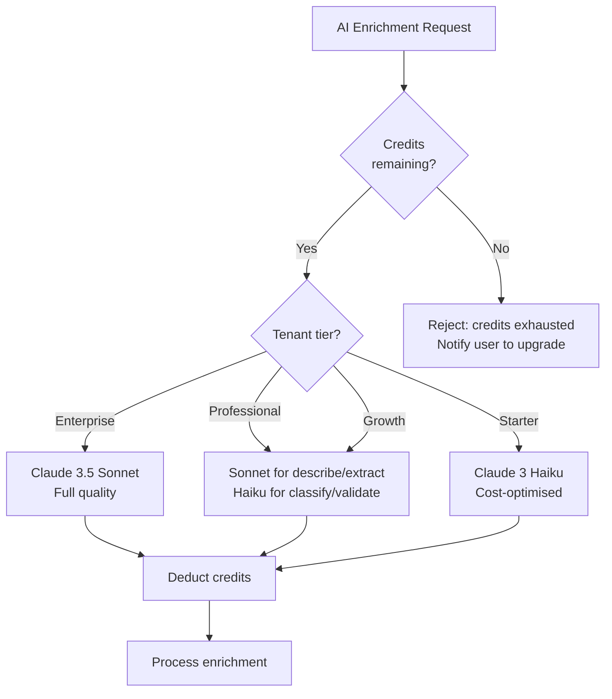

# MerchOS Engineering Blueprint

## Volume 20 — Cost Optimisation

---

| Field | Value |
|-------|-------|
| **Document ID** | MERCH-020 |
| **Title** | Cost Optimisation |
| **Version** | 0.1 |
| **Status** | Draft |
| **Owner** | Wadzanai Maparura |
| **Technical Lead** | Kiro AI |
| **Created** | 2026-06-27 |
| **Last Updated** | 2026-06-27 |
| **Next Review** | 2026-07-11 |
| **Classification** | Internal — Confidential |
| **Related Documents** | MERCH-005 (AWS Architecture), MERCH-002 (Business & Product — Pricing), MERCH-004 (NFRs — Cost Efficiency) |

---

## Revision History

| Version | Date | Author | Change Description |
|---------|------|--------|-------------------|
| 0.1 | 2026-06-27 | Kiro AI / Wadzanai Maparura | Initial draft |

---

## Table of Contents

1. [Purpose](#1-purpose)
2. [Scope](#2-scope)
3. [Cost Philosophy](#3-cost-philosophy)
4. [Cost Model by Service](#4-cost-model-by-service)
5. [Cost Projections](#5-cost-projections)
6. [Per-Tenant Cost Attribution](#6-per-tenant-cost-attribution)
7. [Optimisation Strategies](#7-optimisation-strategies)
8. [AI Cost Management](#8-ai-cost-management)
9. [Cost Monitoring & Alerting](#9-cost-monitoring--alerting)
10. [Cost Review Process](#10-cost-review-process)
11. [Assumptions](#11-assumptions)
12. [Dependencies](#12-dependencies)
13. [References](#13-references)

---


## 1. Purpose

This document defines the cost optimisation strategy for MerchOS — ensuring the platform operates at maximum efficiency while maintaining performance, reliability, and user experience. Cost awareness is embedded in every architectural decision.

---

## 2. Scope

Covers: Cost philosophy, per-service cost modelling, projections by growth phase, per-tenant cost attribution, optimisation strategies for each AWS service, AI-specific cost management, cost monitoring/alerting, and quarterly review process.

---

## 3. Cost Philosophy

| Principle | Implementation |
|-----------|---------------|
| **Serverless = pay-per-use** | Zero cost when idle; scale cost linearly with usage |
| **Cost is a feature** | Treat cost like performance — measure, optimise, budget |
| **Right-size from day one** | Don't over-provision; start minimal and scale |
| **Attribute cost to value** | Know what each feature costs; ensure margin covers infrastructure |
| **Optimise the expensive things** | Focus on top 3 cost drivers; ignore sub-$10/month items |
| **Automate cost governance** | Budget alerts, anomaly detection, automated lifecycle policies |
| **Infrastructure cost < 15% revenue** | Target gross margin > 85% on infrastructure |

---

## 4. Cost Model by Service

### 4.1 Service Cost Breakdown

| Service | Pricing Model | Primary Cost Driver | Monthly Estimate (Growth: 1K tenants) |
|---------|--------------|--------------------|-----------------------------------------|
| **Lambda** | Per invocation + duration | Request volume × duration | $150–$400 |
| **DynamoDB** | Per RCU/WCU (on-demand) | Read/write operations | $200–$600 |
| **S3** | Storage + requests | GB stored + GET/PUT count | $50–$200 |
| **API Gateway** | Per request | API call volume | $50–$150 |
| **Bedrock (AI)** | Per token (input + output) | AI enrichment volume | $500–$2,000 |
| **Textract** | Per page | OCR processing volume | $50–$200 |
| **Rekognition** | Per image | Image analysis volume | $50–$150 |
| **Step Functions** | Per state transition | Workflow complexity × volume | $30–$100 |
| **EventBridge** | Per event | Event volume | $5–$20 |
| **SQS** | Per message | Queue message volume | $5–$20 |
| **SNS** | Per notification | Alert/notification volume | $5–$20 |
| **Cognito** | Per MAU | Monthly active users | $50–$200 |
| **CloudWatch** | Logs + metrics + alarms | Log volume + custom metrics | $100–$300 |
| **Amplify** | Build + hosting + SSR | Build minutes + request volume | $30–$100 |
| **Secrets Manager** | Per secret + API calls | Secret count | $5–$10 |
| **X-Ray** | Per trace | Trace sampling rate | $10–$30 |
| **Total (Growth)** | — | — | **$1,300–$4,500/month** |

### 4.2 Cost per Product Metric

| Scale | Products | Est. Monthly Cost | Cost per Product |
|-------|----------|------------------|-----------------|
| Startup (50 tenants) | 25,000 | $400–$1,000 | $0.016–$0.040 |
| Growth (200 tenants) | 250,000 | $1,300–$4,500 | $0.005–$0.018 |
| Scale (1,000 tenants) | 2,500,000 | $4,000–$12,000 | $0.002–$0.005 |
| Enterprise (5,000 tenants) | 25,000,000 | $15,000–$40,000 | $0.001–$0.002 |

---

## 5. Cost Projections

### 5.1 Phase-Based Projections



### 5.2 Top Cost Drivers by Phase

| Phase | #1 Cost Driver | #2 Cost Driver | #3 Cost Driver |
|-------|---------------|---------------|---------------|
| Phase 1 | Bedrock (AI tokens) | DynamoDB | CloudWatch |
| Phase 2 | Bedrock (AI tokens) | DynamoDB | Lambda |
| Phase 3 | Bedrock (AI tokens) | DynamoDB | S3 storage |
| Phase 4 | Bedrock (AI tokens) | DynamoDB | Lambda |

> **Note:** AI (Bedrock) is consistently the #1 cost driver. AI cost management (Section 8) is critical.

---

## 6. Per-Tenant Cost Attribution

### 6.1 Attribution Strategy

| Service | Attribution Method | Granularity |
|---------|-------------------|-------------|
| Lambda | Custom metric: tenantId dimension | Per invocation |
| DynamoDB | Custom metric: RCU/WCU per tenant prefix | Per operation |
| S3 | Object prefix: `{tenantId}/` → S3 Storage Lens | Per GB |
| Bedrock | Custom metric: tokens per tenant | Per AI call |
| Textract | Custom metric: pages per tenant | Per page |
| Rekognition | Custom metric: images per tenant | Per image |
| Step Functions | Custom metric: executions per tenant | Per workflow |
| Cognito | Users per tenant (custom attribute) | Per MAU |

### 6.2 Tenant Cost Report

```json
{
  "tenantId": "t_xyz789",
  "period": "2026-06",
  "costs": {
    "compute": { "amount": 12.50, "unit": "USD", "driver": "Lambda invocations" },
    "storage": { "amount": 3.20, "unit": "USD", "driver": "S3: 12.5 GB" },
    "database": { "amount": 8.40, "unit": "USD", "driver": "DynamoDB: 45K WCU, 120K RCU" },
    "ai": { "amount": 45.00, "unit": "USD", "driver": "Bedrock: 1.5M tokens" },
    "imaging": { "amount": 5.50, "unit": "USD", "driver": "Textract: 200 pages, Rekognition: 500 images" },
    "total": 74.60
  },
  "revenue": 7999.00,
  "margin": "99.1%"
}
```

### 6.3 Profitability Alert

| Condition | Action |
|-----------|--------|
| Tenant cost > 20% of tenant revenue | Alert finance; review tenant usage |
| Tenant AI cost > tier allocation | Throttle AI; notify tenant; suggest upgrade |
| Single tenant > 30% of total platform cost | Review for abuse; consider dedicated pricing |

---

## 7. Optimisation Strategies

### 7.1 Lambda Optimisation

| Strategy | Saving | Implementation |
|----------|--------|---------------|
| arm64 (Graviton2) | 20% | All functions use arm64 architecture |
| Right-sized memory | 10–30% | Lambda Power Tuning per function; benchmark |
| Minimal bundle size | Faster cold start | esbuild tree-shaking; exclude unused SDK clients |
| Provisioned concurrency (critical only) | N/A (cost increase) | Auth + Product API only; avoid for async |
| Batch processing | Fewer invocations | SQS batch size > 1; process multiple records per invocation |

### 7.2 DynamoDB Optimisation

| Strategy | Saving | Implementation |
|----------|--------|---------------|
| On-demand mode | No over-provisioning | Default for unpredictable workloads |
| GSI projection (KEYS_ONLY where possible) | 30–50% GSI cost | Only project needed attributes |
| TTL for expired data | Free deletions | Session data, temp records auto-expire |
| Batch operations | Fewer requests | BatchWriteItem (25 per batch) for bulk imports |
| Efficient queries | Fewer RCU | Query with `Limit`; avoid Scan; use begins_with |
| Item size optimisation | Less storage | Compress large text; overflow to S3 |

### 7.3 S3 Optimisation

| Strategy | Saving | Implementation |
|----------|--------|---------------|
| Intelligent-Tiering | 40–70% on cold data | Enable on media bucket |
| Lifecycle policies | Automated cleanup | Exports: delete after 90d; imports: delete after 30d |
| Delete incomplete multipart | Avoid waste | Abort incomplete uploads after 7 days |
| Compression (gzip) | 60–80% transfer | Compress export files before storage |
| WebP image format | 30–50% vs JPEG | Store variants as WebP |
| CloudFront caching | Reduce S3 GETs | Frontend assets + image variants cached at edge |

### 7.4 API Gateway Optimisation

| Strategy | Saving | Implementation |
|----------|--------|---------------|
| HTTP API (not REST API) | 70% cheaper | $1/M vs $3.50/M requests |
| Response caching | Reduce Lambda calls | Cache for read-heavy endpoints (marketplace schemas) |
| Request deduplication | Fewer invocations | Idempotency key prevents duplicate processing |

### 7.5 CloudWatch Optimisation

| Strategy | Saving | Implementation |
|----------|--------|---------------|
| Log level filtering (production) | 50–70% log volume | INFO level only; DEBUG sampled at 5% |
| Metric aggregation | Fewer custom metrics | Aggregate per-service, not per-function |
| Log retention policy | Storage savings | 30 days hot; export to S3 for long-term |
| Embedded Metrics Format | Free metrics | Metrics within logs; no separate PutMetricData |

---

## 8. AI Cost Management

### 8.1 AI Cost Breakdown

| Model | Input Cost | Output Cost | Avg per Enrichment | Monthly (10K enrichments) |
|-------|-----------|-------------|-------------------|---------------------------|
| Claude 3.5 Sonnet | $3.00/1M tokens | $15.00/1M tokens | ~$0.031 | ~$310 |
| Claude 3 Haiku | $0.25/1M tokens | $1.25/1M tokens | ~$0.0026 | ~$26 |
| Titan Embeddings | $0.02/1M tokens | — | ~$0.00001 | ~$0.10 |

### 8.2 AI Cost Reduction Strategies

| Strategy | Saving | Implementation |
|----------|--------|---------------|
| Model routing by tier | 50–90% for Starter/Growth | Haiku for simple tasks; Sonnet for complex |
| Prompt caching | 20–40% | Cache identical prompts; serve from DynamoDB |
| Response caching | 30–50% | Cache results for similar products (same category/brand) |
| Batch prompt optimisation | 10–20% | Amortise system prompt across batch of products |
| Token-efficient prompts | 10–15% | Monthly prompt review; remove redundant instructions |
| Skip unnecessary enrichment | Variable | Don't re-enrich products with high confidence scores |
| Per-tenant budgets | Prevents runaway | Hard credit limits; alert at 80% |
| Haiku for validation | 80% cheaper | Use Haiku for output validation checks |

### 8.3 AI Budget Enforcement



---

## 9. Cost Monitoring & Alerting

### 9.1 Cost Monitoring Tools

| Tool | Purpose | Frequency |
|------|---------|-----------|
| AWS Cost Explorer | Service-level cost analysis | Daily review |
| AWS Budgets | Budget threshold alerts | Real-time |
| CloudWatch Metrics (custom) | Per-tenant cost tracking | Real-time |
| S3 Storage Lens | Storage cost analysis | Weekly |
| Cost Anomaly Detection | Detect unexpected spikes | Continuous |
| Custom Dashboard | Cost & margin visibility | Real-time |

### 9.2 Budget Alerts

| Alert | Threshold | Action |
|-------|-----------|--------|
| Monthly forecast exceeds budget | 80% of monthly budget | Email to finance + engineering lead |
| Monthly forecast exceeds budget | 100% of monthly budget | Email + Slack alert; investigate |
| Daily spend anomaly | > 150% of 7-day average | Immediate investigation |
| AI token spike | > 200% of daily average per tenant | Per-tenant AI throttle check |
| Single service spike | Any service > 200% of monthly average | Investigate specific service |

### 9.3 Cost Dashboard

| Widget | Metric | Granularity |
|--------|--------|-------------|
| Total daily spend | AWS Cost Explorer API | Daily |
| Cost by service (pie chart) | Top 10 services | Monthly |
| Cost trend (line) | Daily spend vs forecast | 30-day window |
| Per-tenant top spenders | Custom metric | Monthly |
| AI token consumption | Custom metric | Daily |
| Cost per product (KPI) | Derived: total cost / total products | Monthly |
| Infrastructure margin | (Revenue - AWS cost) / Revenue | Monthly |

---

## 10. Cost Review Process

### 10.1 Review Cadence

| Review | Frequency | Participants | Output |
|--------|-----------|-------------|--------|
| Daily cost check | Daily (automated) | DevOps (dashboard) | Anomaly alerts if needed |
| Weekly cost summary | Weekly | Engineering lead | Summary email; action items |
| Monthly cost review | Monthly | Engineering + Finance | Detailed report; optimisation plan |
| Quarterly architecture review | Quarterly | Full team | Right-sizing; architecture changes |

### 10.2 Monthly Review Checklist

- [ ] Total spend vs budget (variance analysis)
- [ ] Per-service cost breakdown (identify growth)
- [ ] Top 5 tenant cost consumers (profitability check)
- [ ] AI token efficiency (tokens per enrichment trending)
- [ ] Lambda right-sizing check (memory vs duration analysis)
- [ ] Storage growth rate (S3 + DynamoDB)
- [ ] Unused resources (Lambda functions with 0 invocations)
- [ ] Cost per product metric trend
- [ ] Savings opportunities identified and prioritised
- [ ] Action items from previous month (status check)

### 10.3 Optimisation Backlog

All cost optimisation opportunities are tracked in a prioritised backlog:

| Priority | Criteria |
|----------|----------|
| P0 | Saving > $500/month; low effort |
| P1 | Saving > $200/month; medium effort |
| P2 | Saving > $50/month; any effort |
| P3 | Future optimisation (when scale justifies effort) |

---

## 11. Assumptions

| # | Assumption | Impact if Invalid |
|---|-----------|-------------------|
| A1 | Serverless pricing remains competitive vs containers at scale | Evaluate ECS/Fargate at > 5,000 tenants |
| A2 | AI token costs decrease over time (industry trend) | Budget increase or model downgrade |
| A3 | On-demand DynamoDB remains cheaper than provisioned at current scale | Switch to provisioned + auto-scaling |
| A4 | Infrastructure cost stays < 5% of revenue at growth scale | Pricing adjustment or architecture change |
| A5 | Per-tenant cost attribution is sufficiently accurate with custom metrics | Need dedicated cost allocation tags |

---

## 12. Dependencies

| Dependency | Impact |
|-----------|--------|
| AWS Cost Explorer API | Automated cost reporting |
| AWS Budgets | Alert infrastructure |
| CloudWatch (custom metrics) | Per-tenant attribution |
| S3 Storage Lens | Storage cost analysis |
| AWS Cost Anomaly Detection | Spike detection |
| Finance team | Budget approval and review |

---

## 13. References

| # | Reference |
|---|-----------|
| 1 | AWS Well-Architected — Cost Optimisation Pillar |
| 2 | AWS Serverless Cost Optimisation Guide |
| 3 | AWS Cost Explorer API Reference |
| 4 | MERCH-002 (Business & Product — Pricing strategy) |
| 5 | MERCH-004 (NFRs — Cost Efficiency requirements) |
| 6 | MERCH-005 (AWS Architecture — per-service cost notes) |
| 7 | MERCH-007 (AI Architecture — token economics) |

---

*End of Volume 20 — Cost Optimisation*

*Previous: Volume 19 — Monitoring & Operations (MERCH-019)*
*Next: Volume 21 — Implementation Roadmap (MERCH-021)*
