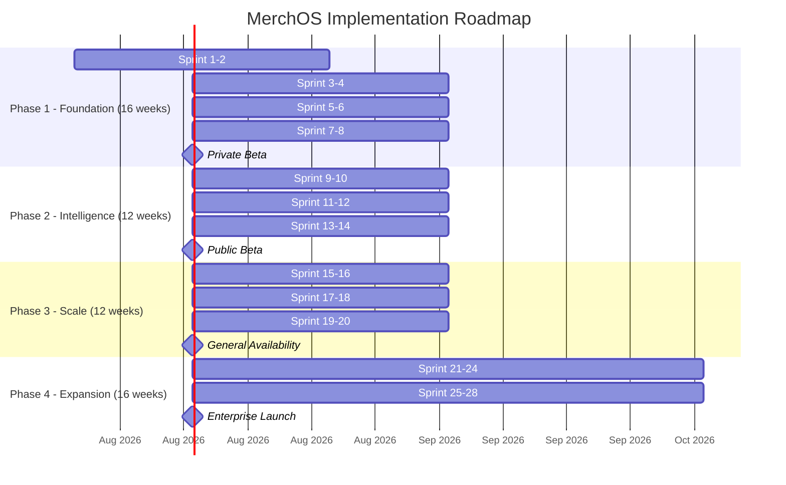

# MerchOS Engineering Blueprint

## Volume 21 — Implementation Roadmap

---

| Field | Value |
|-------|-------|
| **Document ID** | MERCH-021 |
| **Title** | Implementation Roadmap |
| **Version** | 0.1 |
| **Status** | Draft |
| **Owner** | Wadzanai Maparura |
| **Technical Lead** | Kiro AI |
| **Created** | 2026-06-27 |
| **Last Updated** | 2026-06-27 |
| **Next Review** | 2026-07-11 |
| **Classification** | Internal — Confidential |
| **Related Documents** | MERCH-002 (Business & Product — Roadmap), All volumes (implementation source) |

---

## Revision History

| Version | Date | Author | Change Description |
|---------|------|--------|-------------------|
| 0.1 | 2026-06-27 | Kiro AI / Wadzanai Maparura | Initial draft |

---

## Table of Contents

1. [Purpose](#1-purpose)
2. [Scope](#2-scope)
3. [Delivery Principles](#3-delivery-principles)
4. [Phase Overview](#4-phase-overview)
5. [Phase 1 — Foundation (MVP)](#5-phase-1--foundation-mvp)
6. [Phase 2 — Intelligence](#6-phase-2--intelligence)
7. [Phase 3 — Scale](#7-phase-3--scale)
8. [Phase 4 — Expansion](#8-phase-4--expansion)
9. [Sprint Structure](#9-sprint-structure)
10. [Risk & Mitigation](#10-risk--mitigation)
11. [Success Criteria](#11-success-criteria)
12. [Assumptions](#12-assumptions)
13. [Dependencies](#13-dependencies)
14. [References](#14-references)

---

## 1. Purpose

This document defines the implementation roadmap for MerchOS — translating the architectural blueprint into a phased delivery plan with concrete sprints, deliverables, exit criteria, and team allocation.

---

## 2. Scope

Covers: Delivery principles, four implementation phases with detailed sprint breakdown, work items per sprint, exit criteria, dependencies between work streams, risk mitigation, and success metrics.

---

## 3. Delivery Principles

| Principle | Application |
|-----------|-------------|
| Blueprint before code | No implementation without an approved blueprint chapter |
| Vertical slices | Each sprint delivers end-to-end functionality (API → Backend → Frontend) |
| Continuous deployment | Every merge to main deploys to staging; production on approval |
| Feature flags | New capabilities behind flags for controlled rollout |
| Observability from day one | Logging, metrics, and tracing in every function from Sprint 1 |
| Test-driven confidence | Tests written alongside code; > 80% coverage maintained |
| Demo-driven | End-of-sprint demo to stakeholders; feedback incorporated |
| No technical debt in Phase 1 | Do it right the first time; debt budgeted from Phase 2 |

---

## 4. Phase Overview

### 4.1 Phase Summary

| Phase | Duration | Sprints | Key Outcome | Exit Gate |
|-------|----------|---------|-------------|-----------|
| Phase 1 — Foundation | 16 weeks | 1–8 | MVP: Product Hub + Takealot export | 10 beta sellers export valid CSVs |
| Phase 2 — Intelligence | 12 weeks | 9–14 | AI enrichment + 3 marketplaces | AI reduces manual effort by 50% |
| Phase 3 — Scale | 12 weeks | 15–20 | 5 marketplaces + inventory + suppliers | 50 tenants, 50K products, 5 marketplaces |
| Phase 4 — Expansion | 16 weeks | 21–28 | Analytics, scheduling, agency, API push | 200 tenants, GA launch |

---

## 5. Phase 1 — Foundation (MVP)

### Sprint 1–2: Infrastructure & DevOps (Weeks 1–4)

| Deliverable | Blueprint Source | Acceptance Criteria |
|-------------|----------------|-------------------|
| AWS account setup (prod + staging + dev) | MERCH-005 | Accounts created; OIDC configured |
| CDK project scaffolding | MERCH-005 §20 | All stacks synth successfully; CDK Nag passes |
| Data Stack (DynamoDB + S3 buckets) | MERCH-005 §6, §8 | Tables + buckets deployed with correct config |
| CI/CD pipeline (GitHub Actions) | MERCH-018 | PR checks run; staging auto-deploys on merge |
| Monitoring Stack (CloudWatch basics) | MERCH-019 | Log groups, base dashboards, first alarms |
| Domain + Amplify setup | MERCH-005 §19 | merchos.com configured; Amplify deploys Next.js |
| Backend project scaffolding | MERCH-017 | Monorepo structure; shared packages; build works |
| Frontend project scaffolding | MERCH-016 | Next.js app; Tailwind + shadcn/ui; routing skeleton |

### Sprint 3–4: Authentication & Tenant Management (Weeks 5–8)

| Deliverable | Blueprint Source | Acceptance Criteria |
|-------------|----------------|-------------------|
| Cognito User Pool + App Client | MERCH-005 §10 | Signup, login, MFA working |
| Cognito Lambda triggers (pre-signup, post-confirm, pre-token) | MERCH-006 §5 | Tenant auto-created; claims enriched |
| Auth middleware (backend) | MERCH-017 §6 | JWT validated; tenantId/role extracted |
| Tenant CRUD API | MERCH-015 §13 | Create, read, update tenant |
| User management API (invite, roles) | MERCH-015 §13 | Invite user; change roles; list users |
| Login/Register UI | MERCH-016 §5 | Full auth flow working in browser |
| App shell UI (sidebar, header, routing) | MERCH-016 §5 | Navigation between all pages |
| RBAC enforcement | MERCH-006 §5 | Permissions enforced on all endpoints |

### Sprint 5–6: Product Hub (Weeks 9–12)

| Deliverable | Blueprint Source | Acceptance Criteria |
|-------------|----------------|-------------------|
| Product CRUD API (create, read, update, delete) | MERCH-015 §6 | All endpoints working with validation |
| Product variants API | MERCH-015 §6 | Create/edit/delete variants |
| Product search + filtering + pagination | MERCH-015 §6 | Cursor-based; filters working |
| Bulk product import (CSV) | MERCH-015 §6 | Upload CSV → products created with report |
| Image upload (pre-signed URL) | MERCH-015 §11 | Upload → S3 → thumbnails generated |
| Product management UI (list, create, edit) | MERCH-016 §5 | Full product CRUD in browser |
| Bulk import wizard UI | MERCH-016 §5 | Upload → mapping → preview → import |
| Marketplace Knowledge Base (Takealot schema loaded) | MERCH-008 §5 | Takealot columns, rules, categories in DB |

### Sprint 7–8: Export Engine + Validation (Weeks 13–16)

| Deliverable | Blueprint Source | Acceptance Criteria |
|-------------|----------------|-------------------|
| Validation engine | MERCH-008 §10 | Products validated against Takealot rules |
| Marketplace readiness score | MERCH-008 §10 | Score calculated per product per marketplace |
| Export workflow (Step Functions) | MERCH-013 §4 | Validate → generate CSV → upload S3 → notify |
| CSV generation (Takealot format) | MERCH-013 §6 | Valid Takealot CSV exported; passes Takealot validation |
| Export history + download API | MERCH-015 §8 | List exports; download via signed URL |
| Export UI (select products, validate, export) | MERCH-016 §5 | End-to-end export flow in browser |
| Validation report UI | MERCH-016 §5 | Per-field errors displayed; actionable |
| Beta onboarding flow | MERCH-002 §14 | First 10 sellers can sign up and export |

**Phase 1 Exit Gate:** 10 beta sellers successfully import products and export valid Takealot CSVs.

---

## 6. Phase 2 — Intelligence

### Sprint 9–10: AI Enrichment (Weeks 17–20)

| Deliverable | Blueprint Source | Acceptance Criteria |
|-------------|----------------|-------------------|
| AI orchestration (Step Functions workflow) | MERCH-009 §3 | Enrichment pipeline processes products |
| Description generation (Bedrock Claude) | MERCH-009 §4 | Descriptions generated with confidence scores |
| Attribute extraction | MERCH-009 §5 | Attributes extracted from raw text |
| Category recommendation (RAG) | MERCH-009 §6 | Top 3 categories with reasoning |
| AI credit system | MERCH-007 §11 | Credits tracked; budget enforced |
| Intelligence API | MERCH-015 §7 | Enrich, batch, credits endpoints |
| AI enrichment UI (review + approve) | MERCH-016 §5 | User reviews AI suggestions; accept/edit/reject |
| Prompt templates (v1) | MERCH-007 §7 | Initial prompts for all tasks |

### Sprint 11–12: Image Intelligence + OCR (Weeks 21–24)

| Deliverable | Blueprint Source | Acceptance Criteria |
|-------------|----------------|-------------------|
| OCR processing (Textract integration) | MERCH-010 §5 | Text extracted from product images |
| Image analysis (Rekognition) | MERCH-010 §6 | Labels + moderation results |
| Marketplace image compliance | MERCH-010 §7 | Per-marketplace compliance checks |
| Image quality scoring | MERCH-010 §9 | Quality score 0–100 calculated |
| Image auto-resize (marketplace variants) | MERCH-010 §8 | Variants generated on upload |
| Image compliance UI | MERCH-016 §5 | Compliance status visible per image |
| SEO optimisation (AI) | MERCH-009 §7 | Title + keyword optimisation |

### Sprint 13–14: Amazon + Makro Marketplaces (Weeks 25–28)

| Deliverable | Blueprint Source | Acceptance Criteria |
|-------------|----------------|-------------------|
| Amazon Knowledge Base (schema + categories) | MERCH-008 §6 | Amazon flat file spec loaded |
| Amazon export (flat file generation) | MERCH-013 §6 | Valid Amazon flat file generated |
| Makro Knowledge Base (schema) | MERCH-008 §7 | Makro CSV spec loaded |
| Makro export (CSV generation) | MERCH-013 §6 | Valid Makro CSV generated |
| Multi-marketplace export UI | MERCH-016 §5 | Select marketplace → export |
| Marketplace configuration UI | MERCH-016 §5 | Connect/configure marketplaces |

**Phase 2 Exit Gate:** AI enrichment reduces manual listing effort by > 50% for beta users; 3 marketplaces operational.

---

## 7. Phase 3 — Scale

### Sprint 15–16: Supplier Intelligence (Weeks 29–32)

| Deliverable | Blueprint Source | Acceptance Criteria |
|-------------|----------------|-------------------|
| Supplier registration + profiles | MERCH-011 §4 | Create/edit suppliers with column mappings |
| Catalogue ingestion (CSV/Excel) | MERCH-011 §5 | Parse → normalise → create products |
| Data normalisation pipeline | MERCH-011 §6 | Transforms applied; clean data produced |
| Deduplication engine | MERCH-011 §7 | Duplicates detected; merge/skip/create logic |
| Supplier quality scoring | MERCH-011 §8 | Quality score calculated per supplier |
| Supplier management UI | MERCH-016 §5 | Full supplier CRUD + ingestion |
| Ingestion reports UI | MERCH-016 §5 | Reports visible with error details |

### Sprint 17–18: Inventory + Marketplace Sync (Weeks 33–36)

| Deliverable | Blueprint Source | Acceptance Criteria |
|-------------|----------------|-------------------|
| Inventory tracking (stock CRUD) | MERCH-012 §4–5 | Adjustments with atomic writes |
| Low-stock alerts | MERCH-012 §8 | Notifications when stock below threshold |
| Inventory bulk update (CSV) | MERCH-012 §10 | Bulk stock update via upload |
| Marketplace stock sync (Shopify, Amazon) | MERCH-012 §9 | Stock changes propagated to marketplaces |
| Inventory UI (stock view, adjust, history) | MERCH-016 §5 | Full inventory management in browser |
| Notification system | MERCH-003 §13 | In-app + email notifications working |

### Sprint 19–20: Shopify + WooCommerce (Weeks 37–40)

| Deliverable | Blueprint Source | Acceptance Criteria |
|-------------|----------------|-------------------|
| Shopify connector (Admin API) | MERCH-008 §8 | Products push to Shopify; bidirectional sync |
| WooCommerce connector (REST API) | MERCH-008 §9 | Products push to WooCommerce |
| API push mode (direct integration) | MERCH-013 §7 | Products pushed via API (not just CSV) |
| Multi-warehouse inventory (Growth+) | MERCH-012 §6 | Multiple warehouses tracked |
| Agency multi-tenant (basic) | MERCH-002 §5 | Parent-child tenant relationship |
| 5-marketplace export UI | MERCH-016 §5 | All 5 marketplaces selectable |

**Phase 3 Exit Gate:** 5 marketplaces supported; 50 tenants active; 50,000 products under management.

---

## 8. Phase 4 — Expansion

### Sprint 21–24: Analytics + Scheduling + Polish (Weeks 41–48)

| Deliverable | Blueprint Source | Acceptance Criteria |
|-------------|----------------|-------------------|
| Analytics dashboard | MERCH-003 §14 | Key metrics displayed; charts and trends |
| Scheduled exports | MERCH-013 §9 | Cron-based exports; delta detection |
| Delta exports | MERCH-013 §8 | Only changed products exported |
| Price tracking (supplier) | MERCH-011 §9 | Price changes detected and alerted |
| Translation (multi-language) | MERCH-009 §8 | AI translation for product content |
| Performance optimisation | MERCH-004 §3 | Meet all p95 latency targets |
| Security hardening | MERCH-006 | Pentest; fix findings; CDK Nag clean |

### Sprint 25–28: Agency + Enterprise + GA (Weeks 49–56)

| Deliverable | Blueprint Source | Acceptance Criteria |
|-------------|----------------|-------------------|
| Agency multi-tenant (full) | MERCH-002 §5 | Cross-client management; aggregate views |
| Allocation rules (inventory) | MERCH-012 §7 | Per-marketplace stock allocation |
| Webhook system (outbound) | MERCH-015 §14 | Events delivered to customer endpoints |
| Batch AI enrichment (50K) | MERCH-009 §9 | Large batch processing operational |
| Admin panel (platform ops) | MERCH-003 §15 | Tenant management; schema updates |
| Onboarding optimisation | MERCH-002 §11 | < 15 min time-to-first-value |
| GA launch preparation | — | Load testing; documentation; marketing |
| General Availability launch | — | Public launch; no beta restrictions |

**Phase 4 Exit Gate:** 200+ tenants; all features operational; GA launched.

---

## 9. Sprint Structure

### 9.1 Sprint Cadence

| Aspect | Value |
|--------|-------|
| Sprint duration | 2 weeks |
| Sprint planning | Monday (sprint start) |
| Daily standup | 15 min (async or sync) |
| Mid-sprint check | Wednesday of week 2 |
| Sprint review (demo) | Friday of week 2 |
| Sprint retrospective | Friday of week 2 (after demo) |
| Deployment to staging | Continuous (on merge) |
| Deployment to production | End of sprint (approved) |

### 9.2 Definition of Done

A work item is "done" when:
- [ ] Code written and passes all lint/type checks
- [ ] Unit tests written (>80% coverage on new code)
- [ ] Integration test (if API endpoint)
- [ ] Code reviewed and approved (1+ reviewer)
- [ ] Deployed to staging and smoke-tested
- [ ] Documentation updated (if API/schema change)
- [ ] Feature flag configured (if new feature)
- [ ] Monitoring/alerting confirmed (logs + metrics emit)

---

## 10. Risk & Mitigation

| Risk | Likelihood | Impact | Mitigation |
|------|-----------|--------|-----------|
| Phase 1 scope creep | Medium | High | Strict MVP scope; no feature additions without blueprint |
| AI quality insufficient at launch | Medium | Medium | Iterative prompt improvement; human-in-the-loop; lower confidence thresholds |
| Marketplace CSV format changes during development | Medium | Medium | Knowledge base abstraction; quick schema updates |
| Team velocity slower than estimated | Medium | High | Buffer weeks between phases; reduce scope not quality |
| AWS service limits hit during load testing | Low | Medium | Request increases early; design within known limits |
| Beta user feedback requires significant changes | Medium | Medium | Build feedback loops into sprints; prioritise brutally |
| Third-party API instability (Takealot, Amazon) | Medium | Medium | Circuit breakers; retry logic; fallback modes |

---

## 11. Success Criteria

### 11.1 Per-Phase Metrics

| Metric | Phase 1 | Phase 2 | Phase 3 | Phase 4 |
|--------|---------|---------|---------|---------|
| Active tenants | 10 (beta) | 30 | 50 | 200+ |
| Products under management | 5,000 | 50,000 | 250,000 | 1,000,000 |
| Marketplaces supported | 1 (Takealot) | 3 | 5 | 5+ |
| Export validation pass rate | > 90% | > 95% | > 98% | > 98% |
| AI acceptance rate | — | > 60% | > 70% | > 75% |
| Platform uptime | > 99% | > 99.5% | > 99.9% | > 99.9% |
| Time-to-first-export (new user) | < 30 min | < 15 min | < 15 min | < 10 min |
| Monthly recurring revenue | — | R50K | R500K | R2.5M |

### 11.2 Engineering Quality Metrics

| Metric | Target (all phases) |
|--------|-------------------|
| Test coverage | > 80% |
| Deployment frequency | Multiple per day |
| Change failure rate | < 5% |
| Mean time to recovery | < 30 minutes |
| CDK Nag violations | Zero |
| Security vulnerabilities (critical) | Zero |
| API p95 latency | < 500ms |

---

## 12. Assumptions

| # | Assumption | Impact if Invalid |
|---|-----------|-------------------|
| A1 | Single developer + AI (Kiro) can deliver Phase 1 in 16 weeks | Need additional developers or extended timeline |
| A2 | Blueprint is sufficiently detailed to enable implementation without major research | Discovery work may add 20–30% to estimates |
| A3 | Beta sellers available and engaged for feedback | Delay beta validation; build without user input |
| A4 | AWS account and domain setup takes < 1 week | Blocks all subsequent work |
| A5 | Marketplace documentation is accurate enough for integration | Requires trial-and-error with marketplace portals |

---

## 13. Dependencies

| Dependency | Blocks | Resolution Date |
|-----------|--------|----------------|
| Blueprint completion (all volumes) | Phase 1 start | Now (this document) |
| AWS account setup | Sprint 1 | Week 1 |
| Domain registration (merchos.com) | Frontend deployment | Before Sprint 1 |
| Takealot seller account | Export testing | Before Sprint 7 |
| Amazon seller account | Amazon connector | Before Sprint 13 |
| Shopify partner account | Shopify connector | Before Sprint 19 |
| Beta seller recruitment | Phase 1 exit gate | Before Sprint 7 |

---

## 14. References

| # | Reference |
|---|-----------|
| 1 | MERCH-002 (Business & Product — Product Roadmap) |
| 2 | All blueprint volumes (MERCH-003 through MERCH-020) |
| 3 | Agile/Scrum methodology |
| 4 | Shape Up (Basecamp) — for cycle-based delivery |
| 5 | DORA Metrics — for engineering quality |

---

*End of Volume 21 — Implementation Roadmap*

*Previous: Volume 20 — Cost Optimisation (MERCH-020)*
*Next: Appendices (Glossary, ADRs, Index)*
