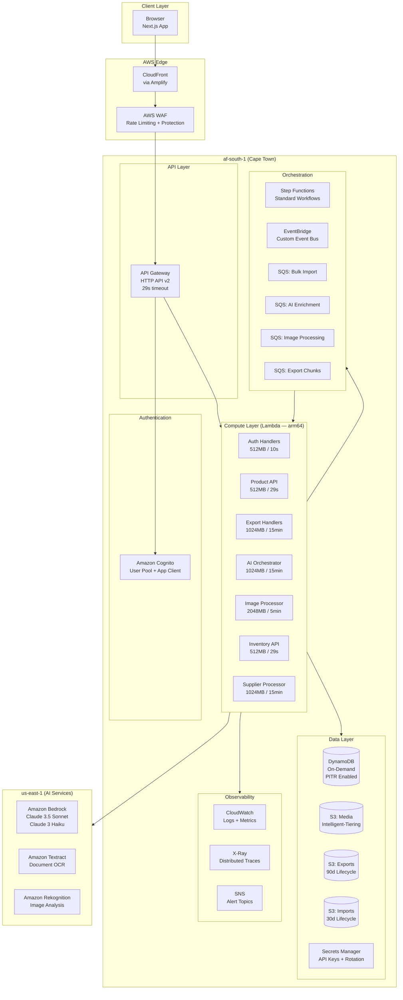
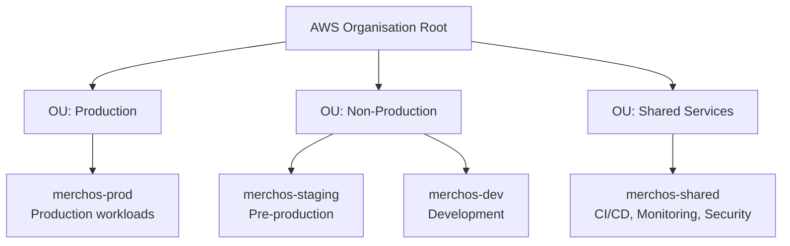
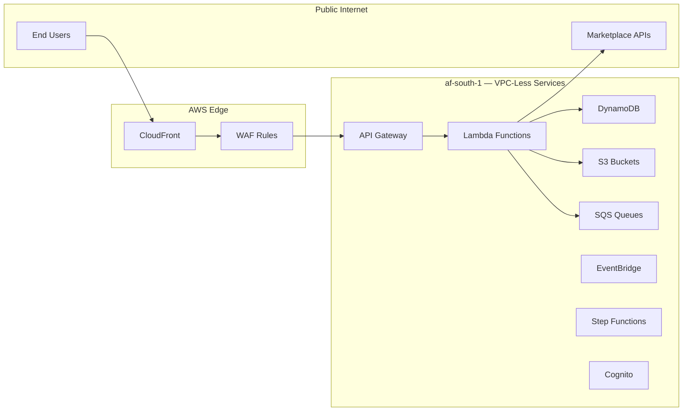

# AWS Infrastructure Diagram

> Complete AWS service topology for MerchOS.

---

## AWS Account Strategy

---

## Network Architecture (VPC-Less)

> **Note:** MerchOS uses a fully VPC-less architecture. All services communicate via AWS service endpoints. No VPC, subnets, or NAT Gateways are required — reducing cost by ~$32/month and eliminating network complexity.
