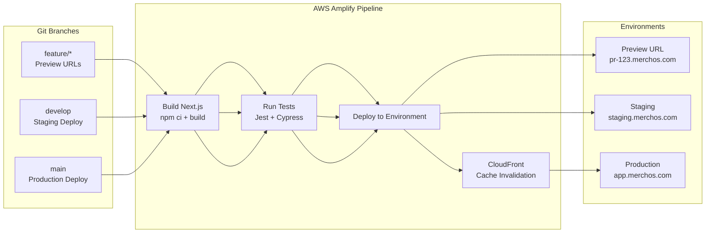

# CI/CD Pipeline

> Deployment pipeline from code commit to production.

```mermaid
graph LR
    subgraph Development["Development"]
        DEV[Developer<br/>Local Dev]
        PR[Pull Request<br/>Code Review]
    end

    subgraph CI["Continuous Integration"]
        LINT[Lint + Format<br/>ESLint, Prettier]
        TEST_UNIT[Unit Tests<br/>Vitest]
        TEST_INT[Integration Tests<br/>DynamoDB Local]
        CDK_SYNTH[CDK Synth<br/>Template Generation]
        CDK_NAG[CDK Nag<br/>Security Checks]
        BUILD[Build<br/>esbuild + TypeScript]
    end

    subgraph CD_Staging["Deploy to Staging"]
        DEPLOY_STG[CDK Deploy<br/>merchos-staging]
        E2E_STG[E2E Tests<br/>Staging Environment]
        SMOKE[Smoke Tests<br/>API Health Checks]
    end

    subgraph CD_Prod["Deploy to Production"]
        APPROVE[Manual Approval<br/>Required]
        DEPLOY_PROD[CDK Deploy<br/>merchos-prod]
        CANARY[Canary Checks<br/>5-minute monitoring]
        ROLLBACK{Healthy?}
    end

    DEV -->|git push| PR
    PR -->|merge to main| CI
    LINT --> TEST_UNIT --> TEST_INT --> CDK_SYNTH --> CDK_NAG --> BUILD
    BUILD --> DEPLOY_STG
    DEPLOY_STG --> E2E_STG --> SMOKE
    SMOKE -->|Pass| APPROVE
    APPROVE --> DEPLOY_PROD
    DEPLOY_PROD --> CANARY --> ROLLBACK
    ROLLBACK -->|Yes| DONE[Live ✓]
    ROLLBACK -->|No| ROLL[Rollback<br/>Previous Version]
```

---

## Frontend CI/CD (Amplify)

---

## Deployment Environments

| Environment | Trigger | URL | Purpose |
|-------------|---------|-----|---------|
| Preview | PR created | `pr-{n}.merchos.com` | Feature review |
| Development | Push to `develop` | `dev.merchos.com` | Integration testing |
| Staging | Merge to `main` (auto) | `staging.merchos.com` | Pre-production validation |
| Production | Manual approval | `app.merchos.com` | Live customer traffic |
