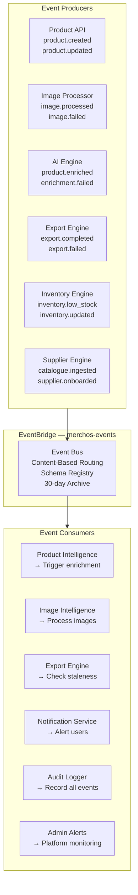
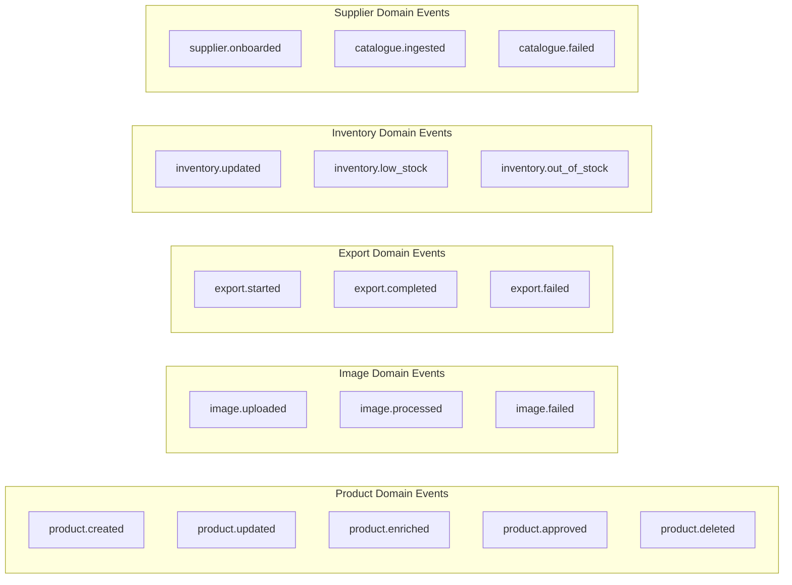

# Event-Driven Architecture — Data Flow

> Shows how domain events flow through EventBridge connecting all MerchOS services.



---

## Event Catalogue



---

## Event Schema Example

```json
{
  "version": "0",
  "id": "evt-abc123",
  "source": "merchos.product-hub",
  "detail-type": "product.created",
  "account": "123456789012",
  "time": "2026-07-15T10:30:00Z",
  "region": "af-south-1",
  "detail": {
    "tenantId": "t_abc123",
    "productId": "p_def456",
    "title": "Wireless Bluetooth Headphones",
    "category": "electronics/audio",
    "hasImages": true,
    "imageCount": 3,
    "source": "manual_upload",
    "timestamp": "2026-07-15T10:30:00Z"
  }
}
```

---

## Event Routing Rules

| Event | Consumer | Action |
|-------|----------|--------|
| `product.created` | Product Intelligence Engine | Start AI enrichment workflow |
| `product.created` | Image Intelligence Engine | Process uploaded images |
| `product.enriched` | Export Engine | Mark product as export-ready |
| `product.enriched` | Notification Service | Notify seller "Ready for review" |
| `export.completed` | Notification Service | Notify seller "Export ready" |
| `export.failed` | Admin Alerts | Alert ops team |
| `inventory.low_stock` | Notification Service | Warn seller |
| `catalogue.ingested` | Product Hub | Create products from supplier data |
