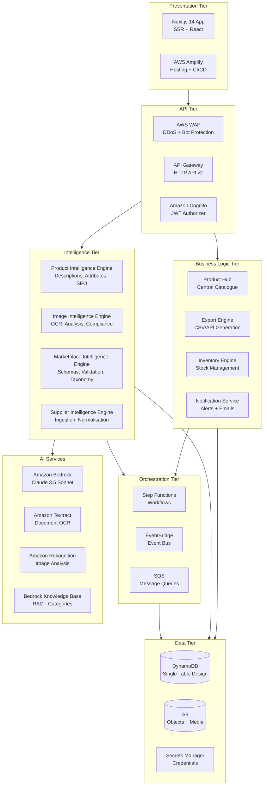

# Component Architecture Diagram

> Internal component structure of the MerchOS platform.

```mermaid
graph TB
    subgraph Presentation["Presentation Tier"]
        NEXT[Next.js 14 App<br/>SSR + React]
        AMP[AWS Amplify<br/>Hosting + CI/CD]
    end

    subgraph API_Tier["API Tier"]
        WAF[AWS WAF<br/>DDoS + Bot Protection]
        APIGW[API Gateway<br/>HTTP API v2]
        COGNITO[Amazon Cognito<br/>JWT Authorizer]
    end

    subgraph Intelligence["Intelligence Tier"]
        PIE[Product Intelligence Engine<br/>Descriptions, Attributes, SEO]
        IIE[Image Intelligence Engine<br/>OCR, Analysis, Compliance]
        MIE[Marketplace Intelligence Engine<br/>Schemas, Validation, Taxonomy]
        SIE[Supplier Intelligence Engine<br/>Ingestion, Normalisation]
    end

    subgraph Business["Business Logic Tier"]
        PROD_HUB[Product Hub<br/>Central Catalogue]
        EXP[Export Engine<br/>CSV/API Generation]
        INV[Inventory Engine<br/>Stock Management]
        NOTIF[Notification Service<br/>Alerts + Emails]
    end

    subgraph Orchestration["Orchestration Tier"]
        SF[Step Functions<br/>Workflows]
        EB[EventBridge<br/>Event Bus]
        SQS[SQS<br/>Message Queues]
    end

    subgraph Data["Data Tier"]
        DDB[(DynamoDB<br/>Single-Table Design)]
        S3[(S3<br/>Objects + Media)]
        SM[Secrets Manager<br/>Credentials]
    end

    subgraph AI["AI Services"]
        BEDROCK[Amazon Bedrock<br/>Claude 3.5 Sonnet]
        TEXTRACT[Amazon Textract<br/>Document OCR]
        REKOG[Amazon Rekognition<br/>Image Analysis]
        KB[Bedrock Knowledge Base<br/>RAG - Categories]
    end

    Presentation --> API_Tier
    API_Tier --> Intelligence
    API_Tier --> Business
    Intelligence --> Orchestration
    Business --> Orchestration
    Intelligence --> AI
    Orchestration --> Data
    Intelligence --> Data
    Business --> Data
```
