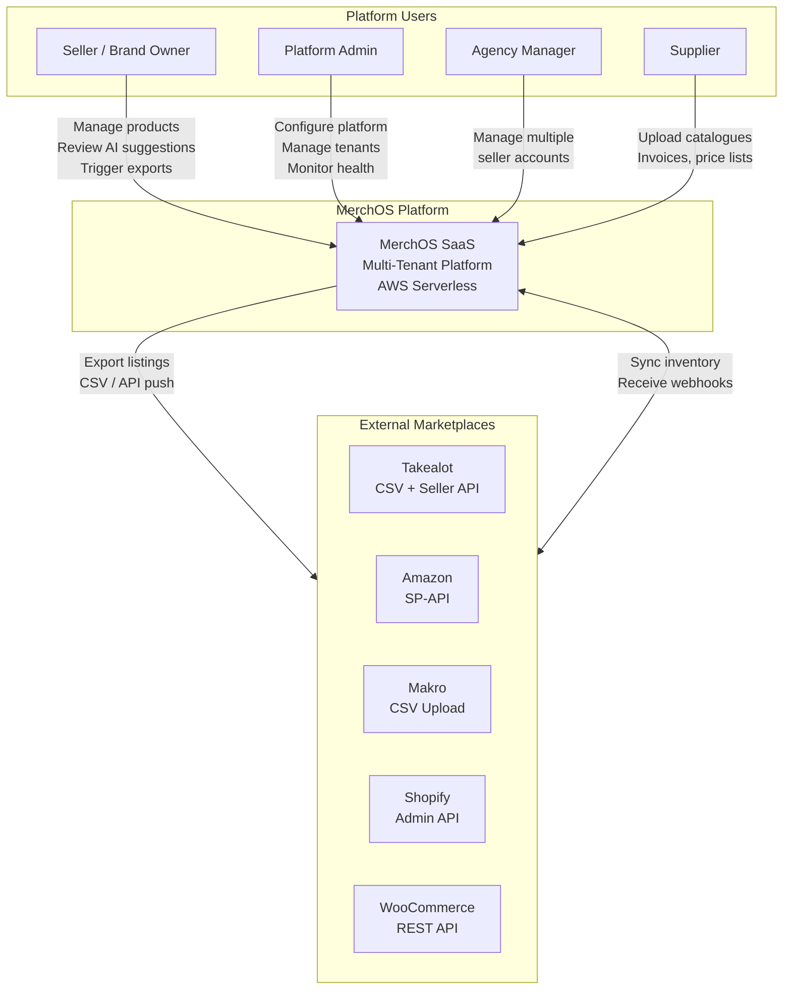

# System Context Diagram

> High-level view of MerchOS and its external interactions.

---

## Key Interactions

| Actor | Direction | Interaction |
|-------|-----------|-------------|
| Seller | Inbound | Product creation, AI review, export triggers |
| Supplier | Inbound | Catalogue uploads (CSV, PDF, Excel) |
| Marketplaces | Outbound | Listing exports, inventory sync |
| Marketplaces | Inbound | Webhooks, order notifications, schema updates |
