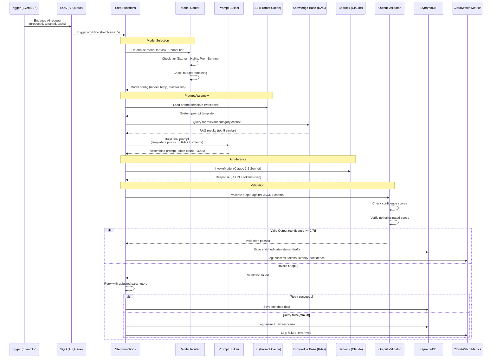
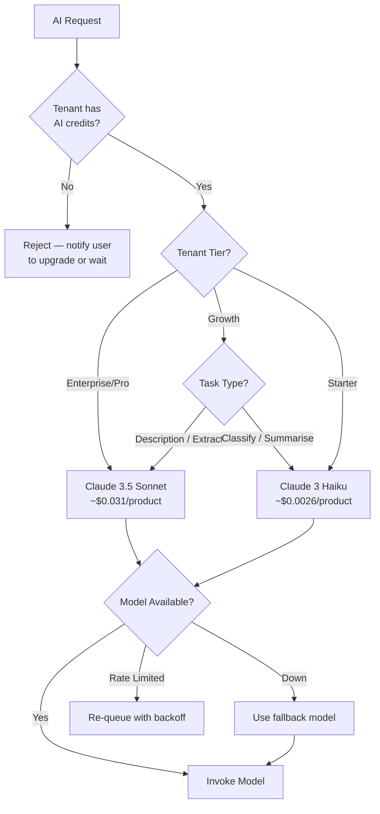

# AI Processing Pipeline

> Detailed sequence showing how AI requests are managed, queued, and processed.

---

## Model Routing Decision Tree

---

## Token Cost Tracking

| Model | Input Cost | Output Cost | Avg per Product | Monthly Budget (Growth) |
|-------|-----------|-------------|-----------------|------------------------|
| Claude 3.5 Sonnet | $3.00/1M tokens | $15.00/1M tokens | ~$0.031 | 500 products |
| Claude 3 Haiku | $0.25/1M tokens | $1.25/1M tokens | ~$0.0026 | ~6,000 products |
