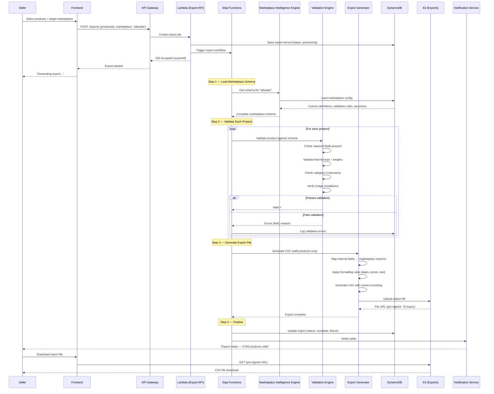

# Marketplace Export Workflow

> Sequence showing how approved products are exported to marketplace-specific formats.

---

## Export Validation Rules (Example: Takealot)

| Field | Rule | Action on Failure |
|-------|------|-------------------|
| Title | Required, 5–150 chars | Reject product |
| Category | Must exist in taxonomy | Flag for manual mapping |
| Price | Required, > 0, ZAR format | Reject product |
| Image URL | Required, HTTPS, .jpg/.png | Reject product |
| Description | Required, 50–5000 chars | Truncate or reject |
| Barcode | Valid EAN-13 or UPC-A | Warning (not blocking) |
| Stock | Required, integer >= 0 | Reject product |
