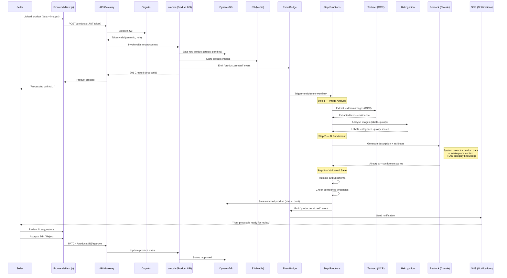

# Product Ingestion Flow

> Sequence diagram showing the complete product upload and AI enrichment pipeline.

---

## Key Decision Points

| Step | Decision | Outcome |
|------|----------|---------|
| Confidence >= 0.9 | Auto-suggest as "Recommended" | Green badge in UI |
| Confidence 0.7–0.89 | Suggest with review flag | Yellow badge |
| Confidence < 0.7 | Require manual review | Orange/red badge |
| AI unavailable | Graceful degradation | Manual mode enabled |
