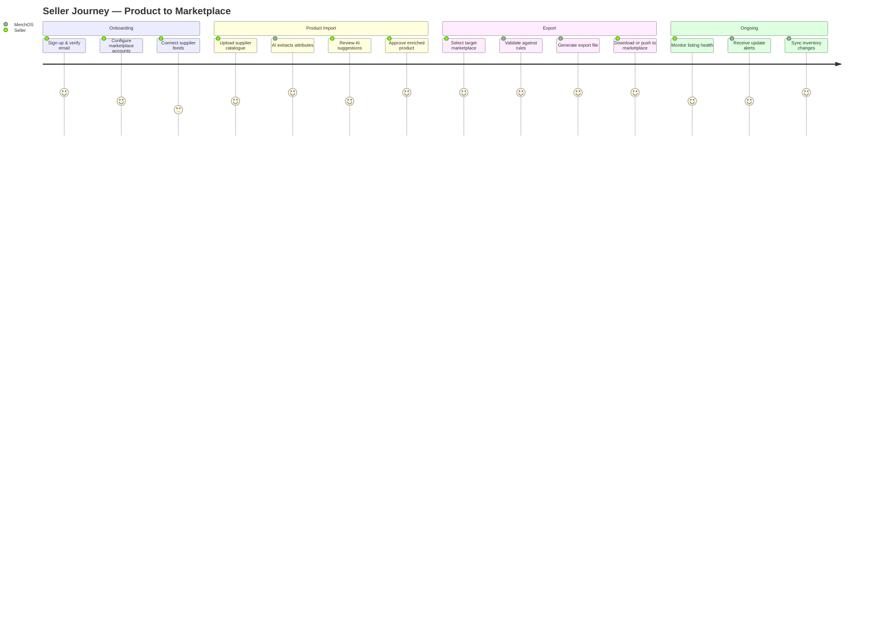

# User Journey Diagram

> End-to-end seller journey from signup to marketplace listing.

```mermaid
journey
    title Seller Journey — Product to Marketplace
    section Onboarding
      Sign up & verify email: 5: Seller
      Configure marketplace accounts: 4: Seller
      Connect supplier feeds: 3: Seller
    section Product Import
      Upload supplier catalogue: 4: Seller
      AI extracts attributes: 5: MerchOS
      Review AI suggestions: 4: Seller
      Approve enriched product: 5: Seller
    section Export
      Select target marketplace: 5: Seller
      Validate against rules: 5: MerchOS
      Generate export file: 5: MerchOS
      Download or push to marketplace: 5: Seller
    section Ongoing
      Monitor listing health: 4: Seller
      Receive update alerts: 4: MerchOS
      Sync inventory changes: 5: MerchOS
```
